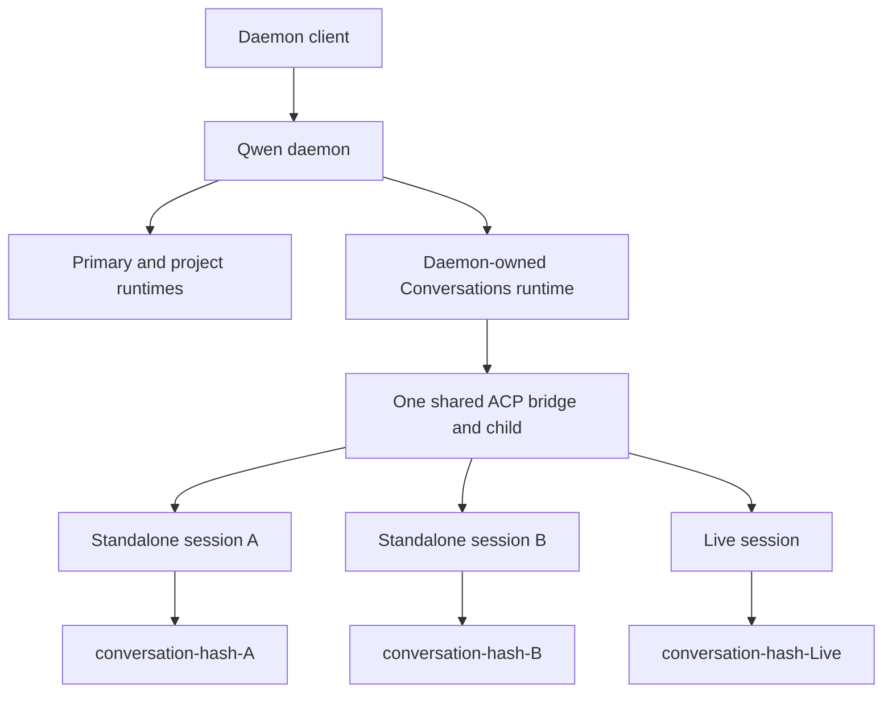

# Standalone Daemon Sessions

## Status

This document defines the target architecture for daemon sessions that do not
belong to a user-selected workspace. It is a design contract only. The feature,
capability advertisement, SDK surface, and WebShell UI are delivered in the
follow-up pull requests described below.

The design builds on the projectless conversation infrastructure introduced for
Live Voice. It does not authorize a second projectless runtime, a second session
catalog, or a child process per standalone session.

This contract extends, and does not replace, the projectless runtime decisions
in [WebShell Live Voice Codex-Parity Refactor Contract](./web-shell-live-voice-codex-parity-refactor.md).

## Problem

The daemon currently treats its primary workspace as the implicit target when a
client creates a session without `cwd`. This makes the top-level **New Chat**
action project-bound even when the user has not selected a project. It also
exposes the lifetime of that project directory as the lifetime of the chat. If
the directory is moved or removed, the client can only report that the current
working directory no longer exists.

Live Voice already owns a secure projectless storage root at
`~/Documents/Qwen Code/Conversations`, publishes one daemon-owned runtime for
that root, and relocates each Live session into a deterministic private child
directory. Standalone sessions generalize that substrate into a normal text-chat
product surface while preserving Live-specific behavior.

## Goals

- Let a user create and continue a normal text session without selecting a
  workspace.
- Make top-level **New Chat** create a standalone session while keeping
  project-local **New Chat** project-bound.
- Give every standalone session a durable private working directory with normal
  Qwen Code tools and approvals.
- Support creation, listing, load, resume, rename, archive, unarchive, repair,
  and deletion across daemon restarts.
- Keep standalone, workspace, and Live contexts explicit throughout the SDK and
  WebShell.
- Reuse the Conversations runtime, ACP bridge, transcript catalog, admission
  limits, and permission pipeline.
- Fail closed when an internal runtime or managed directory cannot be validated;
  never fall back to the primary workspace.

## Non-goals

- An operating-system sandbox or a stronger filesystem boundary than the
  existing approval policy.
- A separate ACP child per standalone session.
- Standalone attachments, storage quotas, retention policy, or background orphan
  cleanup beyond deletion recovery.
- Moving or forking a standalone session into a project.
- Git branches, worktrees, repository status, or project settings for standalone
  sessions.
- Changing Live Voice conversation ownership, Realtime behavior, or its tool
  surface.

## Product contract

### Explicit session contexts

WebShell models the user-visible context as a discriminated value:

```ts
type SessionContext =
  | { kind: 'standalone' }
  | { kind: 'workspace'; workspaceCwd: string }
  | { kind: 'live' };
```

Clients derive this value from the operation they perform and the persisted
session source returned by the daemon. They must not infer product semantics
from `workspaceCwd`. For protocol compatibility, a standalone session still has
an internal `workspaceCwd`, but that value identifies the daemon-owned
Conversations runtime and must not be displayed as a project.

The entry-point behavior is fixed:

| Entry point                            | New-session context |
| -------------------------------------- | ------------------- |
| Top-level home and global **New Chat** | `standalone`        |
| **New Chat** within a selected project | `workspace`         |
| Live Voice                             | `live`              |

Standalone sessions appear in a top-level **Recents** group separate from Live
and project groups. Their chat surface hides workspace selection, Git status,
branch and worktree controls, and project settings. Normal model, approval,
tool, permission, transcript, and session metadata controls remain available.

### Persisted source

New standalone transcripts persist `sourceType: "standalone"` with no
`sourceId`. Live sessions retain their current `sourceType: "default"` and
`sourceId: "realtime_voice:<call-id>"` provenance.

`standalone` is a daemon-reserved source. Generic `POST /session` creation must
reject it, just as it rejects the reserved Live source. Classification requires
both compatible source metadata and ownership by the validated Conversations
runtime; source metadata alone can never turn a project session into a
standalone session.

Existing top-level Conversations transcripts with no parent, no source ID, and
either no source type or `sourceType: "default"` are normalized as legacy
standalone sessions at read time. Their transcripts are not rewritten. A source
that is explicitly Live, belongs to another feature, or has a parent is never
silently reclassified.

Live task list, read, wait, and follow-up operations continue to treat explicit
and legacy standalone sessions as loadable projectless task targets. This does
not relabel them as Live in WebShell and does not expose Live-only tools in their
ordinary text turns.

## Runtime architecture



### One Conversations runtime

The daemon continues to publish one trusted, non-removable runtime rooted at
`~/Documents/Qwen Code/Conversations`. Standalone creation makes this runtime
available lazily even when Live Voice is disabled. Live enablement only binds
and advertises Live-specific Host, Appshot, Realtime, speech, and task channels;
it does not own the lifetime of the underlying Conversations runtime.

The existing internal runtime provenance value `live-conversation` is retained
for compatibility in the first implementation. Within daemon routing it means
"daemon-owned Conversations runtime" and must not be used to classify a session
as Live. Persisted session source performs that classification. Renaming the
runtime provenance is unnecessary for this feature and would expand the change
without changing behavior.

Each workspace runtime owns one ACP bridge and child process. Standalone and
Live sessions therefore share the Conversations runtime's existing ACP child.
Session admission remains subject to the daemon's total and per-runtime limits.

### Managed working directories

The existing conversation workspace creates a deterministic direct child for
each session:

```text
~/Documents/Qwen Code/Conversations/conversation-<sha256(session-id)>
```

The root and child must be real directories owned by the daemon user. On POSIX,
they must not grant group or other permissions. The daemon validates the root's
canonical path, device and inode before and after sensitive operations, and it
requires each session directory to be an exact direct child. Symbolic links and
path traversal are rejected. Windows applies the same path and directory
identity checks where the platform exposes them, without POSIX mode checks.

The transcript and runtime configuration remain stored under the Conversations
runtime root. The session's effective tool and shell working directory is its
private child. Managed relocation updates the effective target directory and
workspace context without changing transcript ownership.

User and global settings continue to apply. Primary-project settings, memory,
Git state, and workspace trust must not leak into a standalone session. The
Conversations runtime is daemon-owned and trusted only after the root identity
checks succeed.

### Permission boundary

The private directory is a stable default working directory, not an OS sandbox.
Relative file and shell operations begin there and normal workspace-aware tools
receive that directory as session context. An explicit operation targeting an
absolute path outside it remains governed by the existing permission and
approval pipeline. This feature does not claim containment that the current
tooling cannot enforce.

### Internal runtime isolation

The Conversations root is not a user workspace. Generic workspace registration,
settings, Git, file, shell, extension, MCP, and memory routes must reject a
request that resolves to the internal runtime. Only session catalog, transcript,
archive, existing owner-routed session operations, and dedicated Live or
standalone services may opt into it.

An unknown, bootstrapping, untrusted, compromised, draining, or removed
Conversations runtime returns an error. It must never resolve to or retry against
the primary runtime.

## Daemon and SDK contract

### Capability

The daemon advertises `standalone_sessions_v1` in `GET /capabilities` only when
the complete standalone route set and managed-directory lifecycle are available.
The runtime foundation pull request must not advertise the capability before the
public API is complete.

The capability is unconditional for a successfully initialized daemon build
that contains the feature; it is not coupled to Live Voice availability or
enablement. Root materialization remains lazy, so a missing but creatable root
does not suppress capability advertisement.

### Routes

The dedicated API is:

```text
POST /standalone/sessions
GET  /standalone/sessions
POST /standalone/sessions/:id/load
POST /standalone/sessions/:id/resume
POST /standalone/sessions/:id/repair-directory
POST /standalone/sessions/archive
POST /standalone/sessions/unarchive
POST /standalone/sessions/delete
```

Dedicated routes prevent omission of `cwd` from silently selecting the primary
runtime. They also let SDK clients distinguish an unsupported old daemon from a
failed standalone operation.

Creation accepts only:

```ts
interface CreateStandaloneSessionRequest {
  sessionId?: string;
  modelServiceId?: string;
  approvalMode?: string;
}
```

`sessionId`, when present, follows the existing caller-supplied UUID validation
and admission rules. The server fixes `sessionScope` to `thread` and source to
`standalone`. Unknown keys are rejected. In particular, clients cannot supply
`cwd`, `workspaceCwd`, `workspaceId`, `sourceType`, `sourceId`, `sessionScope`,
`branch`, or `worktree`.

Load and resume use `Omit<RestoreSessionRequest, 'workspaceCwd'>`: they retain
the existing approval, history-page, and client timeout options while the route
selects the owner runtime and private directory. Repair has no request body.
Archive, unarchive, and delete accept the existing bounded, de-duplicated
`sessionIds` array shape and apply only to standalone sources. Listing reuses the
existing `cursor`, `size`, and `archiveState` semantics, but fixes the source
filter to standalone and never returns Live or project sessions.

Rename continues to use owner-routed `PATCH /session/:id/metadata`. Prompt,
cancel, subscribe, permission, transcript, and other session-ID routes also keep
their current owner-routing behavior. A second standalone variant of those
routes would add no isolation because the session owner is already resolved and
validated centrally.

### SDK types

The SDK exposes narrow create, restore, and summary results using common fields:

```ts
interface DaemonStandaloneFields {
  sourceType: 'standalone';
  context: { kind: 'standalone' };
  workingDirectory: {
    state: 'ready' | 'recreated';
    warnings?: string[];
  };
}

interface DaemonStandaloneSession
  extends DaemonSession,
    DaemonStandaloneFields {}

interface DaemonRestoredStandaloneSession
  extends DaemonRestoredSession,
    DaemonStandaloneFields {}

interface DaemonStandaloneSessionSummary extends DaemonSessionSummary {
  sourceType: 'standalone';
  context: { kind: 'standalone' };
}
```

Create returns `DaemonStandaloneSession`; load and resume return
`DaemonRestoredStandaloneSession`. A recreated directory warning means the
transcript survived but files previously stored in the directory are not
recoverable. Standalone list summaries expose the explicit context and source
but do not probe or return working-directory state.

The existing internal `workspaceCwd` field remains required on base daemon
session types for routing and backward compatibility. Standalone SDK methods do
not accept it as input, and WebShell does not expose it as a project.

## Lifecycle and consistency

### Creation transaction

The SDK generates a UUID before the request unless the caller supplied one.
Creation proceeds as one logical transaction:

1. Validate the request.
2. Ensure and revalidate the Conversations runtime and root.
3. Reserve the UUID against that runtime's bridge with the existing
   caller-supplied session admission service.
4. Materialize and validate the deterministic private directory.
5. Create the ACP session with thread scope and standalone source metadata.
6. Require the ACP result to use the reserved UUID and report
   `sourcePersisted: true`.
7. Relocate the session into its private directory using managed containment.
8. Commit the response only after relocation succeeds.

Before relocation commits, a failure closes the new session, releases the UUID
reservation, and removes the private directory only if it is empty. An existing
empty directory with no transcript can be reused after validation. An existing
non-empty directory without a transcript is a conflict and is never adopted or
deleted automatically. An existing transcript or live session with the UUID is
reported through the existing ID conflict semantics.

After relocation commits, loss of the HTTP response has an unknown outcome. The
server must not delete the session. The client resolves the outcome by loading
the UUID it generated; a retry with the same UUID must not create a second
session.

### Load and resume

Load and resume first validate that the requested transcript is a standalone
source owned by the Conversations runtime. They then validate the root and the
deterministic child before attaching the client or admitting a prompt.

If the child is absent, the daemon recreates it at the same path, relocates the
session, and returns `workingDirectory.state: "recreated"` with a warning. It
does not claim to restore files that were deleted. If the path exists but is a
link, non-directory, wrong owner, overly permissive POSIX directory, or not the
expected direct child, the operation fails closed.

An explicit repair request acquires the session's exclusive lifecycle lock,
waits for current prompt teardown, recreates only an absent directory, and
reapplies relocation. It never replaces or changes permissions on a suspicious
existing path.

### Archive and rename

Archiving closes active ownership through the existing archive coordinator,
moves transcript state into the archived catalog, and retains the private
directory. Unarchive makes the transcript active again; the next load validates
or recreates the directory. Rename changes transcript metadata only and never
renames the deterministic directory.

### Deletion transaction

Deletion requires the product's existing second confirmation. Once accepted,
the daemon acquires the session's exclusive archive lock and writer lease,
rejects new prompts, and closes or cancels any remaining live ownership before
filesystem mutation.

For each validated standalone session, an absent normal and staged child is
treated as already cleaned and does not block transcript deletion. A suspicious
existing path still fails closed. When a valid normal child exists:

1. Revalidate the Conversations root, source, transcript, and private child.
2. Atomically rename the child to the deterministic direct sibling
   `conversation-<hash>.deleting`.
3. Delete the active or archived transcript and its sidecars through the
   existing session service.
4. If transcript deletion fails, atomically restore the original directory
   name and report the session error.
5. If transcript deletion succeeds, recursively remove the staged directory.

If transcript deletion and the rollback rename both fail, the transcript
remains authoritative, the staged directory is left untouched, and the response
reports `working_directory_recovery_failed`. A later load or explicit repair
must attempt the same validated recovery before using the session.

Failure of the final directory removal does not resurrect a deleted transcript.
The response includes the session ID in `fileCleanupPending`, and a later
bounded cleanup attempt may retry only that exact validated staged path.

Crash recovery is deterministic. If startup or load sees a transcript and its
`.deleting` sibling but no normal child, it restores the original child before
continuing. If no transcript exists, the staged directory is a deletion remnant
and may be removed. Conflicting normal and staged children, an invalid staged
path, or failed identity validation is reported and left untouched for manual
recovery.

### Failure contract

| Condition                                         | Result                                  |
| ------------------------------------------------- | --------------------------------------- |
| Invalid or forbidden standalone request field     | `400 invalid_request`                   |
| Session is absent or not a standalone source      | `404 standalone_session_not_found`      |
| UUID, orphan directory, or session state conflict | `409 standalone_session_conflict`       |
| Existing managed path fails validation            | `409 working_directory_compromised`     |
| Transcript rollback cannot restore staged child   | `500 working_directory_recovery_failed` |
| Conversations root identity or trust fails        | `503 conversation_root_compromised`     |
| Conversations runtime cannot be initialized       | `503 conversation_runtime_unavailable`  |
| Transcript deleted but final file cleanup failed  | `200` with `fileCleanupPending`         |

Structured route errors include the session ID when one is known, but do not
expose untrusted filesystem paths. Logs and telemetry record the route, phase,
runtime provenance, error code, and cleanup outcome.

## Compatibility and rollout

An older daemon omits `standalone_sessions_v1`. A newer WebShell connected to
such a daemon preserves the legacy behavior in which global **New Chat** targets
the primary workspace. It may explain that standalone chat requires a daemon
upgrade, but must not call the new routes.

If the capability is present and standalone creation fails, the client displays
the failure and preserves the user's standalone intent for retry. It must not
silently create a primary-workspace session. This distinction prevents a broken
or compromised Conversations runtime from changing the target of user actions.

There is no transcript migration. New sessions persist explicit standalone
source metadata; compatible legacy projectless transcripts are normalized when
read. Removing the feature code leaves existing transcripts and directories in
the Conversations root and does not affect project sessions.

The capability is published only with the daemon API pull request, after the
hidden runtime foundation has landed. SDK and UI changes may then gate on it.

## Delivery sequence

| PR  | Responsibility                                                                                                                                   | Estimated production / test lines |
| --- | ------------------------------------------------------------------------------------------------------------------------------------------------ | --------------------------------- |
| PR1 | Hidden Conversations runtime generalization, source classification, managed directory lifecycle, runtime route guard, and transactional services | 300-500 / 500-900                 |
| PR2 | Standalone daemon routes, capability advertisement, lifecycle integration tests, and E2E plan                                                    | 450-800 / 800-1,300               |
| PR3 | TypeScript SDK methods, narrow types, capability handling, and compatibility tests                                                               | 180-320 / 250-450                 |
| PR4 | Explicit WebUI session contexts and transactional switching integration                                                                          | 200-350 / 350-650                 |
| PR5 | WebShell entry points, Recents grouping, hidden project controls, errors, and E2E coverage                                                       | 350-650 / 500-900                 |

PR1 must remain behaviorally hidden. PR2 must be usable and testable without a
WebShell. PR4 should build on the transactional WebUI session-switching work in
PR #8882 rather than duplicate it. Attachments, quotas, move-to-project, and a
stronger sandbox are separate follow-ups.

## Acceptance matrix

| Area                 | Required scenarios                                                                                                                            |
| -------------------- | --------------------------------------------------------------------------------------------------------------------------------------------- |
| Creation             | No workspace input; server-generated and caller-generated UUIDs; source persisted; relocation succeeds; no primary fallback                   |
| Transaction rollback | Directory creation, ACP creation, source persistence, relocation, and response-loss boundaries                                                |
| Runtime sharing      | Multiple standalone sessions and Live sessions share one Conversations ACP child without cwd or event leakage                                 |
| Restart              | Active and archived sessions list, load, resume, and use the same deterministic path after daemon restart                                     |
| Directory recovery   | Missing child is recreated with warning; symlink, wrong owner, wrong mode, and identity changes fail closed                                   |
| Session operations   | Rename, archive, unarchive, prompt, subscribe, cancel, permissions, and transcript remain owner-routed                                        |
| Deletion             | Active and archived deletion; second confirmation; prompt cancellation; transcript rollback; staged-directory crash recovery; cleanup pending |
| Isolation            | Generic workspace APIs reject the internal runtime; primary project settings, memory, Git state, and cwd do not leak                          |
| Compatibility        | Old daemon preserves primary behavior; capable daemon failures never fall back; legacy projectless transcript normalization                   |
| WebShell             | Global New Chat is standalone; project New Chat remains workspace-bound; Recents groups and controls match context                            |
| Platforms            | POSIX owner and mode validation on macOS/Linux; Windows canonical path, junction/symlink, restart, and deletion behavior                      |

Unit tests cover source classification, route ownership, containment, state
transitions, rollback, crash recovery, SDK parsing, and UI context reducers.
Daemon integration tests use the real bridge boundary to assert process sharing,
relocation, restart restoration, and owner routing. WebShell tests cover entry
points and capability fallback. Before implementation, the behavioral baseline
and final manual flows are recorded under `.qwen/e2e-tests/` as required by the
repository workflow.

## Follow-up boundaries

File upload and attachments should reuse the workspace upload work from PR
#8874 while applying standalone containment. Moving or forking a conversation
into a project should build on PR #8817. Neither dependency blocks the MVP.

Storage quotas and orphan retention need a separate policy because automatic
deletion changes user data lifetime. A per-session ACP process or OS sandbox
would change resource usage and the security model and therefore requires a new
design rather than an extension of this contract.
