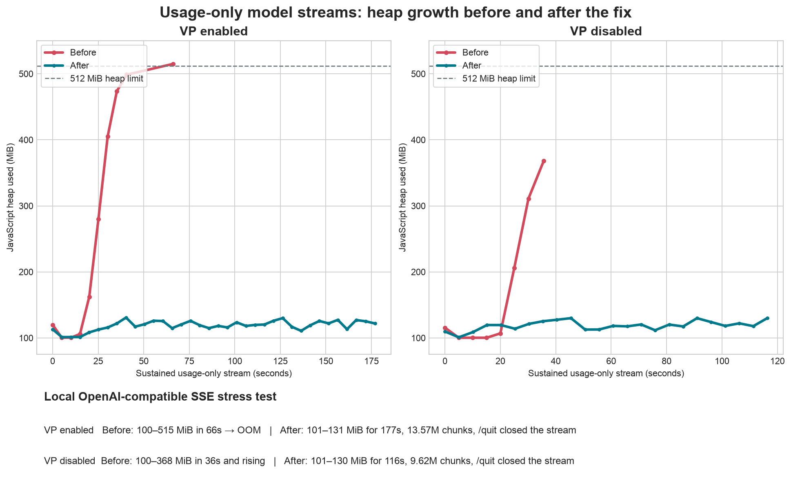

# Usage-only stream memory and shutdown

## Problem

An OpenAI-compatible endpoint can keep a streaming request open while sending
only usage metadata. This is unusual but valid enough for the SDK parser to
continue yielding chunks.

Two layers retained every converted response for the lifetime of the stream:

- the OpenAI conversion pipeline kept all responses to find the pending finish
  chunk;
- the logging wrapper kept all responses to build one consolidated response at
  the end.

With a sustained metadata-only stream, both arrays grew without bound even
though each new chunk replaced the same logical usage value. VP mode changes
rendering but does not participate in either retention path.

The `/quit` action also only requested that background memory work stop. It did
not abort the active model request, so the stream could continue allocating
during the exit window.

## Change

The OpenAI pipeline now keeps only its existing pending finish response. No
history is needed to merge a later usage chunk.

The logging wrapper keeps responses that contain candidate parts or a finish
reason, plus the final metadata response. This preserves the consolidated
output and latest usage while making metadata-only retention constant-size.

The quit action calls the existing request cancellation path before requesting
client shutdown and running exit cleanup. Literal `/quit` and `/exit` input also
bypass the message queue while a response is active.

## Scope

This does not add a new stream timeout, change VP behavior, or cap real model
output. Streams that produce user-visible content still preserve that content
for telemetry and optional OpenAI interaction logging.

## Verification

- unit coverage for bounded metadata-only logging retention;
- unit coverage that `/quit` cancels an active request;
- existing finish/usage and duplicate tool-call stream tests;
- interactive reproduction against a local SSE server that returns a 429, an
  empty successful response, and then an unbounded usage-only stream;
- memory sampling and quit-latency evidence with VP enabled and disabled.

## Local result

With a 512 MiB heap limit, the old build reached 515 MiB and crashed with VP
enabled. The fixed build stayed between 101 and 131 MiB for 177 seconds while
processing 13.57 million usage-only chunks. With VP disabled, it stayed between
101 and 130 MiB for 116 seconds while processing 9.62 million chunks. In both
fixed runs, entering `/quit` closed the active server-side stream and exited the
CLI normally.
