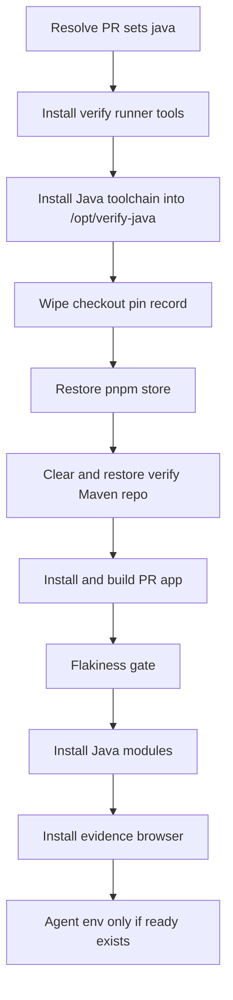

# Java toolchain for the verify lane

[English](verify-java-toolchain.md) | [简体中文](verify-java-toolchain.zh-CN.md)

Status: implementing with this change. Tracks issue #13741.

## Problem

The sandboxed `verify` job in `.github/workflows/qwen-triage.yml` is the
lane a maintainer uses for an A/B verdict on a pull request. It runs in a
fresh `node:22-bookworm` container and does not install a JDK or Maven. For
a pull request that changes `packages/sdk-java/`, whether the Java side is
executed depends on whether that round's agent spends its own time budget
downloading a toolchain. Some rounds do, some do not, and a later round can
silently stop executing Java that an earlier round executed.

`sdk-java.yml` already builds and tests Java on `pull_request`. The gap is
the verify agent's own verdict, not CI coverage.

## Current state

- The verify container is recreated per job. `$RUNNER_TEMP` is bind-mounted
  from the host and survives across jobs, so every consumer deletes its own
  subtree before use.
- The agent starts with `env -i` and a fresh `HOME` under `$RUNNER_TEMP`.
  `~/.m2` is always empty. Anything the agent should see has to be passed in
  that environment.
- The four Java modules publish fixed versions (`0.1.0-alpha`,
  `0.0.1-alpha` for `acp-sdk`), not SNAPSHOT. `qwen-managed-agent-server`
  depends on `qwencode-sdk` and `qwen-managed-runtime-broker`, including the
  broker test-jar. A stale jar left in the local repository is what Maven
  resolves.
- `actions/cache` identifies an entry by the literal `path` plus the
  compression method. This image ships no `zstd`. The working precedent is
  `.github/workflows/pnpm-store.yml`: a trusted producer on `main`, and a
  restore-only consumer with the same `runs-on`, container, and `path`.
- The verify job budget comment accounts for 180 minutes against
  `timeout-minutes: 190`.

## Goals

When a pull request diff touches `packages/sdk-java/`, the agent starts with
JDK 21, Maven 3.9.11, a warmed local repository, and `qwencode` plus
`runtime-broker` installed from the merge ref. Other pull requests pay
nothing. The skill's environment contract states what the lane provides.

## Non-goals

Left under _Not covered_ in the skill, and still owned by `sdk-java.yml`:

- MariaDB / MySQL failsafe integration tests and the hosted harness. Those
  need a database and a bundled `dist/cli.js`.
- The Java 11 and Java 17 matrix.
- Re-running Java tests through the flakiness gate.

## Proposed solution

The resolver already paginates the full changed-file list into `$files`
before checkout. When that list matches `^packages/sdk-java/`, it sets the
`java=true` output. Later steps require both `decision == 'run'` and
`java == 'true'`.

Root steps run before any PR code. The step that executes PR POM files runs
as `node`, with GitHub and Actions credentials stripped.

### Toolchain

`Install Java toolchain` runs as root, after `Install verify runner tools`
and before `Checkout PR merge ref`. It downloads a pinned Temurin 21 x64
tarball (sha256) and Maven 3.9.11 from `repo.maven.apache.org` (sha512, the
same `MAVEN_VERSION` and `MAVEN_SHA512` as `sdk-java.yml`). Both archives
are unpacked to `/opt/verify-java/{jdk,maven}`, mode `a+rX`, owned by root.
`/opt/verify-java/ready` is written only after both checksums and
`java -version` / `mvn -version` succeed. `JAVA_HOME` and `PATH` are
exported before `mvn -version`: the Maven launcher does not search the
unpacked JDK on its own, and without that it exits before `ready` exists. `curl` uses `--max-time 300` and
retries. Failure removes the prefix, emits a warning, and exits 0.

`/opt` is container-local and root-owned, so the `node` user cannot plant
`ready`. The container is new per job, so `ready` cannot leak from a
previous run.

### Maven repository cache

`.github/workflows/verify-maven-repo.yml` is the producer. It runs on push
to `main` when `packages/sdk-java/*/pom.xml` or the workflow file itself
changes, and on `workflow_dispatch`. It uses the verify job's `runs-on` and
`node:22-bookworm` with `--init --user node`, and saves
`${{ runner.temp }}/verify-maven-repo` with `actions/cache/save` at the same
SHA pin as the pnpm store. The key is
`verify-maven-repo-${{ hashFiles('packages/sdk-java/*/pom.xml') }}`.

The producer installs `qwencode` and `runtime-broker` with `-DskipTests`,
then runs `-DskipTests verify` on `managed-agent-server` and `client` so
compile, test, and lifecycle plugins land in the repository. Before saving,
it deletes `com/alibaba/<artifactId>` for every module under
`packages/sdk-java/*/pom.xml`. Those versions are not SNAPSHOT; leaving
main's jars in the cache would let a failed sibling install resolve the
main build.

The verify job clears `$RUNNER_TEMP/verify-maven-repo` and restores it with
`actions/cache/restore` only (no save step), before `Install and build PR
app`. `restore-keys: verify-maven-repo-` covers a pull request that edits a
POM. The restore step is `continue-on-error`, so a cache outage becomes a
cold repository instead of a failed verification.

### Sibling modules

`Install Java modules` runs after the flakiness gate and before
`Install evidence browser`, only when install/build did not already record a
verdict. If `ready` is missing it warns and exits 0. Otherwise it hands the
repository to `node` and runs, each under `timeout -k 30 300` and `runuser
-u node` with credentials stripped:

- `mvn -f packages/sdk-java/qwencode/pom.xml -DskipTests -Dgpg.skip=true -Dmaven.javadoc.skip=true install`
- `mvn -f packages/sdk-java/runtime-broker/pom.xml -DskipTests -Dspotbugs.skip=true install`

Both use `-Dmaven.repo.local=$RUNNER_TEMP/verify-maven-repo`. Root appends
`qwencode=<exit> runtime-broker=<exit>` to
`$RUNNER_TEMP/verify-context/java-prepare.log` and writes the cache hit to
the step summary. The step always exits 0 and never writes a verdict.

### Agent environment

`Run verification agent` appends to `QWEN_ENV` only when
`/opt/verify-java/ready` exists, after the existing Chromium block. A later
`PATH` entry wins because `env` applies assignments left to right:

- `PATH` prefixed with `/opt/verify-java/jdk/bin` and
  `/opt/verify-java/maven/bin`
- `JAVA_HOME=/opt/verify-java/jdk`
- `MAVEN_ARGS=-Dmaven.repo.local=$RUNNER_TEMP/verify-maven-repo`
- `QWEN_VERIFY_JAVA=1`

`.qwen/skills/verify-pr/SKILL.md` tells the agent not to download a JDK or
Maven, how to read `java-prepare.log`, how to reinstall siblings for the
base side of an A/B (one non-SNAPSHOT copy in the repository), and to list
database-backed integration tests under _Not covered_. A Java diff without
`QWEN_VERIFY_JAVA` means the toolchain install failed.

### Timeout

The budget comment adds at most ~20 minutes for the toolchain, the restore,
and the two capped `mvn install`s, and only on a Java diff. Worst case goes
from ~180 minutes to ~200 minutes. `timeout-minutes` becomes 210, leaving
the same 10 minutes of headroom.

## Design decisions

- **Path gate is `packages/sdk-java/` only.** `sdk-java.yml` also triggers
  on broad core and CLI paths. Provisioning Java for those diffs would
  download the toolchain for most core pull requests, whose cross-language
  tests still need MySQL and a bundle that this lane does not provide.
- **Download as root before checkout, not `actions/setup-java`.** That
  action's toolcache lives on the shared host, and `cache: maven` saves in
  a post step. apt cannot pin Temurin 21 on bookworm. The pre-checkout step
  has no PR input, matching `Install verify runner tools`.
- **Restore-only cache plus a trusted producer.** A save step in the verify
  job would let PR-controlled POM resolution write the shared cache. The
  producer runs on `main` only. Acceptance of the cache is a hit on a second
  run, not a YAML shape check: this image has no `zstd`, and a previous
  cache with matching keys never hit for that reason.
- **Strip this repo's artifacts before save.** Fixed versions make a stale
  jar indistinguishable from the merge-ref build.
- **Sibling install is best-effort and after the TypeScript build.** A
  Maven failure must not turn a TypeScript verification into `fail`. The
  log's exit codes tell the agent whether to reinstall.

## Constraints

- `issue_comment` workflows run the default branch's YAML. The lane behaves
  this way only after the change reaches `main`.
- A cache written from a feature branch is visible only to that branch. The
  producer has to run on `main` before the verify job can hit.
- Cache entries unused for 7 days are evicted. The next producer run or
  `workflow_dispatch` rewrites them. A miss still works; it is slower.
- `qwen-triage.yml` is under the workflow size ratchet. The new producer is
  a separate file and needs its own `.size-baseline` line.

## Risks

- Maven Central or the Temurin download can be unreachable. The Java side
  degrades to _Not covered_; the rest of the verification still runs.
- The container gains the unpacked JDK (about 0.5 GB). The host's
  `$RUNNER_TEMP` gains the repository (about 200 MB), deleted at the next
  Java verify run.
- #13732 rule 11 tells the agent to treat Java as uncovered until a
  toolchain exists. Once this lane sets `QWEN_VERIFY_JAVA`, that rule should
  apply only when the variable is absent. If #13732 merges first, this
  change updates it.

## Validation

- `scripts/tests/qwen-triage-workflow.test.js` pins the gate, step order,
  checksums, Maven pins shared with `sdk-java.yml` and the producer, the
  restore-only cache (same path, key, runner, and container), the stripped
  artifact set, `runuser` plus `timeout`, conditional agent environment, and
  the 210-minute job limit.
- `.github/scripts/qwen-triage-workflow.test.mjs` requires
  `timeout-minutes >= 210`.
- A local `node:22-bookworm` rehearsal runs the download, the sibling
  install as `node`, and `mvn test` with only the agent environment.
- After merge: two `/verify` runs on the same Java pull request. The second
  step summary shows `verify Maven repo: hit=true`, the report executes the
  Java side, and the agent does not download a JDK.

## Acceptance criteria

- A diff outside `packages/sdk-java/` does not download a JDK, restore the
  Maven repository, or install siblings.
- A Java diff reaches the agent with `QWEN_VERIFY_JAVA=1`, `JAVA_HOME`, and
  `MAVEN_ARGS` set, or, when the download fails, without those variables and
  with a warning. The job still runs the agent.
- The verify job never saves the Maven cache.
- The producer's stripped artifact ids are exactly the artifact ids of
  `packages/sdk-java/*/pom.xml`.
- The second verify run on `main`, after the producer has saved, reports a
  cache hit.
