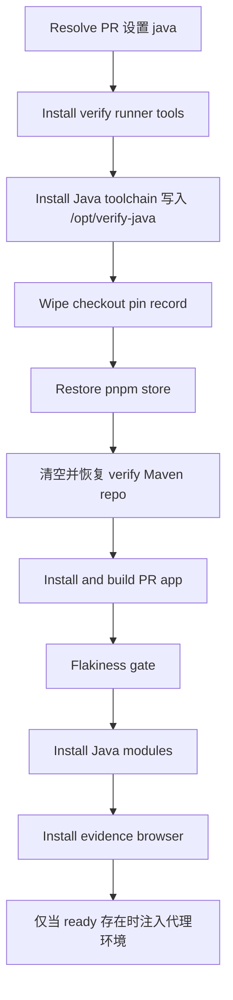

# verify 通道的 Java 工具链

[English](verify-java-toolchain.md) | [简体中文](verify-java-toolchain.zh-CN.md)

状态：随本次改动实现。对应 issue #13741。

## 问题

`.github/workflows/qwen-triage.yml` 里的沙箱 `verify` 任务是维护者对 PR 做
A/B 结论的通道。它跑在每次新建的 `node:22-bookworm` 容器里，不安装 JDK 或
Maven。改动了 `packages/sdk-java/` 的 PR，Java 侧有没有被执行，取决于那一轮
代理肯不肯花自己的时间去下载工具链。有的轮次会下载，有的不会，后一轮还可能
悄悄停掉前一轮已经执行过的 Java。

`sdk-java.yml` 已经在 `pull_request` 上构建并测试 Java。缺口是 verify 代理
自己的结论，不是 CI 覆盖。

## 现状

- verify 容器每个 job 新建。`$RUNNER_TEMP` 从宿主机挂载，跨 job 保留，所以
  每个消费者在使用前都会删掉自己的子目录。
- 代理以 `env -i` 启动，`HOME` 是 `$RUNNER_TEMP` 下的新目录。`~/.m2` 永远是
  空的。代理该看到的东西必须放进这组环境变量。
- 四个 Java 模块发布的是固定版本（`0.1.0-alpha`，`acp-sdk` 为
  `0.0.1-alpha`），不是 SNAPSHOT。`qwen-managed-agent-server` 依赖
  `qwencode-sdk` 和 `qwen-managed-runtime-broker`，包括 broker 的
  test-jar。本地仓库里留下的旧 jar 就是 Maven 会解析到的那一个。
- `actions/cache` 用 `path` 的字面量加上压缩方式来识别一条缓存。这个镜像没有
  `zstd`。已经走通的先例是 `.github/workflows/pnpm-store.yml`：在 `main` 上
  跑的可信生产者，加上只恢复的消费者，两边的 `runs-on`、容器和 `path` 相同。
- verify 任务的预算注释按 180 分钟计算，对应 `timeout-minutes: 190`。

## 目标

PR diff 碰到 `packages/sdk-java/` 时，代理一开始就有 JDK 21、Maven 3.9.11、
预热过的本地仓库，以及按合并引用装好的 `qwencode` 和 `runtime-broker`。其他
PR 不付代价。技能的环境约定写明通道提供什么。

## 不做的事

在技能里列为 _Not covered_，仍由 `sdk-java.yml` 负责：

- MariaDB / MySQL 的 failsafe 集成测试和 hosted harness。它们需要数据库和
  打包好的 `dist/cli.js`。
- Java 11 和 Java 17 矩阵。
- 用抖动门重跑 Java 测试。

## 方案

resolver 在 checkout 之前已经把完整的改动文件列表分页取进 `$files`。列表匹配
`^packages/sdk-java/` 时，输出 `java=true`。后面的步骤同时要求
`decision == 'run'` 和 `java == 'true'`。

root 步骤都在任何 PR 代码之前。执行 PR POM 的步骤以 `node` 运行，并剥离
GitHub 和 Actions 凭据。

### 工具链

`Install Java toolchain` 以 root 运行，位于 `Install verify runner tools`
之后、`Checkout PR merge ref` 之前。它下载钉死版本的 Temurin 21 x64 压缩包
（sha256），以及 `repo.maven.apache.org` 上的 Maven 3.9.11（sha512，与
`sdk-java.yml` 的 `MAVEN_VERSION`、`MAVEN_SHA512` 相同）。两份归档解压到
`/opt/verify-java/{jdk,maven}`，权限 `a+rX`，属主为 root。只有两份校验和
`java -version` / `mvn -version` 都成功之后才写 `/opt/verify-java/ready`。
`mvn -version` 之前会导出 `JAVA_HOME` 和 `PATH`：Maven 启动脚本不会自己去找刚解压的
JDK，否则它会在 `ready` 写出来之前退出。
`curl` 使用 `--max-time 300` 并重试。失败时删掉前缀、打出 warning、以 0
退出。

`/opt` 在容器本地且属 root，`node` 用户不能投放 `ready`。容器每个 job 都是
新的，`ready` 不会从上一次运行漏过来。

### Maven 仓库缓存

`.github/workflows/verify-maven-repo.yml` 是生产者。它在推送到 `main` 且
`packages/sdk-java/*/pom.xml` 或该工作流文件本身变化时触发，也支持
`workflow_dispatch`。它使用 verify 任务的 `runs-on` 和 `node:22-bookworm`，
选项为 `--init --user node`，并用与 pnpm store 相同的 SHA 钉住
`actions/cache/save`，保存 `${{ runner.temp }}/verify-maven-repo`。key 为
`verify-maven-repo-${{ hashFiles('packages/sdk-java/*/pom.xml') }}`。

生产者对 `qwencode` 和 `runtime-broker` 做 `-DskipTests` 的 install，再对
`managed-agent-server` 和 `client` 做 `-DskipTests verify`，把编译、测试和
生命周期插件拉进仓库。保存前删除 `packages/sdk-java/*/pom.xml` 每个模块对应的
`com/alibaba/<artifactId>`。这些版本不是 SNAPSHOT；把 main 的 jar 留在缓存里，
同级模块安装失败时就会解析到 main 的构建。

verify 任务在 `Install and build PR app` 之前清空
`$RUNNER_TEMP/verify-maven-repo`，并用只恢复的 `actions/cache/restore`
恢复（没有 save 步骤）。`restore-keys: verify-maven-repo-` 覆盖改了 POM 的
PR。恢复步骤设置 `continue-on-error`，缓存服务故障时退化为冷仓库，而不是让
验证失败。

### 同级模块

`Install Java modules` 放在抖动门之后、`Install evidence browser` 之前，仅当
安装/构建还没有写下 verdict 时运行。没有 `ready` 就 warning 并 exit 0。否则
把仓库交给 `node`，每条命令包在 `timeout -k 30 300` 和 `runuser -u node`
里，并剥离凭据：

- `mvn -f packages/sdk-java/qwencode/pom.xml -DskipTests -Dgpg.skip=true -Dmaven.javadoc.skip=true install`
- `mvn -f packages/sdk-java/runtime-broker/pom.xml -DskipTests -Dspotbugs.skip=true install`

两者都带 `-Dmaven.repo.local=$RUNNER_TEMP/verify-maven-repo`。root 把
`qwencode=<exit> runtime-broker=<exit>` 追加到
`$RUNNER_TEMP/verify-context/java-prepare.log`，并把缓存是否命中写入步骤摘要。
这一步总是以 0 退出，从不写 verdict。

### 代理环境

`Run verification agent` 只在 `/opt/verify-java/ready` 存在时，于现有
Chromium 代码块之后向 `QWEN_ENV` 追加。后面的 `PATH` 生效，因为 `env` 从左到右
应用赋值：

- `PATH` 前面加上 `/opt/verify-java/jdk/bin` 和
  `/opt/verify-java/maven/bin`
- `JAVA_HOME=/opt/verify-java/jdk`
- `MAVEN_ARGS=-Dmaven.repo.local=$RUNNER_TEMP/verify-maven-repo`
- `QWEN_VERIFY_JAVA=1`

`.qwen/skills/verify-pr/SKILL.md` 告诉代理不要自己下载 JDK 或 Maven，如何读
`java-prepare.log`，A/B 的 base 一侧如何重装同级模块（仓库里只有一份非
SNAPSHOT），以及把依赖数据库的集成测试写进 _Not covered_。Java diff 存在但没有
`QWEN_VERIFY_JAVA`，表示工具链安装失败。

### 超时

预算注释为工具链、恢复和两次封顶的 `mvn install` 增加最多约 20 分钟，且只在
Java diff 上发生。最坏情况从约 180 分钟变为约 200 分钟。`timeout-minutes`
改为 210，仍留 10 分钟余量。

## 设计决定

- **路径开关只看 `packages/sdk-java/`。** `sdk-java.yml` 还会在很宽的 core
  和 CLI 路径上触发。给那些 diff 准备 Java，会让大多数 core PR 都去下载工具链，
  而它们的跨语言测试仍然需要 MySQL 和本通道不提供的 bundle。
- **checkout 之前以 root 下载，不用 `actions/setup-java`。** 那个 action 的
  toolcache 在共享宿主机上，`cache: maven` 还会在 post 步骤回写。bookworm 的
  apt 钉不住 Temurin 21。checkout 之前的步骤没有 PR 输入，与
  `Install verify runner tools` 相同。
- **只恢复的缓存加上可信生产者。** verify 任务里的 save 会让 PR 控制的 POM
  解析写入共享缓存。生产者只在 `main` 上跑。缓存的验收是第二次运行命中，不是
  YAML 形状检查：这个镜像没有 `zstd`，以前就有 key 相同却永远命不中的缓存。
- **保存前剥离本仓库的产物。** 固定版本让旧 jar 和合并引用的构建无法区分。
- **同级模块安装尽力而为，并且放在 TypeScript 构建之后。** Maven 失败不能把
  TypeScript 验证变成 `fail`。日志里的退出码告诉代理要不要重装。

## 约束

- `issue_comment` 工作流跑的是默认分支上的 YAML。这套行为只有在改动进入
  `main` 之后才生效。
- 功能分支写入的缓存只有该分支能读到。verify 任务要能命中，生产者必须先在
  `main` 上跑过。
- 7 天没人访问的缓存会被淘汰。下一次生产者运行或 `workflow_dispatch` 会重写。
  未命中仍然能用，只是更慢。
- `qwen-triage.yml` 受工作流体积棘轮约束。新的生产者是单独文件，需要自己的
  `.size-baseline` 行。

## 风险

- Maven Central 或 Temurin 下载可能不可达。Java 侧退化为 _Not covered_；
  验证的其余部分照常跑。
- 容器多出解压后的 JDK（约 0.5 GB）。宿主机的 `$RUNNER_TEMP` 多出仓库（约
  200 MB），下一次 Java verify 运行时删掉。
- #13732 第 11 条在工具链就位之前要求把 Java 视为未覆盖。本通道开始设置
  `QWEN_VERIFY_JAVA` 之后，那一条应只在变量不存在时生效。如果 #13732 先合并，
  本次改动一并修改它。

## 验证

- `scripts/tests/qwen-triage-workflow.test.js` 钉住路径开关、步骤顺序、校验和、
  与 `sdk-java.yml` 及生产者共享的 Maven 钉子、只恢复的缓存（相同的 path、
  key、runner 和容器）、被剥离的 artifact 集合、`runuser` 加 `timeout`、
  有条件的代理环境，以及 210 分钟的任务上限。
- `.github/scripts/qwen-triage-workflow.test.mjs` 要求
  `timeout-minutes >= 210`。
- 本地 `node:22-bookworm` 演练跑下载、以 `node` 安装同级模块，以及只用代理
  环境变量跑 `mvn test`。
- 合并之后：对同一个 Java PR 连续两次 `/verify`。第二次的步骤摘要显示
  `verify Maven repo: hit=true`，报告执行了 Java 侧，代理没有下载 JDK。

## 验收标准

- `packages/sdk-java/` 以外的 diff 不下载 JDK、不恢复 Maven 仓库、不安装同级模块。
- Java diff 到达代理时已设置 `QWEN_VERIFY_JAVA=1`、`JAVA_HOME` 和
  `MAVEN_ARGS`；下载失败时则没有这些变量，并有 warning。任务仍然运行代理。
- verify 任务从不保存 Maven 缓存。
- 生产者剥离的 artifact id 恰好等于 `packages/sdk-java/*/pom.xml` 的
  artifact id。
- 生产者在 `main` 上保存之后，第二次 verify 运行报告缓存命中。
