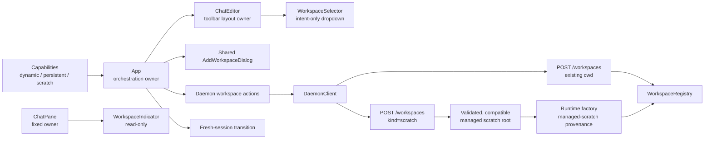
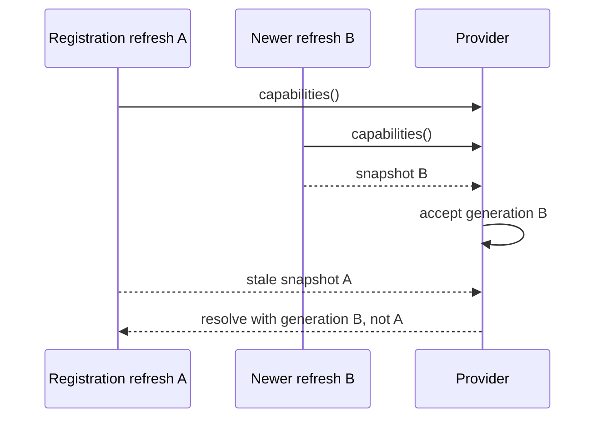
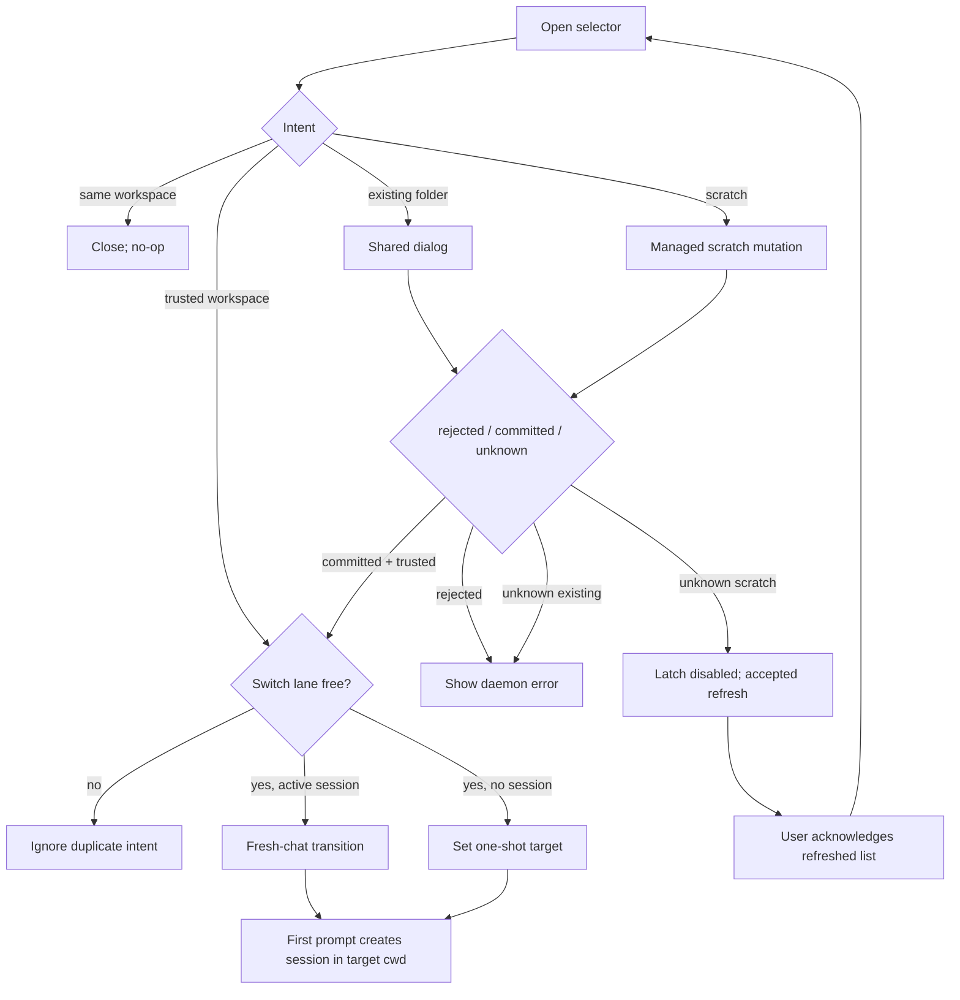

# Web Shell Composer Workspace Selector

## Status

Revised proposal for [#6700](https://github.com/QwenLM/qwen-code/issues/6700), under [#6699](https://github.com/QwenLM/qwen-code/issues/6699).

This is one end-to-end solution delivered in two dependent changes:

1. add the missing daemon capabilities and managed scratch-workspace contract;
2. add the composer dropdown and reuse the existing workspace/session flows.

The daemon change must land first. The UI must capability-gate every new action so mixed-version deployments remain safe.

## Goals

- Show the current workspace in the main composer toolbar.
- Switch to a registered trusted workspace without changing an existing session's owner.
- Register a directory that already exists on the daemon host.
- Create a usable workspace in a new daemon-managed empty directory.
- Preserve locked-workspace, untrusted-workspace, responsive toolbar, portal, and React 18 behavior.
- Make mutation timeout, refresh ordering, and rapid switching deterministic.

## Non-goals

- Moving an existing session between workspaces.
- Letting the browser create arbitrary daemon-host directories.
- Automatically deleting scratch workspace contents. Removal continues to unregister the runtime, not delete user files.
- Adding a second workspace state store in Web Shell.

## Current state and gaps

- `App` already stores a one-shot `selectedWorkspaceCwd` for the next lazily created session and clears it after creation (`packages/web-shell/client/App.tsx:1252-1259`, `packages/web-shell/client/App.tsx:2639-2688`).
- `ChatEditor` already has a compact workspace `Select`, but it appears only with multiple workspaces and has no trust or add actions (`packages/web-shell/client/components/ChatEditor.tsx:1597-1606`, `packages/web-shell/client/components/ChatEditor.tsx:2004-2096`).
- `createNewSession(workspaceCwd)` already clears the attachment and prepares a fresh target-workspace composer (`packages/web-shell/client/App.tsx:3741-3781`).
- The sidebar owns `AddWorkspaceDialog` and the existing-directory registration flow (`packages/web-shell/client/components/sidebar/WebShellSidebar.tsx:1174-1197`, `packages/web-shell/client/components/sidebar/WebShellSidebar.tsx:3772-3779`).
- `POST /workspaces` requires an existing absolute directory; it cannot implement “Start from scratch” (`packages/cli/src/serve/routes/workspace-management.ts:243-297`).
- `refreshCapabilities()` rejects stale state writes but still returns a stale response to its caller when a newer refresh supersedes it (`packages/webui/src/daemon/workspace/DaemonWorkspaceProvider.tsx:95-121`).
- `withActionTimeout()` does not cancel its input promise, so a timed-out registration has an unknown commit result (`packages/webui/src/daemon/timing.ts:34-52`).

`WorkspaceIndicator` remains a separate read-only `<output>` for split panes whose sessions already have fixed owners (`packages/web-shell/client/components/WorkspaceIndicator.tsx:30-83`).

## Architecture



Ownership is explicit:

- The daemon owns filesystem creation, canonical paths, trusted provenance, registration, limits, and cleanup safety.
- `DaemonWorkspaceProvider` owns the accepted capability generation.
- `App` owns mutation reconciliation, workspace-switch serialization, and the single Add Workspace dialog.
- `WorkspaceSelector` renders state and emits intents only.
- Session creation remains lazy; selecting a workspace does not create an empty session.

## Daemon contract

### Capabilities

Add two conditional feature tags:

- `dynamic_workspace_registration`: `createWorkspaceRuntime` is available, so an existing directory can be registered at runtime.
- `scratch_workspace_registration`: the provenance-aware runtime factory and complete runtime-disposal owner are available, and every startup workspace is compatible with the validated managed scratch root under the shared predicate below.

Keep `persistent_workspace_registration` as the independent signal that `persist: true` is supported.

Production `runQwenServe` supplies the scratch root under Qwen's user-private data directory. Direct `createServeApp` embeds advertise scratch support only when they explicitly inject a root, the provenance-aware factory, and `workspaceRuntimeRemoval`; the factory alone is insufficient because a constructed-but-unregistered runtime needs the complete disposal owner during shutdown. Older daemons advertise none of the new tags; the new UI hides unsupported actions.

Define one `isScratchRootCompatible(canonicalCwd, canonicalRoot)` predicate and reuse it for startup restoration, capability calculation, ordinary registration, scratch preflight, and in-flight checks. It returns true when the canonical workspace is disjoint from the canonical root, or when it is a direct child whose canonical basename matches `scratch-*`. It returns false for the root itself, every ancestor containing the root, and every other descendant. Every caller canonicalizes through the existing workspace-path boundary before evaluating the predicate; no additional source-path metadata is stored.

The root is an active reserved boundary only when every startup workspace passes this predicate. While active, an ordinary `POST /workspaces` path must pass it; an allowed direct child always uses `existing` provenance and the ordinary trusted-folder calculation, so its location never restores managed trust. Before creating scratch, every registered cwd and `inFlight: addition` cwd must still pass the same predicate. After `mkdtemp`, the new candidate must also pass the ordinary workspace nesting check against all registered and in-flight cwd values; compatible direct children are siblings and therefore do not block one another. If the primary workspace is `$HOME` and the configured root is below it, compatibility fails and scratch support is omitted rather than advertised as an action that must fail.

### Request and response

Keep the existing request unchanged:

```json
{ "cwd": "/existing/absolute/path", "persist": true }
```

Extend `POST /workspaces` with one mutually exclusive request shape:

```json
{ "kind": "scratch" }
```

Supplying both `cwd` and `kind`, an unknown kind, or any `persist` field with `kind: "scratch"` returns `400`. Scratch workspaces are process-local registrations and are never written to the registration store. Existing-directory persistence remains unchanged and still uses `persistent_workspace_registration`.

Scratch success uses the existing workspace response unchanged:

```json
{
  "id": "workspace-id",
  "cwd": "/managed-root/scratch-Ab3x9Q",
  "primary": false,
  "trusted": true,
  "persisted": false
}
```

The SDK adds `addScratchWorkspace()`; WebUI exposes the same action. Existing clients, response types, request shapes, and registration-store schema v1 remain unchanged.

### Trusted runtime provenance

Change the internal factory contract to require an explicit daemon-owned provenance:

```ts
type WorkspaceRuntimeProvenance = 'existing' | 'managed-scratch';

createWorkspaceRuntime(
  cwd: string,
  options: { provenance: WorkspaceRuntimeProvenance },
): Promise<WorkspaceRuntime>;
```

This option is never parsed from HTTP input. The existing-directory branch always passes `existing`; only the scratch branch may pass `managed-scratch`, after it created and validated the child under the accepted root. `runQwenServe` computes `trusted` from trusted-folder settings for `existing` and grants automatic trust for `managed-scratch`. Merely being inside the managed root never grants trust to an `existing` registration, although explicit trusted-folder configuration may independently make it trusted. The resulting value must feed the filesystem factory and runtime record; the bridge receives that filesystem adapter, and the registry and capabilities read the runtime's trusted value. The factory also requires a `managed-scratch` cwd to be a direct canonical child of the accepted root, providing defense in depth for internal callers.

### Managed scratch directory

The scratch route accepts no client path or name.

1. Resolve and create the configured root at daemon startup with user-only permissions. Reject a symlink, non-directory, wrong-owner, or group/world-writable root. Omit `scratch_workspace_registration` if any restored startup workspace fails `isScratchRootCompatible` (using the applicable ownership and symlink checks on each platform).
2. Before each creation, re-check that the root is still the same non-symlink canonical directory accepted at startup; fail closed if its identity changed. Use `mkdtemp(<canonical-root>/scratch-)` for atomic, collision-resistant child creation.
3. Canonicalize the child and require its direct parent to equal the startup-canonicalized root before runtime creation.
4. Call the runtime factory with `managed-scratch` provenance. Arbitrary registered paths always use `existing` and retain the current trust calculation.
5. Reuse the existing workspace capacity, in-flight registration, runtime creation, registry-add, and shutdown gates through the reservation protocol below. Scratch never enters the persistence branch.
6. Once `mkdtemp` succeeds, never delete that child automatically, including on validation, runtime, registry, response, shutdown, or removal failure. Log the preserved path for inspection or manual cleanup.
7. Workspace removal unregisters the runtime and preserves its directory and files. The user can re-add it through “Use an existing folder.”

Before its first `await`, the scratch branch synchronously checks `sealed`, computes projected capacity as the size of the union of registered runtime cwds and cwd-keyed `inFlight` additions plus `pendingScratchCreations`, increments `pendingScratchCreations`, and calls `operationStarted()`. Ordinary registration uses the same projected-capacity formula, so it cannot steal a slot reserved by scratch. After `mkdtemp` returns a validated canonical child, the route synchronously decrements `pendingScratchCreations` and installs that cwd as `inFlight: addition` before calling the runtime factory. Every exit path releases whichever reservation it owns and calls `operationFinished()` exactly once. The branch re-checks `sealed` after each awaited filesystem/factory step and before `workspaceRegistry.add`; if sealing wins, it does not admit the runtime, invokes the required runtime-disposal owner exactly once for any fully constructed unregistered runtime, and preserves the child directory. `sealAndWait()` waits for that finalizer through the operation count.

There is no cross-process lock, historical-directory quota, or startup cleanup. `mkdtemp` already provides collision-safe creation across daemon processes, while each daemon's existing runtime capacity bounds its live resource consumption. A daemon must never delete a directory that another daemon may be creating or using. Removal preserves the directory; the daemon logs the managed root so users can inspect or manually remove unused children. A durable global disk quota would require a separately owned, crash-recoverable lease protocol and is outside this feature.

### Mutation result semantics

Registration has three client-visible outcomes:

| Outcome     | Examples                                               | UI behavior                                                                                                                                                                     |
| ----------- | ------------------------------------------------------ | ------------------------------------------------------------------------------------------------------------------------------------------------------------------------------- |
| `rejected`  | definitive `400/401/403/409/501/503` response          | Keep the initiating surface open and show the daemon error.                                                                                                                     |
| `committed` | successful POST response                               | Close the mutation surface and refresh capabilities; retry only the refresh if it fails. Switch only if an accepted snapshot contains the returned canonical trusted workspace. |
| `unknown`   | timeout, disconnect, aborted response, ambiguous `5xx` | For scratch, latch creation disabled, refresh capabilities, and require explicit acknowledgement after an accepted refresh. Never auto-retry or auto-select.                    |

An HTTP abort does not roll back daemon work. Unknown outcomes deliberately favor duplicate prevention over automatic convenience.

For scratch creation, `scratchOutcomeUnknownRef` is the synchronous authority for an explicit state machine independent of the short-lived mutation token. A React state value mirrors the ref only for rendering:

```text
clear -> refreshing -> awaiting-ack -> clear
                    -> refreshing (manual refresh retry)
```

A single helper writes `scratchOutcomeUnknownRef.current` before scheduling its mirrored React state update. The handler reads the ref before acquiring `workspaceMutationTokenRef` and writes `refreshing` to the ref before releasing that mutation token. Therefore a second intent in the same render interval returns before issuing a request even if React has not committed the visual disabled state. Only an accepted capability refresh advances the ref to `awaiting-ack`; a failed refresh leaves it at `refreshing` and exposes “Refresh workspace list,” while a superseded refresh follows its accepted successor under the refresh contract below. The notice lists the refreshed workspaces and exposes “I checked the workspace list”; that acknowledgement alone returns the ref to `clear`. Neither refresh nor acknowledgement selects a workspace. Existing-folder registration keeps its current retry surface because its canonical input makes a repeat resolve as an existing/duplicate registration rather than creating another directory.

## Capability refresh contract

Strengthen `refreshCapabilities()` without changing its public return type:

- A call resolves with a snapshot only if that snapshot became the provider's accepted generation.
- If refresh A is superseded by refresh B, A chains to B and resolves/rejects with B's result instead of returning A's stale payload.
- A client replacement rejects work tied to the old client.
- State, status, error, the cached promise, and the returned promise describe the same generation.

The registration handler may switch only from this accepted result. It must still confirm that the response's canonical `cwd` exists in the accepted snapshot and is trusted.



## Composer and App design

### WorkspaceSelector

Create `WorkspaceSelector.tsx` with options `{id, cwd, label, primary, trusted}` and callbacks for selecting, creating scratch, and opening the existing-folder dialog.

- Render workspaces as radio items; exactly one is checked.
- Disable untrusted entries and show a lock plus localized text.
- Show `Start from scratch` only with `scratch_workspace_registration`.
- Show `Use an existing folder…` only with `dynamic_workspace_registration`.
- Show the `New workspace` submenu only when at least one creation action is available.
- If there is one workspace and no creation capability, hide the selector. With multiple workspaces, retain switching even if creation is unavailable.
- Keep the full cwd tooltip, accessible trigger name, keyboard navigation, and compact visual label.

Use the shared `DropdownMenu` portal. Convert only wrappers on the actual `asChild` ref path to `React.forwardRef`; the final ref must reach the native button under React 18.

### One Add Workspace owner

Move dialog state, registration, capability refresh, suggestions, and persistence gating from `WebShellSidebar` to `App`. Pass one open callback to sidebar and composer and render one dialog.

All workspace-creation intents share a synchronous `workspaceMutationTokenRef`. The owner token is stored before invoking either existing-folder or scratch registration; a second intent is ignored until `finally` releases the matching token. Rendered busy state is feedback, not the concurrency guard. Scratch additionally checks `scratchOutcomeUnknownRef.current` before acquiring the token, so an ambiguous completed request cannot be repeated after the token is released.

`AddWorkspaceDialog` receives `persistenceSupported`:

- supported: default `persist` to true and show the switch;
- unsupported: omit the switch and always send `persist: false`.

Successful existing-folder registration uses the daemon's canonical response cwd. Scratch creation has no dialog and follows the same committed/unknown reconciliation rules. A committed trusted registration calls the same serialized workspace-switch entry point used by ordinary workspace items: it starts a fresh chat when a session is active and only updates the draft target when no session exists.

### Serialized workspace switching

Selecting a different workspace from an active session means “open a fresh chat there”; it never mutates the old session.

Use a synchronous `workspaceSwitchTokenRef` plus rendered busy state:

1. The first active-session intent stores a unique token in the ref before invoking `createNewSession` or changing state.
2. Later intents while the ref is occupied are ignored; first intent wins.
3. Selecting the current owner is a no-op and does not acquire the lane.
4. The transition calls the existing `createNewSession(targetCwd)` and keeps lazy first-prompt creation.
5. `finally` releases the ref only when it still owns the same token.
6. The selector is visually disabled while the lane is occupied.

With no active session, selection is a synchronous draft preference and the latest user selection wins; it does not need the destructive-transition lane.

`clearSession()` clears local attachment state synchronously and treats detach failure as best-effort; `reloadLoadedSkills()` already absorbs lookup failure. The switch therefore commits when `createNewSession` clears the attachment. Tests should assert the actual current behavior rather than invent rollback of the old attachment.

Before the first prompt, an effect validates `selectedWorkspaceCwd` against the latest accepted capabilities. Missing or untrusted selections reset to primary; the daemon remains the final fail-closed authority.



## Files

| Layer     | Files                                                                                                               |
| --------- | ------------------------------------------------------------------------------------------------------------------- |
| CLI       | `capabilities.ts`, `server.ts`, `run-qwen-serve.ts`, `routes/workspace-management.ts`, and focused tests            |
| SDK       | daemon request/result types, `DaemonClient.ts`, and unit tests                                                      |
| WebUI     | workspace action/types, `DaemonWorkspaceProvider.tsx`, and tests                                                    |
| Web Shell | `App.tsx`, `ChatEditor.tsx`, `WorkspaceSelector.tsx`, sidebar/dialog wiring, dropdown ref boundary, i18n, and tests |

This is a cross-package infrastructure change and requires maintainer review under the repository's core-infrastructure gate.

## Complete unit test plan

### CLI workspace management

1. Advertise dynamic and persistent capabilities only when their existing dependencies exist; advertise scratch only with a validated compatible root, provenance-aware factory, and complete runtime-disposal owner. A direct embed missing any one dependency omits scratch support.
2. Preserve the existing `{cwd, persist?}` request and response exactly.
3. Accept exactly `{kind: "scratch"}`; reject mixed/unknown shapes and any scratch persistence field.
4. Create scratch only as a direct canonical child of the injected root with user-only permissions.
5. Evaluate startup, persisted, registered, and in-flight canonical paths through the same `isScratchRootCompatible` cases: disjoint and canonical direct `scratch-*` child pass; root, ancestor, and every other descendant fail. `$HOME` primary with a root below `$HOME` suppresses the capability.
6. While scratch support is active, ordinary registration enforces that predicate; an allowed direct child uses `existing` provenance and ordinary trust.
7. Pass `existing` provenance for every ordinary registration and `managed-scratch` only for a route-created, revalidated direct child.
8. Verify managed provenance grants automatic trust through the filesystem factory, bridge, runtime, registry, and capability entry. Verify a re-added direct child with `existing` provenance is trusted or untrusted solely according to explicit trusted-folder configuration, never because of its managed-root location.
9. Re-add one preserved direct child at runtime, then create a second scratch sibling successfully. Re-add with `persist: true`, restart, restore that child as a startup workspace, and retain scratch capability and sibling creation.
10. Count the union of registered and `inFlight: addition` cwds plus `pendingScratchCreations`; at `MAX - 1`, a scratch reservation prevents an ordinary registration from taking the final slot, and the reverse ordering also stays within capacity.
11. Keep registration-store schema v1 byte-compatible and perform no scratch store reads or writes.
12. After `mkdtemp`, preserve the child on every validation, runtime, registry, response, shutdown, and removal path; no route or daemon instance calls `rmdir` or recursive deletion.
13. Convert one pending reservation into one cwd-keyed in-flight addition without double-counting; every validation, creation, runtime, registry, and shutdown exit releases the owned reservation and calls `operationFinished()` once.
14. Call `sealAndWait()` while scratch awaits filesystem creation and again after the factory returns but before registry add; shutdown waits, no runtime is admitted afterward, and the complete disposal owner is called exactly once when a runtime exists.
15. Block daemon A's runtime factory after child creation, register that child through daemon B with `existing` provenance, then fail A; A preserves B's active cwd. Perform no startup or cross-process child cleanup.
16. Concurrent requests from two daemon instances sharing a root use `mkdtemp` to create distinct directories without a shared lock; each daemon independently enforces its live runtime capacity.
17. Return the canonical scratch response with `persisted: false`; aborting the HTTP client after mutation begins does not roll back daemon completion, which remains observable through capabilities.

### SDK and WebUI

1. `addScratchWorkspace` sends exactly `{kind: "scratch"}` and parses the existing workspace response.
2. Existing add-workspace wire tests remain unchanged.
3. Action timeout does not trigger an automatic second POST.
4. Refresh A superseded by B resolves callers with B; stale A never updates state or escapes as a return value.
5. Newer refresh rejection propagates to callers chained from A.
6. Client replacement rejects the old generation.

### WorkspaceSelector and ChatEditor

1. Render selected basename, accessible name, full-cwd tooltip, folder icon, radio checked state, and compact mode.
2. Show and invoke each creation action only under its exact capability.
3. Hide the submenu with no creation capability; hide the whole selector only for one non-creatable workspace or locked mode.
4. Untrusted entries are labeled, disabled, and callback-free.
5. Portal, Enter/Space/arrows/Escape, focus restoration, and React 18 ref behavior remain correct.
6. Wide/narrow measurement replicas match the real trigger; custom/right widths and hysteresis remain stable.
7. Split panes still render only `WorkspaceIndicator`.

### App orchestration

1. Existing session -> different trusted workspace performs one fresh-chat transition and preserves the old session owner.
2. Same owner is a no-op.
3. Two intents in the same tick execute one clear; first intent wins.
4. A later intent after lane release can switch normally; an old completion cannot release a newer lane.
5. Missing/untrusted stale target resets before first-prompt creation.
6. Both add entry points open one shared dialog; cancel performs no mutation.
7. Two creation intents in the same tick issue one POST; first intent wins, and an old completion cannot release a newer mutation lane.
8. Existing-folder persistence UI and request follow `persistent_workspace_registration`; scratch never shows or sends persistence.
9. Committed existing/scratch mutation refreshes once and switches through the common serialized entry point only for the canonical trusted entry from the accepted generation.
10. Untrusted committed registration appears but does not switch.
11. A committed POST followed by refresh failure retries only the refresh and never issues a second registration request.
12. Definitive `4xx/501/503` rejection remains actionable without changing context.
13. Scratch timeout/disconnect/ambiguous `5xx` writes `refreshing` to the authoritative ref before releasing the mutation token; a second handler call before React re-renders, or after token release, still produces one POST.
14. Failed reconciliation refresh keeps scratch disabled; a superseded refresh follows its accepted successor, and only an accepted generation advances to `awaiting-ack` without auto-selecting.
15. Only explicit acknowledgement after the accepted refresh clears the latch; a later click can then create once normally.
16. Registration refresh A superseded by removal refresh B cannot select from A.
17. Locked workspace exposes no switching or creation actions.

Run focused tests from each package directory, then run `npm run build && npm run typecheck` from the repository root.

## Acceptance criteria

- The composer identifies and switches among registered trusted workspaces without migrating sessions.
- The same dropdown provides both “Start from scratch” and “Use an existing folder” when supported.
- Scratch creation is confined to a compatible daemon-managed root. The shared predicate permits only disjoint canonical workspaces and canonical direct scratch children. Managed provenance grants automatic trust; ordinary re-registration can become trusted only through the existing trusted-folder configuration.
- Scratch registrations are process-local, keep registration-store schema v1 unchanged, and never trigger automatic startup or cross-process deletion.
- Dynamic, persistent, and scratch actions are independently capability-gated.
- Scratch timeout is a latched unknown commit state; creation stays disabled through an accepted refresh and explicit acknowledgement.
- Only the latest accepted capability generation can drive a switch.
- Same-tick workspace intents are serialized deterministically.
- Single/multi-workspace, locked, untrusted, responsive, portal, React 18, error, race, and cleanup paths have focused unit tests.
- Split-pane workspace indicators remain read-only.
