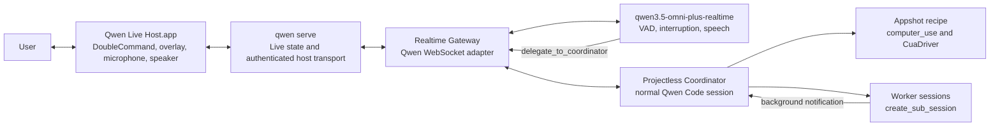

# WebShell Live Voice

## Status

This document defines the implementation contract for Codex-style live voice
in Qwen Code WebShell.

- Implementation base: `origin/main` at
  `8a44b1b9f79341a0faca9814fb1b57f0f1b354a2`.
- Reference behavior: Codex Desktop `26.721.41059`, build `5848`.
- Realtime model: `qwen3.5-omni-plus-realtime`.
- Initial native platform: macOS.
- Browser-only fallback: intentionally unsupported.

The existing WebShell voice button remains dictation. Live Voice is a separate
feature with a separate protocol and lifecycle.

## Product contract

After installing Qwen Live Host and granting every required permission, a user
can double-tap Command from any application or macOS Space to start or resume a
voice conversation. The conversation is backed by a normal Qwen Code session
in a daemon-managed, projectless Conversations workspace. The user can ask the
conversation to inspect the current screen, use normal Qwen Code tools, or
create independent worker sessions for longer tasks.

Live is available only when all of the following are true:

- Qwen Live Host is installed, running, authenticated to the local daemon, and
  protocol-compatible.
- Microphone and Input Monitoring are granted to the signed Live Host.
- Accessibility and Screen Recording are granted to the supported CuaDriver
  identity used by Qwen Code.
- microphone capture, audio output, DoubleCommand, and Appshot self-checks pass.
- the Realtime provider, credential, endpoint, and model pass a live readiness
  check.

Missing or revoked permission, a disconnected Host, a protocol mismatch, or an
unavailable provider makes Live unavailable. WebShell must not call browser
`getUserMedia`, fall back to dictation, or offer a reduced Live mode without
Appshot. If readiness is lost during a call, audio stops safely while the
Coordinator and worker sessions remain available.

`general.liveVoice.enabled` is a restart-time hard gate. When it is false, a
Host handshake reports `provider_config` without creating the Conversations
runtime, preheating the ACP child or CuaDriver tools, or probing/connecting the
Realtime provider.

## Verified baseline

### Existing Qwen Code behavior

- `/voice/stream` is one-way browser microphone to ASR. A final transcript is
  inserted into the composer; it is not automatically submitted and there is
  no model audio output.
- `/capabilities` advertises `voice_transcribe`, not Live. Global `qwen` 0.20.0
  returned 404 for `/live/status` in the isolated pre-change dry run.
- `POST /workspaces` already supports daemon-owned managed scratch workspaces,
  but each one consumes a workspace runtime and is process-local. A new scratch
  runtime per voice call would leak runtimes and hit the workspace limit.
- `POST /session` and the daemon bridge support thread-scoped sessions,
  source metadata, parent lineage, session cwd relocation, event replay, and
  normal prompt FIFO ordering.
- `create_sub_session` already creates independent sibling sessions. Its
  `first-turn` mode collects a bounded result, while `sent` currently drains
  completion without notifying the parent.
- background task completion already has the required parent-session semantics:
  a persisted system notification, WebShell rendering, and an automatic model
  turn.
- CuaDriver already exposes permission checks, application/window discovery,
  accessibility text, and per-window PNG capture through `computer_use`.
- `packages/desktop` is an intentionally isolated Bun/Electron product. Its
  Session manager and UI must not be imported into the root workspace, but its
  signing pipeline and transparent always-on-top window patterns are reusable
  inside that isolated build domain.

### Real Realtime API result

On 2026-07-27 the API key configured for the `qwen3.8-max-preview` provider was
used, without exposing it to a client, to connect to:

```text
wss://dashscope.aliyuncs.com/api-ws/v1/realtime?model=qwen3.5-omni-plus-realtime
```

The real service successfully completed:

- `session.created` and `session.update`/`session.updated`;
- 16 kHz mono PCM input and accurate transcription;
- 24 kHz PCM output with `response.audio.delta`, `response.audio.done`, and
  `response.done`;
- `semantic_vad` speech start, stop, automatic commit, and automatic response;
- a narrow `delegate_to_coordinator` function call and a final response after
  `function_call_output`.

The current generic WebRTC signalling URL returned 404 and the local provider
configuration has no Bailian Workspace ID. The first implementation therefore
uses the verified server-side WebSocket transport. The endpoint remains
configurable so a workspace-scoped WebRTC transport can be added only after a
real SDP and media-track test passes.

The current selected chat model is not necessarily the provider whose key can
call Realtime. Live credential resolution therefore reads user settings and
the daemon environment only, selects an explicit configured provider entry,
and never accepts project settings or project environment overrides for this
process-global capability. It must not silently use the currently selected
model.

## Architecture



The Realtime model never receives shell, filesystem, computer-use, or worker
management tools. It receives two narrow functions:
`delegate_to_coordinator` and `start_new_live_conversation`. The latter only
rotates the projectless Coordinator; all approvals, sandboxing, tools, and
worker creation still happen in a normal Qwen Code session.

## Native Live Host

### Packaging boundary

Create a dedicated app under `packages/desktop/apps/live-host`. It is built and
signed in the existing desktop isolation domain but has its own product and
bundle identity:

```text
Qwen Live Host.app
com.alibaba.qwen-code.live-host
```

It must not start or reuse the Desktop workspace server, Session manager, or
main renderer. Its only UI is a small transparent overlay and a settings/status
surface for installation and permissions. It runs as an accessory app, stays
alive without visible windows, and can be enabled as a login item.

The preload API is deliberately narrow: toggle, stop, input/output mute, open
Coordinator/worker, permission action, and state subscription. Model
credentials and direct Realtime access are never exposed to the renderer.

### DoubleCommand

Electron cannot register a bare-modifier double tap. The app bundles a signed
native helper that uses a listen-only `CGEventTap` and
`CGPreflightListenEventAccess`/`CGRequestListenEventAccess`.

The recognizer accepts two complete Command taps within 350 ms only when no
ordinary key or other modifier intervenes. It emits the toggle only after the
second Command release. Long press, slow double tap,
Command shortcuts, simultaneous left/right Command, and triple taps must not
produce duplicate toggles. The Electron main process parses bounded JSON lines,
restarts a failed helper with a bounded policy, and owns the single
`toggleLive()` path.

### Audio and overlay

Microphone capture happens only in the installed Host. The Host converts input
to 16 kHz mono signed PCM and sends binary audio frames to the daemon. It plays
24 kHz signed PCM returned by the daemon and drops queued output immediately on
barge-in or stop.

The overlay is frameless, transparent, always on top, visible on all Spaces,
and shown without stealing focus. It displays readiness, listening/thinking/
speaking state, recent transcript, mute controls, stop, and links to the active
Coordinator and workers. Empty transparent regions are click-through.

### Appshot responsibility

The Host does not implement a second screen-capture stack. Qwen Code continues
to use the pinned CuaDriver identity for Accessibility and Screen Recording.
The Live installation/status workflow starts that driver and surfaces all four
permissions as one readiness checklist. This avoids two competing CUA bundle
identities and duplicate TCC grants.

## Daemon Live service

Live is process-global rather than workspace-scoped. A `LiveCoordinator` owns:

- at most one authenticated Host connection;
- at most one active call epoch and audio owner;
- the call state machine;
- the Realtime gateway;
- the active/resumable Coordinator locator;
- Host and CuaDriver readiness;
- WebShell status subscribers.

The existing `/voice/stream` and `WorkspaceVoiceCoordinator` are unchanged.

### Routes

```text
GET    /live/status
POST   /live/start
POST   /live/new
POST   /live/stop
POST   /live/mute
WS     /live/host
```

`/live/host` uses the same no-server WebSocket upgrade boundary as `/acp` and
`/voice/stream`: loopback-only deployment assumptions, bearer validation when
configured, strict path/host/origin checks, frame and queue limits, heartbeat,
and deterministic close codes. The handshake includes protocol version, Host
version, bundle identity, instance nonce, permissions, and self-checks. A
second Host is rejected while the current lease is healthy.

Protocol v2 Host input frames contain an eight-byte big-endian call epoch
followed by the bounded PCM16 payload. The capture generation freezes that
epoch before audio enters IPC, and the daemon discards any frame whose epoch no
longer owns the active call. This prevents queued audio from an old call from
crossing an HTTP `/live/new` boundary.

`GET /live/status` returns only non-secret state:

```ts
type LiveStatus = {
  available: boolean;
  state:
    | 'unavailable'
    | 'idle'
    | 'starting'
    | 'listening'
    | 'thinking'
    | 'speaking'
    | 'stopping'
    | 'error';
  blocker?:
    | 'host_missing'
    | 'host_disconnected'
    | 'host_version'
    | 'microphone_permission'
    | 'input_monitoring_permission'
    | 'accessibility_permission'
    | 'screen_recording_permission'
    | 'audio_input'
    | 'audio_output'
    | 'global_shortcut'
    | 'appshot'
    | 'provider_config'
    | 'provider_unreachable';
  callId?: string;
  coordinator?: { workspaceCwd: string; sessionId: string };
};
```

### Discovery

The daemon publishes a mode-0600 process-global Host locator at
`~/.qwen/live/daemon.json`, independent of `QWEN_RUNTIME_DIR` and
`advanced.runtimeOutputDir`, so a Finder- or Login Item-launched Host can find
it without inheriting CLI environment variables. The record contains the
loopback URL, protocol version, daemon PID, instance nonce, and bearer token
when one is required. Writes are atomic. A daemon cannot replace a live owner;
it may reclaim only a stale record, and shutdown removes the record only when
the nonce and PID still identify that daemon. The runtime-local record may
remain for diagnostics, but the stable locator is authoritative for the Host.
Tokens never appear in URLs, renderer state, logs, or process arguments.

## Realtime gateway

### Configuration

Add settings separate from dictation:

```json
{
  "general": {
    "liveVoice": {
      "enabled": false,
      "model": "qwen3.5-omni-plus-realtime",
      "providerModel": "openai:qwen3.8-max-preview",
      "endpoint": "wss://dashscope.aliyuncs.com/api-ws/v1/realtime",
      "voice": "Tina"
    }
  }
}
```

`providerModel` uses the existing model-provider selector semantics, including
base-URL disambiguation when needed. The daemon resolves its `envKey` or other
supported credential source server-side, validates that the provider is a
supported DashScope/Bailian route, and substitutes only the upstream Realtime
model. `voiceModel` remains dedicated to ASR dictation.

The endpoint override is advanced configuration. Non-TLS or private-network
upstream URLs are rejected unless an existing explicit development override
authorizes them.

### Upstream session

The adapter sends a `session.update` that configures:

- 16 kHz PCM input and 24 kHz PCM output;
- input transcription;
- `semantic_vad` with automatic response and interruption;
- text and audio output;
- a concise Live frontend prompt;
- two narrow functions: `delegate_to_coordinator` for normal turns and
  `start_new_live_conversation` for an explicit voice request to leave the
  current conversation and begin a new projectless one.

Every completed meaningful user turn delegates to the Coordinator. The
function arguments include the verbatim request and a bounded recent transcript
needed for disambiguation. Tool output is the Coordinator's authoritative
response. Realtime then produces the natural spoken answer. Upstream tool
requests are correlated by call ID and call epoch; stale results are persisted
to the Coordinator but never spoken into a newer call.

The provider currently supports autonomous `tool_choice` only; it can choose to
answer a user turn directly even when instructed to delegate. Therefore all
text and audio from the initial user-response phase are authority-gated and
suppressed until an approved narrow function is observed. If a completed
response contains no approved function, the adapter may synthesize exactly one
`delegate_to_coordinator` request from the uniquely associated, bounded final
input transcript. Its result returns through the same trusted Coordinator
update path, never as a fabricated provider `function_call_output`. Missing,
empty, reused, or ambiguous transcript correlation fails closed. Duplicate
representations of the same provider call ID are idempotent; conflicting or
multiple approved calls in one response are rejected.

Transcript fallback also has a trusted model-control escape hatch for an
explicit request to reset the current Live conversation. Each delegation gets
a random nonce in bridge-only model context. Only an `end_turn` whose complete
Coordinator text exactly matches that nonce-bearing control rotates Live; a
wrong nonce, surrounding text, or any other stop reason is ordinary output.
The adapter never classifies the user's language itself. The internal control
assistant message remains in the old Coordinator's raw transcript; it is not
forwarded to Realtime or spoken. Avoiding that record would require a broader
private ACP tool/control channel and is outside this fallback's scope.

The adapter handles VAD start/stop, input transcript deltas/finals, output text
and audio deltas, function argument deltas/finals, response completion, rate
limits, provider errors, reconnect, and cancellation. A VAD speech-start event
while output is playing first tells the Host to clear playback, then cancels
the upstream response.

An upstream connection reaching its scheduled maximum age is rotated only at
an observed idle boundary: no speech or uncommitted input, response, delegated
turn, or authorized follow-up response may still be pending. A bounded drain
deadline fails the call explicitly instead of truncating an unknown tail.
Network-unreachable readiness is re-probed by one slow background timer only
while Live is enabled, a Host has completed its handshake, and no call is
active. A successful probe clears the temporary override. Configuration
failures are not retried in a loop.

## Projectless Coordinator lifecycle

### Conversations workspace

Do not create one managed-scratch runtime per call. The daemon owns one durable
Conversations workspace:

```text
~/Documents/Qwen Code/Conversations/
```

It is created with mode 0700, registered as a daemon-managed trusted runtime,
and restored on daemon startup. Each materialized Live conversation gets a
deterministic server-generated child directory derived from the session ID,
such as:

```text
~/Documents/Qwen Code/Conversations/conversation-<sha256(session-id)>/
```

The browser and Host never submit an arbitrary cwd. Session cwd relocation is
allowed only to the expected owned, mode-0700, non-symlink direct child of the
Conversations root. Resume derives and revalidates the same directory from the
persisted session ID, then reapplies the relocation before accepting a prompt;
no client-provided path or separate mutable mapping is trusted.

### Provisional and resume behavior

Starting audio creates only a provisional call. The first meaningful user
utterance atomically creates the directory and a thread-scoped Coordinator.
Stopping before that leaves no visible session or directory.

For compatibility with the current WebShell catalog, the first implementation
stores the session as the normal/default source type with a versioned
`sourceId` prefixed by `realtime_voice:p1:h1:a1:`. The three version components
cover the Live prompt, handoff protocol, and Appshot recipe. This preserves Live
provenance while keeping the conversation visible in existing overview/resume
queries. A future catalog API that accepts multiple source types can migrate to
a dedicated `realtime_voice` source type without hiding sessions.

DoubleCommand resumes the most recently active compatible Live Coordinator.
Compatibility includes the Live prompt version, handoff protocol version, and
Appshot schema version. An explicit “new conversation” action skips resume.
Resume injects a bounded recent transcript/summary into Realtime and waits for
the user to speak; it never greets proactively.

Stopping Live closes only the Realtime/audio call. The Coordinator and workers
remain normal sessions.

## Coordinator and workers

The Coordinator receives the spoken request as the normal persisted user
message. A trusted bridge-only model context carries the structured
`<realtime_delegation>` instructions below; clients cannot supply this context,
and it is not echoed into the transcript. Its Live instruction says:

- answer ordinary questions and quick tool checks in the current session;
- use `computer_use` only for explicit deictic screen requests;
- use `create_sub_session` when the user explicitly asks for a new task/session
  or when independent long-running work is appropriate;
- return the exact trusted nonce control only when the user explicitly resets
  or switches the current Live voice conversation;
- return a concise speakable result while leaving detailed artifacts in the
  session or worker.

“Capture screen context” is a constrained Coordinator recipe over the existing
CuaDriver: discover the frontmost non-Host window and call
`get_window_state` for its accessibility tree and PNG. A target-window capture
does not include the separate Live overlay window. Ordinary conversation does
not poll or capture the screen.

For `create_sub_session` in `sent` mode, reuse the bounded first-turn collector
and add a parent-scoped background-notification bridge method. The ACP child
enqueues the existing task-notification shape into the parent Session so it is
persisted, rendered by WebShell, and consumed by a normal automatic Coordinator
turn. The notification includes the child session locator and a bounded result
or error. If the same Live call epoch is still active, its concise update may
be returned to Realtime; otherwise it remains in session history.

Worker discovery for the Host overlay trusts only a completed
`create_sub_session` tool result emitted on the Coordinator subscription and
extracts the bounded locator from that result's `rawOutput`. Session-like URIs
in assistant text, screen content, tool arguments, failed calls, background
notifications, or results from another tool never register a worker. The
daemon-owned tool invocation supplies the parent lineage; opening the resulting
locator separately revalidates that it belongs to the owned Live runtime.

## WebShell

WebShell adds a Live control separate from the current dictation microphone.
It subscribes to `LiveStatus`, shows install/permission/provider blockers, and
enables start only when `available` is true. It never opens a browser
microphone.

The active-call surface shows state, transcript, Coordinator, and worker links.
Opening a link loads the supplied `{workspaceCwd, sessionId}` locator. Worker
links must not rely on a bare `qwen-session://<id>` when the target may be in a
different runtime.

Screen-aware requests use the same frontmost-window CuaDriver recipe whether
Qwen or another application is foreground. WebShell does not publish page state
or credentials into the Live protocol.

## Failure and security rules

- API keys stay in daemon memory and are redacted from logs and errors.
- Audio and Appshot payloads have explicit frame, image, text, and queue caps.
- Only one call epoch owns input and output. Reconnect cannot create a second
  audio owner or duplicate Coordinator.
- Permission revocation, Host exit, CuaDriver exit, or protocol mismatch stops
  the active call and fails closed.
- Disabled Live performs no Conversations, ACP/Appshot, CuaDriver, or provider
  startup work.
- Initial provider text/audio has no speaking authority. Only an approved
  narrow tool result or trusted Coordinator update can reach Host playback.
- Upstream reconnect preserves the Coordinator identity but does not replay old
  output audio or duplicate a delegation.
- Appshot is explicit and pull-only. There is no continuous screen stream.
- Conversation directories are generated and containment-checked by the
  daemon. Symlinks may not escape the Conversations root.
- Host and daemon version skew uses an explicit protocol range, not optimistic
  feature detection.

## Delivery slices and real validation gates

1. **Protocol and provider**: unit-test the Realtime adapter with a fake server,
   then repeat the real handshake, audio, semantic VAD, output audio, and narrow
   tool-call test using the configured qwen3.8 provider credential.
2. **Daemon and Coordinator**: use a protocol test Host to verify hard gating,
   provisional materialization, resume/new, real model prompt completion, and
   no API key leakage.
3. **Signed Host**: build/install the app and native helper; verify signing,
   exact bundle identities, each TCC permission, audio input/output, global
   DoubleCommand, and fail-closed revocation behavior.
4. **Appshot and workers**: run real foreground-window capture and real
   `create_sub_session` cases, including completion return to the parent.
5. **WebShell and full acceptance**: build/typecheck/focused tests, run the local
   bundled daemon with the real Realtime model, and use Computer Use to execute
   every case in `.qwen/e2e-tests/web-shell-live-voice-alignment.md` across
   Chrome, Finder/editor, full-screen, and multiple Spaces.

No slice is considered complete solely from mocks. Each gate records the exact
binary/SHA, Host bundle version, model, provider route, event sequence, and
redacted evidence.
