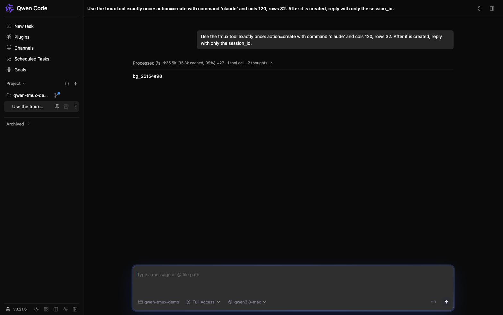

# Web Shell tmux Terminal (Interactive CLI Sub-Agent)

## Real scenario

The agent (in the Web Shell) is asked to start an interactive CLI; it uses the
`tmux` tool, which registers a terminal task. The user can then attach and
watch the live session.

Web Shell session after the agent created the terminal (`bg_25154e98`):

## Problem

A Web Shell session's agent already runs as a full qwen-code process on the
daemon host (one `qwen --acp` child per workspace, spawned by
`packages/acp-bridge/src/spawnChannel.ts`), so it _can_ drive an interactive
CLI such as `claude` today by hand-rolling `tmux` commands through the shell
tool — this is exactly what the `tmux-real-user-testing` and `e2e-testing`
skills do. But that pattern has four gaps:

1. **No lifecycle integration.** A tmux session created via the shell tool is
   invisible to the background task system: it does not appear in
   `GET /session/:id/tasks`, cannot be cancelled from the Web Shell tasks UI,
   and is not cleaned up on session shutdown.
2. **No live view.** Web Shell has no terminal component and the daemon has no
   PTY/terminal endpoint, so the user can only read `capture-pane` text
   snapshots in tool output — never watch or interact with the session.
3. **No approval granularity.** Every tmux invocation is a generic shell
   command; the permission system cannot distinguish "create a terminal" from
   "send keys to it".
4. **Fragile orchestration.** The model must re-derive tmux plumbing (socket
   names, session naming, scrollback capture, exit detection) from skill text
   on every run.

## Goals

Let an agent spawn and drive an arbitrary interactive CLI inside tmux on the
daemon host, as a first-class background task, and let the user watch and type
in that terminal live from the Web Shell browser UI.

Non-goals: claude-specific adaptations (the design is CLI-agnostic), Windows
support (tmux is Unix-only), running inside the tool sandbox (tmux is
unavailable there), multi-user access control, session recording/replay, and
the remote-sandbox ("Stage 4+") deployment model.

## Proposed Changes by Layer

### 1. Core: a `tmux` tool

New tool `tmux` in `packages/core/src/tools/tmux.ts`, following the
`monitor.ts` structure (`BaseDeclarativeTool` + `BaseToolInvocation`,
`Kind.Execute`, deferred with a `searchHint`). One tool with an `action`
parameter keeps the declaration count at one:

| Action    | Params (beyond `action`)                  | Permission | Behavior                                                                                          |
| --------- | ----------------------------------------- | ---------- | ------------------------------------------------------------------------------------------------- |
| `create`  | `command`, `cwd?`, `cols?`, `rows?`       | ask        | Creates a detached tmux session on the dedicated socket running `command`; registers a shell task |
| `send`    | `sessionId`, `keys`, `enter?`, `literal?` | ask        | `tmux send-keys` to the session's pane                                                            |
| `capture` | `sessionId`, `lines?`                     | allow      | `capture-pane -p` (no escape codes; `-S -<lines>` capped at 2000); plain text to the model        |
| `list`    | —                                         | allow      | Lists live tmux sessions owned by this registry                                                   |
| `kill`    | `sessionId`                               | ask        | Kills the tmux session; settles the task as cancelled                                             |

Registration touch points (the standard recipe): `ToolNames` /
`ToolDisplayNames` in `tool-names.ts`, a `registerLazy` entry in
`Config.createToolRegistry` (config.ts), and `PermissionManager.CORE_TOOLS`
(permission-manager.ts). `getConfirmationDetails()` returns `type: 'exec'`
details naming the wrapped tmux command and carries per-action permission
rules — `Tmux(create)`, `Tmux(send)`, `Tmux(kill)` — so the existing
"always allow" confirmation flow persists a rule for that action and a long
drive loop does not re-prompt on every `send`. No session-scoped grant
mechanism is added. `toAutoClassifierInput()` is overridden so AUTO mode
sees the action and command. The tool is _not_ added to the plan-mode shell
whitelist in `coreToolScheduler.ts` — creating or driving a terminal is a
host mutation and stays gated in plan mode.

Availability guards: the tool is always registered (sandbox state is a
deployment property, not a registration-time one) and fails fast at
invocation with a clear error on Windows or when the tool sandbox is
active; `verifyTmux()` (existing, requires tmux ≥ 3.0) runs on `create`.

### 2. Core: tmux sessions as shell-kind tasks

`create` registers the session in `BackgroundShellRegistry` as a regular
`kind: 'shell'` task:

- `shellId` uses the existing `bg_<hex>` scheme; the tmux session name is
  `qsh-<shellId>` on a fixed dedicated socket `qwen-serve`
  (`tmux -L qwen-serve`). A fixed socket (not pid-namespaced like
  `arena-server-<pid>`) keeps naming stable and documentable; uniqueness
  comes from the random shell id.
- `pid` is omitted (already optional); the abort listener runs
  `tmuxKillSession` instead of a process-group kill. Cancellation via
  `task_stop`, the daemon cancel route, and `abortAll()` on shutdown all work
  unchanged.
- `outputPath` points at a file filled by a new `tmuxPipePane` helper
  (`pipe-pane -o 'cat >> <file>'`), so the existing output-tail notification
  and the Web Shell output viewer work as-is. Pipe output carries raw ANSI;
  ANSI stripping moves to read time (`readOutputTail`).
- `ShellTask` gains one optional field:
  `terminal?: { socket: string; tmuxSession: string }`. This is the only
  data-model change.
- Pane exit detection polls `tmuxListPanes` (the `remain-on-exit` +
  `#{pane_dead_status}` pattern from `TmuxBackend.pollPaneStatus`) and
  settles the registry entry `completed`/`failed`.

`tmux-commands.ts` gains `tmuxPipePane`; all other helpers
(`tmuxNewSession`, `tmuxSendKeys`, `tmuxCapturePaneContent`, `tmuxKillSession`,
`tmuxListPanes`) already exist and are reused as-is.

### 3. ACP bridge + SDK: additive serialization

The optional `terminal` field rides the existing shell-task status chain —
no new task kind, no widened unions:

- `ServeSessionShellTaskStatus` (acp-bridge `status.ts`): optional `terminal`.
- Shell serializer in `tasksSnapshot.ts`: pass the field through.
- `DaemonSessionShellTaskStatus` (sdk-typescript `types.ts`): optional
  `terminal`.

Every existing consumer of the union (`session.ts` cancel route validator,
web-shell `kind ===` switches) is untouched because the kind stays `'shell'`.

### 4. Daemon: a terminal WebSocket endpoint

New endpoint `/terminal?sessionId=<id>&taskId=<bg_xxx>`, registered through
the existing `extraWsRoutes` mechanism at the `mountAcpHttp` call in
`server.ts` (a second `'upgrade'` listener cannot coexist; `ExtraWsRoute` is
the supported path). The path is static with query params because extra
routes match the request pathname exactly — a parameterized path like
`/session/:id/terminal/:taskId` cannot be expressed without changing the
shared ACP upgrade dispatcher, which this design avoids. The handler,
`packages/cli/src/serve/terminal/terminal-ws.ts`, is modeled on
`voice-ws.ts` and inherits the shared upgrade-time defenses (bearer via
header or `qwen-bearer.` subprotocol, loopback host allowlist, CSWSH origin
checks).

Connection flow:

1. Parse `sessionId`/`taskId` from the query string; resolve the session's
   owning runtime via the workspace registry (single-workspace shortcut →
   primary; otherwise `resolveLiveSessionOwner`, untrusted non-primary
   rejected).
2. Fetch tasks via `runtime.bridge.getSessionTasksStatus(sessionId)`, find
   `taskId`, and reject unless it is a running shell task with `terminal`
   metadata. This registry lookup is the authorization boundary: the daemon
   never attaches to an arbitrary host tmux session, only to sessions the
   agent created through the tool.
3. Spawn `@lydell/node-pty` (via core's lazy `getPty()`, re-exported from
   the core package index — no new cli dependency) running
   `tmux -L <socket> attach-session -t <tmuxSession>` at 80×24. tmux shared
   attach gives multi-viewer support and correct curses redraw and resize
   propagation for free.
4. Framing: binary client→server frames are written to the pty stdin; pty
   stdout streams down as binary frames. JSON text control frames carry
   `{type:'hello', cols, rows}` and `{type:'resize', cols, rows}` (pty
   resize). The server sends `{type:'ready'}` once attached; clients send
   nothing before it. Same binary-up/JSON-control shape as the voice
   socket.
5. Bounds: a fixed cap of 4 concurrent terminal sockets per session (the
   connection is rejected beyond that), a hard 60-minute connection
   lifetime cap, and a 16 MB buffered-output backpressure bound. A full
   admission-lease coordinator like `WorkspaceVoiceCoordinator` is not
   justified for the daemon's single-operator model.

### 5. Web Shell: live terminal tab

- New dependency: `@xterm/xterm` + `@xterm/addon-fit` (no `addon-attach` —
  our framing is custom). The xterm stylesheet is imported inside the
  scoped-CSS root so the Web Shell style isolation contract is preserved.
- `client/terminal/useTerminalSocket.ts`: WebSocket client hook modeled on
  `voice/useVoiceCapture.ts` (ws-url derivation, `['qwen-ws', bearer]`
  subprotocols, `binaryType='arraybuffer'`, generation-snapshot cleanup).
- `client/components/terminal/TerminalPanel.tsx`: xterm instance + fit
  addon + the socket hook; plain DOM, no portals, so no portal-root or
  React-19 ref concerns beyond the standard `forwardRef` discipline.
- `ArtifactPanelTab` gains a `'terminal'` kind with a render branch next to
  the existing `shell`/`monitor` branches, plus an `openTerminalPanel`
  callback in App.tsx.
- `ShellTaskDetail` in `TasksStatusMessage.tsx` shows an "Open Terminal"
  button when the task carries `terminal` metadata; cancel keeps using the
  existing `cancelTask(id, 'shell')` path.

## Key Design Decisions

1. **Reuse the `'shell'` task kind instead of adding a `'terminal'` kind.**
   A new kind would mean widening `TaskKind`, `ServeSessionTaskStatus`, the
   background-notification union, both kind validators (daemon route +
   acpAgent), SDK types, and every web-shell `kind ===` switch — a large,
   error-prone sweep. One optional field on the shell task delivers the same
   wiring with additive-only changes. The registry is not tied to
   `ChildProcess` (it stores `pid?` + `AbortController`), so a tmux-backed
   entry fits today.
2. **The daemon attaches to tmux directly; terminal bytes do not flow
   through ACP.** Daemon and ACP child share host and UID (the spawn-channel
   threat model already assumes shell equivalence). Proxying a byte stream
   through ACP JSON-RPC would add base64 overhead and latency for no security
   gain. The ACP layer is used only for what it's good at: task metadata.
3. **PTY `attach-session` over `pipe-pane` scraping for the live view.**
   Attach gives faithful terminal semantics (curses redraws, bracketed paste,
   resize via SIGWINCH, shared multi-client view) with xterm.js as a dumb
   renderer. `pipe-pane` remains, but only to fill the registry output file
   for model-facing tails.
4. **A dedicated tool instead of skill-text orchestration.** The tool is
   what creates the registry entry, the output file, and the permission
   boundary (`ask` on mutations, `allow` on reads); none of that is possible
   when the model improvises tmux commands through the generic shell tool.
5. **Fixed tmux socket `qwen-serve`, no adoption and no startup sweep.**
   Graceful shutdown kills sessions through `abortAll()`; a hard-killed
   daemon leaves orphans attached to the socket. Because the socket is
   shared by every daemon on the host, a boot-time sweep could kill another
   live daemon's sessions, and adoption is impossible without a persisted
   registry — both are rejected. Orphans are unreachable from the daemon
   (validation always goes through the in-memory registry) and harmless;
   cleanup targets the specific sessions (`tmux -L qwen-serve kill-session -t
qsh-<id>` per orphan) — avoid `kill-server`, which also terminates every
   other daemon's terminals sharing the host-wide `qwen-serve` socket.
   Reconciliation can be revisited if a persisted task registry ever lands.

## Files Affected

| Package                   | Files                                                                                                                                                                                                                                                                                                                                                                                                               |
| ------------------------- | ------------------------------------------------------------------------------------------------------------------------------------------------------------------------------------------------------------------------------------------------------------------------------------------------------------------------------------------------------------------------------------------------------------------- |
| `packages/core`           | `src/tools/tmux.ts` (+test), `src/tools/tool-names.ts`, `src/config/config.ts`, `src/index.ts`, `src/permissions/permission-manager.ts` (+test), `src/permissions/rule-parser.ts` (+test), `src/permissions/autoMode.ts`, `src/agents/backends/tmux-commands.ts` (+test), `src/agents/backends/TmuxBackend.ts`, `src/services/backgroundShellRegistry.ts`                                                           |
| `packages/cli`            | `src/serve/terminal/terminal-ws.ts` (+test), `src/serve/server.ts`, `src/serve/acp-http/index.ts`, `src/serve/process-env-guard.test.ts`, `src/config/config.ts`, `src/acp-integration/session/tasksSnapshot.ts` (+test), `src/i18n/locales/en.js` + `zh.js` + `zh-TW.js`, `package.json`                                                                                                                           |
| `packages/acp-bridge`     | `src/status.ts`                                                                                                                                                                                                                                                                                                                                                                                                     |
| `packages/sdk-typescript` | `src/daemon/types.ts`                                                                                                                                                                                                                                                                                                                                                                                               |
| `packages/web-shell`      | `client/terminal/useTerminalSocket.ts` (+test), `client/components/terminal/TerminalPanel.tsx` (+module.css), `client/components/artifacts/ArtifactPanel.tsx` (+module.css), `client/components/messages/TasksStatusMessage.tsx` (+test), `client/components/messages/toolFormatting.ts`, `client/App.tsx`, `client/i18n.tsx`, `client/vite-config.test.ts`, `vite.config.ts`, `vite.lib.config.ts`, `package.json` |

## Scope Boundaries

- Unix + no tool sandbox only; the tool errors clearly otherwise.
- No new task kind, no push channel for task status (the existing 3 s poll
  stays), no mid-invocation tool-text streaming to the transcript.
- No recording/replay, scrollback export beyond `capture`, or multi-user
  ACLs beyond the daemon's existing single-operator bearer model.
- No orphan adoption or sweep after a hard daemon kill; cleanup is manual
  and documented (Decision 5).
- The disabled arena `TmuxBackend` stays disabled; this feature reuses only
  its command helpers, not the backend.
