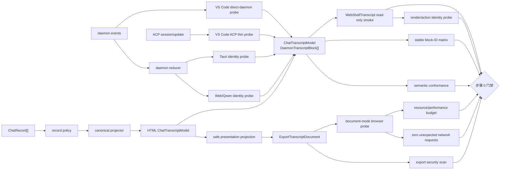

# Chat Transcript 契约预验证设计

> 状态：已实施，步骤 0 门禁通过；未执行 VS Code 生产时间线迁移<br>
> 对应阶段：统一 ChatPanel 方案的步骤 0<br>
> 相关方案：[Web Shell、VS Code、Desktop 与 HTML Export 统一 ChatPanel 方案](../../../Web%20Shell、VS%20Code、Desktop%20与%20HTML%20Export%20统一%20ChatPanel%20方案.md)

## 1. 结论

本步骤先冻结四端共同需要的**最小只读会话记录语义**，再验证各端能否稳定地产生该语义。它不迁移 UI，不替换宿主输入框、权限交互或会话管理，也不预先建立新的公共 ChatPanel 包。

预验证中的最小 `ChatTranscriptModel` 只包裹现有 `DaemonTranscriptBlock[]`：

```ts
interface ChatTranscriptModel {
  readonly blocks: readonly DaemonTranscriptBlock[];
}
```

这里的 `ChatTranscriptModel` 是测试和评审使用的契约名称，不是本步骤要发布的新运行时类型。若验证通过，生产代码继续直接使用 `DaemonTranscriptBlock[]`；只有录制用例证明现有 block 无法表达必需的用户可见语义时，才能提议扩展现有契约或新增公共类型。

四端都必须参加 adapter 验证，但不要求四端各自实现一套生产转换：

- Web/Qwen Server 直接消费 daemon blocks；Qwen Tauri Desktop 的打包脚本构建并复制同一 WebShell 产物，两者使用同一个 identity adapter/probe 证明契约覆盖；
- VS Code 分别验证直接消费 daemon events/blocks 的 identity 候选和保留 ACP 时的薄转换候选，随后选择其中一条；
- HTML Export 验证 `ChatRecord[]` 经记录策略与规范投影生成相同 blocks，再经安全边界生成导出专用文档的路径。

本步骤只有在**共享消息语义、稳定 block/渲染项 identity、宿主动作寻址和导出规则均有可重复的录制数据与自动化证据**时才通过。

这不是对现状的预判通过。实施前的基线 fixture 稳定复现了三项缺口：部分 block ID 由归约 ordinal 生成；`WebShellTranscript` 的工具、计划和权限历史依赖导出禁止的 raw 字段；Markdown 图片允许主动请求远程 URL。本次分别用源级 segment identity + 只读稳定 ID 投影、显式 document-mode 安全投影、类型化安全展示字段和资源策略修复了三项缺口，同时保持 interactive/readonly 的 `rawInput`/`rawOutput` 与默认 ordinal ID 兼容语义。

### 1.1 2026-08-17 实施结果

本次实施已经完成合成 fixture、schema/hash、四端 probe、类型化安全展示字段、`ExportTranscriptDocumentV1` allowlist、document render mode、CSP/零网络与最大预算 Chromium 测试。导出实现将真正进入 Markdown renderer 的字段与 code、diff、shell、command 等普通可见文本分开计量：两类字段共享总文本预算，但只有前者执行主动资源清洗，避免把代码中的 URL 或 `![...]` 字面量误改写。结论按四组门禁记录如下：

| 门禁组                       | 结论 | 证据摘要                                                                                                                                                                                                                                                                                                   |
| ---------------------------- | ---- | ---------------------------------------------------------------------------------------------------------------------------------------------------------------------------------------------------------------------------------------------------------------------------------------------------------- |
| 共享消息语义                 | pass | ChatRecord canonical projection 以及删除 raw 字段后的工具结果、Todo/Plan、权限历史与 WebShell render fixture 通过                                                                                                                                                                                          |
| block/render/action identity | pass | Qwen ACP prompt-bound live text 在源头携带 prompt-scoped 确定性 segment ID，历史回放保留 record-derived segment ID；direct-daemon 与 ACP probe 均将原生 identity 投影为 scope-keyed block ID，append、partial prepend、replay、render/action 矩阵通过；缺失原生 identity 的任意 ACP 输入继续 fail closed   |
| 导出安全                     | pass | record/block/metadata allowlist、opaque ID、canary、路径与 URL、Markdown/结构化图片和版本失败测试通过                                                                                                                                                                                                      |
| 资源与网络                   | pass | 构建后的 `WebShellTranscript` 以 document mode 在锁定 Chromium 中非虚拟化渲染 1,000 source blocks（经文本、嵌套工具与并行 agent 固定规则合并为 997 个 rendered items）、约 8 MiB 可见文本，并完成全文查找、复制与打印；最终复验 15.152 秒、JS heap 增量 97,492,162 bytes（约 93 MiB）、零请求、零 CSP 违规 |

direct-daemon 与 ACP 两条候选均已通过稳定 identity 验证。默认 SDK reducer 继续产生兼容的 ordinal runtime ID；只有显式 contract probe 使用 `scopeKey + block kind + 原生 identity` 的确定性投影，因此本步骤不会改变 Web Shell interactive/readonly 的运行时 ID。Qwen ACP prompt-bound live text 在 `Session.sendUpdate()` 边界按稳定 prompt、lane、离散消息边界和已有 tool 边界生成 segment ID；历史 replay 已有的 record-derived segment ID 保持不变。缺失稳定 prompt/segment 来源的任意 ACP text 不会被猜测性补 ID，probe 仍明确失败。

步骤 0 的总体结论是 **pass**。两条候选同时保留为已验证路径；由于 ACP 是当前 VS Code 生产基线，capability matrix 将 ACP 选为后续迁移路径，direct-daemon 保留为已验证备选。这一选择只决定后续方向，本步骤未修改生产 `QwenManager`，也未迁移 VS Code 时间线、composer、权限交互或会话管理。

最大文档测试把当前构建的 `WebShellTranscript` library bundle 内联到预验证专用 HTML，并拒绝比 Web Shell 生产源码更旧的构建产物；这验证了真实 document-mode renderer，但不代表本步骤已替换现有 CLI HTML 模板，生产 HTML renderer 绑定仍属于后续阶段。测试同时核对全部 1,000 个 source block ID 均进入 render evidence，允许 renderer 对相邻同类 block 做语义合并，不能用 DOM 行数代替来源完整性。CSP 对 script 和 style element 使用 nonce，因现有 React 组件依赖受信任代码生成的 style attribute，仅对 `style-src-attr` 开放 inline；导出 DTO 不接受任意 style 字段或原始 HTML。测试会在 `INTEGRATION_TEST_FILE_DIR` 下生成 `chat-transcript-gate-report.json`，报告包含阈值、实测值、fixture hash、capability matrix hash、两条 VS Code 候选结果和后续选定路径，人工不填写 pass。

## 2. 背景与问题

当前四个消费端并非四套等价运行时：

| 消费端             | 当前数据边界                                        | 本步骤验证方式                               | 预期生产结果                                                              |
| ------------------ | --------------------------------------------------- | -------------------------------------------- | ------------------------------------------------------------------------- |
| Web/Qwen Server    | daemon state → `DaemonTranscriptBlock[]` → WebShell | identity probe                               | 保持现状，不新增 adapter                                                  |
| Qwen Tauri Desktop | 启动同一 daemon，并打开完整 WebShell                | 共享 identity probe + 打包 wiring 源码断言   | 保持现状，不新增 adapter                                                  |
| VS Code            | ACP session/update；另有 daemon 连接能力            | direct-daemon 与 ACP prototype 二选一评估    | direct identity 或 ACP 薄 adapter                                         |
| HTML Export        | `ChatRecord[]` → 独立 HTML renderer                 | canonical projection + export boundary probe | 复用规范投影得到 blocks，再生成安全导出文档并由 `WebShellTranscript` 渲染 |

因此，契约预验证不能从“每个产品都写一个 adapter”出发。需要先回答四个问题：

1. 现有 `DaemonTranscriptBlock[]` 是否能表达四端需要共享的全部只读消息语义；
2. 相同 scope 内的 block identity 能否在重放、重连、增量更新和分页下保持稳定；
3. block 经过 renderer 合并或分组后，VS Code 能否继续通过稳定 identity 完成语义复制、编辑定位和文件打开，而不依赖 DOM 或数组位置；
4. HTML Export 能否在不泄露运行时原始数据、不发起非预期网络请求且不超出资源预算的前提下生成同一展示语义。

## 3. 目标

1. 冻结最小 `ChatTranscriptModel` 及其明确的包含/排除边界。
2. 建立四端 capability-to-contract 清单和 adapter 验证用例。
3. 冻结稳定 block ID、渲染项 identity 和宿主动作寻址的来源、稳定域、失败条件和验证方法。
4. 验证工具、计划和权限历史的完整展示语义可由经过类型化、逐字段 allowlist 的字段表达，不把 raw payload 当作唯一来源。
5. 冻结 HTML Export 的记录级策略、block 字段白名单、安全 metadata、零自动网络请求策略和可执行资源预算。
6. 提交确定性、无真实用户数据的录制 fixture，作为后续 HTML 与 VS Code 迁移的共同基线。
7. 输出二元退出结论：通过，或列出由失败 fixture 证明的具体契约缺口。

## 4. 非目标

- 不发布 `@qwen-code/web-shell/chat-panel` 或新的公共消息模型。
- 不迁移或统一 composer、草稿、附件选择、队列、权限响应、会话列表、持久化和宿主导航。
- 不要求 Web/Qwen Server 或 Qwen Tauri Desktop 新增生产 adapter。
- 不替换 VS Code 时间线，也不决定未经验证的最终接入路径。
- 不在本步骤实现 VS Code 的真实文件打开、clipboard 或编辑副作用；这里只验证 renderer 能用稳定 identity 产生宿主可消费的动作目标和语义结果。
- 不实现最终 HTML 模板、VSIX 打包或 Desktop UI 改造。
- 不迁移 `packages/desktop` 中的 OpenWork/Craft Electron。
- 不把 PDF 等 artifact 预览纳入消息契约；聊天中只保留对 artifact 的展示引用和宿主动作语义。

## 5. 契约边界

### 5.1 最小模型

`ChatTranscriptModel` 只表达有序、只读的会话记录：

```ts
import type { DaemonTranscriptBlock } from '@qwen-code/sdk/daemon';

interface ChatTranscriptModel {
  readonly blocks: readonly DaemonTranscriptBlock[];
}
```

模型版本不进入运行时 model。fixture 使用独立 `fixtureVersion`，HTML 导出文档使用独立 `schemaVersion`；这样不会把测试格式、导出格式和 daemon 运行时契约误合并为一个版本系统。

### 5.2 属于共享消息语义的内容

| 能力                  | 预期 block 语义                                   | 必须验证的状态                                |
| --------------------- | ------------------------------------------------- | --------------------------------------------- |
| 用户与 assistant 文本 | `user` / `assistant` text block                   | 完成、流式、空增量、usage                     |
| thinking/commentary   | `thought` text block                              | 与 assistant 交错、折叠状态、结束             |
| 图片                  | text block 的图片展示数据                         | 多图、无效 MIME、超限数据、缺失资源           |
| 工具及分组            | `tool` block + 类型化安全 preview + tool identity | 并行、嵌套、前台、后台、重放、失败、结果摘要  |
| shell                 | `shell` / `user_shell` block                      | 启动、增量、后台化、退出、重连                |
| 计划                  | `tool` block 的类型化安全计划展示语义             | 创建、revision、依赖、完成、失败              |
| 权限历史              | `permission` block 的类型化安全历史展示语义       | pending、resolved、rejected、过期后的历史显示 |
| 状态与失败            | `status` / `error` / `prompt_cancelled`           | 取消、连接状态、截断、不完整 replay           |
| 调试与未知输入        | `debug` 或显式 fallback/diagnostic                | 可见降级或有据可查地丢弃，不能静默消失        |

“计划”当前不是独立 block kind，因此门禁不接受仅凭类型名宣称已经支持。fixture 必须证明现有投影能保留用户实际看到的计划标题、步骤、状态、revision 和依赖；任何缺失都作为明确契约缺口返回，而不是把任意原始对象塞入 `meta`、`details` 或 `rawOutput`。

当前 `WebShellTranscript` adapter 会从 `rawInput`、`rawOutput`、`content` 和 permission `toolCall` 恢复工具详情、Todo/Plan 与权限历史，而导出边界禁止这些字段。步骤 0 必须先用 fixture 让这项矛盾失败，再提交最小修复：优先在现有 block/preview 契约中补充逐 kind、类型化、可安全序列化的展示字段。interactive/readonly 必须只沿用既有 raw 字段语义，即使 raw 缺失也不能改为消费 typed preview/result；document/export 必须显式选择安全投影，只消费 typed preview/result，typed 字段缺失时也不能回退到 raw。这样两条路径互不污染，也不会把有损展示投影冒充完整工具参数。若现有 block 无法承载这些字段，则必须携带失败 fixture 评审最小契约扩展，不能声称安全子类型已经可以直接渲染。

默认路径的兼容性本身是门禁：同一 block 同时携带 raw 与 typed preview/result 时，interactive/readonly 的工具参数、结构化结果、权限状态和渲染项 ID 必须与改动前一致；`write_file` 必须继续产生完整 diff 与增删行统计。identity probe 所需的新来源映射只能由显式 probe 选项启用，不能改变默认运行时 ID。

### 5.3 不属于最小模型的状态

以下状态继续由宿主或 daemon side-channel 管理：

- composer 内容、光标、草稿和待发送附件；
- follow-up queue 和 suggestion 查询状态；
- 当前活动权限请求的响应动作、credential 输入和 ask-user 表单；
- session 列表、当前 session、branch 导航和持久化对象；
- 打开文件、diff、URL、artifact、复制、编辑消息等宿主动作；
- WebShell 的当前工具、approval mode、resync、pending shell 等运行时 side-channel。

`permission` block 只保存权限事件的时间线展示状态，不授予调用响应 API 的能力。验证 adapter 时不得为方便而把 action callback、宿主 service 或传输对象放入 block。

### 5.4 渲染项 identity 与宿主动作边界

宿主动作不进入 `ChatTranscriptModel`，但步骤 0 必须证明 renderer 不会在 block 合并、工具分组或虚拟化后丢失动作目标：

- 每个可操作渲染项有稳定 `renderedItemId`，并能追溯到一个或多个稳定 `sourceBlockIds` 或 tool call identity；
- assistant block 合并、相邻工具合组和 thought/sub-agent 嵌套必须有确定性 identity 规则，不能只保留第一个 block ID 后静默丢失其余来源；
- 单条复制、复制最后回复、编辑最后一条用户消息和文件打开均以稳定 identity 解析语义目标，不读取 DOM 子节点位置或当前数组下标；
- semantic copy 从 renderer 的展示模型生成确定性文本，不能抓取虚拟列表当前挂载的 DOM；
- scope 切换后，旧 scope 的 `renderedItemId`、动作请求和异步结果全部失效。

prototype 使用测试私有的 render/action probe 记录上述映射。本步骤不预先发布公共 handle；只有失败 fixture 证明现有 `WebShellTranscript` props 无法表达必要接缝时，才增加最小 callback 或 imperative handle。

### 5.5 可见未知内容的规则

adapter 遇到契约尚未认识的输入时必须选择以下一种结果，并产生稳定 diagnostic code：

1. 转为不会泄露原始载荷的可见文本 fallback；
2. 按已冻结策略明确排除；
3. 将用例标记为契约缺口并使门禁失败。

禁止静默丢弃用户原本可见的内容，也禁止通过 `unknown`、`meta`、`details` 或 raw payload 绕过契约评审。

## 6. 四端 adapter 验证

### 6.1 验证接口

prototype 使用测试私有接口，生产代码无需采用该形态：

```ts
interface TranscriptAdapterContext {
  readonly scopeKey: string;
  readonly generation: number;
}

interface TranscriptDiagnostic {
  readonly code: string;
  readonly severity: 'info' | 'warning' | 'error';
  readonly sourceIndex?: number;
}

interface TranscriptIdentityEvidence {
  readonly blockId: string;
  readonly sourceKind: string;
  readonly sourceIdentity: readonly string[];
}

interface TranscriptAdapterProbeResult {
  readonly model: ChatTranscriptModel;
  readonly diagnostics: readonly TranscriptDiagnostic[];
  readonly identities: readonly TranscriptIdentityEvidence[];
}

interface TranscriptRenderedItemEvidence {
  readonly renderedItemId: string;
  readonly sourceBlockIds: readonly string[];
  readonly sourceToolCallIds: readonly string[];
  readonly capabilities: readonly (
    | 'copy'
    | 'open-file'
    | 'edit-user-message'
  )[];
}

interface TranscriptRenderProbeResult {
  readonly items: readonly TranscriptRenderedItemEvidence[];
  readonly semanticCopyHashes: Readonly<Record<string, string>>;
}
```

diagnostic 只能携带 code、severity、位置和计数等安全信息，不能回显原始 prompt、token、路径或工具参数。

`scopeKey` 是宿主为当前 session + branch 分配的稳定、不透明 key；同一 session 重连时保持不变，切换 session 或 branch 时必须变化。`generation` 是同一 scope 每次重新绑定 transport 时递增的本地代数，只用于丢弃上一代迟到事件和异步回调，不参与 block ID。`TranscriptIdentityEvidence` 和 `TranscriptRenderProbeResult` 仅存在于测试报告，不得写入运行时 model 或导出文档。semantic copy 使用固定算法对合成文本计算 hash，报告不保存真实用户内容。

现有 `TranscriptProjectionDiagnostic` 含有 message、record ID 和 path 等调试信息，不能直接作为上述安全 diagnostic 或导出元数据。probe 必须将其归并为 code、severity、影响完整性的布尔值和计数；完整原始 diagnostic 只保留在受控测试进程中。

### 6.2 Web/Qwen Server

输入为 daemon reducer 的 `DaemonTranscriptState.blocks`。probe 验证：

- model 的 blocks 与 reducer 输出保持引用或结构等价，不进行第二次语义转换；
- 所有必需能力都有 fixture 覆盖；
- 相同 scope 的 replay 与增量结果满足 ID 门禁；
- `WebShellTranscript` 能以只读方式渲染每一种允许的 block；
- 工具、计划和权限历史在移除 raw 字段后仍由类型化安全展示字段完整渲染；
- render probe 能为合并文本、工具组和用户消息输出稳定动作目标。

通过后不落地新的生产 adapter。

### 6.3 Qwen Tauri Desktop

Tauri Desktop 使用与 Web/Qwen Server 相同的 identity probe，同时对 `prepare-runtime.js` 做打包 wiring 源码断言：

- 脚本显式执行 WebShell workspace build；
- 脚本把同一 `web-shell/index.html`、assets 和 library dist 复制到桌面 runtime；
- 仓库中没有为 Tauri 引入桌面专用 transcript 转换或 Craft/OpenWork renderer 分叉。

本步骤证明的是契约与打包 wiring 共用，不宣称已经启动安装后的桌面二进制做端到端 smoke。最终安装产物 smoke 仍属于后续桌面发布验证；这里不复制一套等价 adapter，也不以未执行的二进制验证充当证据。

### 6.4 VS Code

预验证同时建立两个仅测试使用的 contract probe：

1. **direct-daemon 候选**：把真实形状的 daemon events 送入 SDK reducer，并在 VS Code 所有的 `scopeKey` + `generation` harness 中直接消费 blocks；本步骤不修改生产 `QwenManager`，也不建立真实网络连接；
2. **ACP 候选**：录制 ACP session/update，通过 SDK 的规范化与 transcript reducer 薄转换为 blocks。

两条路径均需满足共享消息语义、稳定 ID、scope 隔离和打包边界。评审只选择至少一条可行路径：

- 当前生产基线仍是 ACP；direct-daemon 只是 spike，不能仅凭存在连接代码就登记为可行；
- direct-daemon 若要求替换现有 composer、权限交互或会话边界，则不在本步骤直接采用；
- ACP adapter 不得重新实现一套 Markdown、工具或计划语义，也不得把 ACP session object 交给 renderer；
- 两条候选都必须用 render/action probe 验证文件打开、单条/全部/最后回复复制和编辑最后一条用户消息的稳定目标；副作用仍由 VS Code 宿主持有；
- scope 切换、迟到 tool/plan/permission 更新和异步 copy/edit 结果必须按 `scopeKey` + `generation` 丢弃；
- 两条路径都失败时，记录最小失败 fixture 并使步骤 0 失败。

### 6.5 HTML Export

输入为 `ChatRecord[]`。prototype 执行：

```text
ChatRecord[]
  → 记录级导出策略
  → 规范 transcript 投影
  → ChatTranscriptModel
  → block 级安全展示投影
  → 版本化 ExportTranscriptDocument
  → schema 校验
  → WebShellTranscript document-mode probe
```

规范投影应优先复用现有 `projectChatRecordsToDaemonTranscript()`，本步骤负责用录制数据验证它，而不是建立第二套 record reducer。导出 boundary 是从 model 到安全文档的单向、只读转换，不复用 live runtime 的 side-channel，也不把完整 `ChatRecord`、`DaemonTranscriptBlock` 或 `DaemonTranscriptState` 直接序列化进文件。`WebShellTranscript` 只有在 `renderMode="document"` 时才启用 typed preview/result 安全投影；默认 readonly 和产品 interactive 路径继续使用完整 raw 数据。

“安全展示投影可以直接交给现有 renderer”是需要证明的结论，不是前提。若安全字段已由 `DaemonTranscriptBlock` 类型表达且 `WebShellTranscript` 实际消费它们，`ExportTranscriptBlockV1` 可以保持为安全子类型；否则步骤 0 必须失败并选择下列最小修复之一：扩展现有类型化 preview/display 字段，或增加唯一的 `ExportTranscriptDocumentV1 → renderer input` 纯函数 adapter。该 adapter 只能重排安全展示字段，不能恢复 raw payload、复制 reducer 或形成第二套消息语义。

## 7. 稳定 ID 规则

### 7.1 稳定域

“稳定”限定为：在同一个 `scopeKey` 和同一条原生语义事件链中，block ID 在以下操作后不变：

- React rerender；
- 相同录制数据重复归约；
- streaming 增量追加；
- 断线后的完整或重叠 replay；
- 历史记录前向分页或在已有窗口前 prepend；
- 时间戳被测试归一化；
- 相同事件以允许的顺序重新到达。

不同 session、branch 或独立导出文件不要求共享同一个 block ID。不同原生协议也不要求产生相同字符串 ID；跨 adapter 比较使用规范化语义和 provenance，而不是强行共享一个虚构的全局 ID。

### 7.2 ID 来源

每个输出 block 都必须提供 `TranscriptIdentityEvidence`：

| block                  | 首选原生 identity                                         | 不足时的处理                     |
| ---------------------- | --------------------------------------------------------- | -------------------------------- |
| tool                   | `toolCallId` + scope                                      | 无 tool call identity 则失败     |
| permission             | `requestId` + scope                                       | 无 request identity 则失败       |
| 历史 text/thought      | `sourceRecordIds` + role/lane + 原生 segment identity     | 缺失且无法确定性推导则失败       |
| live text/thought      | prompt/event identity + role/lane + 原生 segment identity | 禁止用当前序号掩盖缺口           |
| shell/user_shell       | shell/event identity + scope                              | 缺失则失败                       |
| status/error/cancelled | 权威事件 identity + scope                                 | 缺失则失败或合并进已有稳定 block |

不得以当前时间、随机数、DOM 位置或当前数组下标生成 identity。可以使用确定性派生值，但输入必须来自稳定的原生 provenance，并记录推导规则。

### 7.3 对现有 ordinal block ID 的处理

当前 reducer 的部分 `block.id` 来自归约顺序中的 ordinal。它可以在同一完整输入的确定性 replay 中稳定，但尚不足以证明分页、窗口 prepend 和部分 replay 下稳定。

实施后的处理分为两层：

- 默认 interactive/readonly reducer 继续使用 ordinal ID，避免改变现有 Web Shell 行为；
- direct-daemon/ACP contract probe 显式地从 `scopeKey`、block kind 以及 `segmentId`、`toolCallId`、`requestId` 或权威事件 ID 投影稳定 block ID，并同步重写内部 parent block 引用；
- Qwen ACP live text 在源发送边界生成 prompt-scoped、lane-aware 的确定性 segment ID，同一 streaming segment 的多个 delta 复用该 ID；历史 replay 的 segment ID 不被覆盖；
- 原生 identity 缺失时不使用 ordinal、时间、随机数、内容 hash 或数组位置兜底，而是输出阻断 diagnostic。

预验证必须先用稳定性矩阵测试现有实现：

- 若现有 `block.id` 全部通过，则记录其稳定域和 provenance；
- 若语义相同的 block 因分页或 replay 改变 ID，则步骤 0 不通过；
- 修复方案必须在事件准入或规范投影阶段建立稳定 identity，不能由 React renderer 或 DOM 事后补救；
- 在缺口修复并重录 fixture 前，不得进入 UI 迁移。

### 7.4 渲染项与动作 identity

稳定 block ID 只是必要条件。`WebShellTranscript` 会合并连续 assistant 文本、合组相邻工具，并把 thought 或 sub-agent 内容嵌入父项，因此动作层不能假设一个 block 永远对应一个 DOM 节点。

render/action probe 必须验证：

- `renderedItemId` 由稳定 `sourceBlockIds`、tool call identity 和固定分组规则确定性生成；
- 相同输入的 rerender、折叠/展开、虚拟化启停、分页 prepend 和 replay 不改变该映射；
- 合并后的每个来源 block 仍可追溯，工具组内每个 tool call 仍可单独寻址；
- semantic copy、编辑目标和文件目标通过 identity 解析，结果与 legacy 行为 fixture 等价；
- React key、DOM 顺序、当前数组下标和当前可见窗口不能成为业务 identity。

如果现有 renderer 无法暴露上述证据，步骤 0 记录最小失败 fixture；后续最小修复可以是内部稳定 item key、测试查询接口或宿主 callback/handle，但不得把 DOM 查询包装成所谓语义 API。

## 8. HTML 导出安全规则

### 8.1 两阶段策略

安全处理分为两层，顺序不能调换：

1. **记录级策略**：分类 system、用户可见记录、内部控制记录和未知记录；保留规范投影所需字段，默认拒绝不可确认的内部记录；
2. **投影后 block 白名单**：只序列化 renderer 实际需要的安全字段，并再次处理文本、URL、路径和图片资源。

只在 `ChatRecord` 层删字段可能破坏规范投影，只在 block 层过滤则可能让内部记录影响排序和可见语义，因此两层都必须存在。

记录级策略只能做分类和有证据的排除，不能改写输入顺序、parent/branch 关系或把子记录接到新的父节点。若某个被拒绝记录同时是后续可见记录的因果链节点，必须把该 case 标记为不完整或拒绝导出；在没有 fixture 证明语义等价前，不得通过重连链路绕过它。

### 8.2 默认字段策略

| 内容                                                 | 导出规则                                                                                                                                                     |
| ---------------------------------------------------- | ------------------------------------------------------------------------------------------------------------------------------------------------------------ |
| user/assistant/thought 文本                          | 保留可见文本；JSON 安全编码后由 code-aware Markdown sanitizer 与 renderer resource policy 处理链接、图片和主动内容，禁止字符串拼接注入                       |
| tool                                                 | 只保留安全标题、状态、kind、renderer 实际消费的类型化 preview/result summary 和展示层级                                                                      |
| permission                                           | 只保留 renderer 实际消费的可见说明、选项标签、历史结果摘要与批准/拒绝/取消/过期/已解决安全终态；删除 credential、原始 option ID 结果、tool call 和响应 token |
| shell                                                | 只保留产品允许导出的可见命令/输出；路径与环境值按规则脱敏                                                                                                    |
| status/error/cancelled                               | 只保留有类型、用户可见的安全摘要                                                                                                                             |
| images                                               | 仅允许批准的 raster MIME 和限额内 data URL/同包资源；Markdown 与结构化图片使用同一策略，禁止 SVG、远程 URL 与主动内容                                        |
| URL                                                  | 外部链接只允许明确的用户点击导航；删除 credentials；查询参数和 fragment 默认拒绝或显式安全转换；任何 URL 都不能在页面加载时自动请求                          |
| 本地路径                                             | 默认转为 basename 或工作区相对展示路径，不导出绝对用户目录                                                                                                   |
| `rawInput`/`rawOutput`                               | 永不直接导出                                                                                                                                                 |
| `content`/`details`/`meta`/`status.data`/`locations` | 默认拒绝；只有逐字段安全 transformer 才能生成新的展示字段                                                                                                    |
| system/debug/未知记录                                | 默认拒绝并产生仅含 code/count 的 diagnostic；若原本用户可见则门禁失败                                                                                        |

白名单必须以独立对象逐字段构造，不能用 spread 后再删除黑名单字段。新增 block 字段不会自动进入导出格式。

### 8.3 精确 block 白名单

导出 schema 对每个 kind 使用 `additionalProperties: false`，并只允许下列字段。`ExportTranscriptBlockV1` 能否在结构上满足 `DaemonTranscriptBlock`、能否直接交给 `WebShellTranscript`，必须由类型测试与无 raw render fixture 证明，不能预先假定：

| block kind                       | 允许字段                                                                                                                                                                                                                                                   |
| -------------------------------- | ---------------------------------------------------------------------------------------------------------------------------------------------------------------------------------------------------------------------------------------------------------- |
| 所有 kind                        | 安全且唯一的 `id`、`kind`；`clientReceivedAt`、`createdAt`、`updatedAt` 统一写为 `0`                                                                                                                                                                       |
| `user` / `assistant` / `thought` | `text`、安全图片、`collapsed`、`parentToolCallId` 的文档内安全引用、数值 allowlist 后的 `usage`；导出时 `streaming` 固定为 `false`                                                                                                                         |
| `tool`                           | 文档内安全 `toolCallId`、`title`、终态 `status`、安全枚举/短标签 `toolName`、`toolKind`、逐 preview kind 转换且由 renderer 消费的工具结果/计划展示字段、文档内 `parentToolCallId`/`parentBlockId`、安全短标签 `subagentType`                               |
| `shell`                          | `text`、`stream`                                                                                                                                                                                                                                           |
| `user_shell`                     | `text`、`command`、脱敏后的工作区相对 `cwd`、`stream`                                                                                                                                                                                                      |
| `permission`                     | 文档内安全 `requestId`、`title`、只含 opaque `optionId`/`label`/安全 `description` 且 `raw` 固定为 `null` 的 `options`、由 renderer 消费的类型化历史摘要；`resolved` 只能是 `approved`/`rejected`/`cancelled`/`expired`/`resolved`，不得包含原生 option ID |
| `status` / `error`               | `text`、已知 `code`、已知 `errorKind`、安全枚举 `source`                                                                                                                                                                                                   |
| `prompt_cancelled`               | 安全枚举或短文本 `reason`                                                                                                                                                                                                                                  |
| `debug`                          | 默认不导出；若未来要显示，必须新增版本化 schema 与专用安全转换                                                                                                                                                                                             |

公共字段 `eventId`、`serverTimestamp`、`sourceRecordIds`、`promptId` 和 `branchRecordId` 默认不导出；它们不参与文档模式的排序或操作。完整 tool 的 `content`、`locations`、`details`、`rawInput`、`rawOutput`，permission 的 `sessionId`、`toolCall`，以及 status 的 `data`、`debugReason` 永不透传。工具结果、Plan/Todo 和权限历史只有在类型化安全展示字段足以恢复正向 fixture 时才可通过；仅剩标题或状态不算语义等价。

`id`、`toolCallId`、`requestId` 和父子引用必须先通过受控字符集与长度校验。原生 ID 不满足安全格式时，sanitizer 在单个文档内建立确定性 opaque 映射，并同步重写所有引用；映射表不写入文档。所有文本、数组长度、对象深度和数值范围均有 schema 上限，不能只限制图片。

### 8.4 资源、网络与计算预算

V1 先采用下列可执行上限；serializer 和浏览器 schema validator 必须使用同一常量来源，任一上限变化都按 8.7 的安全语义版本规则处理：

| 预算项                              | V1 上限                                 |
| ----------------------------------- | --------------------------------------- |
| transcript blocks                   | 1,000                                   |
| 单文本字段 UTF-8 字节数             | 400 KiB                                 |
| 全文可见文本 UTF-8 字节数           | 8 MiB                                   |
| 单 raster 解码后字节数              | 8 MiB                                   |
| 全部 raster 解码后字节数            | 16 MiB                                  |
| 序列化 JSON envelope UTF-8 字节数   | 32 MiB                                  |
| JSON/preview 对象深度               | 16                                      |
| 单数组元素数                        | 1,000                                   |
| 单对象属性数                        | 1,000                                   |
| Mermaid/chart/diff/高亮等富渲染任务 | 合计 100；超出部分显示安全源码 fallback |

其中 1,000 blocks 对齐 SDK reducer 的当前默认上限，400 KiB 覆盖当前单 block 100,000 字符上限的四字节 UTF-8 最坏情况，单图 8 MiB 对齐现有 WebShell 图片输入上限；其余是 V1 的保守总量上限。步骤 0 必须用最大预算 fixture 验证这些值，不能只因它们写进文档就登记为通过。

- 仅允许 `image/png`、`image/jpeg`、`image/gif`、`image/webp`；V1 拒绝动画图片，后续允许动画必须升级安全策略与测试；
- 拒绝 SVG、HTML、JavaScript、`file:`、`blob:`、远程图片 URL 和非预期 `data:`；
- Markdown 图片与结构化 image block 共用 MIME、字节和来源策略，不能因为 URL 藏在 Markdown 文本中绕过 sanitizer；
- 主动 Markdown 资源扫描只用于 user/assistant/thought/status/error 正文和工具 result summary 等实际 Markdown 字段；code、diff、shell、command、路径、问题与表格值只执行逐字段普通文本/path/URL 策略，但仍计入相同单字段与全文预算；
- 超限时在解析或渲染前输出安全占位和 diagnostic，不对不完整图片、JSON、Markdown 或图表继续做容错解析；
- document mode 可以禁用虚拟化，但必须用最大预算 fixture 验证全文查找、复制和打印；达不到基准时步骤 0 失败或收紧预算，不能静默只渲染当前窗口；
- document mode 必须独立关闭 turn collapse、session timeline 导航和活动计划切换，并完整展开 plan、thinking、工具组、并行 agent、sub-agent 及其嵌套工具；这些组件内部的折叠和滚动裁剪不能仅因外层关闭虚拟化就继续生效；交互按钮保持只读或 inert；
- Mermaid、代码高亮、diff 和 chart 必须有确定性失败/超时 fallback；Mermaid 的文本、边数和超时预算只在 document mode 启用，配置缓存必须区分 document 与 runtime，不能把限制泄漏到 interactive/readonly；document mode 下其他 code fence 固定使用可复制纯文本，不加载需要 WebAssembly `unsafe-eval` 的 Shiki grammar；默认 ECharts/chart fence 固定显示可复制源码，不执行图表运行时；不得为这些富渲染放宽 CSP。CI 在固定环境记录最大预算 fixture 的总耗时与峰值内存，阈值写入 gate report；
- 导出文件不得请求 `@qwen-code/webui@latest`、远程 renderer、动态 chunk、WASM、字体、图片、样式、source map 或分析端点；所有运行资源随 CLI 版本绑定并本地打包或内联；
- document mode 的 CSP 至少关闭 `connect-src`、`object-src`、`frame-src` 和 `media-src`，图片只允许批准的 `data:`/同包来源，script/style 使用构建产物的精确 hash 或等价静态策略；
- 浏览器 smoke 在网络层拦截全部请求。打开文档、展开内容、渲染 Markdown/Mermaid 和打印预览期间，除初始本地文档及其已登记同包资源外必须为零请求；
- 安全扫描覆盖 JSON envelope、生成 HTML、CSP 和旁路资源清单，而不只扫描页面可见文本。

### 8.5 导出 envelope

`ChatTranscriptModel` 不承担文件兼容性。HTML 路径单独使用版本化文档：

```ts
interface ExportTranscriptDocumentV1 {
  readonly schemaVersion: 1;
  readonly rendererVersion: string;
  readonly blocks: readonly ExportTranscriptBlockV1[];
  readonly diagnostics: readonly {
    readonly code: string;
    readonly severity: 'info' | 'warning' | 'error';
    readonly count: number;
  }[];
  readonly metadata: ExportMetadataPresentationV1;
}

interface ExportMetadataPresentationV1 {
  readonly title?: string;
  readonly startedAt?: string;
  readonly exportedAt: string;
  readonly complete: boolean;
  readonly truncated: boolean;
  readonly projectName?: string;
  readonly repository?: string;
  readonly gitBranch?: string;
  readonly model?: string;
  readonly channel?: string;
  readonly promptCount?: number;
  readonly contextUsagePercent?: number;
  readonly contextWindowSize?: number;
  readonly totalTokens?: number;
  readonly filesWritten?: number;
  readonly linesAdded?: number;
  readonly linesRemoved?: number;
}
```

`ExportTranscriptBlockV1` 是逐 kind 定义的版本化安全文档 DTO，不是第二套跨宿主消息语义。若无 raw 类型测试与 render fixture 证明它可直接赋给 `DaemonTranscriptBlock`，浏览器端必须通过 6.5 所述唯一纯函数 adapter 生成 renderer input。浏览器端先验证 schema 和预算，再执行 adapter 和 document-mode render。`exportedAt` 只用于文档元数据，不能参与 block ID 或语义快照。

`ExportMetadataPresentationV1` 由 CLI 逐字段构造并使用 `additionalProperties: false`。`projectName` 只能是 basename 或显式安全标签，不能复制绝对 `cwd`；不导出 `uniqueFiles`、原始 session ID、session label、用户目录或任意 metadata bag。`repository`、`gitBranch`、`model` 和 `channel` 均有受控长度与字符策略。计数字段必须是非负安全整数并设置 schema 上限；未来若产品明确要求导出 session label，必须通过新的 schema 版本和隐私评审加入，V1 不预留未使用字段。

### 8.6 失败语义

- 无法分类的潜在敏感字段默认不导出；
- 无法安全降级但原本用户可见的内容使该 fixture 和步骤 0 失败；
- sanitizer error 不得回显被拒绝的原始值；
- 导出完成但有安全降级时，文档记录安全 diagnostic code/count 和 `complete` 状态；
- 因预算或安全策略以占位替换原本可见内容时，`truncated` 必须为 `true` 且 `complete` 必须为 `false`；若富 renderer 失败但完整安全源码 fallback 仍在，则可保持 `complete: true`，但必须记录 warning diagnostic；
- 工具结果、计划、权限历史或 metadata 因删除 raw 字段而只剩不等价摘要时，正向 fixture 和步骤 0 失败；
- 任一未登记网络请求、CSP 违规、预算绕过或超限后继续富渲染都立即失败；
- 任何用于验证隐藏字段泄漏的 canary secret 出现在 envelope、HTML、资源或 diagnostic 中都立即失败。用户主动输入并预期可见的普通文本不使用该 canary，以免把“保留可见内容”和“隐藏字段不泄漏”混为一谈。

### 8.7 版本规则

- `schemaVersion` 发生字段、kind、默认值或安全语义变化时必须递增，已发布版本不能原地改义；
- `rendererVersion` 必须是 CLI 构建绑定的精确版本或内容 hash，禁止 `latest`、范围版本和运行时远程解析；
- 每个 renderer 明确声明可读取的 schema 版本；不兼容时显示只读错误页，不能尝试宽松解析；
- 字段 allowlist、metadata policy、MIME/URL/CSP 策略或资源上限的语义变化均视为 schema 安全语义变化，不能只升级 renderer 而原地改变旧文档解释；
- fixture 的 `fixtureVersion` 只描述测试录制格式，不代替 export schema 版本；
- schema 升级必须保留上一已发布版本的读取测试和安全 canary fixture，直到对应 CLI 版本退出支持范围。

## 9. 录制数据设计

### 9.1 原则

- 使用确定性测试 harness 生成合成录制，不采集真实用户会话；
- ID、时间、cwd、用户名、URL、token 和图片均使用固定测试值；
- 所有 secret 都是可搜索的显式 canary，例如 `CHAT_TRANSCRIPT_TEST_SECRET_DO_NOT_EXPORT`；
- 原生输入、预期 model、预期 export 和 diagnostic 分开保存；
- fixture 更新必须显式执行 update 模式，普通测试只验证，不自动覆盖 snapshot。

### 9.2 目录

```text
integration-tests/fixtures/chat-transcript-contract/v1/
├── capability-matrix.md
├── cases/
│   └── <case-name>/
│       ├── manifest.json
│       ├── daemon-events.jsonl
│       ├── acp-session-updates.jsonl
│       ├── chat-records.jsonl
│       ├── expected-model.json
│       ├── expected-render-items.json
│       ├── expected-export.json
│       └── expected-network.json
└── schema/
    ├── manifest.schema.json
    └── export-transcript-document-v1.schema.json
```

并非每个 case 都必须包含三种原生输入；`manifest.json` 明确声明适用 source、消费端、能力、期望 diagnostic、是否完整以及允许的归一化字段。`gate-report.json` 是运行产物，生成到 `INTEGRATION_TEST_FILE_DIR`（通常为 `.integration-tests/<run-id>/`），不混入受 hash 管理的 fixture 目录。

### 9.3 必需场景

1. 基础 user/assistant、thinking、usage 和多图片；
2. streaming、交错 delta、重复事件、乱序、完整 replay 与重叠 replay；
3. 并行/嵌套工具、diff、shell、后台化、replay 到完成，以及删除 `rawInput`/`rawOutput`/`content` 后仍可见的 document 工具结果摘要；同时存在 raw 与 typed preview/result 时，默认 adapter 必须只消费 raw，document adapter 必须只消费安全投影；仅有 typed 字段时默认 adapter 也不能改变既有输出；
4. 计划创建、revision、priority、依赖、完成与失败，并证明安全展示字段在 document mode 是 renderer 的权威来源；
5. 权限 pending/resolved/rejected、历史结果、取消、错误和迟到完成，并证明不需要原始 `toolCall`；
6. assistant block 合并、相邻工具分组、thought/sub-agent 嵌套、折叠/展开和虚拟化启停下的稳定 `renderedItemId`、semantic copy 与动作目标；
7. 分页 prepend、branch、截断、不完整 replay、未知事件、scope 切换，以及切换后迟到的 tool/plan/permission 和异步动作结果；
8. system/debug、raw tool payload、credential、绝对路径、危险 URL、危险或超限图片，以及 metadata 中的 cwd、原始 session ID 和文件列表；
9. Markdown 中的远程图片、HTML/SVG/data URI、重定向和嵌套链接，验证 document mode 零非预期网络请求；
10. 每项资源上限的边界值与超限值，以及最大预算文档的全文查找、复制、打印、耗时和峰值内存；
11. 正向安全内容，证明 sanitizer 不会错误删除正常 Markdown、用户点击链接、代码、diff、LaTeX、Mermaid、工具摘要和安全 metadata。
12. `write_file` 同时携带 `rawInput.content` 与 `preview.newText`，验证默认 Turn Output 仍生成完整 diff 和增删行统计；Mermaid 在 document → interactive/readonly 切换后不得残留 document 预算或超时。

### 9.4 录制治理

- capture 脚本固定 locale、timezone、clock、随机种子和 workspace 路径；
- manifest 保存 generator 版本、输入文件 hash 和 expected 文件 hash；
- CI 先校验 schema/hash，再执行 adapter tests；
- snapshot 变更必须同时展示原生输入、语义变化、导出字段变化和门禁结论；
- 禁止把失败 snapshot 直接以 update 模式“修绿”；契约变化必须先更新设计评审和版本策略。
- `gate-report.json` 由测试从 capability matrix 和产物 hash 生成到测试输出目录，人工不得直接填写 pass。

## 10. 验证架构



## 11. 实施步骤

### 11.1 建立清单与 fixture schema

1. 逐项登记 Web/Qwen Server、Tauri Desktop、VS Code 和 HTML Export 当前可见能力；
2. 为每项能力登记原生来源、目标 block 字段、安全展示字段、rendered item/action identity、消费端、下游 renderer、fixture 和 owner；
3. 建立 manifest/export schema 与合成录制 harness；
4. 先提交尚未通过的基线 fixture，确保缺口可被自动化重现。

### 11.2 实现四端 probes

1. 实现 daemon identity probe，并分别挂到 Web/Qwen 与 Tauri 验证清单；
2. 实现 VS Code direct-daemon probe；
3. 实现 ACP → SDK normalizer/reducer 薄 probe；
4. 实现 WebShell render/action identity probe，覆盖合并、分组、semantic copy、编辑和文件目标；
5. 用录制数据验证现有 ChatRecord canonical projection，并实现 export safety、metadata、document-mode 网络和资源预算 probe；
6. 所有产生 transcript 的 probe 输出相同的 model、diagnostic 和 identity evidence 测试形态；render probe 额外输出渲染项映射，export safety probe 额外输出版本化导出文档和安全 diagnostic。

### 11.3 验证共享消息语义

- 每个必需能力至少有一个正向 fixture；
- 每个未知/不完整输入至少有一个 fallback、排除或失败 fixture；
- 语义比较忽略允许变化的 renderer 局部状态，但不忽略缺失内容、状态、层级或 provenance；
- WebShellTranscript 对所有允许 block 执行只读 render smoke；
- 对工具、计划和权限历史分别构造移除全部 raw 字段的正向 fixture；类型化安全展示字段必须保留与 live renderer 等价的用户可见语义。

### 11.4 验证 block、渲染项和动作 identity

对每组原生输入生成以下变体并比较 identity evidence 与 block ID：

1. 原始完整归约；
2. 相同输入再次归约；
3. 增量归约；
4. 中途断开后重叠 replay；
5. 后半窗口先加载、再 prepend 历史；
6. 归一化 timestamp 后归约；
7. 允许乱序的独立事件交换顺序。

所有本应表示同一 block 的 ID 必须相同；本应产生新 block 的事件不得被错误去重。随后对每个变体运行 render/action probe，比较 `renderedItemId`、完整 `sourceBlockIds`/tool call 映射、semantic copy hash、编辑目标和文件目标；折叠、虚拟化及 DOM 结构变化不能改变语义结果。

### 11.5 验证导出规则

1. 对 block、typed preview/result、metadata 和 diagnostic allowlist 做 schema test；
2. 对文本、Markdown 主动资源语法、URL、路径、图片、对象深度、数组长度和总体 resource budget 做边界测试；
3. 在 record、block、metadata、diagnostic 和资源中植入不同 canary；
4. 对 envelope、最终 HTML、CSP 和所有旁路资源执行字节级 canary scan；
5. 在真实浏览器打开、展开、打印最大预算 fixture，验证零非预期网络请求、全文可访问、耗时与峰值内存门禁；
6. 用正向 fixture 验证工具结果、计划、权限历史、正常 Markdown 和安全 metadata 未被过度删除；
7. 验证 schema/renderer 版本不兼容时显式失败或安全降级。

### 11.6 形成门禁报告

在同一 capability matrix 中记录每项结论：

| 字段             | 含义                                                    |
| ---------------- | ------------------------------------------------------- |
| Capability       | 用户可见能力                                            |
| Native source    | 原生事件/记录及稳定 identity                            |
| Contract mapping | block kind、安全展示字段与 raw 输入边界                 |
| Render mapping   | rendered item、source IDs、semantic copy 与宿主动作目标 |
| Consumers        | 四端中的适用端和下游                                    |
| Fixture          | 输入与 expected 文件                                    |
| Evidence         | 测试名、结果、产物 hash、网络请求数、耗时与峰值内存     |
| Owner            | 后续契约变更维护者                                      |
| Gate             | pass / fail / not-applicable + 理由                     |

任何 required 项不能以 `unknown`、`TBD` 或只有人工截图的状态通过。

## 12. 自动化验证

已增加并执行下列定向测试：

```text
integration-tests/chat-transcript-contract.test.ts
integration-tests/chat-transcript-document.test.ts
packages/acp-bridge/src/transcript-replay.test.ts
packages/cli/src/ui/utils/export/export-transcript-document.test.ts
packages/sdk-typescript/test/unit/daemon-transcript-projection.test.ts
packages/sdk-typescript/test/unit/daemonUi.test.ts
packages/vscode-ide-companion/src/services/chatTranscriptContractProbe.test.ts
packages/web-shell/client/adapters/transcriptToMessages.test.ts
packages/web-shell/client/adapters/transcriptRenderProbe.test.ts
packages/web-shell/client/components/WebShellTranscript.test.tsx
packages/web-shell/client/components/MessageList.test.ts
packages/web-shell/client/components/MessageList.dom.test.tsx
packages/web-shell/client/components/messages/AssistantMessage.test.tsx
packages/web-shell/client/components/messages/Markdown.test.ts
packages/web-shell/client/components/messages/PlanExecutionView.test.tsx
packages/web-shell/client/components/messages/PlanMessage.test.tsx
packages/web-shell/client/components/messages/TasksStatusMessage.test.tsx
packages/web-shell/client/components/messages/ToolGroup.test.tsx
packages/web-shell/client/components/messages/UserMessage.test.tsx
packages/web-shell/client/components/messages/tools/ParallelAgentsGroup.test.tsx
packages/web-shell/client/components/messages/tools/SubAgentPanel.test.tsx
```

关键复验命令为：

```bash
KEEP_OUTPUT=true npx vitest run --root ./integration-tests chat-transcript-contract.test.ts chat-transcript-document.test.ts

cd packages/acp-bridge
npx vitest run src/transcript-replay.test.ts

cd ../cli
npx vitest run src/acp-integration/session/transcript-update-identity.test.ts
npx vitest run src/acp-integration/session/Session.test.ts -t 'stamps live ACP text deltas'
npx vitest run src/ui/utils/export/export-transcript-document.test.ts

cd ../sdk-typescript
npx vitest run test/unit/daemonUi.test.ts test/unit/daemon-transcript-projection.test.ts

cd ../web-shell
npx vitest run client/adapters/transcriptToMessages.test.ts client/adapters/transcriptRenderProbe.test.ts client/components/WebShellTranscript.test.tsx client/components/artifacts/turnOutputSelectors.test.ts client/components/messages/Markdown.test.ts client/components/messages/Markdown.mermaid.test.ts client/components/messages/ToolGroup.test.tsx

cd ../vscode-ide-companion
npx vitest run src/services/chatTranscriptContractProbe.test.ts
```

最终复验结果：

| 范围                       | 结果                                                                                                  |
| -------------------------- | ----------------------------------------------------------------------------------------------------- |
| ACP 定向 / 整包            | 32 / 1,461 tests passed                                                                               |
| SDK 定向                   | 317 tests passed                                                                                      |
| CLI identity / export 定向 | 7 / 20 tests passed                                                                                   |
| WebShell 定向 / 整包       | 321 / 3,647 tests passed                                                                              |
| VS Code contract probe     | 9 tests passed                                                                                        |
| 跨端 / 浏览器门禁          | 7 tests passed；15.152 秒、97,492,162 bytes heap delta、8,037,647 bytes envelope、零请求、零 CSP 违规 |
| 静态与构建                 | 变更文件 ESLint、`npm run build`、`npm run typecheck` passed                                          |

document test 使用仓库锁定的 Playwright Chromium，记录请求日志、CSP console error、总耗时和峰值内存，并在网络层拦截全部请求。机器报告的 `overall` 由四组门禁自动汇总为 `pass`，`selectedVscodePath` 为 `acp`，并同时记录 direct-daemon 与 ACP 的候选结果；步骤 0 不以宽泛 UI 截图或整仓测试替代契约定向测试。

## 13. 退出门禁

步骤 0 只有在下列条件全部满足时通过：

### 13.1 共享消息语义明确

- `ChatTranscriptModel` 仍可保持为只含 `DaemonTranscriptBlock[]` 的最小测试契约；
- capability matrix 中所有 required 能力都有类型映射、原生来源、owner 和自动化 fixture；
- 计划、工具分组、thinking、图片、权限历史、取消、错误、未知输入和不完整 replay 均有明确结果；
- 工具结果、计划和权限历史在删除 `rawInput`、`rawOutput`、`content`、permission `toolCall` 后仍由 document renderer 实际消费的类型化安全字段完整展示；
- interactive/readonly 默认 adapter 保持 raw 字段、权限状态和运行时渲染 identity 的既有语义，且完全不消费 typed preview/result；document adapter 只消费 typed preview/result，不能回退到 raw；
- 没有宿主对象、transport object 或 action callback 进入 transcript model；live 兼容 block 中既有 raw 字段不能成为 required 展示语义的唯一来源，也不能进入 export、render/action evidence 或宿主动作参数；
- 四个消费端的验证 case 均通过；identity probe 可共享，但证据必须分别登记。

### 13.2 block、渲染项与动作 identity 明确

- 每个 block 有可审计的原生 identity 或确定性推导规则；
- replay、增量、重连、分页 prepend、时间归一化和允许乱序矩阵全部通过；
- 每个可操作渲染项有稳定 `renderedItemId` 和完整 source block/tool call 映射；合并、分组、折叠和虚拟化不丢失来源；
- 单条/全部/最后回复复制、编辑最后一条用户消息和文件打开均通过 identity 获得与 legacy fixture 等价的语义目标；
- 没有时间、随机数、React key、DOM 位置、数组下标或当前可见窗口参与业务 identity；
- scope 切换后旧 generation 的事件、动作请求和异步结果全部被丢弃；
- 现有 ordinal ID 若不能满足稳定域，必须先修复并重录 fixture；不能把风险延期到 UI 迁移。

### 13.3 导出规则明确

- 记录级分类以及投影后 block、typed preview/result、metadata、diagnostic allowlist 都已实现并有 schema test；
- `rawInput`、`rawOutput`、credential、内部 system/debug、绝对用户路径、原始 session ID、文件列表和危险资源均通过负向测试；
- Markdown 与结构化资源共用安全策略，浏览器在打开、展开、富渲染和打印期间为零非预期网络请求且没有 CSP 违规；
- envelope、HTML、CSP、资源和 diagnostic 的字节级 canary scan 为零命中；
- V1 的 block、文本、图片、envelope、对象深度、数组元素、对象属性和富渲染任务上限由 serializer/schema 共用并全部通过边界测试；
- 最大预算 fixture 的全文查找、复制、打印、耗时和峰值内存达到 gate report 中冻结的阈值；
- 工具结果、计划、权限历史、正常 Markdown 和安全 metadata 没有被错误删除；
- export schema、renderer 版本、metadata、CSP/网络策略、资源预算和失败语义均已冻结。

### 13.4 门禁结论

- 共享语义、identity/action、导出安全和资源/网络四组门禁任一失败：步骤 0 失败，后续 UI 迁移不得开始；
- 只有由 fixture 证明的必需能力缺口，才允许提出最小契约变更；
- 若全部通过：不新增公共 `ChatTranscriptModel`，后续步骤直接复用 `DaemonTranscriptBlock[]`；
- VS Code 只有至少一条候选路径同时通过 transcript、scope、render/action identity、CSP/资源和打包 probe 才可进入后续迁移，选定路径及舍弃理由必须写入 capability matrix；
- HTML Export 路径必须独立通过安全门禁，不得以 VS Code 或 live renderer 通过代替；
- 修复任一失败项后必须重新运行四端语义、block/render identity、宿主动作、导出安全以及资源/网络矩阵；不能只复验修复端，也不能用人工豁免把 required 项改成 not-applicable。

## 14. 风险与控制

| 风险                                | 控制                                                                                       |
| ----------------------------------- | ------------------------------------------------------------------------------------------ |
| 把“四端验证”误解为“四套 adapter”    | 区分 endpoint case 与 protocol transform；Web/Qwen、Tauri 共用 identity probe              |
| 测试模型演变成第二套生产模型        | model 只包裹 blocks；版本留在 fixture/export；本步骤不发布公共 API                         |
| ordinal ID 在简单 replay 中假稳定   | 强制分页 prepend、重叠 replay 和增量矩阵，要求 provenance evidence                         |
| block ID 稳定但渲染项/动作不稳定    | 对 renderer 合并、分组、虚拟化运行 identity/action probe，禁止 DOM/数组寻址                |
| 通过 raw 字段补齐契约缺口           | raw/meta/details 默认禁止；由失败 fixture 触发最小契约评审                                 |
| 安全 DTO 通过类型但 renderer 丢语义 | 无 raw 正向 fixture 必须保留工具、计划、权限历史；直接渲染不是预设结论                     |
| sanitizer 漏掉非可见数据            | 扫描 envelope、HTML、diagnostic 和全部旁路资源                                             |
| Markdown URL 绕过结构化资源策略     | code/fence-aware 主动资源扫描与 document renderer 双重拒绝；浏览器网络拦截要求零非预期请求 |
| sanitizer 过度删除正常内容          | 正向安全 fixture 与语义 snapshot 同时门禁                                                  |
| document mode 取消虚拟化导致耗尽    | serializer/schema 双重预算、富渲染 fallback、最大预算浏览器性能门禁                        |
| metadata 回归或泄露 cwd/session     | 使用版本化 presentation schema，逐字段构造，默认拒绝绝对路径和原始 ID                      |
| 把 direct-daemon spike 当作已接入   | capability matrix 以端到端 probe 为证据；ACP 仍是当前生产基线                              |
| 真实录制泄露用户数据                | 只使用确定性合成录制，schema/hash/secret lint 后才能提交                                   |
| snapshot update 掩盖回归            | 更新需显式模式、语义 diff、设计评审和版本决策                                              |
| Tauri 复用验证流于重复              | 对桌面 runtime 的 WebShell 构建/复制 wiring 做源码断言；安装产物 smoke 留给后续发布验证    |

## 15. 后续关系

阻断缺口修复且本步骤通过后，进入统一方案的“现有复用边界验证”：

- HTML 路径继续把已验证的 document mode 和安全导出文档绑定到 CLI HTML 生成流程；不得放宽本步骤已冻结的 schema、CSP/零网络、metadata 与资源预算；
- VS Code 路径根据本步骤证据选择 direct daemon 或 ACP 薄转换，并只实现由 action probe 证明必要的最小 callback/handle；
- Web/Qwen Server 与 Qwen Tauri Desktop 继续保持完整 WebShell，不执行迁移；
- 本步骤只为共享只读 transcript、HTML document mode 和 VS Code 时间线打基础，不宣称已经统一 composer、活动权限、宿主副作用或 OpenWork/Craft Desktop；
- 任一路径发现新的公共消息语义缺口，携带最小失败 fixture 返回本步骤重新评审；普通宿主实现问题不扩大公共契约。
