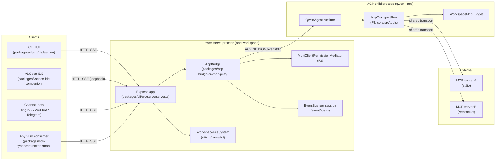
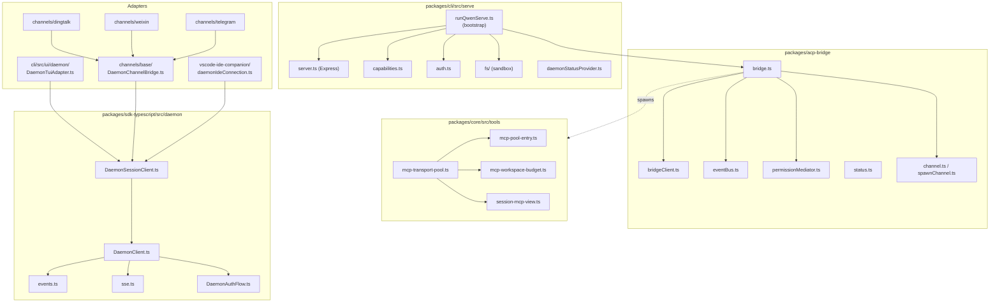
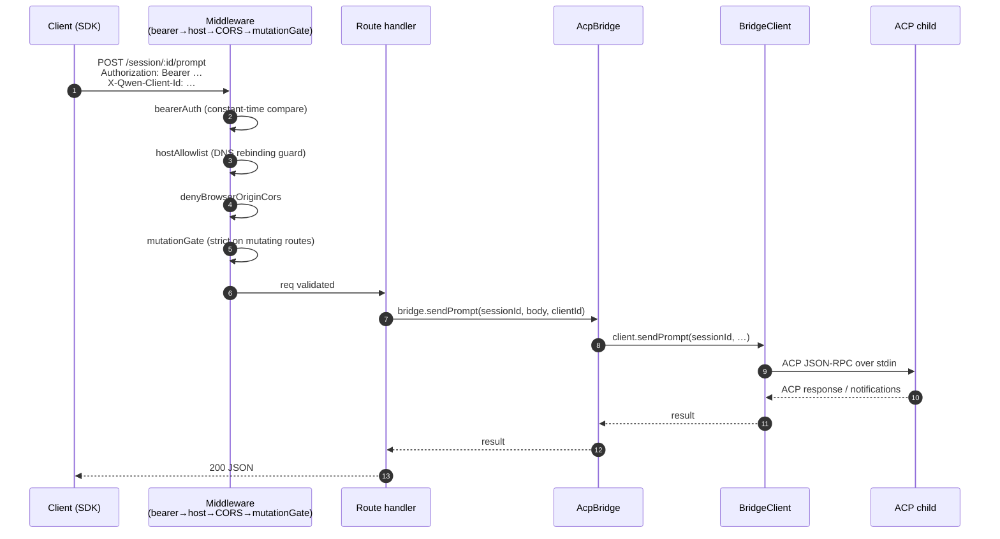
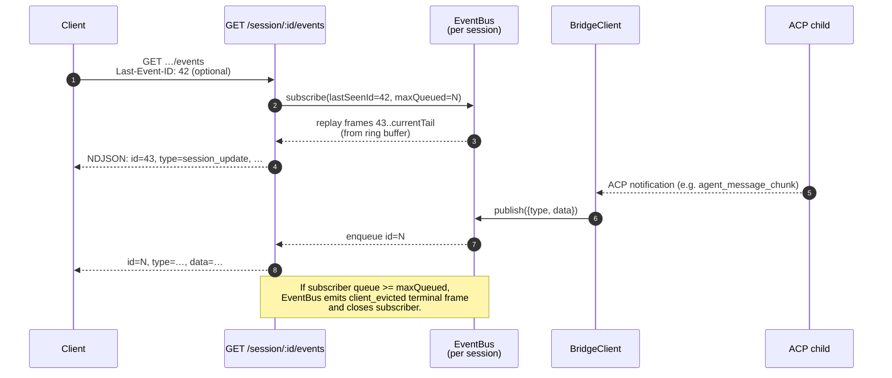
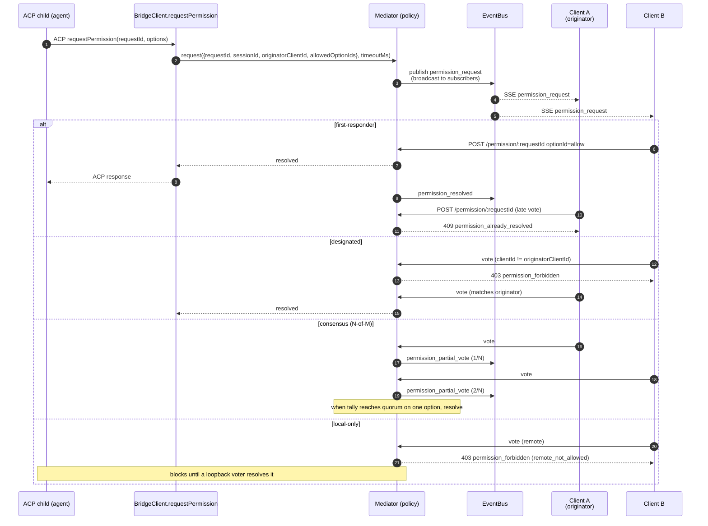
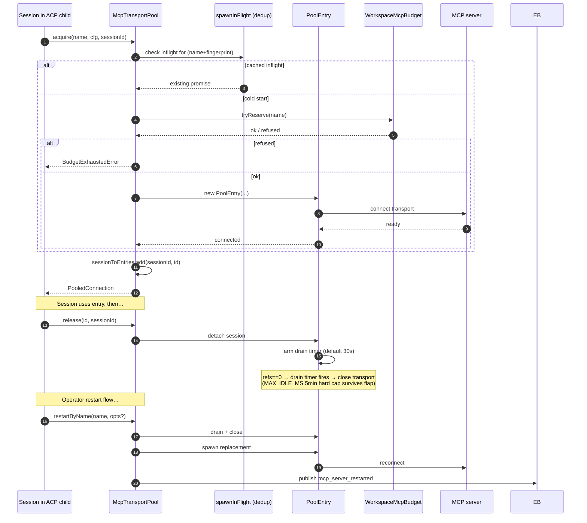
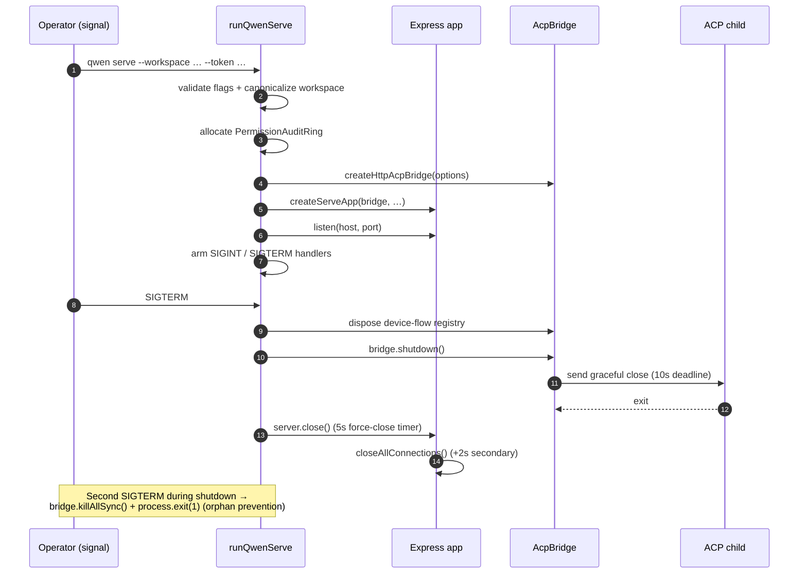

# Daemon Architecture (English)

## Overview

A `qwen serve` process is **one daemon = one workspace**. It hosts a single Express HTTP server, owns an `acp-bridge` instance, and spawns one ACP child process (`qwen --acp`) that runs the actual agent runtime. Multiple clients (CLI TUI, IDE companion, IM channel bots, web BFFs, custom scripts) connect over HTTP + SSE and either share one ACP session (`sessionScope: 'single'`, default) or each get their own (`per-client`).

Inside the ACP child, MCP servers are shared workspace-wide through `McpTransportPool` (F2): a single (server-name + config-fingerprint) tuple maps to one MCP transport, regardless of how many sessions discover it. The bridge's `MultiClientPermissionMediator` (F3) coordinates permission votes across all connected clients under one of four policies.

This doc gives the **system-level picture** that every other doc in this set hangs off. Each load-bearing flow is shown as a Mermaid sequence diagram; per-component implementation details live in the other 18 docs.

## Process topology

The daemon process and the ACP child are connected by an `AcpChannel` (default: a real subprocess pair-of-pipes; `inMemoryChannel` for tests). Everything the daemon does is shaped by this split: HTTP and SSE traffic terminate in the daemon; agent decisions and tool invocations happen in the child; the bridge is the seam.

## Package map

Three trust boundaries to keep in mind: the HTTP edge (`serve/auth.ts` middleware chain), the bridge ↔ ACP-child seam (NDJSON over stdio, no auth — the child trusts the bridge implicitly), and the agent ↔ MCP server seam (the agent may invoke tools that touch the host).

## Workflow 1: HTTP request lifecycle

Non-streaming routes (prompt, cancel, model switch, metadata, workspace CRUD) terminate as a single JSON reply. Streaming output is delivered out-of-band on the SSE channel, **not** as a chunked HTTP body on this connection. See workflow 2.

## Workflow 2: SSE event delivery and replay

The ring buffer is bounded (`eventRingSize`, default 1024). A reconnecting client whose `Last-Event-ID` is older than the ring's head receives a synthetic catch-up signal and must call `loadSession` / `resumeSession` to rebuild deeper state. Slow clients trigger `slow_client_warning` at 75% queue fill and `client_evicted` at the cap.

## Workflow 3: Multi-client permission mediation

Cross-policy escape hatch: any client may vote `CANCEL_VOTE_SENTINEL` to short-circuit the request as `cancelled / agent_cancelled`. The bridge guards against wire callers smuggling the sentinel via the normal `optionId` field (`InvalidPermissionOptionError`).

## Workflow 4: MCP transport pool acquire / release / restart

`releaseSession(sessionId)` uses the reverse `sessionToEntries` index to release every entry the session holds in O(refs). On daemon shutdown, `drainAll()` sets the `draining` flag (refusing new acquires) and waits for every entry to close under a configurable timeout.

## Workflow 5: Lifecycle — startup and graceful shutdown

The two-phase shutdown matters because in-flight HTTP requests, in-flight SSE subscribers, and the ACP child's in-flight tool calls all need bounded teardown windows. If anything blocks past those deadlines, the force-close path takes over so a stuck child can't keep the daemon process alive.

## Critical files

| Concern              | File                                                                 |
| -------------------- | -------------------------------------------------------------------- |
| Bootstrap            | `packages/cli/src/serve/runQwenServe.ts` (308-994)                   |
| Express app          | `packages/cli/src/serve/server.ts` (261-339)                         |
| Capability registry  | `packages/cli/src/serve/capabilities.ts` (37-215)                    |
| Auth middleware      | `packages/cli/src/serve/auth.ts` (1-60)                              |
| Bridge               | `packages/acp-bridge/src/bridge.ts`                                  |
| BridgeClient         | `packages/acp-bridge/src/bridgeClient.ts`                            |
| Permission mediator  | `packages/acp-bridge/src/permissionMediator.ts` (1-1292)             |
| EventBus             | `packages/acp-bridge/src/eventBus.ts`                                |
| MCP transport pool   | `packages/core/src/tools/mcp-transport-pool.ts` (104+)               |
| Workspace MCP budget | `packages/core/src/tools/mcp-workspace-budget.ts`                    |
| Workspace FS         | `packages/cli/src/serve/fs/`                                         |
| SDK DaemonClient     | `packages/sdk-typescript/src/daemon/DaemonClient.ts` (209-1506)      |
| SDK SessionClient    | `packages/sdk-typescript/src/daemon/DaemonSessionClient.ts` (61-385) |
| Event schema         | `packages/sdk-typescript/src/daemon/events.ts` (13-63)               |

## References

- Design issues: [#3803](https://github.com/QwenLM/qwen-code/issues/3803) (daemon design), [#4175](https://github.com/QwenLM/qwen-code/issues/4175) (F-series milestones).
- User guide: [`../../users/qwen-serve.md`](../../users/qwen-serve.md).
- Wire protocol reference: [`../qwen-serve-protocol.md`](../qwen-serve-protocol.md).
- F2 design doc (v2.2 with 32 review fold-ins): [`../../design/f2-mcp-transport-pool.md`](../../design/f2-mcp-transport-pool.md).
- F2 design notes: issue [#4175](https://github.com/QwenLM/qwen-code/issues/4175) commits 4-6.

---

# Daemon 架构 (中文)

## 概览

一个 `qwen serve` 进程坚持 **一 daemon = 一 workspace** 的不变式。它内嵌一个 Express HTTP 服务、持有一个 `acp-bridge` 实例、拉起一个 ACP 子进程（`qwen --acp`）来跑真正的 agent 运行时。多个客户端（CLI TUI、IDE companion、IM channel 机器人、Web BFF、自定义脚本）通过 HTTP + SSE 连进来，要么共享同一个 ACP session（`sessionScope: 'single'`，默认），要么每个客户端各拿一个（`per-client`）。

在 ACP 子进程内部，MCP server 通过 `McpTransportPool`（F2）实现工作区内共享：一对 (server name + 配置指纹) 对应一条 MCP transport，不管被几个 session 发现都只起一份。Bridge 的 `MultiClientPermissionMediator`（F3）在四种策略之一下协调多客户端的权限投票。

本文给出 **系统级全景**，本文档集其余 18 篇文档都挂在它下面。每条主干流程都给一张 Mermaid 时序图，单个组件的实现细节请看对应的专题文档。

## 进程拓扑

> 见英文版「Process topology」图（同一张 Mermaid 图无需重复渲染）。

要点：

- daemon 进程与 ACP 子进程通过 `AcpChannel` 连接，默认是真实的子进程 + 一对管道；`inMemoryChannel` 用于测试。
- 所有架构都被这条「daemon ↔ child」缝隙塑造：HTTP / SSE 在 daemon 终止，agent 决策与工具调用在子进程发生，bridge 是中转。

## 包关系

> 见英文版「Package map」图。

记住三条信任边界：

1. HTTP 入口边界：`serve/auth.ts` 中间件链。
2. bridge ↔ ACP 子进程边界：stdio 上的 NDJSON，没有认证 —— 子进程默认信任 bridge。
3. agent ↔ MCP server 边界：agent 可能触发涉及宿主资源的工具调用。

## 流程 1：HTTP 请求生命周期

> 见英文版「Workflow 1」时序图。

非流式路由（prompt、cancel、model 切换、metadata、workspace CRUD）以一次 JSON 响应结束。流式输出**不是**在该 HTTP 连接上以分块方式返回，而是走 SSE 通道；见流程 2。

## 流程 2：SSE 事件投递与重放

> 见英文版「Workflow 2」时序图。

要点：

- 环形缓冲有上限（`eventRingSize`，默认 1024）。
- 重连客户端如果 `Last-Event-ID` 已经落出环外，会收到合成 catch-up 信号，必须用 `loadSession` / `resumeSession` 重建更深层状态。
- 慢消费者在队列 75% 触发 `slow_client_warning`，达到上限时收到 `client_evicted`（终态）后被关掉。

## 流程 3：多客户端权限协调

> 见英文版「Workflow 3」时序图。

跨策略「逃生口」：任何客户端都可以投 `CANCEL_VOTE_SENTINEL` 把请求短路成 `cancelled / agent_cancelled`。bridge 防止 wire 端通过普通 `optionId` 字段偷偷塞这个哨兵（`InvalidPermissionOptionError`）。

四种策略一句话：

- `first-responder` — 第一个有效投票获胜（默认，保留 live 协作 UX）。
- `designated` — 只有 `originatorClientId` 能投，其他客户端收 `permission_forbidden`。
- `consensus` — N-of-M 法定人数，过程中发 `permission_partial_vote` 让 UI 渲染进度。
- `local-only` — 拒绝任何 HTTP 投票，只接受 loopback。

## 流程 4：MCP transport 池的 acquire / release / restart

> 见英文版「Workflow 4」时序图。

要点：

- `releaseSession(sessionId)` 借助 `sessionToEntries` 反向索引，以 O(refs) 释放该 session 持有的所有条目。
- daemon 关停时 `drainAll()` 置 `draining` 标志（拒绝新的 acquire），并以可配置超时等待所有条目关闭。
- `restartByName` 可以接 `entryIndex` 来精确重启某条；池里同名多条目时返回 `{entries: RestartResult[]}` 形状。

## 流程 5：生命周期 —— 启动与优雅退出

> 见英文版「Workflow 5」时序图。

为什么要分两阶段：

- 还在飞的 HTTP 请求、还连着的 SSE 订阅者、子进程里还在跑的工具调用都需要有上限的退出窗口。
- 任何一条卡过窗口，force-close 路径会接管，避免子进程把 daemon 进程拖住。
- 第二次 SIGTERM 直接走 `bridge.killAllSync()` + `process.exit(1)`，防孤儿。

## 关键文件

| 关注点             | 文件                                                                 |
| ------------------ | -------------------------------------------------------------------- |
| Bootstrap          | `packages/cli/src/serve/runQwenServe.ts` (308-994)                   |
| Express 应用       | `packages/cli/src/serve/server.ts` (261-339)                         |
| 能力注册表         | `packages/cli/src/serve/capabilities.ts` (37-215)                    |
| Auth 中间件        | `packages/cli/src/serve/auth.ts` (1-60)                              |
| Bridge             | `packages/acp-bridge/src/bridge.ts`                                  |
| BridgeClient       | `packages/acp-bridge/src/bridgeClient.ts`                            |
| 权限协调器         | `packages/acp-bridge/src/permissionMediator.ts` (1-1292)             |
| EventBus           | `packages/acp-bridge/src/eventBus.ts`                                |
| MCP transport 池   | `packages/core/src/tools/mcp-transport-pool.ts` (104+)               |
| Workspace MCP 预算 | `packages/core/src/tools/mcp-workspace-budget.ts`                    |
| Workspace 文件系统 | `packages/cli/src/serve/fs/`                                         |
| SDK DaemonClient   | `packages/sdk-typescript/src/daemon/DaemonClient.ts` (209-1506)      |
| SDK SessionClient  | `packages/sdk-typescript/src/daemon/DaemonSessionClient.ts` (61-385) |
| 事件 schema        | `packages/sdk-typescript/src/daemon/events.ts` (13-63)               |

## 参考

- 设计 issue：[#3803](https://github.com/QwenLM/qwen-code/issues/3803)（daemon 总体设计）、[#4175](https://github.com/QwenLM/qwen-code/issues/4175)（F 系列里程碑）。
- 用户使用文档：[`../../users/qwen-serve.md`](../../users/qwen-serve.md)。
- Wire 协议参考：[`../qwen-serve-protocol.md`](../qwen-serve-protocol.md)。
- F2 设计文档（v2.2，含 32 条 review fold-in）：[`../../design/f2-mcp-transport-pool.md`](../../design/f2-mcp-transport-pool.md)。
- F2 设计笔记：issue [#4175](https://github.com/QwenLM/qwen-code/issues/4175) commit 4-6。
