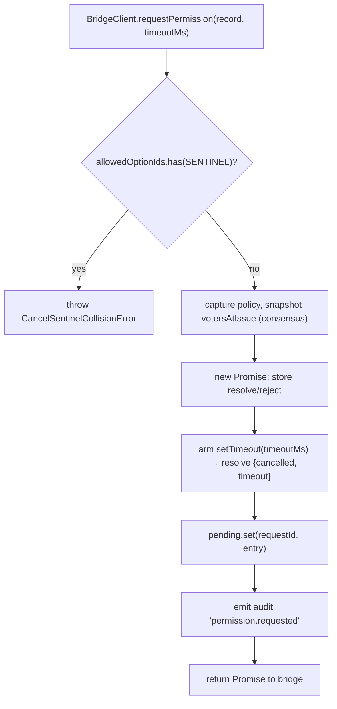
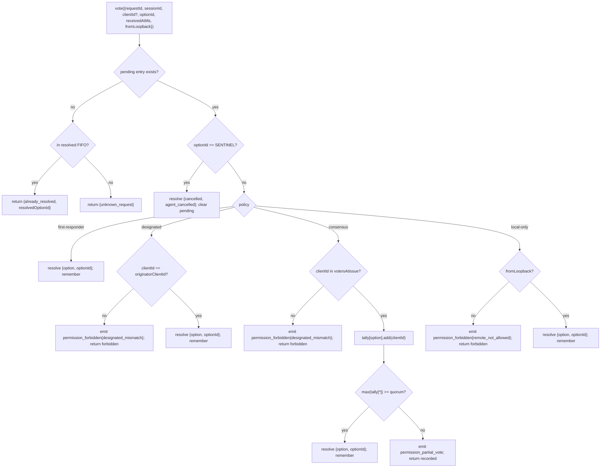

# Multi-Client Permission Mediation (English)

## Overview

When the ACP child's agent calls `requestPermission`, the daemon doesn't just forward it to one client — under `sessionScope: 'single'` every connected client sees the request and any of them might respond. Without a mediator that's chaos: late votes have nowhere to go, two clients can race the same request, a single rogue client can override the originator, etc.

`MultiClientPermissionMediator` (`packages/acp-bridge/src/permissionMediator.ts:1-1292`) implements the `PermissionMediator` contract (`packages/acp-bridge/src/permission.ts`) and owns ALL pending + resolved permission state for the bridge. It dispatches votes through one of four policies declared in `PermissionPolicy`:

| Policy | Resolution rule | Use case |
|---|---|---|
| `first-responder` | First valid vote wins; later voters get `permission_already_resolved`. | Live cross-client collaboration UX (default). |
| `designated` | Only the prompt's `originatorClientId` may resolve; others see `permission_forbidden{designated_mismatch}`. | Per-tenant SaaS where the UI surface must own its own approvals. |
| `consensus` | N-of-M quorum across pair-token-authenticated clients; intermediate `permission_partial_vote` events let UIs render progress. | Enterprise change review where two operators must agree. |
| `local-only` | Refuses any non-loopback voter; blocks until a loopback client resolves. | Workstations where remote control must never grant privilege escalation. |

## Responsibilities

- Track every pending request (`request → vote → resolved` lifecycle).
- Arm and disarm per-request wallclock timeouts (the **N1 invariant**: timeout MUST be armed synchronously inside `request()` so an immediately-cancelled session can't leak a forever-pending closure).
- Dispatch votes through the policy captured at `request()` time (changing daemon policy mid-flight does not affect in-flight requests).
- Maintain a bounded FIFO (`MAX_RESOLVED_PERMISSION_RECORDS = 512`) of recently-resolved requests so duplicate votes get a structured `already_resolved` rather than `unknown_request`.
- Emit `permission_partial_vote` (consensus) and `permission_forbidden` (designated / consensus / local-only) on the per-session EventBus.
- Resolve pending requests as `{kind: 'cancelled', reason: 'session_closed'}` via `forgetSession(sessionId)` on session teardown.
- Reject malicious or accidental injection of `CANCEL_VOTE_SENTINEL` through the wire (`InvalidPermissionOptionError`) and through agent-published option labels (`CancelSentinelCollisionError`).

## Architecture

### Public surface

```ts
interface PermissionMediator {
  readonly policy: PermissionPolicy;
  request(record: PermissionRequestRecord, timeoutMs: number): Promise<PermissionResolution>;
  vote(vote: PermissionVote): PermissionVoteOutcome;
  forgetSession(sessionId: string): void;
}
```

`MultiClientPermissionMediator` adds: `peekSessionFor(requestId)`, `pendingCount(sessionId)`, internal audit publisher, etc. `BridgeClient` only depends on the `request()` half (structural sub-typing — see `bridgeClient.ts:30`).

### `PermissionPolicy` and `PermissionVoteOutcome`

```ts
type PermissionPolicy = 'first-responder' | 'designated' | 'consensus' | 'local-only';

type PermissionVoteOutcome =
  | { kind: 'resolved';            resolvedOptionId: string }
  | { kind: 'recorded';            votesNeeded: number }            // consensus partial
  | { kind: 'already_resolved';    resolvedOptionId: string }
  | { kind: 'forbidden';           reason: 'designated_mismatch' | 'remote_not_allowed' }
  | { kind: 'unknown_request' };

type PermissionResolution =
  | { kind: 'option';    optionId: string }
  | { kind: 'cancelled'; reason: 'timeout' | 'session_closed' | 'agent_cancelled' };
```

### Cancel sentinel

`CANCEL_VOTE_SENTINEL = '__cancelled__'`. The bridge maps voter `{outcome:'cancelled'}` to this sentinel **before** calling `mediator.vote`. The mediator routes the sentinel **before** policy dispatch — voter-cancel works under every policy regardless of `clientId` / loopback / membership. Two guards:

1. **`bridge.ts`** rejects wire votes whose `optionId === CANCEL_VOTE_SENTINEL` with `InvalidPermissionOptionError` (a malicious wire client must not be able to inject cancel by lying about an `optionId`).
2. **`mediator.request`** rejects records whose `allowedOptionIds` contains the sentinel with `CancelSentinelCollisionError` (an agent legitimately publishing `'__cancelled__'` as an option label must not be able to masquerade).

This deliberate cross-policy escape is documented at `permissionMediator.ts:50-57` so a future maintainer doesn't "fix" the bypass.

### Pending state

Each pending request is keyed by `requestId` and carries:
- `policy` — captured at `request()` time.
- `record: PermissionRequestRecord` (requestId, sessionId, originatorClientId, allowedOptionIds, issuedAtMs).
- `resolve` / `reject` closures.
- `votesAtIssue` (consensus only) — snapshot of registered `clientIds` for the session at issue time; later votes are rejected if not in this set.
- `tally` (consensus only) — `Map<optionId, Set<clientId>>` counting votes per option.
- `timeoutHandle` — Node timeout armed inside `request()` (N1 invariant).
- `auditTrail[]` — per-vote audit records.

### Resolved FIFO

`MAX_RESOLVED_PERMISSION_RECORDS = 512`. Eviction is FIFO via `resolvedOrder.shift()` (DeepSeek review #4335 / 3271627446 — mirrors `PermissionAuditRing`). Stores only `{requestId, sessionId, outcome}`, so 512 records stay under 100 KB across normal UI reconnect/race windows.

## Workflow

### `request()` (N1 invariant)



The timer is armed **before** the entry is even visible elsewhere. Without this, a `forgetSession` arriving between `pending.set` and `setTimeout` would leave the entry pending with no timeout — the bridge's per-session `promptQueue` would hang forever.

### `vote()` dispatch



### `forgetSession()`

Called on session close, eviction, and bridge shutdown. For every pending entry whose `record.sessionId === sessionId`:
1. Cancel the timeout.
2. Resolve the pending Promise with `{kind: 'cancelled', reason: 'session_closed'}`.
3. Append an audit record.
4. Remove from `pending`.

The bridge's session-teardown path always calls `forgetSession` **before** the channel-kill window so pending permissions don't outlive their session.

## State & Lifecycle

- `policy` is captured per-request. Changing daemon-wide policy (future surface) does not affect in-flight requests.
- `votesAtIssue` (consensus) is captured at `request()` time; clients that arrive AFTER the request can vote, but if their `clientId` isn't already registered with the session at issue time their vote is rejected as `designated_mismatch`. This is overloaded with the `designated` policy's mismatch reason intentionally to keep the contract closed; future versions may split the union if SDK consumers need to distinguish.
- Resolved entries live in the FIFO for at most `MAX_RESOLVED_PERMISSION_RECORDS` (512). After eviction a duplicate vote on the same `requestId` returns `{unknown_request}`.
- `permission_partial_vote` only fires for `consensus`. Don't depend on it under any other policy.
- `permission_forbidden` fires for `designated`, `consensus`, and `local-only` — not `first-responder`.

## Dependencies

- [`03-acp-bridge.md`](./03-acp-bridge.md) — how the bridge wires `BridgeClient.requestPermission` to `mediator.request`.
- [`10-event-bus.md`](./10-event-bus.md) — how partial-vote and forbidden frames reach clients.
- [`09-event-schema.md`](./09-event-schema.md) — payload contracts for `permission_*` events.
- [`08-session-lifecycle.md`](./08-session-lifecycle.md) — `forgetSession()` is called on every session termination.
- [`02-serve-runtime.md`](./02-serve-runtime.md) — `PermissionAuditRing` (512-entry FIFO of audit records).

## Configuration

| Source | Knob | Effect |
|---|---|---|
| `settings.json` | `policy.permissionStrategy` | Active mediator policy. |
| `settings.json` | `policy.consensusQuorum` | N for consensus. |
| `BridgeOptions` | `permissionPolicy`, `permissionConsensusQuorum`, `permissionAudit` | Programmatic override. |
| Capability tag | `permission_mediation` (always; `modes: ['first-responder', 'designated', 'consensus', 'local-only']`) | Build-supported set. |
| Capability envelope | `policy.permission` | Active policy this daemon is running. |

## Caveats & Known Limits

- **Cancel sentinel routes BEFORE policy dispatch** by design — a `local-only` daemon and a `consensus` daemon can both be cancelled by any voter who posts `{outcome: 'cancelled'}`. This is documented at `permissionMediator.ts:50-57` and is the agent-side abort path.
- **`designated` and `consensus` overload `designated_mismatch`** in `PermissionVoteOutcome`. The mediator emits separate audit records but the wire shape is single. Future protocol versions may split the union.
- **Anonymous voters (no `X-Qwen-Client-Id`)** are accepted under `first-responder` and `local-only` (loopback) only; `designated` and `consensus` reject them.
- **Cross-policy escape hatch** means cancel cannot be gated by policy. If a deployment needs policy-gated cancel that would be a future contract change — do not paper-over with route-level checks.
- **`votesAtIssue` snapshot semantics** mean a consensus deployment with a churning client set can have legitimate clients rejected because they connected after the request was issued. Operators should pre-register collaborator client ids before issuing change-review prompts.

## References

- `packages/acp-bridge/src/permission.ts:1-177` (frozen contract)
- `packages/acp-bridge/src/permissionMediator.ts:1-1292` (implementation; F3 commits 6+7)
- `packages/acp-bridge/src/bridgeClient.ts:30` (uses structural sub-typing on `PermissionMediator`)
- `packages/acp-bridge/src/bridgeErrors.ts` (`CancelSentinelCollisionError`, `InvalidPermissionOptionError`, `PermissionForbiddenError`)
- `packages/cli/src/serve/permissionAudit.ts:1-60` (audit ring + publisher)
- Issue: [#4175](https://github.com/QwenLM/qwen-code/issues/4175) F3 series.

---

# 多客户端权限协调 (中文)

## 概览

ACP 子进程的 agent 调 `requestPermission` 时，daemon 并不会只转给某一个客户端 —— `sessionScope: 'single'` 下每个连上来的客户端都看得到这个请求，谁回复都行。没有协调器就乱套：迟到的投票无处去、两个客户端 race 同一个请求、一个流氓客户端能盖过 originator 等等。

`MultiClientPermissionMediator`（`packages/acp-bridge/src/permissionMediator.ts:1-1292`）实现了 `PermissionMediator` 契约（`packages/acp-bridge/src/permission.ts`），bridge 的所有 pending + resolved 权限状态都归它管。它按 `PermissionPolicy` 四选一分派投票：

| 策略 | 裁决规则 | 用例 |
|---|---|---|
| `first-responder` | 第一个有效票获胜；后来的拿 `permission_already_resolved` | 实时跨客户端协作 UX（默认） |
| `designated` | 只允许 prompt 的 `originatorClientId` 裁决；其他人收 `permission_forbidden{designated_mismatch}` | per-tenant SaaS，UI surface 自己拥有审批 |
| `consensus` | N-of-M 法定人数（pair-token 认证），过程中 `permission_partial_vote` 让 UI 渲进度 | 企业变更评审，两名操作员需达成一致 |
| `local-only` | 拒绝任何非 loopback 投票，阻塞直到 loopback 客户端裁决 | 工作站，远程控制绝不能授予提权 |

## 职责

- 跟踪每个 pending 请求（`request → vote → resolved` 生命周期）。
- 给每个请求装上 wallclock 超时（**N1 不变式**：超时必须在 `request()` **同步**装上，不然立刻 cancel 的 session 会把闭包永远 pending 漏掉）。
- 按 `request()` 时刻捕获的策略派发投票（中途改 daemon 全局策略不影响飞行中请求）。
- 维护有界 FIFO（`MAX_RESOLVED_PERMISSION_RECORDS = 512`），新近 resolved 的请求重复投票拿结构化 `already_resolved` 而不是 `unknown_request`。
- 在 per-session EventBus 上发 `permission_partial_vote`（consensus）和 `permission_forbidden`（designated / consensus / local-only）。
- 在 session teardown 时 `forgetSession(sessionId)` 把 pending 解析为 `{kind: 'cancelled', reason: 'session_closed'}`。
- 拒绝恶意 / 误注入 `CANCEL_VOTE_SENTINEL`：wire 端 `InvalidPermissionOptionError`，agent 端 `CancelSentinelCollisionError`。

## 架构

### 公开 surface

```ts
interface PermissionMediator {
  readonly policy: PermissionPolicy;
  request(record: PermissionRequestRecord, timeoutMs: number): Promise<PermissionResolution>;
  vote(vote: PermissionVote): PermissionVoteOutcome;
  forgetSession(sessionId: string): void;
}
```

`MultiClientPermissionMediator` 还有 `peekSessionFor(requestId)`、`pendingCount(sessionId)`、内部 audit publisher 等。`BridgeClient` 只依赖 `request()` 那一半（结构化 sub-typing，见 `bridgeClient.ts:30`）。

### `PermissionPolicy` 与 `PermissionVoteOutcome`

```ts
type PermissionPolicy = 'first-responder' | 'designated' | 'consensus' | 'local-only';

type PermissionVoteOutcome =
  | { kind: 'resolved';            resolvedOptionId: string }
  | { kind: 'recorded';            votesNeeded: number }            // consensus 局部
  | { kind: 'already_resolved';    resolvedOptionId: string }
  | { kind: 'forbidden';           reason: 'designated_mismatch' | 'remote_not_allowed' }
  | { kind: 'unknown_request' };

type PermissionResolution =
  | { kind: 'option';    optionId: string }
  | { kind: 'cancelled'; reason: 'timeout' | 'session_closed' | 'agent_cancelled' };
```

### Cancel 哨兵

`CANCEL_VOTE_SENTINEL = '__cancelled__'`。bridge 把 voter `{outcome:'cancelled'}` 映射成这个哨兵后再调 `mediator.vote`。mediator 在策略派发**之前**就处理哨兵 —— voter-cancel 在任何策略下都能用，跟 `clientId` / loopback / membership 无关。两道护栏：

1. **`bridge.ts`** 拒掉 wire 端 `optionId === CANCEL_VOTE_SENTINEL` 的投票，抛 `InvalidPermissionOptionError`（恶意 wire 客户端不能靠假报 `optionId` 注入 cancel）。
2. **`mediator.request`** 拒掉 `allowedOptionIds` 包含哨兵的记录，抛 `CancelSentinelCollisionError`（agent 合法发布 `'__cancelled__'` 选项标签也不能伪装成 cancel）。

这种刻意跨策略 escape 在 `permissionMediator.ts:50-57` 有文档说明，免得未来 maintainer 把它「修掉」。

### Pending 状态

每个 pending 按 `requestId` 索引，包含：
- `policy` —— `request()` 时捕获。
- `record: PermissionRequestRecord`（requestId、sessionId、originatorClientId、allowedOptionIds、issuedAtMs）。
- `resolve` / `reject` 闭包。
- `votesAtIssue`（仅 consensus）—— 发起时 session 上已登记的 `clientIds` 快照；后到的投票必须在这个集合里。
- `tally`（仅 consensus）—— `Map<optionId, Set<clientId>>` 按 option 计票。
- `timeoutHandle` —— `request()` 内同步装上的 Node timeout（N1 不变式）。
- `auditTrail[]` —— 每票审计记录。

### Resolved FIFO

`MAX_RESOLVED_PERMISSION_RECORDS = 512`，FIFO 通过 `resolvedOrder.shift()`（DeepSeek review #4335 / 3271627446，对齐 `PermissionAuditRing`）。只存 `{requestId, sessionId, outcome}`，512 条在正常 UI 重连 / race 窗口下 < 100 KB。

## 流程

### `request()`（N1 不变式）

> 见英文版「`request()`」flowchart。

定时器在 entry 对外可见**之前**就装上。否则 `forgetSession` 在 `pending.set` 与 `setTimeout` 之间到来，entry 就成了「pending 但无超时」 —— bridge 的 per-session `promptQueue` 永远 hang。

### `vote()` 派发

> 见英文版「`vote()` dispatch」flowchart。

### `forgetSession()`

session close / 剔除 / bridge shutdown 时调用。对每个 `record.sessionId === sessionId` 的 pending entry：
1. 取消超时。
2. 用 `{kind: 'cancelled', reason: 'session_closed'}` resolve Promise。
3. 写一条 audit。
4. 从 `pending` 删除。

bridge 的 session-teardown 路径永远在 channel-kill 窗口**之前**调 `forgetSession`，pending 不会比 session 活得久。

## 状态与生命周期

- `policy` per-request 捕获。改 daemon 全局策略不影响飞行中请求。
- `votesAtIssue`（consensus）`request()` 时捕获；request 后到来的客户端可以投票，但 `clientId` 不在那时的快照中 → 拒为 `designated_mismatch`。和 `designated` 的 mismatch 原因刻意重载以保持契约封闭；未来版本如果 SDK 需要区分可以拆。
- Resolved entry 在 FIFO 里活最多 `MAX_RESOLVED_PERMISSION_RECORDS`（512）；evict 后对同 `requestId` 的重复投票返回 `{unknown_request}`。
- `permission_partial_vote` 只在 `consensus` 下发，别人那不要依赖。
- `permission_forbidden` 在 `designated` / `consensus` / `local-only` 下发，**不在** `first-responder` 下发。

## 依赖

- [`03-acp-bridge.md`](./03-acp-bridge.md) — bridge 怎么把 `BridgeClient.requestPermission` 接到 `mediator.request`。
- [`10-event-bus.md`](./10-event-bus.md) — partial-vote / forbidden 帧怎么到客户端。
- [`09-event-schema.md`](./09-event-schema.md) — `permission_*` 事件的 payload 契约。
- [`08-session-lifecycle.md`](./08-session-lifecycle.md) — 每次 session 终态都会 `forgetSession()`。
- [`02-serve-runtime.md`](./02-serve-runtime.md) — `PermissionAuditRing`（512 条 FIFO 审计）。

## 配置

| 来源 | 旋钮 | 效果 |
|---|---|---|
| `settings.json` | `policy.permissionStrategy` | 激活 mediator 策略 |
| `settings.json` | `policy.consensusQuorum` | consensus 的 N |
| `BridgeOptions` | `permissionPolicy`、`permissionConsensusQuorum`、`permissionAudit` | 程序化覆盖 |
| 能力 tag | `permission_mediation`（恒；`modes: ['first-responder', 'designated', 'consensus', 'local-only']`） | 构建期支持集 |
| 能力 envelope | `policy.permission` | 当前 daemon 跑的策略 |

## 注意 & 已知局限

- **Cancel 哨兵在策略派发之前路由**是刻意的 —— `local-only` 和 `consensus` 都能被任何投 `{outcome: 'cancelled'}` 的客户端取消。这是 agent 侧 abort 路径，文档在 `permissionMediator.ts:50-57`。
- **`designated` 与 `consensus` 都用 `designated_mismatch`** 在 `PermissionVoteOutcome` 里重载；mediator 写不同 audit，但 wire 形状一致。未来协议版本可能拆。
- **匿名投票者（无 `X-Qwen-Client-Id`）** 只在 `first-responder` 和 `local-only`（loopback）下被接受；`designated` / `consensus` 拒。
- **跨策略 escape** 意味着 cancel 无法被策略 gate。如果部署需要 policy-gated cancel，那是未来契约变化，不要用路由级 check paper-over。
- **`votesAtIssue` 快照语义**意味着客户端集合在变动中的 consensus 部署会拒掉合法客户端（连入晚于 request 发起）。operator 应当在发起 change-review prompt 之前预先注册协作者的 client id。

## 参考

- `packages/acp-bridge/src/permission.ts:1-177`（冻结契约）
- `packages/acp-bridge/src/permissionMediator.ts:1-1292`（实现，F3 commit 6+7）
- `packages/acp-bridge/src/bridgeClient.ts:30`（对 `PermissionMediator` 用结构化 sub-typing）
- `packages/acp-bridge/src/bridgeErrors.ts`（`CancelSentinelCollisionError`、`InvalidPermissionOptionError`、`PermissionForbiddenError`）
- `packages/cli/src/serve/permissionAudit.ts:1-60`（audit ring + publisher）
- Issue：[#4175](https://github.com/QwenLM/qwen-code/issues/4175) F3 系列。
