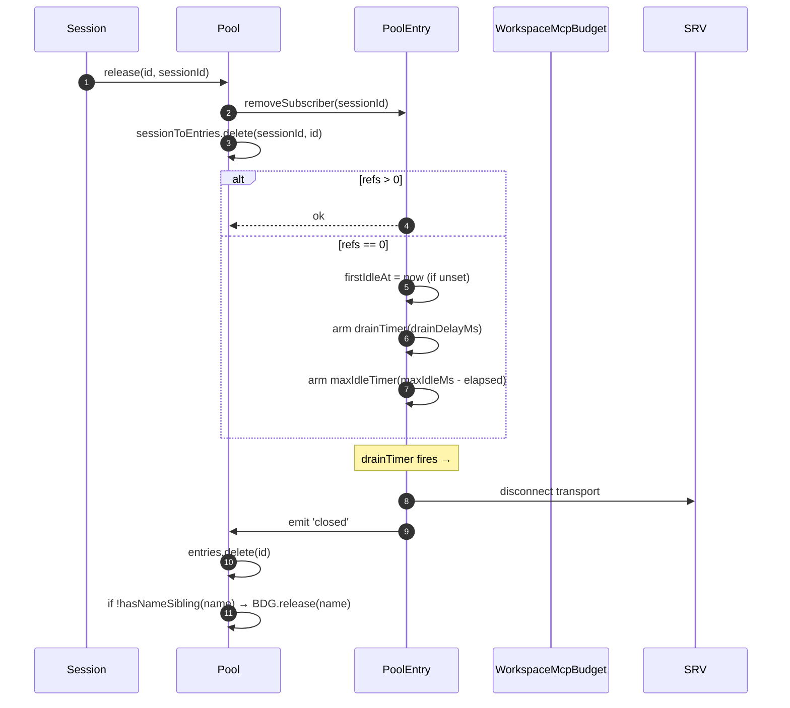
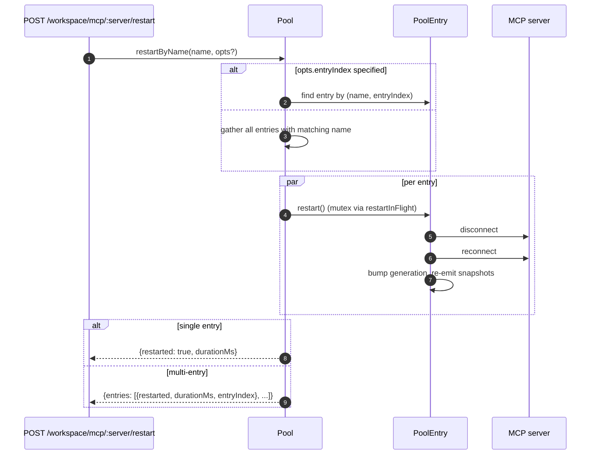
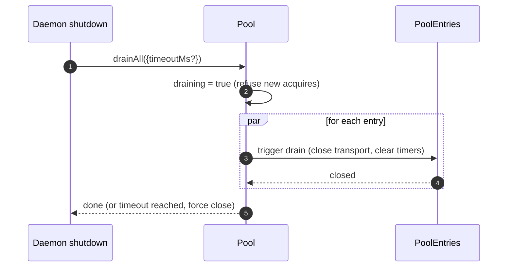

# Workspace MCP Transport Pool (English)

## Overview

`McpTransportPool` (`packages/core/src/tools/mcp-transport-pool.ts:104+`) is the F2 (#4175 commit 5) workspace-scoped pool: N ACP sessions on one daemon share one transport per unique `(serverName + configFingerprint)` tuple, instead of each spawning its own MCP child process. The pool lives **inside the ACP child** (`QwenAgent.mcpPool`), is constructed once at agent startup with the daemon's bootstrap `Config`, and survives session lifecycles — entries reference-count session attaches and drain back to closed under a configurable grace period when ref count hits zero.

It is the dominant reason a multi-session daemon doesn't fork N copies of every MCP server.

## Responsibilities

- Acquire or spawn one MCP transport per `(name + fingerprint)`, deduping concurrent acquires via `spawnInFlight`.
- Release per-session references; arm the entry's drain timer when the last reference detaches.
- Survive ref-count flap with a hard `MAX_IDLE_MS` cap so a thrashing client can't keep an idle transport alive forever.
- Reference-count sessions in a reverse index (`sessionToEntries`) so `releaseSession(sessionId)` is O(refs) rather than O(entries).
- Restart entries on demand (`restartByName`) — single-entry returns `{restarted, durationMs}`, multi-entry returns `{entries: RestartResult[]}` (F2 multi-entry contract).
- Drain the entire pool on daemon shutdown with a configurable timeout; refuse new acquires while draining.
- Consult `WorkspaceMcpBudget` (see [`06-mcp-budget-guardrails.md`](./06-mcp-budget-guardrails.md)) on `acquire` to enforce per-name reservation caps; release the slot on entry close when no sibling entry holds the same name.
- Produce per-session filtered tool/prompt snapshots via `SessionMcpView` so a discovery in one session doesn't register tools into other sessions.

## Architecture

### Public surface

```ts
class McpTransportPool {
  constructor(cliConfig: Config, options: McpTransportPoolOptions);
  acquire(serverName, cfg, sessionId, sessionToolRegistry, sessionPromptRegistry): Promise<PooledConnection>;
  release(id, sessionId): void;
  releaseSession(sessionId): void;
  restartByName(name, opts?): Promise<RestartResult | { entries: RestartResult[] }>;
  drainAll(opts?): Promise<void>;
  getBudget(): WorkspaceMcpBudget | undefined;
  getSnapshot(): McpPoolSnapshot;
}
```

`McpTransportPoolOptions`:
- `workspaceContext: WorkspaceContext` (required).
- `debugMode: boolean`.
- `sendSdkMcpMessage?` — per-session callback (pool bypasses SDK MCP).
- `pooledTransports?: ReadonlySet<McpTransportKind>` — default `{stdio, websocket}`. HTTP/SSE transports are intentionally unpooled (each acquire mints a new entry that lives only as long as its session) because their headers can carry session-specific OAuth state.
- `drainDelayMs?` — default `30_000`.
- `entryOptions?: (transport) => PoolEntryOptions`.
- `budget?: WorkspaceMcpBudget`.

### Internal state

| State | Type | Purpose |
|---|---|---|
| `entries` | `Map<ConnectionId, PoolEntry>` | Live pool entries keyed by `connectionIdOf(name, fingerprint)`. |
| `unpooledIds` | `Set<ConnectionId>` | Entries for HTTP/SSE (non-poolable) transports. |
| `spawnInFlight` | `Map<ConnectionId, Promise<PoolEntry>>` | Dedups concurrent cold acquires for the same key. |
| `sessionToEntries` | `Map<string, Set<ConnectionId>>` | V21-2 reverse index for O(refs) `releaseSession`. |
| `draining` | `boolean` | Wenshao C5 drain mutex — once set, all `acquire` calls reject. |
| `nextIndexByName` | `Map<string, number>` | V21-7 monotonic `entryIndex` per server name (dashboards don't shuffle when a new entry appears). |

### `PoolEntry` (per-entry struct, `mcp-pool-entry.ts`)

State machine: `spawning → active ⇄ (active ↔ reconnect) → (active → draining on last detach, draining → active on attach OR draining → closed on timer)`.

| Field | Purpose |
|---|---|
| `localStatus: MCPServerStatus` | Driven by `MCPServerStatus` lifecycle. |
| `state: PoolEntryState` | `spawning`/`active`/`draining`/`closed`/`failed`. |
| `generation: number` | Bumped on each restart; subscribers compare to detect reconnect cycles. |
| `refs: Set<string>` | Session ids currently attached. |
| `subscribers: Map<string, SessionMcpView>` | Per-session filtered views. |
| `subscriberHandles: Map<string, PooledConnectionImpl>` | Handles returned from `acquire`. |
| `toolsSnapshot[], promptsSnapshot[]` | Canonical pool-level snapshots; re-issued on `toolsChanged` / `promptsChanged`. |
| `drainTimer?` | Armed when `refs.size === 0`; default 30s. Reset on attach. |
| `maxIdleTimer?` | Armed at FIRST idle; never reset by acquire/release flap. Default 5 min. |
| `firstIdleAt?` | Watermark for the max-idle hard cap. |
| `restartInFlight?` | Mutex for `restart()`. |

### `PoolEntryOptions`

```ts
interface PoolEntryOptions {
  drainDelayMs: number;        // default 30_000
  maxIdleMs: number;           // default 5 * 60_000
  maxReconnectAttempts: number;// default 3 (stdio/ws) or 5 (http/sse)
  reconnectStrategy:
    | { kind: 'fixed';       delayMs: number }
    | { kind: 'exponential'; baseMs: number; capMs: number };
}
```

`defaultPoolEntryOptions(transport)` (`mcp-pool-entry.ts:58-70`) returns stdio/ws defaults `{fixed 5s, 3 attempts}` and http/sse defaults `{exponential 1s → 16s, 5 attempts}`. Remote transports get longer retry budgets because their failures are more often transient.

## Workflow

### `acquire`

```mermaid
sequenceDiagram
    autonumber
    participant S as Session
    participant P as Pool
    participant SIF as spawnInFlight
    participant E as PoolEntry
    participant BDG as WorkspaceMcpBudget
    participant SRV as MCP server

    S->>P: acquire(name, cfg, sessionId, sessionToolRegistry, sessionPromptRegistry)
    P->>P: refuse if draining
    P->>P: connectionId = connectionIdOf(name, fingerprint)
    P->>P: if !isPoolable(cfg) → mark unpooled
    alt entry in entries (warm)
        E-->>P: existing PoolEntry
    else inflight cold spawn
        SIF-->>P: existing Promise<PoolEntry>
    else cold start
        P->>BDG: tryReserve(name) (if budget set + poolable)
        BDG-->>P: 'reserved' | 'already_held' | 'refused'
        alt refused
            P->>BDG: recordRefusal(name, transport)
            P-->>S: BudgetExhaustedError
        else ok
            P->>E: spawnEntry(name, cfg)
            E->>SRV: connect transport
            SRV-->>E: ready
            P->>P: entries.set(id, E); nextIndexByName++
            E-->>P: connected
        end
    end
    P->>E: addSubscriber(sessionId, sessionToolRegistry, sessionPromptRegistry)
    P->>P: sessionToEntries.add(sessionId, id)
    P->>P: cancel drain timer (refs>0)
    P-->>S: PooledConnection { id, serverName, entryIndex, client, toolsSnapshot, promptsSnapshot, on, off, release }
```

### `release` + drain



`hasNameSibling(name)` (`mcp-transport-pool.ts:181+`) iterates both `entries.values()` and `spawnInFlight.keys()` parsing the latter with `parseConnectionId` (server names can legitimately contain `::`, so `startsWith` would false-positive on a sibling name beginning with `${name}::`).

`releaseSession(sessionId)` reads from `sessionToEntries`, releases all referenced entries in O(refs), then clears the index entry. Used by the bridge's session-close path so we don't iterate the full entry map.

### `restartByName`



The pre-flight budget check at the daemon HTTP layer returns `{restarted:false, skipped:true, reason:'budget_would_exceed'}` (Wave-4 PR 17) when the target's slot isn't already reserved AND a restart would push live count over `enforce` budget.

### `drainAll`



## State & Lifecycle

- Pool construction is synchronous; first `acquire` cold-starts a transport.
- `drainDelayMs` (default 30s) is reset to cancellation on attach.
- `maxIdleMs` (default 5 min) is **never** reset by attach/detach — it starts ticking at the FIRST idle and only stops when the entry actually closes or attaches before the deadline. Defense against thrashing clients.
- `nextIndexByName` is monotonic. Old entries keep their assigned index even after newer ones appear, so dashboards reading `entryIndex` don't shuffle.
- Spawn failure releases the reserved budget slot (V21-4 — without this, a cold spawn that crashed mid-connect would leak the reservation forever).

## Dependencies

- `packages/core/src/tools/mcp-client.ts` — `McpClient`, status enum, `SendSdkMcpMessage`.
- `packages/core/src/tools/mcp-pool-entry.ts` — `PoolEntry`, `PoolEntryOptions`, `defaultPoolEntryOptions`.
- `packages/core/src/tools/mcp-pool-key.ts` — `connectionIdOf`, `parseConnectionId`, `isPoolable`, `mcpTransportOf`, `POOLED_TRANSPORTS_DEFAULT`.
- `packages/core/src/tools/mcp-pool-events.ts` — `ConnectionId`, `PoolEntryState`, `PoolEvent`.
- `packages/core/src/tools/session-mcp-view.ts` — per-session view that filters pool snapshots.
- `packages/core/src/tools/mcp-workspace-budget.ts` — `WorkspaceMcpBudget` (see [`06-mcp-budget-guardrails.md`](./06-mcp-budget-guardrails.md)).
- `packages/core/src/tools/mcp-discovery-timeout.ts` — `discoveryTimeoutFor`, `runWithTimeout`.

## Configuration

| Source | Knob | Effect |
|---|---|---|
| Env | `QWEN_SERVE_NO_MCP_POOL=1` | Kill switch — `QwenAgent.mcpPool` stays undefined; per-session `McpClientManager` enforces (pre-F2 path). |
| Flag | `--mcp-client-budget=N`, `--mcp-budget-mode={off,warn,enforce}` | Forwarded to ACP child via `childEnvOverrides`; child constructs `WorkspaceMcpBudget` and passes to pool. |
| Capability tags (conditional) | `mcp_workspace_pool`, `mcp_pool_restart` | Advertised together when pool is on. SDK pre-flights both to branch on pool-aware response shapes. |

### Unpooled entries (HTTP / SSE / SDK-MCP)

Transports outside `pooledTransports` (HTTP, SSE, SDK-MCP) take a separate path: `createUnpooledConnection(name, cfg, sessionId, ...)` (`mcp-transport-pool.ts:855+`) creates a per-session entry with id `${name}::unpooled-${entryIndex}`. Differences from pooled entries:

- Stored in `entries` AND tracked in `unpooledIds: Set<ConnectionId>` so `release` / `releaseSession` can fast-path the close-on-detach behavior (refs always max out at 1).
- `McpClient.discover()` is used directly instead of pool replay; `applyTools` / `applyPrompts` are no-ops because the session's registries already hold what was registered (W77 / `skipReplay: true` in `attach()`).
- Workspace budget still gates them — F2 commit 6 closed the prior loophole where unpooled connections bypassed `tryReserve`; the same `WorkspaceMcpBudget` slot is reserved and released on entry close (whether pooled or unpooled).

The W77 race (`cb206da36`): `createUnpooledConnection` stores the entry in `this.entries` BEFORE awaiting `client.connect()` / `client.discover()`, but only indexes `sessionToEntries[sessionId]` AFTER `attach()` succeeds. A concurrent `closeStoredSession()` / `releaseSession(sessionId)` during the connect/discover window saw an empty index, let the unpooled spawn finish, and `attach()` then registered tools/prompts into an already-closed session. The fix:

- `mcp-pool-entry.ts:251`: public `isTerminated(): boolean` probe (`state === 'closed' || state === 'failed'`).
- `mcp-pool-entry.ts:260`: `markActive()` short-circuits if `isTerminated()` so a torn-down entry can't be resurrected to `'active'`.
- Callers (the pool's unpooled path) probe `isTerminated()` between the awaits and abort the attach if the parent session went away.

This race was latent today (the W61/W71 per-session `releaseSession` hooks land in F4) but would become live the moment that hook arrived — fix landed early on the F2 line.

## Caveats & Known Limits

- **HTTP / SSE transports are unpooled** — each acquire mints a fresh entry that lives only as long as its session. Reason: their headers may carry session-specific OAuth state, so pooling would leak credentials across sessions.
- **`maxIdleMs` is a hard cap surviving flap.** A 5-minute idle hard cap means even an aggressively attaching/detaching client can't keep an idle transport pinned past 5 minutes. Operators who want pinned long-lived transports should bump `maxIdleMs` or run the server outside the pool.
- **Per-server-name budget slots** mean two pool entries that share a name but differ by fingerprint consume ONE slot together, not two. Subprocess accounting is exposed separately via `pool.getSnapshot().subprocessCount`.
- **`startsWith` regression** was avoided in `hasNameSibling` because MCP server names can legitimately contain `::` (`mcp-pool-key.test.ts:258`). Always use `parseConnectionId`'s `lastIndexOf('::')` split, never string-prefix matching.
- **Pool draining is one-way** — `drainAll` sets `draining = true` permanently; a fresh pool is required for further work.

## References

- `packages/core/src/tools/mcp-transport-pool.ts` (entire file; key landmarks at line 104+, 181+, 208+)
- `packages/core/src/tools/mcp-pool-entry.ts:1-120` and beyond (entry lifecycle)
- `packages/core/src/tools/mcp-pool-key.ts` (`connectionIdOf`, `parseConnectionId`)
- `packages/core/src/tools/mcp-pool-events.ts` (event types)
- `packages/core/src/tools/session-mcp-view.ts` (per-session filtered view)
- F2 design notes: issue [#4175](https://github.com/QwenLM/qwen-code/issues/4175) (commits 4-6 of the F2 series).

---

# Workspace MCP Transport 池 (中文)

## 概览

`McpTransportPool`（`packages/core/src/tools/mcp-transport-pool.ts:104+`）是 F2（#4175 commit 5）的工作区级共享池：一个 daemon 上的 N 个 ACP session 共享每个唯一 `(serverName + configFingerprint)` 元组对应的一条 transport，不再各 spawn 一份 MCP 子进程。池**在 ACP 子进程里**（`QwenAgent.mcpPool`），用 daemon bootstrap `Config` 构造一次，活过 session 生命周期 —— 条目按 session attach 引用计数，refs 归零后在可配宽限期 drain 回 closed。

它是多 session daemon 不至于把每个 MCP server fork N 份的最大原因。

## 职责

- 每 `(name + fingerprint)` acquire 或 spawn 一条 transport，并发 cold acquire 通过 `spawnInFlight` 去重。
- 释放 per-session 引用；最后一个引用脱离时 arm drain 定时器。
- 用硬性 `MAX_IDLE_MS` 上限挡住 ref-count 抖动客户端无限保活。
- 用反向索引 `sessionToEntries` 让 `releaseSession(sessionId)` 是 O(refs) 而不是 O(entries)。
- 按需重启条目（`restartByName`）：单条目返回 `{restarted, durationMs}`，多条目返回 `{entries: RestartResult[]}`（F2 multi-entry 契约）。
- daemon shutdown 时 `drainAll` 用可配置超时排空全池；drain 期间拒绝新 acquire。
- 与 `WorkspaceMcpBudget`（见 [`06-mcp-budget-guardrays.md`](./06-mcp-budget-guardrails.md)）联动在 `acquire` 上做 per-name 预留上限；条目 close 且同名无其他 entry 时释放 slot。
- 通过 `SessionMcpView` 给每 session 一个过滤过的 tool / prompt 快照，免得一个 session 的 discovery 把 tool 注册到其他 session。

## 架构

### 公开 surface

```ts
class McpTransportPool {
  constructor(cliConfig: Config, options: McpTransportPoolOptions);
  acquire(serverName, cfg, sessionId, sessionToolRegistry, sessionPromptRegistry): Promise<PooledConnection>;
  release(id, sessionId): void;
  releaseSession(sessionId): void;
  restartByName(name, opts?): Promise<RestartResult | { entries: RestartResult[] }>;
  drainAll(opts?): Promise<void>;
  getBudget(): WorkspaceMcpBudget | undefined;
  getSnapshot(): McpPoolSnapshot;
}
```

`McpTransportPoolOptions`：
- `workspaceContext: WorkspaceContext`（必填）。
- `debugMode: boolean`。
- `sendSdkMcpMessage?` —— per-session 回调（池绕过 SDK MCP）。
- `pooledTransports?: ReadonlySet<McpTransportKind>` —— 默认 `{stdio, websocket}`。HTTP/SSE 故意不入池（header 可能带 session 特定 OAuth state，入池会跨 session 泄漏凭证）。
- `drainDelayMs?` —— 默认 `30_000`。
- `entryOptions?: (transport) => PoolEntryOptions`。
- `budget?: WorkspaceMcpBudget`。

### 内部状态

| 状态 | 类型 | 用途 |
|---|---|---|
| `entries` | `Map<ConnectionId, PoolEntry>` | live 条目，key 为 `connectionIdOf(name, fingerprint)` |
| `unpooledIds` | `Set<ConnectionId>` | HTTP/SSE 那种非可入池 transport 的条目 |
| `spawnInFlight` | `Map<ConnectionId, Promise<PoolEntry>>` | 并发 cold acquire 去重 |
| `sessionToEntries` | `Map<string, Set<ConnectionId>>` | V21-2 反向索引，让 `releaseSession` 是 O(refs) |
| `draining` | `boolean` | Wenshao C5 drain 锁；一旦置位所有 `acquire` 都拒 |
| `nextIndexByName` | `Map<string, number>` | V21-7 per server 单调 `entryIndex`（dashboard 不会因为新条目出现而抖动） |

### `PoolEntry`（每条目结构体，`mcp-pool-entry.ts`）

状态机：`spawning → active ⇄ (active ↔ reconnect) → (active → draining on last detach, draining → active on attach OR draining → closed on timer)`。

| 字段 | 用途 |
|---|---|
| `localStatus: MCPServerStatus` | 由 `MCPServerStatus` 生命周期驱动 |
| `state: PoolEntryState` | `spawning`/`active`/`draining`/`closed`/`failed` |
| `generation: number` | 每次 restart bump，订阅者比较探测 reconnect 周期 |
| `refs: Set<string>` | 当前 attach 的 session id 集合 |
| `subscribers: Map<string, SessionMcpView>` | per-session 过滤视图 |
| `subscriberHandles: Map<string, PooledConnectionImpl>` | `acquire` 返回的 handle |
| `toolsSnapshot[]`、`promptsSnapshot[]` | 池级 canonical 快照；`toolsChanged` / `promptsChanged` 时重发 |
| `drainTimer?` | `refs.size === 0` 时装上，默认 30s；attach 时重置 |
| `maxIdleTimer?` | **首次** idle 时装上，acquire/release 抖动不重置；默认 5 min |
| `firstIdleAt?` | 硬性最大空闲的水位线 |
| `restartInFlight?` | `restart()` 的互斥 |

### `PoolEntryOptions`

```ts
interface PoolEntryOptions {
  drainDelayMs: number;        // 默认 30_000
  maxIdleMs: number;           // 默认 5 * 60_000
  maxReconnectAttempts: number;// 默认 3（stdio/ws）或 5（http/sse）
  reconnectStrategy:
    | { kind: 'fixed';       delayMs: number }
    | { kind: 'exponential'; baseMs: number; capMs: number };
}
```

`defaultPoolEntryOptions(transport)`（`mcp-pool-entry.ts:58-70`）：stdio/ws → `{fixed 5s, 3 次}`；http/sse → `{exponential 1s → 16s, 5 次}`。remote transport 给更长重试预算，因为它们的失败更多是 transient。

## 流程

### `acquire`

> 见英文版「`acquire`」时序图。

### `release` + drain

> 见英文版「`release` + drain」时序图。

`hasNameSibling(name)`（`mcp-transport-pool.ts:181+`）同时遍历 `entries.values()` 和 `spawnInFlight.keys()`；后者要用 `parseConnectionId` 解析（MCP server 名可以合法包含 `::`，`startsWith` 会在 sibling 名以 `${name}::` 开头时假阳性）。

`releaseSession(sessionId)` 从 `sessionToEntries` 读，O(refs) 释放该 session 引用的所有条目然后清索引。bridge 的 session-close 路径用它，不必遍历整个 entry map。

### `restartByName`

> 见英文版「`restartByName`」时序图。

daemon HTTP 层的预检（Wave-4 PR 17）：目标 slot 没有被预留，且重启会让 live count 超 `enforce` 预算时，返回 `{restarted:false, skipped:true, reason:'budget_would_exceed'}`。

### `drainAll`

> 见英文版「`drainAll`」时序图。

## 状态与生命周期

- 池构造同步；首次 `acquire` 冷启动 transport。
- `drainDelayMs`（默认 30s）attach 时取消。
- `maxIdleMs`（默认 5 min）attach/detach 抖动**不**重置；从**首次** idle 起跳，到点或在 deadline 前 attach 才停。挡 thrashing 客户端。
- `nextIndexByName` 单调。新条目出现后老条目保留原 index，dashboard 读 `entryIndex` 不抖。
- Spawn 失败释放预留的 budget slot（V21-4，否则 cold spawn 在 connect 中途崩会永远漏 reservation）。

## 依赖

- `packages/core/src/tools/mcp-client.ts`：`McpClient`、status 枚举、`SendSdkMcpMessage`。
- `packages/core/src/tools/mcp-pool-entry.ts`：`PoolEntry`、`PoolEntryOptions`、`defaultPoolEntryOptions`。
- `packages/core/src/tools/mcp-pool-key.ts`：`connectionIdOf`、`parseConnectionId`、`isPoolable`、`mcpTransportOf`、`POOLED_TRANSPORTS_DEFAULT`。
- `packages/core/src/tools/mcp-pool-events.ts`：`ConnectionId`、`PoolEntryState`、`PoolEvent`。
- `packages/core/src/tools/session-mcp-view.ts`：per-session 过滤视图。
- `packages/core/src/tools/mcp-workspace-budget.ts`：`WorkspaceMcpBudget`（见 [`06-mcp-budget-guardrails.md`](./06-mcp-budget-guardrails.md)）。
- `packages/core/src/tools/mcp-discovery-timeout.ts`：`discoveryTimeoutFor`、`runWithTimeout`。

## 配置

| 来源 | 旋钮 | 效果 |
|---|---|---|
| Env | `QWEN_SERVE_NO_MCP_POOL=1` | 杀手锏 —— `QwenAgent.mcpPool` 保持 undefined，回退到 per-session `McpClientManager`（pre-F2 路径） |
| 参数 | `--mcp-client-budget=N`、`--mcp-budget-mode={off,warn,enforce}` | 通过 `childEnvOverrides` 传 ACP 子进程；子进程构造 `WorkspaceMcpBudget` 喂给池 |
| 能力 tag（条件） | `mcp_workspace_pool`、`mcp_pool_restart` | 池开启时一起广播。SDK 都 pre-flight 才能依赖 pool-aware 响应形状 |

### 非入池条目（HTTP / SSE / SDK-MCP）

`pooledTransports` 之外的 transport（HTTP、SSE、SDK-MCP）走另一条路：`createUnpooledConnection(name, cfg, sessionId, ...)`（`mcp-transport-pool.ts:855+`）按 session 起一条 entry，id 形如 `${name}::unpooled-${entryIndex}`。与入池条目的差异：

- 同时存到 `entries` 和 `unpooledIds: Set<ConnectionId>`，`release` / `releaseSession` 能快速走 detach-即关 的路径（refs 永远最多 1）。
- 直接调 `McpClient.discover()`，不走池的重放；`applyTools` / `applyPrompts` 都是 no-op，因为 session 的 registry 自己已经持有刚注册的内容（W77 / `attach()` 里 `skipReplay: true`）。
- workspace 预算照样闸 —— F2 commit 6 关掉了之前 unpooled 绕过 `tryReserve` 的口子；不管入不入池，同一个 `WorkspaceMcpBudget` slot 都被预留，entry close 时释放。

W77 竞态（`cb206da36`）：`createUnpooledConnection` 在 await `client.connect()` / `client.discover()` 之前就把 entry 放进 `this.entries`，但只在 `attach()` 成功之后才往 `sessionToEntries[sessionId]` 索引。connect/discover 窗口里并发到来的 `closeStoredSession()` / `releaseSession(sessionId)` 看到空索引，让 unpooled spawn 跑完，`attach()` 接着把 tool/prompt 注册到一个已经关闭的 session。修复：

- `mcp-pool-entry.ts:251`：公开 `isTerminated(): boolean` 探针（`state === 'closed' || state === 'failed'`）。
- `mcp-pool-entry.ts:260`：`markActive()` 在 `isTerminated()` 时短路，已拆掉的 entry 不能被复活到 `'active'`。
- 调用方（池的 unpooled 路径）在 await 之间探 `isTerminated()`，父 session 没了就放弃 attach。

这条 race 今天**潜在**（W61/W71 的 per-session `releaseSession` hook 在 F4 才落），但那个 hook 一到这条 race 就变 live —— F2 线上先把它修了。

## 注意 & 已知局限

- **HTTP / SSE transport 不入池** —— 每次 acquire 新起一条只活 session 那么久。原因：header 可能带 session 特定 OAuth state，入池会跨 session 泄漏凭证。
- **`maxIdleMs` 是抗抖动硬上限**。5 分钟硬空闲意味着即使激进 attach/detach 也不能让 idle transport 钉超 5 分钟。想要长期常驻 transport 的 operator 应该调大 `maxIdleMs` 或者把 server 跑在池外面。
- **per-server-name 预算 slot** 意味着同名不同 fingerprint 的两条入池条目共占 ONE slot 而不是两个。子进程账面分开通过 `pool.getSnapshot().subprocessCount` 暴露。
- **`startsWith` 回归** 在 `hasNameSibling` 里被规避，因为 MCP server 名可以合法含 `::`（`mcp-pool-key.test.ts:258`）；永远用 `parseConnectionId` 的 `lastIndexOf('::')` 切，不要用字符串前缀匹配。
- **池 drain 是单向**：`drainAll` 永久置 `draining = true`；要再 work 必须新池。

## 参考

- `packages/core/src/tools/mcp-transport-pool.ts`（整文件；关键行 104+、181+、208+）
- `packages/core/src/tools/mcp-pool-entry.ts:1-120+`（entry 生命周期）
- `packages/core/src/tools/mcp-pool-key.ts`（`connectionIdOf`、`parseConnectionId`）
- `packages/core/src/tools/mcp-pool-events.ts`（事件类型）
- `packages/core/src/tools/session-mcp-view.ts`（per-session 过滤视图）
- F2 设计笔记：issue [#4175](https://github.com/QwenLM/qwen-code/issues/4175)（F2 系列 commit 4-6）。
