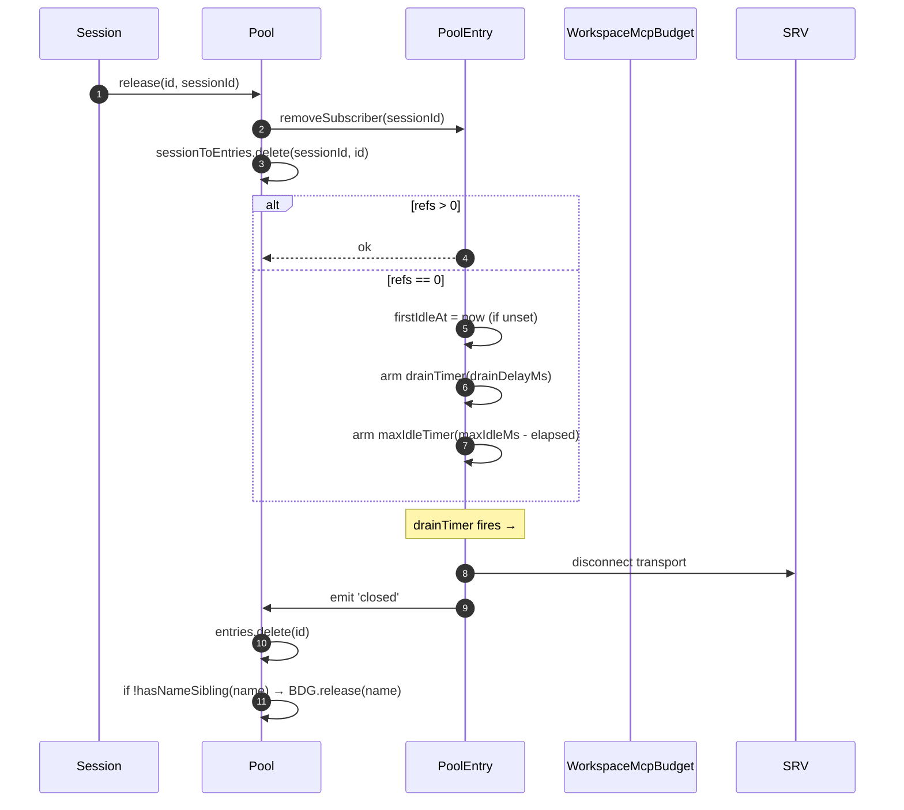
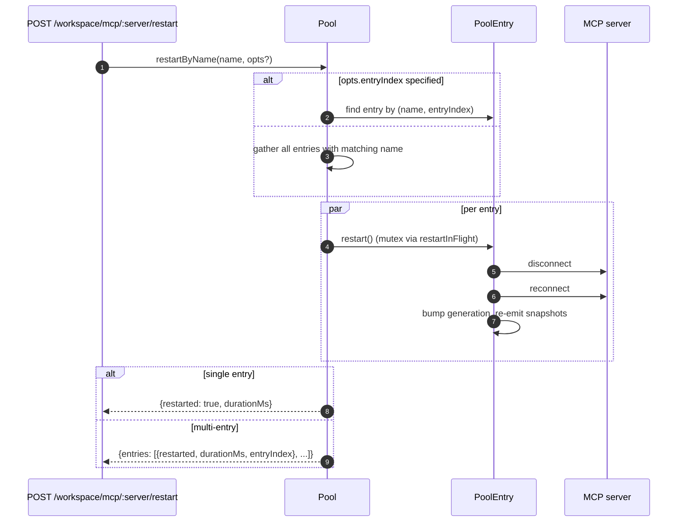
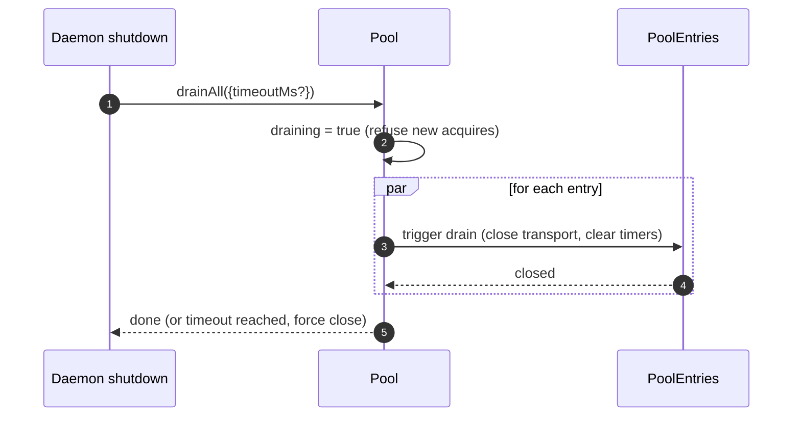

# Workspace MCP Transport Pool

## Overview

`McpTransportPool` (`packages/core/src/tools/mcp-transport-pool.ts:104+`) is the F2 (#4175 commit 5) workspace-scoped pool: N ACP sessions on one daemon share one transport per unique `(serverName + configFingerprint)` tuple, instead of each spawning its own MCP child process. The pool lives **inside the ACP child** (`QwenAgent.mcpPool`), is constructed once at agent startup with the daemon's bootstrap `Config`, and survives session lifecycles — entries reference-count session attaches and drain back to closed under a configurable grace period when ref count hits zero.

It is the dominant reason a multi-session daemon doesn't fork N copies of every MCP server.

## Responsibilities

- Acquire or spawn one MCP transport per `(name + fingerprint)`, deduping concurrent acquires via `spawnInFlight`.
- Release per-session references; arm the entry's drain timer when the last reference detaches.
- Survive ref-count flap with a hard `MAX_IDLE_MS` cap so a thrashing client can't keep an idle transport alive forever.
- Reference-count sessions in a reverse index (`sessionToEntries`) so `releaseSession(sessionId)` is O(refs) rather than O(entries).
- Restart entries on demand (`restartByName`) — single-entry returns `{restarted, durationMs}`, multi-entry returns `{entries: RestartResult[]}` (F2 multi-entry contract).
- Drain the entire pool on daemon shutdown with a configurable timeout; refuse new acquires while draining.
- Consult `WorkspaceMcpBudget` (see [`06-mcp-budget-guardrails.md`](./06-mcp-budget-guardrails.md)) on `acquire` to enforce per-name reservation caps; release the slot on entry close when no sibling entry holds the same name.
- Produce per-session filtered tool/prompt snapshots via `SessionMcpView` so a discovery in one session doesn't register tools into other sessions.

## Architecture

### Public surface

```ts
class McpTransportPool {
  constructor(cliConfig: Config, options: McpTransportPoolOptions);
  acquire(
    serverName,
    cfg,
    sessionId,
    sessionToolRegistry,
    sessionPromptRegistry,
  ): Promise<PooledConnection>;
  release(id, sessionId): void;
  releaseSession(sessionId): void;
  restartByName(
    name,
    opts?,
  ): Promise<RestartResult | { entries: RestartResult[] }>;
  drainAll(opts?): Promise<void>;
  getBudget(): WorkspaceMcpBudget | undefined;
  getSnapshot(): McpPoolSnapshot;
}
```

`McpTransportPoolOptions`:

- `workspaceContext: WorkspaceContext` (required).
- `debugMode: boolean`.
- `sendSdkMcpMessage?` — per-session callback (pool bypasses SDK MCP).
- `pooledTransports?: ReadonlySet<McpTransportKind>` — default `{stdio, websocket}`. HTTP/SSE transports are intentionally unpooled (each acquire mints a new entry that lives only as long as its session) because their headers can carry session-specific OAuth state.
- `drainDelayMs?` — default `30_000`.
- `entryOptions?: (transport) => PoolEntryOptions`.
- `budget?: WorkspaceMcpBudget`.

### Internal state

| State              | Type                                    | Purpose                                                                                           |
| ------------------ | --------------------------------------- | ------------------------------------------------------------------------------------------------- |
| `entries`          | `Map<ConnectionId, PoolEntry>`          | Live pool entries keyed by `connectionIdOf(name, fingerprint)`.                                   |
| `unpooledIds`      | `Set<ConnectionId>`                     | Entries for HTTP/SSE (non-poolable) transports.                                                   |
| `spawnInFlight`    | `Map<ConnectionId, Promise<PoolEntry>>` | Dedups concurrent cold acquires for the same key.                                                 |
| `sessionToEntries` | `Map<string, Set<ConnectionId>>`        | V21-2 reverse index for O(refs) `releaseSession`.                                                 |
| `draining`         | `boolean`                               | Wenshao C5 drain mutex — once set, all `acquire` calls reject.                                    |
| `nextIndexByName`  | `Map<string, number>`                   | V21-7 monotonic `entryIndex` per server name (dashboards don't shuffle when a new entry appears). |

### `PoolEntry` (per-entry struct, `mcp-pool-entry.ts`)

State machine: `spawning → active ⇄ (active ↔ reconnect) → (active → draining on last detach, draining → active on attach OR draining → closed on timer)`.

| Field                                                  | Purpose                                                                         |
| ------------------------------------------------------ | ------------------------------------------------------------------------------- |
| `localStatus: MCPServerStatus`                         | Driven by `MCPServerStatus` lifecycle.                                          |
| `state: PoolEntryState`                                | `spawning`/`active`/`draining`/`closed`/`failed`.                               |
| `generation: number`                                   | Bumped on each restart; subscribers compare to detect reconnect cycles.         |
| `refs: Set<string>`                                    | Session ids currently attached.                                                 |
| `subscribers: Map<string, SessionMcpView>`             | Per-session filtered views.                                                     |
| `subscriberHandles: Map<string, PooledConnectionImpl>` | Handles returned from `acquire`.                                                |
| `toolsSnapshot[], promptsSnapshot[]`                   | Canonical pool-level snapshots; re-issued on `toolsChanged` / `promptsChanged`. |
| `drainTimer?`                                          | Armed when `refs.size === 0`; default 30s. Reset on attach.                     |
| `maxIdleTimer?`                                        | Armed at FIRST idle; never reset by acquire/release flap. Default 5 min.        |
| `firstIdleAt?`                                         | Watermark for the max-idle hard cap.                                            |
| `restartInFlight?`                                     | Mutex for `restart()`.                                                          |

### `PoolEntryOptions`

```ts
interface PoolEntryOptions {
  drainDelayMs: number; // default 30_000
  maxIdleMs: number; // default 5 * 60_000
  maxReconnectAttempts: number; // default 3 (stdio/ws) or 5 (http/sse)
  reconnectStrategy:
    | { kind: 'fixed'; delayMs: number }
    | { kind: 'exponential'; baseMs: number; capMs: number };
}
```

`defaultPoolEntryOptions(transport)` (`mcp-pool-entry.ts:58-70`) returns stdio/ws defaults `{fixed 5s, 3 attempts}` and http/sse defaults `{exponential 1s → 16s, 5 attempts}`. Remote transports get longer retry budgets because their failures are more often transient.

## Workflow

### `acquire`

```mermaid
sequenceDiagram
    autonumber
    participant S as Session
    participant P as Pool
    participant SIF as spawnInFlight
    participant E as PoolEntry
    participant BDG as WorkspaceMcpBudget
    participant SRV as MCP server

    S->>P: acquire(name, cfg, sessionId, sessionToolRegistry, sessionPromptRegistry)
    P->>P: refuse if draining
    P->>P: connectionId = connectionIdOf(name, fingerprint)
    P->>P: if !isPoolable(cfg) → mark unpooled
    alt entry in entries (warm)
        E-->>P: existing PoolEntry
    else inflight cold spawn
        SIF-->>P: existing Promise<PoolEntry>
    else cold start
        P->>BDG: tryReserve(name) (if budget set + poolable)
        BDG-->>P: 'reserved' | 'already_held' | 'refused'
        alt refused
            P->>BDG: recordRefusal(name, transport)
            P-->>S: BudgetExhaustedError
        else ok
            P->>E: spawnEntry(name, cfg)
            E->>SRV: connect transport
            SRV-->>E: ready
            P->>P: entries.set(id, E); nextIndexByName++
            E-->>P: connected
        end
    end
    P->>E: addSubscriber(sessionId, sessionToolRegistry, sessionPromptRegistry)
    P->>P: sessionToEntries.add(sessionId, id)
    P->>P: cancel drain timer (refs>0)
    P-->>S: PooledConnection { id, serverName, entryIndex, client, toolsSnapshot, promptsSnapshot, on, off, release }
```

### `release` + drain



`hasNameSibling(name)` (`mcp-transport-pool.ts:181+`) iterates both `entries.values()` and `spawnInFlight.keys()` parsing the latter with `parseConnectionId` (server names can legitimately contain `::`, so `startsWith` would false-positive on a sibling name beginning with `${name}::`).

`releaseSession(sessionId)` reads from `sessionToEntries`, releases all referenced entries in O(refs), then clears the index entry. Used by the bridge's session-close path so we don't iterate the full entry map.

### `restartByName`



The pre-flight budget check at the daemon HTTP layer returns `{restarted:false, skipped:true, reason:'budget_would_exceed'}` (Wave-4 PR 17) when the target's slot isn't already reserved AND a restart would push live count over `enforce` budget.

### `drainAll`



## State & Lifecycle

- Pool construction is synchronous; first `acquire` cold-starts a transport.
- `drainDelayMs` (default 30s) is reset to cancellation on attach.
- `maxIdleMs` (default 5 min) is **never** reset by attach/detach — it starts ticking at the FIRST idle and only stops when the entry actually closes or attaches before the deadline. Defense against thrashing clients.
- `nextIndexByName` is monotonic. Old entries keep their assigned index even after newer ones appear, so dashboards reading `entryIndex` don't shuffle.
- Spawn failure releases the reserved budget slot (V21-4 — without this, a cold spawn that crashed mid-connect would leak the reservation forever).

## Dependencies

- `packages/core/src/tools/mcp-client.ts` — `McpClient`, status enum, `SendSdkMcpMessage`.
- `packages/core/src/tools/mcp-pool-entry.ts` — `PoolEntry`, `PoolEntryOptions`, `defaultPoolEntryOptions`.
- `packages/core/src/tools/mcp-pool-key.ts` — `connectionIdOf`, `parseConnectionId`, `isPoolable`, `mcpTransportOf`, `POOLED_TRANSPORTS_DEFAULT`.
- `packages/core/src/tools/mcp-pool-events.ts` — `ConnectionId`, `PoolEntryState`, `PoolEvent`.
- `packages/core/src/tools/session-mcp-view.ts` — per-session view that filters pool snapshots.
- `packages/core/src/tools/mcp-workspace-budget.ts` — `WorkspaceMcpBudget` (see [`06-mcp-budget-guardrails.md`](./06-mcp-budget-guardrails.md)).
- `packages/core/src/tools/mcp-discovery-timeout.ts` — `discoveryTimeoutFor`, `runWithTimeout`.

## Configuration

| Source                        | Knob                                                            | Effect                                                                                                    |
| ----------------------------- | --------------------------------------------------------------- | --------------------------------------------------------------------------------------------------------- |
| Env                           | `QWEN_SERVE_NO_MCP_POOL=1`                                      | Kill switch — `QwenAgent.mcpPool` stays undefined; per-session `McpClientManager` enforces (pre-F2 path). |
| Flag                          | `--mcp-client-budget=N`, `--mcp-budget-mode={off,warn,enforce}` | Forwarded to ACP child via `childEnvOverrides`; child constructs `WorkspaceMcpBudget` and passes to pool. |
| Capability tags (conditional) | `mcp_workspace_pool`, `mcp_pool_restart`                        | Advertised together when pool is on. SDK pre-flights both to branch on pool-aware response shapes.        |

### Unpooled entries (HTTP / SSE / SDK-MCP)

Transports outside `pooledTransports` (HTTP, SSE, SDK-MCP) take a separate path: `createUnpooledConnection(name, cfg, sessionId, ...)` (`mcp-transport-pool.ts:855+`) creates a per-session entry with id `${name}::unpooled-${entryIndex}`. Differences from pooled entries:

- Stored in `entries` AND tracked in `unpooledIds: Set<ConnectionId>` so `release` / `releaseSession` can fast-path the close-on-detach behavior (refs always max out at 1).
- `McpClient.discover()` is used directly instead of pool replay; `applyTools` / `applyPrompts` are no-ops because the session's registries already hold what was registered (W77 / `skipReplay: true` in `attach()`).
- Workspace budget still gates them — F2 commit 6 closed the prior loophole where unpooled connections bypassed `tryReserve`; the same `WorkspaceMcpBudget` slot is reserved and released on entry close (whether pooled or unpooled).

The W77 race (`cb206da36`): `createUnpooledConnection` stores the entry in `this.entries` BEFORE awaiting `client.connect()` / `client.discover()`, but only indexes `sessionToEntries[sessionId]` AFTER `attach()` succeeds. A concurrent `closeStoredSession()` / `releaseSession(sessionId)` during the connect/discover window saw an empty index, let the unpooled spawn finish, and `attach()` then registered tools/prompts into an already-closed session. The fix:

- `mcp-pool-entry.ts:251`: public `isTerminated(): boolean` probe (`state === 'closed' || state === 'failed'`).
- `mcp-pool-entry.ts:260`: `markActive()` short-circuits if `isTerminated()` so a torn-down entry can't be resurrected to `'active'`.
- Callers (the pool's unpooled path) probe `isTerminated()` between the awaits and abort the attach if the parent session went away.

This race was latent today (the W61/W71 per-session `releaseSession` hooks land in F4) but would become live the moment that hook arrived — fix landed early on the F2 line.

## Caveats & Known Limits

- **HTTP / SSE transports are unpooled** — each acquire mints a fresh entry that lives only as long as its session. Reason: their headers may carry session-specific OAuth state, so pooling would leak credentials across sessions.
- **`maxIdleMs` is a hard cap surviving flap.** A 5-minute idle hard cap means even an aggressively attaching/detaching client can't keep an idle transport pinned past 5 minutes. Operators who want pinned long-lived transports should bump `maxIdleMs` or run the server outside the pool.
- **Per-server-name budget slots** mean two pool entries that share a name but differ by fingerprint consume ONE slot together, not two. Subprocess accounting is exposed separately via `pool.getSnapshot().subprocessCount`.
- **`startsWith` regression** was avoided in `hasNameSibling` because MCP server names can legitimately contain `::` (`mcp-pool-key.test.ts:258`). Always use `parseConnectionId`'s `lastIndexOf('::')` split, never string-prefix matching.
- **Pool draining is one-way** — `drainAll` sets `draining = true` permanently; a fresh pool is required for further work.

## References

- `packages/core/src/tools/mcp-transport-pool.ts` (entire file; key landmarks at line 104+, 181+, 208+)
- `packages/core/src/tools/mcp-pool-entry.ts:1-120` and beyond (entry lifecycle)
- `packages/core/src/tools/mcp-pool-key.ts` (`connectionIdOf`, `parseConnectionId`)
- `packages/core/src/tools/mcp-pool-events.ts` (event types)
- `packages/core/src/tools/session-mcp-view.ts` (per-session filtered view)
- F2 design notes: issue [#4175](https://github.com/QwenLM/qwen-code/issues/4175) (commits 4-6 of the F2 series).
