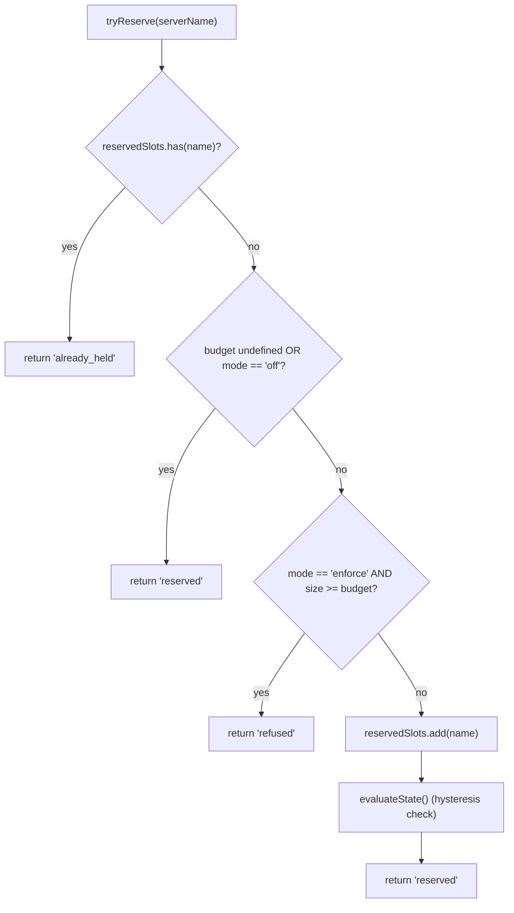
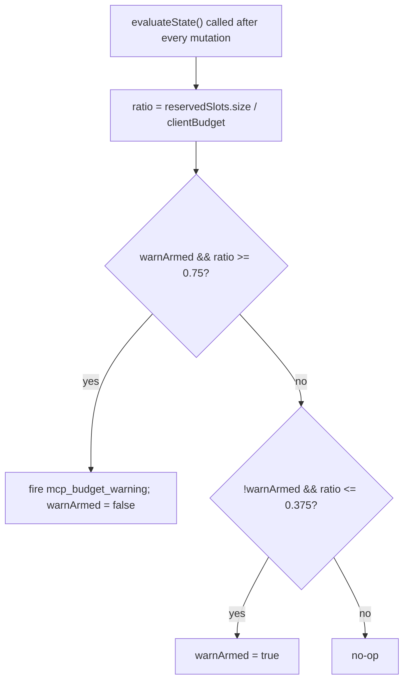

# MCP Workspace Budget Guardrails (English)

## Overview

`WorkspaceMcpBudget` (`packages/core/src/tools/mcp-workspace-budget.ts:55+`) is F2 (#4175 commit 6)'s workspace-scoped MCP client budget controller. It owns the same state machine `McpClientManager` carries inline (slot reservation, 75% hysteresis warning, refused-batch coalescing across a `discoverAllMcpTools*` pass) but lives **one-per-workspace** inside `McpTransportPool` instead of N-per-session inside each ACP child's manager. The pool delegates `acquire`/`release` calls here so the cap caps the **workspace**, not each session.

The legacy `McpClientManager` budget machinery stays for standalone qwen and SDK MCP servers (which bypass the pool per commit 4 fix). Pool mode → `WorkspaceMcpBudget` enforces; standalone / SDK MCP → manager's inline machinery enforces. No double counting because pool-mode discovery never calls the manager's `tryReserveSlot`.

## Responsibilities

- Track `reservedSlots: Set<string>` of currently-held server NAMES (slot key is per-NAME, matching PR 14 v1).
- `tryReserve(name) → 'reserved' | 'already_held' | 'refused'` — atomic and synchronous so concurrent `Promise.all` acquires can't sneak past the cap at an await boundary.
- `release(name) → boolean` — idempotent (`Set.delete` semantics).
- Fire `mcp_budget_warning` once on upward 75% crossing of `reservedSlots.size / clientBudget`; re-arm only after a 37.5% downward crossing.
- Coalesce per-server refusals across a bulk discovery pass — `beginBulkPass()` / `endBulkPass()` brackets accumulate refusals into a single `mcp_child_refused_batch` event.
- Maintain `lastRefusedServerNames` for snapshot consumers (`GET /workspace/mcp`) — cleared at the START of the next bulk pass, NOT on emit, so a snapshot between passes still sees the last refusal set.

## Architecture

### Configuration

```ts
new WorkspaceMcpBudget({
  clientBudget?: number,           // undefined = unlimited
  mode: 'off' | 'warn' | 'enforce',
  onEvent?: (event: McpBudgetEvent) => void,
});
```

`mode` semantics:
- `off` — every method no-ops; `tryReserve` returns `'reserved'` unconditionally; no events fire.
- `warn` — slots are tracked and `mcp_budget_warning` fires at 75%, but `tryReserve` NEVER refuses.
- `enforce` — `tryReserve` refuses past `clientBudget`; `recordRefusal` queues per-server refusals; `endBulkPass` emits `mcp_child_refused_batch`.

### Constants from `mcp-client-manager.ts`

- `MCP_BUDGET_WARN_FRACTION = 0.75` — upward threshold.
- `MCP_BUDGET_REARM_FRACTION = 0.375` — downward hysteresis re-arm.
- `McpBudgetMode = 'off' | 'warn' | 'enforce'`.

### Internal state

| State | Purpose |
|---|---|
| `reservedSlots: Set<string>` | Authoritative reservation set; hysteresis evaluates `size / clientBudget`. |
| `pendingRefusalNames: Set<string>` | Refusal names accumulated during the current `beginBulkPass`/`endBulkPass` window; drained on `endBulkPass`. |
| `pendingRefusalTransports: Map<string, transport>` | Sidecar so the emitted batch carries each refused server's transport. |
| `lastRefusedServerNames: readonly string[]` | Snapshot-visible refusal list from the most recent completed pass. Cleared at the start of the next pass. |
| `warnArmed: boolean` | Hysteresis state — true = ready to fire, false = already fired since last 37.5% drain. |
| `bulkPassDepth: number` | Re-entrancy counter for nested bulk passes (nested passes must not double-emit). |

## Workflow

### `tryReserve`



`tryReserve` is **synchronous**. Pool's `acquire` is async, but reservation happens before any `await`, so two concurrent `Promise.all` acquires for different names can't both squeeze past the cap.

### Hysteresis



Hysteresis avoids flap-spam when a workload oscillates around 75%. The first crossing fires; subsequent crossings without dropping to 37.5% don't.

### Refused-batch coalescing

```mermaid
sequenceDiagram
    autonumber
    participant POOL as pool.discoverAllMcpToolsViaPool
    participant BDG as WorkspaceMcpBudget
    participant EB as EventBus

    POOL->>BDG: beginBulkPass()
    BDG->>BDG: bulkPassDepth++<br/>clear lastRefusedServerNames if outermost
    loop per server in pass
        POOL->>BDG: tryReserve(name)
        alt refused
            POOL->>BDG: recordRefusal(name, transport)
            BDG->>BDG: pendingRefusalNames.add; pendingRefusalTransports.set
            Note over BDG: NO event yet (coalesce)
        end
    end
    POOL->>BDG: endBulkPass()
    BDG->>BDG: bulkPassDepth--
    alt outermost (depth == 0) AND pending non-empty
        BDG->>EB: emit mcp_child_refused_batch<br/>{refusedServers, budget, liveCount, reservedCount, mode: 'enforce', scope?: 'workspace'}
        BDG->>BDG: lastRefusedServerNames = drain pendingRefusalNames
    end
```

Out-of-pass refusals (e.g. lazy `readResource` spawn that bypasses the bulk pass entirely) emit length-1 batches inline for shape consistency. Nested passes (`bulkPassDepth > 0`) don't fire — only the outermost end-of-pass emits the coalesced batch.

## State & Lifecycle

- Budget controller is constructed once per workspace at pool init.
- `clientBudget` is immutable after construction; runtime changes require pool reconstruction.
- `mode` is also immutable (`onEvent` is stashed as `undefined` when `mode === 'off'` as defense in depth).
- `warnArmed` starts true; resets to true via the 37.5% downward crossing.
- `lastRefusedServerNames` is NOT cleared on `endBulkPass` emit — only at the START of the next bulk pass. This lets a snapshot route called between passes still report the last refusal set (otherwise dashboards would show empty refusals immediately after a refused-batch event was delivered).

## Dependencies

- `packages/core/src/tools/mcp-client-manager.ts` — re-uses `McpBudgetEvent`, `McpBudgetMode`, `McpRefusedServer`, `MCP_BUDGET_WARN_FRACTION`, `MCP_BUDGET_REARM_FRACTION`, `BudgetExhaustedError` (thrown by pool's `acquire` on refusal).
- `packages/core/src/tools/mcp-transport-pool.ts` — consumes the budget; passes events through to the daemon EventBus via the pool's `onEvent` plumbing.
- Daemon snapshot route `GET /workspace/mcp` — reads `getReservedSlots()`, `getRefusedServerNames()`, `getReservedCount()`, `getBudget()`, `getMode()`.

## Configuration

| Source | Knob | Effect |
|---|---|---|
| Flag | `--mcp-client-budget=N` | Sets `clientBudget` for the workspace controller. |
| Flag | `--mcp-budget-mode={off,warn,enforce}` | Sets `mode`. `enforce` requires a positive `clientBudget` (boot-loud refusal otherwise). |
| Env | `QWEN_SERVE_MCP_CLIENT_BUDGET`, `QWEN_SERVE_MCP_BUDGET_MODE` | Forwarded to ACP child via `childEnvOverrides`; child's `readBudgetFromEnv()` picks them up. |
| Capability tags | `mcp_guardrails` (always; `modes: ['warn', 'enforce']`), `mcp_guardrail_events` (always) | See [`11-capabilities-versioning.md`](./11-capabilities-versioning.md). |

## Caveats & Known Limits

- **Reservation key is per-NAME.** Two pool entries with the same server name but different fingerprints (e.g. sessions injecting divergent OAuth headers) consume ONE slot together. Subprocess accounting is exposed separately via the pool snapshot's `subprocessCount`. Operators should think of budget as "configured server slots" not "subprocess count".
- **Hysteresis triggers on reservation count, not live (CONNECTED) count.** Reservations include in-flight connects and survive transient disconnects, so hysteresis stays stable across reconnect cycles. Live count is exposed in event payloads as `liveCount` for SDK consumers that want that lens.
- **`warn` mode never refuses.** It still tracks reservations and fires `mcp_budget_warning`, but `tryReserve` always returns `'reserved'`. Refusal semantics are `enforce`-only.
- **Workspace-scoped budget events carry `scope: 'workspace'`** so they fan out to every attached session simultaneously. SDK reducers' `mcpBudgetWarningCount` / `mcpChildRefusedBatchCount` increment in lockstep across sessions on the same connection. Per-session legacy events from `McpClientManager` carry no `scope` (defaults to `'session'` semantically).
- **The kill switch `QWEN_SERVE_NO_MCP_POOL=1`** disables the pool entirely; the workspace budget is also disabled, and the per-session `McpClientManager` budget takes over. The capabilities envelope drops `mcp_workspace_pool` and `mcp_pool_restart` to signal this honestly.

## References

- `packages/core/src/tools/mcp-workspace-budget.ts:1-200+` (entire class)
- `packages/core/src/tools/mcp-client-manager.ts` (`BudgetExhaustedError`, `McpBudgetEvent`, hysteresis constants)
- `packages/core/src/tools/mcp-transport-pool.ts:208+` (pool's `acquire` site that calls `tryReserve`)
- F2 design notes: issue [#4175](https://github.com/QwenLM/qwen-code/issues/4175) commit 6.

---

# MCP 工作区预算护栏 (中文)

## 概览

`WorkspaceMcpBudget`（`packages/core/src/tools/mcp-workspace-budget.ts:55+`）是 F2（#4175 commit 6）的工作区级 MCP client 预算控制器。它持有的状态机和 `McpClientManager` inline 的完全一样（slot 预留、75% 滞回警告、跨 `discoverAllMcpTools*` 一遍 pass 合并 refused-batch），但**一 workspace 一份**住在 `McpTransportPool` 里，而不是每个 ACP child 的 manager 里 N 份。池把 `acquire` / `release` 委托给它，于是上限是**工作区**级上限不是每 session 级。

老的 `McpClientManager` 预算机器保留给独立 qwen 和 SDK MCP server（commit 4 的修复让它们绕过池）。池模式 → `WorkspaceMcpBudget` 强制；standalone / SDK MCP → manager inline 机器强制。不会双数：池模式 discovery 永不调 manager 的 `tryReserveSlot`。

## 职责

- 跟踪 `reservedSlots: Set<string>`（当前持有的 server NAME，slot key per-NAME，对齐 PR 14 v1）。
- `tryReserve(name) → 'reserved' | 'already_held' | 'refused'` —— 原子同步，并发 `Promise.all` acquire 不能在 await 边界偷过上限。
- `release(name) → boolean` —— 幂等（`Set.delete` 语义）。
- `reservedSlots.size / clientBudget` 上升越过 75% 时发一次 `mcp_budget_warning`；下降越过 37.5% 才重新装填。
- 在 bulk discovery pass 内合并 per-server 拒绝 —— `beginBulkPass()` / `endBulkPass()` 包围期间所有拒绝累成一次 `mcp_child_refused_batch` 事件。
- 维护 `lastRefusedServerNames` 给快照消费者（`GET /workspace/mcp`）—— 下一个 bulk pass **开始时**才清掉，不是 emit 时；夹在两 pass 之间的快照还能看到上一批拒绝。

## 架构

### 配置

```ts
new WorkspaceMcpBudget({
  clientBudget?: number,           // undefined = 不限
  mode: 'off' | 'warn' | 'enforce',
  onEvent?: (event: McpBudgetEvent) => void,
});
```

`mode`：
- `off` —— 所有方法 no-op；`tryReserve` 无条件返回 `'reserved'`；无事件。
- `warn` —— 跟踪 slot 并在 75% 发 `mcp_budget_warning`，但 `tryReserve` 永不拒绝。
- `enforce` —— `tryReserve` 超 `clientBudget` 时拒绝；`recordRefusal` 排队 per-server 拒绝；`endBulkPass` 发 `mcp_child_refused_batch`。

### 来自 `mcp-client-manager.ts` 的常量

- `MCP_BUDGET_WARN_FRACTION = 0.75`。
- `MCP_BUDGET_REARM_FRACTION = 0.375`。
- `McpBudgetMode = 'off' | 'warn' | 'enforce'`。

### 内部状态

| 状态 | 用途 |
|---|---|
| `reservedSlots: Set<string>` | 权威预留集合；滞回评估 `size / clientBudget` |
| `pendingRefusalNames: Set<string>` | 当前 `beginBulkPass` / `endBulkPass` 窗口内累积的拒绝名；`endBulkPass` 时排空 |
| `pendingRefusalTransports: Map<string, transport>` | 给 emit 的 batch 带每个拒绝 server 的 transport |
| `lastRefusedServerNames: readonly string[]` | 上一个完成 pass 的拒绝列表，快照可见；下一个 pass 开始才清 |
| `warnArmed: boolean` | 滞回状态 —— true = 准备好发，false = 已发未 37.5% 下回 |
| `bulkPassDepth: number` | 嵌套 bulk pass 计数（嵌套时不能双发） |

## 流程

### `tryReserve`

> 见英文版「`tryReserve`」flowchart。

`tryReserve` 是**同步**的。池的 `acquire` 是 async，但 reservation 在任何 `await` 之前完成，两个并发 `Promise.all` acquire 不同名的请求不可能都挤过上限。

### 滞回

> 见英文版「Hysteresis」flowchart。

滞回防 75% 上下抖时的 spam。首次越过发一次；不再下到 37.5% 时后续越过不发。

### 拒绝-批合并

> 见英文版「Refused-batch coalescing」时序图。

pass 之外的拒绝（比如 lazy `readResource` spawn 完全绕过 bulk pass）inline 发 length-1 batch 保持形状一致。嵌套 pass（`bulkPassDepth > 0`）不发；只有最外层 end-of-pass 才发合并的 batch。

## 状态与生命周期

- 预算控制器在池初始化时一 workspace 一份构造。
- `clientBudget` 构造后不可变；运行时改动要重建池。
- `mode` 也不可变（`mode === 'off'` 时 `onEvent` 被 stash 为 `undefined`，defense in depth）。
- `warnArmed` 初始 true；37.5% 下回时 reset 为 true。
- `lastRefusedServerNames` 在 `endBulkPass` emit 时**不**清；只在下个 bulk pass 开始时清。这让两 pass 之间的快照路由还能报告上一批拒绝集合（否则 refused-batch 事件刚送达 dashboard 就空了）。

## 依赖

- `packages/core/src/tools/mcp-client-manager.ts` —— 复用 `McpBudgetEvent`、`McpBudgetMode`、`McpRefusedServer`、`MCP_BUDGET_WARN_FRACTION`、`MCP_BUDGET_REARM_FRACTION`、`BudgetExhaustedError`（refused 时由池的 `acquire` 抛）。
- `packages/core/src/tools/mcp-transport-pool.ts` —— 消费 budget；通过池的 `onEvent` 把事件喂到 daemon EventBus。
- daemon 快照路由 `GET /workspace/mcp` —— 读 `getReservedSlots()`、`getRefusedServerNames()`、`getReservedCount()`、`getBudget()`、`getMode()`。

## 配置

| 来源 | 旋钮 | 效果 |
|---|---|---|
| 参数 | `--mcp-client-budget=N` | 设 `clientBudget` |
| 参数 | `--mcp-budget-mode={off,warn,enforce}` | 设 `mode`；`enforce` 要求正整数 `clientBudget`（否则 boot-loud 拒） |
| Env | `QWEN_SERVE_MCP_CLIENT_BUDGET`、`QWEN_SERVE_MCP_BUDGET_MODE` | 通过 `childEnvOverrides` 传 ACP 子进程，子进程的 `readBudgetFromEnv()` 接 |
| 能力 tag | `mcp_guardrails`（恒；`modes: ['warn', 'enforce']`）、`mcp_guardrail_events`（恒） | 见 [`11-capabilities-versioning.md`](./11-capabilities-versioning.md) |

## 注意 & 已知局限

- **预留 key 是 per-NAME**。同名不同 fingerprint（session 注入不同 OAuth header）的两条池条目共占 ONE slot。子进程账面通过池快照的 `subprocessCount` 单独暴露。operator 应当把预算理解为「配置 server slot 数」而不是「子进程数」。
- **滞回基于预留数不是 live（CONNECTED）数**。reservation 包括 in-flight connect 且 survive 短暂 disconnect，所以滞回在重连周期里稳定。live count 也在事件 payload 的 `liveCount` 里暴露给想看那个 lens 的 SDK。
- **`warn` 模式永不拒绝**。仍然跟踪并发 `mcp_budget_warning`，但 `tryReserve` 总返 `'reserved'`。拒绝语义只有 `enforce`。
- **工作区级 budget 事件带 `scope: 'workspace'`** 同时扇出给所有 attach 的 session；SDK reducer 的 `mcpBudgetWarningCount` / `mcpChildRefusedBatchCount` 在同一 connection 上的 session 之间齐步增长。`McpClientManager` 的 per-session 老事件无 `scope`（语义默认 `'session'`）。
- **杀手锏 `QWEN_SERVE_NO_MCP_POOL=1`** 完全禁池；workspace budget 也禁，回到 per-session `McpClientManager` budget。capabilities envelope 诚实地不广播 `mcp_workspace_pool` / `mcp_pool_restart`。

## 参考

- `packages/core/src/tools/mcp-workspace-budget.ts:1-200+`（整 class）
- `packages/core/src/tools/mcp-client-manager.ts`（`BudgetExhaustedError`、`McpBudgetEvent`、滞回常量）
- `packages/core/src/tools/mcp-transport-pool.ts:208+`（池 `acquire` 调 `tryReserve` 的站点）
- F2 设计笔记：issue [#4175](https://github.com/QwenLM/qwen-code/issues/4175) commit 6。
