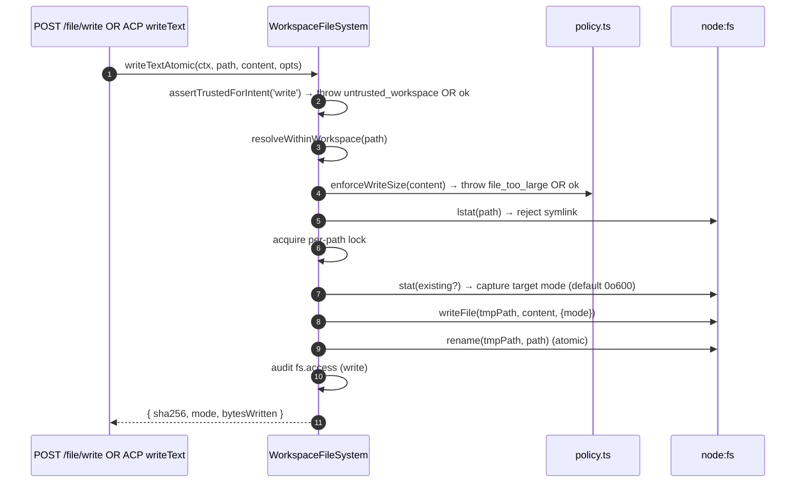
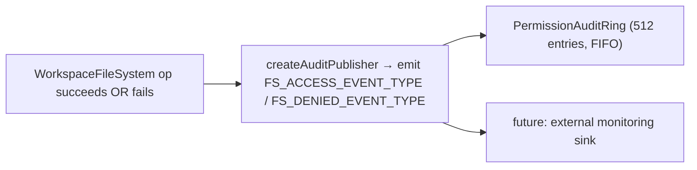

# Workspace File System Boundary (English)

## Overview

The daemon never lets HTTP routes or ACP-side agent calls touch the host filesystem directly. Every read, write, list, glob, and stat goes through the `WorkspaceFileSystem` boundary (`packages/cli/src/serve/fs/`), which provides:

- **Path resolution** — canonicalize + reject anything escaping the bound workspace, including via symlinks.
- **Trust gating** — refuse writes when the workspace isn't trusted (`untrusted_workspace`).
- **Size & content policy** — read cap (`MAX_READ_BYTES = 256 KiB`), write cap (`MAX_WRITE_BYTES = 5 MiB`), binary detection.
- **Atomicity** — write-then-rename with target mode preservation and `0o600` default for new files.
- **Audit** — every access / denial emits a structured event for `PermissionAuditRing` / monitoring.
- **Typed errors** — closed `FsErrorKind` union mapped to HTTP statuses.

The HTTP file routes (`GET /file`, `GET /file/bytes`, `POST /file/write`, `POST /file/edit`, `GET /list`, `GET /glob`, `GET /stat`) and the ACP-side `BridgeFileSystem` adapter (so agent-driven `readTextFile` / `writeTextFile` calls get the same gates) both go through this boundary.

## Responsibilities

- Resolve user-supplied paths into branded `ResolvedPath` values that the rest of the boundary can safely use.
- Refuse paths outside the bound workspace (`path_outside_workspace`) and paths whose target is a symlink (`symlink_escape`).
- Refuse reads above `MAX_READ_BYTES`, writes above `MAX_WRITE_BYTES`, and binary files (`binary_file`).
- Refuse writes/edits when the workspace is untrusted (`untrusted_workspace`) — gated by `assertTrustedForIntent(intent)`.
- Honor `.gitignore` / `.qwenignore` patterns via `shouldIgnore`.
- Perform atomic write-then-rename with target mode preservation; default new file mode is `0o600`.
- Emit `fs.access` / `fs.denied` audit events on every operation.
- Map every failure to a `FsError` with kind + HTTP status; route handlers serialize them uniformly.

## Architecture

### Module layout

| File | Purpose |
|---|---|
| `paths.ts` | `canonicalizeWorkspace`, `resolveWithinWorkspace`, `hasSuspiciousPathPattern`, branded `ResolvedPath`, `Intent` union (`read \| write \| list \| stat \| glob`). |
| `policy.ts` | `MAX_READ_BYTES`, `MAX_WRITE_BYTES`, `BINARY_PROBE_BYTES`, `assertTrustedForIntent`, `detectBinary`, `enforceReadBytesSize`, `enforceReadSize`, `enforceWriteSize`, `shouldIgnore`. |
| `audit.ts` | `FS_ACCESS_EVENT_TYPE`, `FS_DENIED_EVENT_TYPE`, `createAuditPublisher`, audit payload types. |
| `errors.ts` | `FsError` class, `isFsError`, `FsErrorKind` union (13 kinds), `FsErrorStatus` union (`400 / 403 / 404 / 409 / 413 / 422 / 500 / 503`). |
| `workspaceFileSystem.ts` | `createWorkspaceFileSystemFactory`, `WorkspaceFileSystem` (the orchestrator that reads/writes/lists), `WriteMode`, `ContentHash`, `FsEntry`, `FsStat`, `ListOptions`, `GlobOptions`, `ReadTextOptions`, `ReadBytesOptions`, `WriteTextAtomicOptions`. |

### `FsErrorKind` taxonomy

| Kind | Default HTTP | Meaning |
|---|---|---|
| `path_outside_workspace` | 400 | Resolved path is outside the bound workspace. |
| `symlink_escape` | 400 | Target is a symlink (rejected per the conservative PR 18 + PR 20 posture). |
| `path_not_found` | 404 | `ENOENT`. |
| `binary_file` | 422 | Content sniffed binary on a text route. |
| `file_too_large` | 413 | Above `MAX_READ_BYTES` or `MAX_WRITE_BYTES`. |
| `hash_mismatch` | 409 | Optimistic-concurrency `expectedSha256` failed. |
| `file_already_exists` | 409 | `mode: 'create'` against an existing file. |
| `text_not_found` | 422 | `POST /file/edit`'s search string wasn't in the file. |
| `ambiguous_text_match` | 422 | Multiple matches when exactly one was required. |
| `untrusted_workspace` | 403 | Write attempted in an untrusted workspace. |
| `permission_denied` | 403 | OS-level `EACCES` / `EPERM`. |
| `io_error` | 503 | `ENOSPC` / `EIO` / `EBUSY` / `ETXTBSY` / `ENAMETOOLONG` / `EMFILE` / `ENFILE`. **Distinct from `permission_denied`** so monitoring pipelines don't page security oncall for "disk full". |
| `internal_error` | 500 | Non-errno reach-the-boundary error (`TypeError`, programmer bug). |
| `parse_error` | 400 / 422 | Request-body parse error (400) or service-level invariant breach (422). |

### `BridgeFileSystem` (the ACP-side adapter)

`packages/acp-bridge/src/bridgeFileSystem.ts:39-97` defines:

```ts
interface BridgeFileSystem {
  readText(params: ReadTextFileRequest): Promise<ReadTextFileResponse>;
  writeText(params: WriteTextFileRequest): Promise<WriteTextFileResponse>;
}
```

This is the injection seam for ACP `readTextFile` / `writeTextFile`. Bridge tests + Mode A embedded callers can omit it on `BridgeOptions`; `BridgeClient` falls back to its inline `fs.readFile` / `fs.writeFile` proxy (preserves pre-F1 behavior). Production `qwen serve` wires `BridgeFileSystem` through `createBridgeFileSystemAdapter(fsFactory)` (`packages/cli/src/serve/bridgeFileSystemAdapter.ts`) so agent-side ACP writes pick up the same TOCTOU + symlink + trust-gate + audit gates the HTTP routes use.

Two defensive gates the adapter MUST replicate (because the inline proxy is fully bypassed when the adapter is injected):
1. **Reject non-regular files** — sockets / pipes / char devices / procfs / sysfs entries can stream unbounded data despite `stats.size === 0`. The inline path throws with `describeStatKind(stats)` in the message.
2. **Cap buffered size** at `READ_FILE_SIZE_CAP = 100 MiB`. A tiny `{ line: 1, limit: 10 }` request against a 500 MB log would otherwise cost 500 MB of RSS just to return 10 lines.

The adapter goes further: it uses `WorkspaceFileSystem.writeTextOverwrite` (PR 18 primitive) for atomic tmp+rename with mode preservation, `0o600` default, symlink reject inside a per-path lock. This is a **divergence from the pre-F1 inline proxy** which resolved symlinks and wrote through to their target — agents that relied on writing through symlinked dotfiles now have to address the resolved path directly.

### FsError preservation over the ACP wire

When the `BridgeFileSystem` adapter throws an `FsError` (`kind: 'untrusted_workspace'` / `'symlink_escape'` / `'file_too_large'` / etc.), the ACP SDK's default RPC error path serializes only `error.message` as a generic `-32603 "Internal error"` — `kind` / `status` / `hint` are stripped. The agent's RPC client downstream then has to regex-match the human-readable message to dispatch typed UI (auth retry vs file picker vs proxy hint).

`BridgeClient.writeTextFile` and `BridgeClient.readTextFile` install a thin guard (`packages/acp-bridge/src/bridgeClient.ts:40-100+`) that catches FsError-shaped throws and rethrows them as ACP `RequestError`:

```ts
function isFsErrorShape(err: unknown): err is FsErrorShape {
  return (
    err instanceof Error &&
    err.name === 'FsError' &&
    typeof (err as { kind?: unknown }).kind === 'string'
  );
}

function preserveFsErrorOverAcp(err: unknown): never {
  if (isFsErrorShape(err)) {
    throw new RequestError(-32603, err.message, {
      errorKind: err.kind,
      ...(err.hint !== undefined ? { hint: err.hint } : {}),
      ...(err.status !== undefined ? { status: err.status } : {}),
    });
  }
  throw err;
}
```

The agent's RPC client now receives `data.errorKind` (the closed `FsErrorKind` value) plus the optional `data.hint` and `data.status`, so SDK consumers branch on the typed enum instead of regex-matching the message.

Two design notes:

- **Duck typing over import** — `FsError` lives in `packages/cli/src/serve/fs/errors.ts` while `BridgeClient` lives in `packages/acp-bridge`. A direct `import { FsError }` would invert the dependency. The duck check (`name === 'FsError'` + `kind: string`) mirrors what `mapDomainErrorToErrorKind` (`status.ts`) already does for `TrustGateError` / `SkillError` for the same cross-package bundling reason.
- **JSON-RPC code stays at -32603** — the bridge can't reliably map `FsError.kind` to a JSON-RPC error code shape, so the structured `data` field carries the semantic information for SDK consumers. The wire status code (`-32603` "internal error") is unchanged; clients route on `data.errorKind`.

### Trust gate

`assertTrustedForIntent(intent)` consults `Config.isTrustedFolder()`. Read / list / stat / glob are always allowed (trust is only for writes). Write intents in untrusted workspaces throw `FsError('untrusted_workspace', ..., status: 403)`. The trust signal flows in via `WorkspaceFileSystemFactoryDeps.trusted: boolean` — `runQwenServe` passes `true` because the operator booted the daemon against a workspace they implicitly trust; `createServeApp` (direct embed without `runQwenServe`) defaults to `false` and warns once per process (see [`02-serve-runtime.md`](./02-serve-runtime.md)).

## Workflow

### Read

```mermaid
sequenceDiagram
    autonumber
    participant R as HTTP route OR BridgeFileSystem.readText
    participant FS as WorkspaceFileSystem
    participant POL as policy.ts
    participant FSP as node:fs

    R->>FS: readText(ctx, path, opts)
    FS->>FS: resolveWithinWorkspace(path) → ResolvedPath OR throw
    FS->>FS: shouldIgnore? → throw / skip
    FS->>FSP: stat(path)
    FSP-->>FS: stats
    FS->>FS: reject if not regular file (describeStatKind)
    FS->>POL: enforceReadSize(stats.size, opts.maxBytes?)<br/>→ throw file_too_large OR slice plan
    FS->>FSP: readFile(path)
    FSP-->>FS: buffer
    FS->>POL: detectBinary(buffer)
    POL-->>FS: isBinary?
    FS->>FS: reject if binary; sha256 hash; truncate to line window
    FS->>FS: audit fs.access
    FS-->>R: { content, sha256, truncated?, meta }
```

### Write



The atomic write-then-rename ensures a SIGKILL / OOM mid-write does NOT leave the target truncated. `mode: 'create'` aborts with `file_already_exists` on lstat; `mode: 'overwrite'` proceeds; `expectedSha256` arms optimistic-concurrency (`hash_mismatch` on mismatch).

### `POST /file/edit` (single text replacement)

Adds two failure modes on top of write:
- `text_not_found` (422) — search string not in the file.
- `ambiguous_text_match` (422) — multiple matches when exactly one was required (the route's contract).

### Audit fan-out



`FS_ACCESS_EVENT_TYPE` / `FS_DENIED_EVENT_TYPE` carry context (`ctx`), path, intent, outcome, errorKind?, bytesRead/written, sha256?.

## State & Lifecycle

- The factory is built once at daemon boot (`runQwenServe` → `resolveBridgeFsFactory` → adapter).
- Each request constructs a `RequestContext` and invokes the factory's orchestrator for that call only — no long-lived per-file state.
- Per-path locks live only for the duration of the write operation (no cross-call locking; concurrent writes to the same path race on the lock and serialize).
- Audit ring is owned by `runQwenServe` and shared with the permission audit publisher.

## Dependencies

- `@qwen-code/qwen-code-core` — `Ignore`, `isBinaryFile`, `Config.isTrustedFolder()`.
- `node:fs`, `node:path`, `node:crypto`.
- `@qwen-code/acp-bridge` — `BridgeFileSystem` contract on the ACP side.
- HTTP routes: `packages/cli/src/serve/routes/workspaceFileRead.ts`, `workspaceFileWrite.ts`.

## Configuration

| Source | Knob | Effect |
|---|---|---|
| `WorkspaceFileSystemFactoryDeps.trusted: boolean` | Constructor input | Whether writes are allowed; defaults to `true` from `runQwenServe`, `false` from `createServeApp` (with warning). |
| Constant | `MAX_READ_BYTES = 256 KiB` | Read cap; `file_too_large` past this. |
| Constant | `MAX_WRITE_BYTES = 5 MiB` | Write cap; sized below `express.json({ limit: '10mb' })`. |
| Constant | `BINARY_PROBE_BYTES = 4096` | Sample size for content-based binary detection. |
| Capability tags | `workspace_file_read`, `workspace_file_bytes`, `workspace_file_write` | See [`11-capabilities-versioning.md`](./11-capabilities-versioning.md). |
| Workspace files | `.gitignore`, `.qwenignore` | Ignored paths surface as `ignored: true` from `shouldIgnore`. |

## Caveats & Known Limits

- **Symlinks are rejected, not followed.** This is a divergence from the pre-F1 inline `BridgeClient.writeTextFile` proxy which resolved symlinks. Agents writing through symlinked dotfiles need to address the resolved path directly.
- **`io_error` vs `permission_denied` are distinct.** Don't conflate them. Monitoring pipelines key on `errorKind` for alerting — folding ENOSPC into permission_denied would page security oncall for `df -h` problems.
- **New file mode defaults to `0o600`, not umask defaults.** The write syscall's `mode` arg bypasses umask. Agents writing public files should explicitly pass a mode override.
- **`createServeApp` default `trusted: false`** silently rejects ACP writes with `untrusted_workspace` for embedders that don't inject a custom `fsFactory` or `bridge`. A one-time stderr warning fires the first time; further callers see no reminder. See [`02-serve-runtime.md`](./02-serve-runtime.md).
- **Read cap is enforced pre-decode.** A file at `MAX_READ_BYTES + 1` is refused even if the request only wants 10 lines — because the underlying `readFileWithLineAndLimit` reads the whole file into memory before slicing.
- **`BridgeFileSystem` adapter MUST replicate both inline-proxy gates** (non-regular-file refusal + buffered-size cap). The inline path is fully bypassed when the adapter is injected.

## References

- `packages/cli/src/serve/fs/index.ts` (barrel)
- `packages/cli/src/serve/fs/paths.ts`
- `packages/cli/src/serve/fs/policy.ts:1-100+`
- `packages/cli/src/serve/fs/errors.ts:1-80+`
- `packages/cli/src/serve/fs/audit.ts`
- `packages/cli/src/serve/fs/workspaceFileSystem.ts`
- `packages/cli/src/serve/bridgeFileSystemAdapter.ts:1-60`
- `packages/acp-bridge/src/bridgeFileSystem.ts:39-97`
- HTTP route reference: [`../qwen-serve-protocol.md`](../qwen-serve-protocol.md).

---

# Workspace 文件系统边界 (中文)

## 概览

daemon 不让 HTTP 路由或 ACP 侧 agent 直接碰宿主文件系统。所有 read、write、list、glob、stat 都过 `WorkspaceFileSystem` 边界（`packages/cli/src/serve/fs/`）：

- **路径解析** —— canonicalize + 拒绝任何越出 bound workspace 的路径（包括通过 symlink）。
- **信任 gate** —— workspace 不被信任时拒写（`untrusted_workspace`）。
- **大小 & 内容策略** —— 读上限（`MAX_READ_BYTES = 256 KiB`）、写上限（`MAX_WRITE_BYTES = 5 MiB`）、二进制检测。
- **原子性** —— write-then-rename，保留目标 mode，新建文件默认 `0o600`。
- **审计** —— 每次 access / denial 发结构化事件给 `PermissionAuditRing` / 监控。
- **typed error** —— 封闭 `FsErrorKind` 联合 ↔ HTTP 状态码。

HTTP 文件路由（`GET /file`、`GET /file/bytes`、`POST /file/write`、`POST /file/edit`、`GET /list`、`GET /glob`、`GET /stat`）和 ACP 侧 `BridgeFileSystem` 适配器（agent 触发的 `readTextFile` / `writeTextFile` 也拿到同样的护栏）都过这个边界。

## 职责

- 把用户传入的路径解析成 branded `ResolvedPath`，下游安全使用。
- 拒绝 workspace 外的路径（`path_outside_workspace`）和 target 是 symlink 的路径（`symlink_escape`）。
- 拒绝读超 `MAX_READ_BYTES` / 写超 `MAX_WRITE_BYTES` / 二进制文件（`binary_file`）。
- workspace 不被信任时拒写 / edit（`untrusted_workspace`） —— 由 `assertTrustedForIntent(intent)` 闸。
- 遵循 `.gitignore` / `.qwenignore` 模式（`shouldIgnore`）。
- 原子 write-then-rename，保留目标 mode；新建文件默认 `0o600`。
- 每次操作发 `fs.access` / `fs.denied` 审计事件。
- 每次失败都映射到 `FsError`（kind + HTTP 状态），路由 handler 统一序列化。

## 架构

### 模块布局

| 文件 | 用途 |
|---|---|
| `paths.ts` | `canonicalizeWorkspace`、`resolveWithinWorkspace`、`hasSuspiciousPathPattern`、branded `ResolvedPath`、`Intent`（`read \| write \| list \| stat \| glob`） |
| `policy.ts` | `MAX_READ_BYTES`、`MAX_WRITE_BYTES`、`BINARY_PROBE_BYTES`、`assertTrustedForIntent`、`detectBinary`、`enforceReadBytesSize`、`enforceReadSize`、`enforceWriteSize`、`shouldIgnore` |
| `audit.ts` | `FS_ACCESS_EVENT_TYPE`、`FS_DENIED_EVENT_TYPE`、`createAuditPublisher`、audit payload 类型 |
| `errors.ts` | `FsError` 类、`isFsError`、`FsErrorKind`（13 种）、`FsErrorStatus`（`400 / 403 / 404 / 409 / 413 / 422 / 500 / 503`） |
| `workspaceFileSystem.ts` | `createWorkspaceFileSystemFactory`、`WorkspaceFileSystem`、`WriteMode`、`ContentHash`、`FsEntry`、`FsStat`、`ListOptions`、`GlobOptions`、`ReadTextOptions`、`ReadBytesOptions`、`WriteTextAtomicOptions` |

### `FsErrorKind` 分类

| Kind | 默认 HTTP | 含义 |
|---|---|---|
| `path_outside_workspace` | 400 | 解析后的路径在 workspace 外 |
| `symlink_escape` | 400 | target 是 symlink（PR 18 + PR 20 的保守姿态） |
| `path_not_found` | 404 | `ENOENT` |
| `binary_file` | 422 | text 路由上 sniff 到二进制 |
| `file_too_large` | 413 | 超 `MAX_READ_BYTES` 或 `MAX_WRITE_BYTES` |
| `hash_mismatch` | 409 | 乐观并发 `expectedSha256` 不匹配 |
| `file_already_exists` | 409 | `mode: 'create'` 而文件已存在 |
| `text_not_found` | 422 | `POST /file/edit` 的 search 字符串不在文件里 |
| `ambiguous_text_match` | 422 | 需要唯一匹配但匹配到多处 |
| `untrusted_workspace` | 403 | 写在不被信任的 workspace |
| `permission_denied` | 403 | OS 级 `EACCES` / `EPERM` |
| `io_error` | 503 | `ENOSPC` / `EIO` / `EBUSY` / `ETXTBSY` / `ENAMETOOLONG` / `EMFILE` / `ENFILE`。**与 `permission_denied` 严格区分**，否则监控按 errorKind 告警会把「磁盘满」错挂到安全 oncall |
| `internal_error` | 500 | 非 errno 的边界 error（`TypeError`、bug） |
| `parse_error` | 400 / 422 | 请求体解析 error（400）或服务级不变式破坏（422） |

### `BridgeFileSystem`（ACP 侧适配器）

`packages/acp-bridge/src/bridgeFileSystem.ts:39-97`：

```ts
interface BridgeFileSystem {
  readText(params: ReadTextFileRequest): Promise<ReadTextFileResponse>;
  writeText(params: WriteTextFileRequest): Promise<WriteTextFileResponse>;
}
```

这是 ACP `readTextFile` / `writeTextFile` 的注入接口。bridge 测试 + Mode A 嵌入方可以在 `BridgeOptions` 上不传它；`BridgeClient` 回退到 inline `fs.readFile` / `fs.writeFile` proxy（保留 F1 前行为）。生产 `qwen serve` 通过 `createBridgeFileSystemAdapter(fsFactory)`（`packages/cli/src/serve/bridgeFileSystemAdapter.ts`）把它接上，agent 侧 ACP 写得到与 HTTP 路由一致的 TOCTOU + symlink + 信任闸 + 审计护栏。

适配器**必须**复刻 inline proxy 的两道护栏（注入适配器后 inline 路径完全 bypass）：
1. **拒绝非常规文件** —— socket / pipe / char device / procfs / sysfs 即使 `stats.size === 0` 也能流无界数据。inline 路径抛错时带 `describeStatKind(stats)`。
2. **缓冲大小上限** `READ_FILE_SIZE_CAP = 100 MiB`。否则一个针对 500 MB 日志的 `{ line: 1, limit: 10 }` 请求要花 500 MB RSS 才能返 10 行。

适配器还更进一步：用 `WorkspaceFileSystem.writeTextOverwrite`（PR 18 原语）做 atomic tmp+rename、保留 mode、新建默认 `0o600`、symlink reject，整段在 per-path 锁内。这是**与 F1 前 inline proxy 的偏离** —— 老 proxy 解析 symlink 并写穿 target；现在的 agent 如果之前依赖通过 symlink 写 dotfile，要直接寻址解析后的路径。

### FsError 在 ACP wire 上的保留

`BridgeFileSystem` 适配器抛 `FsError`（`kind: 'untrusted_workspace'` / `'symlink_escape'` / `'file_too_large'` 等）时，ACP SDK 默认 RPC error 序列化只把 `error.message` 当作通用 `-32603 "Internal error"` —— `kind` / `status` / `hint` 在线上被剥掉。下游 agent 的 RPC client 想做 typed UI（auth 重试 vs 文件选择 vs 代理提示）就只能 regex-match 人类可读消息。

`BridgeClient.writeTextFile` 与 `BridgeClient.readTextFile` 装了一道薄护栏（`packages/acp-bridge/src/bridgeClient.ts:40-100+`），捕获 FsError 形状的异常重抛为 ACP `RequestError`：

```ts
function isFsErrorShape(err: unknown): err is FsErrorShape {
  return (
    err instanceof Error &&
    err.name === 'FsError' &&
    typeof (err as { kind?: unknown }).kind === 'string'
  );
}

function preserveFsErrorOverAcp(err: unknown): never {
  if (isFsErrorShape(err)) {
    throw new RequestError(-32603, err.message, {
      errorKind: err.kind,
      ...(err.hint !== undefined ? { hint: err.hint } : {}),
      ...(err.status !== undefined ? { status: err.status } : {}),
    });
  }
  throw err;
}
```

agent 的 RPC client 现在拿到 `data.errorKind`（封闭 `FsErrorKind` 值）外加可选 `data.hint`、`data.status`，SDK 消费方按 typed 枚举 dispatch 而不是 regex 消息。

两条设计说明：

- **鸭子类型而非 import** —— `FsError` 住在 `packages/cli/src/serve/fs/errors.ts`，`BridgeClient` 住在 `packages/acp-bridge`，直接 `import { FsError }` 会反向依赖。鸭子检查（`name === 'FsError'` + `kind: string`）与 `mapDomainErrorToErrorKind`（`status.ts`）对 `TrustGateError` / `SkillError` 用的同样思路，跨包打包同问题。
- **JSON-RPC code 保持 -32603** —— bridge 没法把 `FsError.kind` 可靠映射到 JSON-RPC error code 形状，所以语义信息走结构化 `data` 字段。wire 上状态码（`-32603` "internal error"）不变，客户端按 `data.errorKind` 路由。

### 信任 gate

`assertTrustedForIntent(intent)` 查 `Config.isTrustedFolder()`。read / list / stat / glob 总是允许（信任只对写起作用）。在不被信任的 workspace 上 write 意图抛 `FsError('untrusted_workspace', ..., status: 403)`。trust 信号通过 `WorkspaceFileSystemFactoryDeps.trusted: boolean` 注入 —— `runQwenServe` 传 `true`（operator 自己启动 daemon 即默认信任那 workspace）；`createServeApp` 直接嵌入默认 `false` 并 process 内告警一次（详见 [`02-serve-runtime.md`](./02-serve-runtime.md)）。

## 流程

### 读

> 见英文版「Read」时序图。

### 写

> 见英文版「Write」时序图。

atomic write-then-rename 确保 SIGKILL / OOM 写到一半也不会让 target 被截断。`mode: 'create'` 在 lstat 时遇文件已存在中止（`file_already_exists`）；`mode: 'overwrite'` 继续；`expectedSha256` 装乐观并发（不匹配 → `hash_mismatch`）。

### `POST /file/edit`（单段文本替换）

在 write 之上加两种失败：
- `text_not_found`（422）—— search 字符串不在文件里。
- `ambiguous_text_match`（422）—— 需要唯一匹配但匹配到多处（路由契约）。

### 审计扇出

> 见英文版「Audit fan-out」flowchart。

`FS_ACCESS_EVENT_TYPE` / `FS_DENIED_EVENT_TYPE` 带 ctx、path、intent、outcome、errorKind?、bytesRead/written、sha256?。

## 状态与生命周期

- 工厂在 daemon boot 一次（`runQwenServe` → `resolveBridgeFsFactory` → 适配器）。
- 每请求构造一个 `RequestContext` 并调工厂 orchestrator 处理那次；不持久 per-file 状态。
- per-path 锁只活在写操作期间（无跨调用锁；同路径并发写在锁上 race 串行）。
- 审计环属于 `runQwenServe`，与 permission audit publisher 共享。

## 依赖

- `@qwen-code/qwen-code-core` —— `Ignore`、`isBinaryFile`、`Config.isTrustedFolder()`。
- `node:fs`、`node:path`、`node:crypto`。
- `@qwen-code/acp-bridge` —— ACP 侧 `BridgeFileSystem` 契约。
- HTTP 路由：`packages/cli/src/serve/routes/workspaceFileRead.ts`、`workspaceFileWrite.ts`。

## 配置

| 来源 | 旋钮 | 效果 |
|---|---|---|
| `WorkspaceFileSystemFactoryDeps.trusted: boolean` | 构造入参 | 是否允许写；`runQwenServe` 默认 `true`，`createServeApp` 默认 `false`（带告警） |
| 常量 | `MAX_READ_BYTES = 256 KiB` | 读上限；超过 → `file_too_large` |
| 常量 | `MAX_WRITE_BYTES = 5 MiB` | 写上限；低于 `express.json({ limit: '10mb' })` |
| 常量 | `BINARY_PROBE_BYTES = 4096` | 二进制检测采样大小 |
| 能力 tag | `workspace_file_read`、`workspace_file_bytes`、`workspace_file_write` | 见 [`11-capabilities-versioning.md`](./11-capabilities-versioning.md) |
| workspace 文件 | `.gitignore`、`.qwenignore` | 被忽略路径在 `shouldIgnore` 上 `ignored: true` |

## 注意 & 已知局限

- **symlink 直接拒，不跟随**。与 F1 前 inline `BridgeClient.writeTextFile` proxy 的行为偏离。通过 symlink 写 dotfile 的 agent 要改成直接寻址解析后的路径。
- **`io_error` 与 `permission_denied` 严格区分**。不要混。监控按 errorKind 告警 —— 把 ENOSPC 折进 permission_denied 会让 `df -h` 问题误把安全 oncall 叫起来。
- **新建文件默认 `0o600`，不是 umask 默认**。write 系统调用的 `mode` 参数绕过 umask。要写公开文件的 agent 必须显式覆盖 mode。
- **`createServeApp` 默认 `trusted: false`** 嵌入方没注入 `fsFactory` 或 `bridge` 时静默拒 ACP 写为 `untrusted_workspace`。首次告警 stderr 打印一次，之后无提示。详见 [`02-serve-runtime.md`](./02-serve-runtime.md)。
- **读上限是在解码前强制**。一个 `MAX_READ_BYTES + 1` 的文件即使只要 10 行也会被拒，因为底层 `readFileWithLineAndLimit` 先把整文件读进内存才切行。
- **`BridgeFileSystem` 适配器必须复刻 inline-proxy 两道护栏**（非常规文件 refusal + 缓冲大小上限）。注入适配器后 inline 路径完全 bypass。

## 参考

- `packages/cli/src/serve/fs/index.ts`（barrel）
- `packages/cli/src/serve/fs/paths.ts`
- `packages/cli/src/serve/fs/policy.ts:1-100+`
- `packages/cli/src/serve/fs/errors.ts:1-80+`
- `packages/cli/src/serve/fs/audit.ts`
- `packages/cli/src/serve/fs/workspaceFileSystem.ts`
- `packages/cli/src/serve/bridgeFileSystemAdapter.ts:1-60`
- `packages/acp-bridge/src/bridgeFileSystem.ts:39-97`
- HTTP 路由参考：[`../qwen-serve-protocol.md`](../qwen-serve-protocol.md)。
