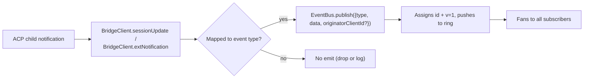
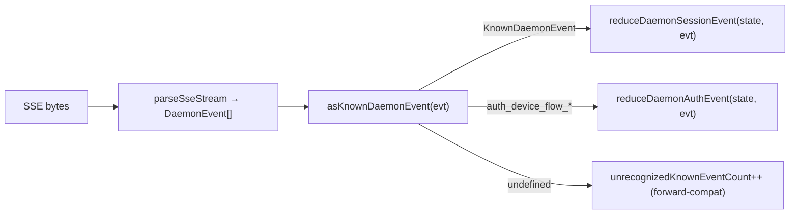

# Typed Daemon Event Schema v1

## 概览

daemon 在 `GET /session/:id/events` 上发的每一帧 SSE 都形如 `{ id, v, type, data, originatorClientId?, _meta? }`，`v: 1` 是当前 `EVENT_SCHEMA_VERSION`。`type` 取自一个封闭的、版本固定的集合 —— `DAEMON_KNOWN_EVENT_TYPE_VALUES`（`packages/sdk-typescript/src/daemon/events.ts`）共 43 种。envelope 的 `_meta` 字段在 SSE 写边界（`server.ts` 的 `formatSseFrame()`）盖上 —— 详见下文 [Envelope 级元数据](#envelope-级元数据)。

SDK 暴露 `asKnownDaemonEvent(evt)`，对已知 type 返回一个判别式 `KnownDaemonEvent`，对其他 type 返回 `undefined` —— SDK 消费方无需固定 SDK 版本就能处理向前兼容（更新的 daemon 加了新 type 也不会崩，会计入 `unrecognizedKnownEventCount`）。

wire 格式见 [`../qwen-serve-protocol.md`](../qwen-serve-protocol.md)，本文是每个事件的 payload 契约。

## 职责

- 提供事件词汇表的唯一事实来源（`DAEMON_KNOWN_EVENT_TYPE_VALUES`）。
- 提供每种 type 的 typed envelope（`DaemonEventEnvelope<TType, TData>`）。
- 提供纯 reducer（`reduceDaemonSessionEvent`、`reduceDaemonAuthEvent`），把事件流投影成 SDK view-state。
- 通过 `typed_event_schema` 能力 tag 广播（信息性 —— 不广播时 `asKnownDaemonEvent` 仍 fallback 到 `unknown`）。

## 事件词汇表（43 种已知 type）

按域分组。

### Core session

| Type                       | 方向         | 触发                                                                     | Payload 关键字段                                                                 |
| -------------------------- | ------------ | ------------------------------------------------------------------------ | -------------------------------------------------------------------------------- |
| `session_update`           | S→C          | 任意 ACP `sessionUpdate` 通知（agent text / thought / tool call / plan） | `sessionUpdate: string, content?: ...`（不透明 ACP shape）                       |
| `session_metadata_updated` | S→C          | `PATCH /session/:id/metadata`                                            | `sessionId, displayName?`                                                        |
| `session_died`             | S→C **终态** | `channel.exited` 触发                                                    | `sessionId, reason, exitCode? \| null, signalCode? \| null`                      |
| `session_closed`           | S→C **终态** | `DELETE /session/:id` 或程序化关闭                                       | `sessionId, reason: 'client_close' \| string, closedBy?`                         |
| `session_snapshot`         | S→C **合成** | SSE attach / replay 后的快照帧                                           | `sessionId, currentModelId: string \| null, currentApprovalMode: string \| null` |

### Subscriber 级合成帧

| Type                    | 触发                                                                                                                                                                                  | 备注                                                                                                                                                                                                                                                                                                                                                                             |
| ----------------------- | ------------------------------------------------------------------------------------------------------------------------------------------------------------------------------------- | -------------------------------------------------------------------------------------------------------------------------------------------------------------------------------------------------------------------------------------------------------------------------------------------------------------------------------------------------------------------------------- |
| `client_evicted`        | EventBus 每订阅者队列溢出。**无 `id`**                                                                                                                                                | `reason: string, droppedAfter?: number`；只对当前订阅者终态，session 还活着                                                                                                                                                                                                                                                                                                      |
| `slow_client_warning`   | 队列 ≥ 75%（force-push，**无 `id`**）                                                                                                                                                 | `queueSize, maxQueued, lastEventId`；37.5% 滞回 re-arm                                                                                                                                                                                                                                                                                                                           |
| `stream_error`          | `SubscriberLimitExceededError` 或其他路由流错                                                                                                                                         | `error: string`；订阅终态                                                                                                                                                                                                                                                                                                                                                        |
| `state_resync_required` | `subscribe({lastEventId})` 时 daemon 环里已不再持有 `[lastEventId+1, earliestInRing-1]` 这段间隙。在剩余 replay 帧**之前**强推。**无 `id`**                                           | `reason: string`（当前恒为 `'ring_evicted'`）、`lastDeliveredId: number`、`earliestAvailableId: number`。**面向恢复，非终态** —— SSE 流保持打开，replay + live 帧继续；SDK reducer 翻转 `awaitingResync = true`，自动跳过 delta，直到调用方调 `loadSession` 重置。daemon 端实现见 `packages/acp-bridge/src/eventBus.ts`，SDK 端见 `packages/sdk-typescript/src/daemon/events.ts` |
| `replay_complete`       | `Last-Event-ID` 重放循环结束时强推的 id-less 哨兵；clean-replay 与 ring-evicted（`state_resync_required`）两条路径都发，即使无帧可重放（`data.replayedCount === 0`）也发。**无 `id`** | `replayedCount: number`；消费方据此确定性地撤掉 catch-up 指示，不必靠超时                                                                                                                                                                                                                                                                                                        |

### Permissions（F3 + base）

| Type                          | 方向 | 触发                                   | Payload 关键字段                                                                                                                       |
| ----------------------------- | ---- | -------------------------------------- | -------------------------------------------------------------------------------------------------------------------------------------- |
| `permission_request`          | S→C  | agent 调 `requestPermission`           | `requestId, sessionId, toolCall, options[]`；envelope 盖 `originatorClientId`（= prompt originator，F3 N3）                            |
| `permission_resolved`         | S→C  | mediator 已裁决                        | `requestId, outcome`（ACP `PermissionOutcome`）                                                                                        |
| `permission_already_resolved` | S→C  | 已裁决后投票才到                       | `requestId, sessionId, outcome`                                                                                                        |
| `permission_partial_vote`     | S→C  | `consensus` 策略记录了一次不裁决的投票 | `requestId, sessionId, votesReceived, votesNeeded (≥1), quorum, optionTallies: Record<string, number>, originatorClientId?`            |
| `permission_forbidden`        | S→C  | 投票被策略拒绝                         | `requestId, sessionId, clientId?, reason: 'designated_mismatch' \| 'remote_not_allowed', originatorClientId?`；匿名投票者无 `clientId` |

### Models

| Type                  | 方向 | Payload                                      |
| --------------------- | ---- | -------------------------------------------- |
| `model_switched`      | S→C  | `sessionId, modelId`                         |
| `model_switch_failed` | S→C  | `sessionId, requestedModelId, error: string` |

### MCP guardrails（PR 14b + F2）

| Type                         | 方向 | Payload                                                                                                                                                                                                                                                                                                                                                                                                                                 |
| ---------------------------- | ---- | --------------------------------------------------------------------------------------------------------------------------------------------------------------------------------------------------------------------------------------------------------------------------------------------------------------------------------------------------------------------------------------------------------------------------------------- |
| `mcp_budget_warning`         | S→C  | `liveCount, reservedCount, budget, thresholdRatio: 0.75, mode: 'warn' \| 'enforce', scope?: 'workspace' \| 'session'`                                                                                                                                                                                                                                                                                                                   |
| `mcp_child_refused_batch`    | S→C  | `refusedServers: [{name, transport, reason: 'budget_exhausted'}], budget, liveCount, reservedCount, mode: 'enforce', scope?: 'workspace' \| 'session'`                                                                                                                                                                                                                                                                                  |
| `mcp_server_restarted`       | S→C  | `serverName, durationMs, entryIndex?`（F2 多 entry）                                                                                                                                                                                                                                                                                                                                                                                    |
| `mcp_server_restart_refused` | S→C  | `serverName, reason: 'budget_would_exceed' \| 'in_flight' \| 'disabled' \| 'restart_failed', entryIndex?, details?`。第 4 个值 `'restart_failed'`（F2 commit 5）携带底层硬失败，`details` 是自由格式字符串，给池模式多 entry restart 用。**封闭集判别**：`MCP_RESTART_REFUSED_REASONS` 拒绝未知 reason，老 SDK reducer 看到加法新值会**默默丢弃**事件（`parseDaemonEvent` 返回 `undefined`）。新 reason 值必须与认识它的 SDK 版本一起发 |

### Mutation control（Wave 4 PR 16+17）

| Type                    | 方向 | Payload                                                                               |
| ----------------------- | ---- | ------------------------------------------------------------------------------------- |
| `memory_changed`        | S→C  | `scope: 'workspace' \| 'global', filePath, mode: 'append' \| 'replace', bytesWritten` |
| `agent_changed`         | S→C  | `change: 'created' \| 'updated' \| 'deleted', name, level: 'project' \| 'user'`       |
| `approval_mode_changed` | S→C  | `sessionId, previous, next, persisted: boolean`                                       |
| `tool_toggled`          | S→C  | `toolName, enabled`（下次 ACP child spawn 才生效，不会回溯改动已在跑的 session）      |
| `settings_changed`      | S→C  | workspace settings 写入完成；payload 是开放对象，消费方用 read-after-write 刷新       |
| `settings_reloaded`     | S→C  | daemon workspace service 重新读取 settings；payload 是开放对象                        |
| `workspace_initialized` | S→C  | `path, action: 'created' \| 'overwrote' \| 'noop', originatorClientId?`               |

### Auth device flow（PR 21）

这些是 workspace-keyed 不是 session-keyed。session reducer 对它们 no-op；`reduceDaemonAuthEvent` 投到 workspace-level state。

| Type                          | 方向 | Payload                                               |
| ----------------------------- | ---- | ----------------------------------------------------- |
| `auth_device_flow_started`    | S→C  | `deviceFlowId, providerId, expiresAt`                 |
| `auth_device_flow_throttled`  | S→C  | `deviceFlowId, intervalMs`                            |
| `auth_device_flow_authorized` | S→C  | `deviceFlowId, providerId, expiresAt?, accountAlias?` |
| `auth_device_flow_failed`     | S→C  | `deviceFlowId, errorKind, hint?`                      |
| `auth_device_flow_cancelled`  | S→C  | `deviceFlowId`                                        |

### MCP runtime mutation（运行时增删 server）

| Type                 | 方向 | 触发                                               | Payload 关键字段                                                             |
| -------------------- | ---- | -------------------------------------------------- | ---------------------------------------------------------------------------- |
| `mcp_server_added`   | S→C  | 运行时经 `POST /workspace/mcp/servers` 新增 server | `name, transport, replaced, shadowedSettings, toolCount, originatorClientId` |
| `mcp_server_removed` | S→C  | 运行时移除 server                                  | `name, wasShadowingSettings, originatorClientId`                             |

### Turn 生命周期 / 助手推送（assist）

| Type                  | 方向 | 触发                                                                              | Payload 关键字段                                                                                                                                           |
| --------------------- | ---- | --------------------------------------------------------------------------------- | ---------------------------------------------------------------------------------------------------------------------------------------------------------- |
| `prompt_cancelled`    | S→C  | prompt 被取消（显式 `cancelSession` 路由 **或** originator SSE 断开）             | envelope 盖 `originatorClientId`（取消方）；语义是「请求取消」而非「确认取消」。多客户端 session 中，peer 订阅者据此知道 prompt 已终止                     |
| `turn_complete`       | S→C  | 一个 turn 正常结束                                                                | `sessionId, stopReason, promptId?`。**`promptId`** 与 non-blocking prompt（202 响应）关联——SDK 通过匹配 `promptId` 将 SSE 事件与发起的 prompt 绑定         |
| `turn_error`          | S→C  | turn 出错                                                                         | `sessionId, message, code?, promptId?`。同上 `promptId` 关联机制                                                                                           |
| `session_rewound`     | S→C  | `POST /session/:id/rewind` 成功回滚                                               | `sessionId, promptId, targetTurnIndex, filesChanged[], filesFailed[], originatorClientId?`                                                                 |
| `session_branched`    | S→C  | `POST /session/:id/branch` 从既有 session 分支                                    | `sourceSessionId, newSessionId, displayName, originatorClientId?`                                                                                          |
| `followup_suggestion` | S→C  | end_turn 后 ACP child 生成的 ghost-text 后续建议，经 per-session SSE 转发         | `sessionId, suggestion, promptId`（wire 只带 `getFilterReason()===null` 的建议）。客户端渲染为输入占位符 ghost-text，下次 sendPrompt 时自行失效            |
| `user_shell_command`  | S→C  | 用户通过 `POST /session/:id/shell` 发起的 shell 命令，扇出给同 session 其他订阅者 | `sessionId, command, shellId, originatorClientId?`。**无 typed `DaemonXxxData` 接口**——`asKnownDaemonEvent` 返回 `undefined`，由 normalizer 层 ad-hoc 解析 |
| `user_shell_result`   | S→C  | 上述 shell 命令的执行结果                                                         | `sessionId, shellId, exitCode, output, aborted`。同上，无 typed 接口                                                                                       |

## 架构

| 关注点                                 | 源                                             | 说明                                                                                    |
| -------------------------------------- | ---------------------------------------------- | --------------------------------------------------------------------------------------- |
| `EVENT_SCHEMA_VERSION = 1`             | `packages/acp-bridge/src/eventBus.ts`          | 每帧带                                                                                  |
| `DAEMON_KNOWN_EVENT_TYPE_VALUES`       | `packages/sdk-typescript/src/daemon/events.ts` | 封闭列表（43 种）                                                                       |
| `DaemonEventEnvelope<TType, TData>`    | `events.ts`                                    | 泛型 envelope                                                                           |
| `DaemonKnownEventType`                 | `events.ts`                                    | `typeof DAEMON_KNOWN_EVENT_TYPE_VALUES[number]`                                         |
| 各事件 payload 类型                    | `events.ts`                                    | 多数 type 有 `DaemonXxxData` interface；`user_shell_*` 当前由 UI normalizer ad-hoc 解析 |
| `asKnownDaemonEvent(evt)`              | `events.ts`                                    | 返回 `KnownDaemonEvent \| undefined`                                                    |
| `reduceDaemonSessionEvent(state, evt)` | `events.ts`                                    | 投到 `DaemonSessionViewState`                                                           |
| `reduceDaemonAuthEvent(state, evt)`    | `events.ts`                                    | 投到 `DaemonAuthState`                                                                  |
| `isWorkspaceScopedBudgetEvent(evt)`    | `events.ts`                                    | 判别 F2 `scope: 'workspace'`                                                            |

### `DaemonSessionViewState`

`reduceDaemonSessionEvent` 填充，CLI TUI adapter、`DaemonChannelBridge`、VSCode IDE 都消费。关键字段：

- `alive: boolean` — 一旦观察到终态帧（`session_died` / `session_closed` / `client_evicted` / `stream_error`）变 `false`。
- `currentModelId?: string` — 由 `model_switched`。
- `displayName?: string` — 由 `session_metadata_updated`。
- `pendingPermissions: Record<string, DaemonPermissionRequestData>` — 当前打开的请求，按 requestId 索引；`permission_resolved` / `permission_already_resolved` 时清掉。
- `lastSessionUpdate?: DaemonSessionUpdateData` — 最近的 `session_update`。
- `lastModelSwitchFailure?: DaemonModelSwitchFailedData` — 由 `model_switch_failed`。
- `terminalEvent?` — 终态帧原始事件。
- `streamError?: DaemonStreamErrorData` — 最近的 `stream_error` payload。
- `unrecognizedKnownEventCount`、`lastUnrecognizedKnownEvent?` — `asKnownDaemonEvent` 识别但 reducer 尚未建专用状态的事件。
- `droppedPermissionRequestCount`、`lastDroppedPermissionRequestId?` — 结构不合法、无法进入 pending map 的权限请求。
- `unmatchedPermissionResolutionCount`、`lastUnmatchedPermissionResolutionId?` — 没有匹配 pending request 的权限 resolution。
- `slowClientWarningCount`、`lastSlowClientWarning?` — 由 `slow_client_warning`。
- `mcpBudgetWarningCount`、`lastMcpBudgetWarning?` — 由 `mcp_budget_warning`。
- `mcpChildRefusedBatchCount`、`lastMcpChildRefusedBatch?` — 由 `mcp_child_refused_batch`。
- `lastWorkspaceMutation?`、`lastWorkspaceMutationType?` — 由 `memory_changed` / `agent_changed`。
- `approvalMode?`、`approvalModeChangedCount`、`lastApprovalModeChange?` — 由 `approval_mode_changed`。
- `toolToggleCount`、`lastToolToggle?` — 由 `tool_toggled`。
- `workspaceInitCount`、`lastWorkspaceInit?` — 由 `workspace_initialized`。
- `mcpRestartCount`、`lastMcpRestart?` — 由 `mcp_server_restarted`。
- `mcpRestartRefusedCount`、`lastMcpRestartRefused?` — 由 `mcp_server_restart_refused`。
- `settings_changed` / `settings_reloaded` — `asKnownDaemonEvent` 识别，session reducer 当前不维护专用 view-state 字段；UI 一般把它们当作刷新 workspace settings 的信号。
- `permissionVoteProgress: Record<string, DaemonPermissionPartialVoteData>` — consensus 投票进度（F3）。
- `forbiddenVotes: DaemonPermissionForbiddenData[]`、`forbiddenVoteCount` — 被策略拒绝的投票记录（F3，上限 32）。
- `awaitingResync: boolean` — `state_resync_required` 时置 `true`；消费方重置 view-state 时清。
- `resyncRequiredCount`、`lastResyncRequired?` — resync 观测计数。
- `lastFollowupSuggestion?: DaemonFollowupSuggestionData` — daemon 推送的后续建议。
- `lastTurnComplete?: DaemonTurnCompleteData` — 最近的 turn 正常结束。
- `lastTurnError?: DaemonTurnErrorData` — 最近的 turn 错误。
- `rewindCount`、`lastRewind?`、`lastBranch?` — 最近的 rewind / branch 事件。

### `DaemonAuthState`

按 `providerId` 一项，由 `auth_device_flow_*` 驱动。每个 flow 暴露 `{deviceFlowId, status, providerId, expiresAt?, lastThrottleIntervalMs?, lastError?}`。

## 流程

### Producer 端



### Consumer 端（SDK）



## Envelope 级元数据

除了每事件的 `data` payload，daemon 还在 envelope 上盖两个字段：

### `_meta.serverTimestamp` —— daemon 时钟

在 `formatSseFrame()`（`packages/cli/src/serve/server.ts`）的 SSE 写边界盖，**不**在 `EventBus.publish`。这样内存里的 `BridgeEvent` 类型不变，内部 daemon 消费方看不到 `_meta`，只有 wire 上的 SSE 帧带。

```jsonc
// 盖完之后 wire 上的一帧
{
  "id": 47,
  "v": 1,
  "type": "session_update",
  "data": { ... },
  "_meta": { "serverTimestamp": 1716287345123 }
}
```

merge 保留任何已有 `_meta` 键（`{...existingMeta, serverTimestamp: Date.now()}`）。**当前 daemon 没有任何生产者写 envelope 级 `_meta`** —— wenshao #4360 review 已确认 `ToolCallEmitter` 的元数据嵌在 `event.data._meta`（ACP `session/update` payload 自己的 `_meta`），不是 envelope。顶层 merge 是向前兼容逃生口。

**为什么重要**：多客户端 UI 渲「X 分钟前」或按 emit 时间排序 transcript 块时，老路径用各自本地时钟，跨浏览器 / 标签 / 手机漂几十秒到几分钟。服务端盖戳之后，所有客户端排序一致。

**SDK 访问**：优先读 envelope 级 `event._meta?.serverTimestamp`；历史兼容路径也可能探 `event.serverTimestamp` / `event.data._meta.serverTimestamp`。不要把 ACP payload 内的 `data._meta` 和 daemon envelope `_meta` 混成同一个字段。

### `originatorClientId`

上文事件表已经标注。带了已注册 `X-Qwen-Client-Id` 的请求触发的事件才有（规则见 [`08-session-lifecycle.md`](./08-session-lifecycle.md)）。

## Tool-call `_meta`（provenance / serverId）

跟上面 envelope 级 `_meta` 不是同一个：ACP `session/update` payload 自己也带 `_meta`，在 `event.data._meta`。`ToolCallEmitter`（`packages/cli/src/acp-integration/session/emitters/ToolCallEmitter.ts`）在 `emitStart` / `emitResult` / `emitError` 上盖两个字段：

| 字段         | 类型                                       | 解析规则（`ToolCallEmitter.resolveToolProvenance`）                                                         |
| ------------ | ------------------------------------------ | ----------------------------------------------------------------------------------------------------------- |
| `provenance` | `'builtin' \| 'mcp' \| 'subagent'`         | 有 `subagentMeta` → `subagent`（最高优先级）；tool 名匹配 `mcp__<server>__<tool>` → `mcp`；其它 → `builtin` |
| `serverId`   | `string`（仅 `provenance === 'mcp'` 时设） | 从 `mcp__<serverId>__<tool>` 命名启发提取                                                                   |

加上原本就有的 `_meta.toolName`（显示名）。

UI 据此渲染 builtin / MCP server badge / subagent 归属的 tool call，不必再去解析 tool 名字。

## SDK reducer 行为

`reduceDaemonSessionEvent(state, evt)`（`packages/sdk-typescript/src/daemon/events.ts`）把事件流投到 `DaemonSessionViewState`。三个 resync 相关字段：

- **`awaitingResync: boolean`** —— `state_resync_required` 时置 `true`；调用方代码自己清（典型路径：调 `POST /session/:id/load` 重置 view state）。
- **`resyncRequiredCount: number`** —— 观测帧计数（病态客户端可能不止一次 resync）。
- **`lastResyncRequired?: DaemonStateResyncRequiredData`** —— 最近一次 payload。

`awaitingResync = true` 期间 reducer **自动跳过** delta 应用，**只放行**封闭的 `RESYNC_PASSTHROUGH_TYPES` 集合：

| 放行 type               | 为什么 resync 期间也要应用                                                   |
| ----------------------- | ---------------------------------------------------------------------------- |
| `state_resync_required` | 二次 resync（少见但可能）要更新 `lastResyncRequired` / `resyncRequiredCount` |
| `session_died`          | 流终态信号即便在 resync limbo 也必须可见                                     |
| `session_closed`        | 同上                                                                         |
| `client_evicted`        | 同上                                                                         |
| `stream_error`          | 同上                                                                         |

`lastEventId` 在 resync limbo 期间仍然通过 `advanceLastEventId(base)` 单调推进，调用方重置并清掉 `awaitingResync` 后，后续 delta 对齐到正确游标。

## 状态与向前兼容

- 新增已知 type → append 到 `DAEMON_KNOWN_EVENT_TYPE_VALUES`。老 SDK 对未识别 type 返回 `undefined`（`asKnownDaemonEvent` 的 fallback），计入 `unrecognizedKnownEventCount`；新 SDK 依赖判别式联合类型。
- 给已有 payload 加可选字段 → 安全（`{ [key: string]: unknown }` 是开的）。
- 改已有 payload 的**形状** → break；必须 bump `EVENT_SCHEMA_VERSION` 并依赖 `caps.features.typed_event_schema_v2` 之类的能力 tag 兼容。
- `id` 是每 session 单调，订阅者级合成帧（`client_evicted`、`slow_client_warning`、`stream_error`、`state_resync_required`、`replay_complete`、`session_snapshot`）刻意无 id，防止其他订阅者看到序号断档。
- `originatorClientId` 在 envelope 而非 `data`。F3 的 partial-vote / forbidden payload 同时也把它盖到 `data`（`mergeOriginator`），view-state 消费方就不必保留 envelope。

## 依赖

- [`10-event-bus.md`](./10-event-bus.md) — 投递通道。
- [`11-capabilities-versioning.md`](./11-capabilities-versioning.md) — SDK 怎么 pre-flight `typed_event_schema`、`mcp_guardrail_events`、`permission_mediation` tag。
- [`04-permission-mediation.md`](./04-permission-mediation.md) — 权限事件怎么产出。
- [`13-sdk-daemon-client.md`](./13-sdk-daemon-client.md) — `asKnownDaemonEvent`、reducer、view-state 形状。

## 配置

- 默认广播：`typed_event_schema`（恒）、`mcp_guardrail_events`（恒）、`permission_mediation`（恒，`modes` 列出支持策略）。
- 没有 env / 参数直接控制 schema 本身；杀手锏 `QWEN_SERVE_NO_MCP_POOL=1` 会让 MCP 事件的 `scope` 字段从 `'workspace'` 变成 缺失 / `'session'`。

## 注意 & 已知局限

- 六种合成帧故意无 `id`，SDK 代码不能假设每个事件都有 id。
- `permission_partial_vote` 只在 `consensus` 下出现；`permission_forbidden` 在 `designated` / `consensus` / `local-only` 下出现，**不在** `first-responder` 下出现。
- `mcp_child_refused_batch` 只在 `mode: 'enforce'` 下出现，`warn` 模式从不拒绝。
- `auth_device_flow_*` 事件不是 session-keyed；通过 `DaemonSessionClient` 消费时必须走 `reduceDaemonAuthEvent`，不要走 session reducer。

## 参考

- `packages/sdk-typescript/src/daemon/events.ts`（整文件）
- `packages/acp-bridge/src/eventBus.ts`（`EVENT_SCHEMA_VERSION`）
- `packages/cli/src/serve/capabilities.ts`（`typed_event_schema`、`mcp_guardrail_events`、`permission_mediation`）。
- wire 参考：[`../qwen-serve-protocol.md`](../qwen-serve-protocol.md)。
