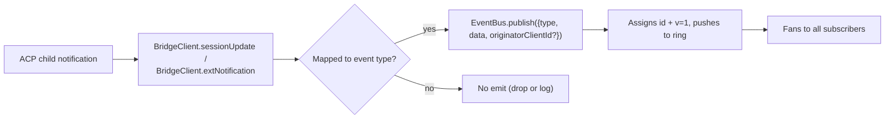
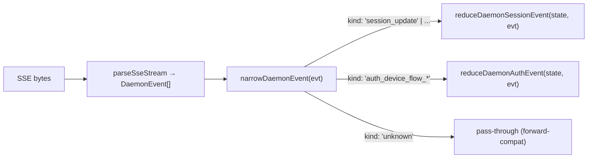

# Typed Daemon Event Schema v1 (English)

## Overview

Every SSE frame the daemon emits on `GET /session/:id/events` carries `{ id, v, type, data, originatorClientId? }`. `v: 1` is the current `EVENT_SCHEMA_VERSION`. `type` is a string from a closed, version-pinned set of **28 known types** declared in `DAEMON_KNOWN_EVENT_TYPE_VALUES` (`packages/sdk-typescript/src/daemon/events.ts:13-63`).

The SDK exposes `narrowDaemonEvent(evt)` which returns a discriminated `KnownDaemonEvent` for any known type or `{ kind: 'unknown' }` for anything else — so SDK consumers handle forward-compat (a newer daemon adding a type) without crashing or pinning their SDK version.

The wire format is documented in [`../qwen-serve-protocol.md`](../qwen-serve-protocol.md); this doc is the per-event payload contract.

## Responsibilities

- Provide a single source of truth for the event vocabulary (the constant array at line 13).
- Provide typed envelopes (`DaemonEventEnvelope<TType, TData>`) for each type.
- Provide pure reducers (`reduceDaemonSessionEvent`, `reduceDaemonAuthEvent`) that project the event stream into SDK view-states.
- Advertise the schema via the `typed_event_schema` capability tag (informational — `narrowDaemonEvent` falls back to `unknown` for daemons that don't advertise it).

## Event vocabulary (28 types)

Grouped by domain.

### Core session

| Type | Direction | Trigger | Payload key fields |
|---|---|---|---|
| `session_update` | S→C | Any ACP `sessionUpdate` notification (agent text, thought, tool call, plan). | `sessionUpdate: string, content?: ...` (opaque ACP shape). |
| `session_metadata_updated` | S→C | `PATCH /session/:id/metadata`. | `sessionId, displayName?`. |
| `session_died` | S→C **terminal** | `channel.exited` fires for any reason. | `sessionId, reason, exitCode? \| null, signalCode? \| null`. |
| `session_closed` | S→C **terminal** | `DELETE /session/:id` or programmatic close. | `sessionId, reason: 'client_close' \| string, closedBy?`. |

### Subscriber-level synthetic

| Type | Trigger | Notes |
|---|---|---|
| `client_evicted` | EventBus per-subscriber queue overflow. **NO `id` field**. | `reason: string, droppedAfter?: number`. Terminal for this subscriber only — the session lives on. |
| `slow_client_warning` | EventBus subscriber queue ≥ 75% (force-push, **NO `id` field**). | `queueSize, maxQueued, lastEventId`. Hysteresis re-arm at 37.5%. |
| `stream_error` | `SubscriberLimitExceededError` or other route-level stream failure. | `error: string`. Terminal for the subscription. |

### Permissions (F3 + base)

| Type | Direction | Trigger | Payload key fields |
|---|---|---|---|
| `permission_request` | S→C | Agent called `requestPermission`. | `requestId, sessionId, toolCall, options[]`. Envelope stamps `originatorClientId` (= prompt originator per F3 N3). |
| `permission_resolved` | S→C | Mediator resolved the request. | `requestId, outcome` (ACP `PermissionOutcome`). |
| `permission_already_resolved` | S→C | Late vote arrived after resolution. | `requestId, sessionId, outcome`. |
| `permission_partial_vote` | S→C | `consensus` policy recorded a non-resolving vote. | `requestId, sessionId, votesReceived, votesNeeded (≥1), quorum, optionTallies: Record<string, number>, originatorClientId?`. |
| `permission_forbidden` | S→C | Vote rejected by policy. | `requestId, sessionId, clientId?, reason: 'designated_mismatch' \| 'remote_not_allowed', originatorClientId?`. Anonymous voters omit `clientId`. |

### Models

| Type | Direction | Payload |
|---|---|---|
| `model_switched` | S→C | `sessionId, modelId`. |
| `model_switch_failed` | S→C | `sessionId, requestedModelId, error: string`. |

### MCP guardrails (PR 14b + F2)

| Type | Direction | Payload |
|---|---|---|
| `mcp_budget_warning` | S→C | `liveCount, reservedCount, budget, thresholdRatio: 0.75, mode: 'warn' \| 'enforce', scope?: 'workspace' \| 'session'`. |
| `mcp_child_refused_batch` | S→C | `refusedServers: [{name, transport, reason: 'budget_exhausted'}], budget, liveCount, reservedCount, mode: 'enforce', scope?: 'workspace' \| 'session'`. |
| `mcp_server_restarted` | S→C | `serverName, durationMs, entryIndex?` (F2 multi-entry). |
| `mcp_server_restart_refused` | S→C | `serverName, reason: 'budget_would_exceed' \| 'in_flight' \| 'disabled', entryIndex?, details?`. |

### Mutation control (Wave 4 PR 16+17)

| Type | Direction | Payload |
|---|---|---|
| `memory_changed` | S→C | `scope: 'workspace' \| 'global', filePath, mode: 'append' \| 'replace', bytesWritten`. |
| `agent_changed` | S→C | `change: 'created' \| 'updated' \| 'deleted', name, level: 'project' \| 'user'`. |
| `approval_mode_changed` | S→C | `sessionId, previous, next, persisted: boolean`. |
| `tool_toggled` | S→C | `toolName, enabled`. (Takes effect on next ACP child spawn; not retroactively enforced on active sessions.) |
| `workspace_initialized` | S→C | `path, action: 'created' \| 'overwritten'`. |

### Auth device flow (PR 21)

These are workspace-keyed (not session-keyed). The session reducer no-ops on them; `reduceDaemonAuthEvent` projects them into a workspace-level state.

| Type | Direction | Payload |
|---|---|---|
| `auth_device_flow_started` | S→C | `deviceFlowId, providerId, expiresAt`. |
| `auth_device_flow_throttled` | S→C | `deviceFlowId, intervalMs`. |
| `auth_device_flow_authorized` | S→C | `deviceFlowId, providerId, expiresAt?, accountAlias?`. |
| `auth_device_flow_failed` | S→C | `deviceFlowId, errorKind, hint?`. |
| `auth_device_flow_cancelled` | S→C | `deviceFlowId`. |

## Architecture

| Concern | File:line | Notes |
|---|---|---|
| `EVENT_SCHEMA_VERSION = 1` | `packages/acp-bridge/src/eventBus.ts:22` | Schema version on every frame. |
| `DAEMON_KNOWN_EVENT_TYPE_VALUES` | `packages/sdk-typescript/src/daemon/events.ts:13-63` | The closed list (length 28). |
| `DaemonEventEnvelope<TType, TData>` | `events.ts:74-78` | Generic envelope. |
| `DaemonKnownEventType` | `events.ts:71-72` | `typeof DAEMON_KNOWN_EVENT_TYPE_VALUES[number]`. |
| Per-event payload types | `events.ts:80+` | One `DaemonXxxData` interface per type. |
| `narrowDaemonEvent(evt)` | `events.ts` | Returns `KnownDaemonEvent \| { kind: 'unknown', value: DaemonEvent }`. |
| `reduceDaemonSessionEvent(state, evt)` | `events.ts` | Projects to `DaemonSessionViewState`. |
| `reduceDaemonAuthEvent(state, evt)` | `events.ts` | Projects auth-flow events to `DaemonAuthState`. |
| `isWorkspaceScopedBudgetEvent(evt)` | `events.ts` | Helper to branch on F2 `scope: 'workspace'`. |

### `DaemonSessionViewState`

Populated by `reduceDaemonSessionEvent` and consumed by the CLI TUI adapter, channels' `DaemonChannelBridge`, the VSCode IDE companion, etc. Critical fields:

- `messages: HistoryItem[]` — derived from `session_update`.
- `pendingPermissionRequests: PermissionRequestData[]` — current open requests; cleared on `permission_resolved` / `permission_already_resolved` / `permission_forbidden` for self / cancel.
- `latestPermissionResolution?: PermissionOutcome` — most recent terminal outcome.
- `currentModelId?: string` — from `model_switched`.
- `lastModelSwitchError?: string` — from `model_switch_failed`.
- `mcpBudgetWarningCount: number`, `lastMcpBudgetWarning?: DaemonMcpBudgetWarningData` — from `mcp_budget_warning`.
- `mcpChildRefusedBatchCount: number`, `lastMcpChildRefusedBatch?: DaemonMcpChildRefusedBatchData` — from `mcp_child_refused_batch`.
- `mcpRestartHistory[]` — from `mcp_server_restarted` / `mcp_server_restart_refused`.
- `terminal?: { kind, reason, ... }` — from any terminal frame.

### `DaemonAuthState`

One entry per `providerId` driven by the `auth_device_flow_*` events. The shape exposes per-flow `{deviceFlowId, status, providerId, expiresAt?, lastThrottleIntervalMs?, lastError?}`.

## Workflow

### Producer side

### Consumer side (SDK)

## F4-prereq additions on `daemon_mode_b_main` (heads-up)

Three commits on `daemon_mode_b_main` shift the wire shape additively and are coming to this branch. None of them break v1; SDK consumers that already implement the forward-compat rule below will keep working.

- **`state_resync_required`** (commit `c1a2f0a78`) — **29th** known event type, synthetic terminal frame, no `id`. Fired in `EventBus.subscribe()`'s replay path when the requested `lastEventId` is below the ring's earliest available id (replay would silently miss events). Payload: `{ reason: 'ring_evicted', lastDeliveredId, earliestAvailableId }`. Receiving it means: stop applying deltas, call `POST /session/:id/load` for a full snapshot, then resubscribe.
- **`_meta.serverTimestamp`** (commit `14637cd79`) — envelope-level field stamped at `formatSseFrame()` in `server.ts` (NOT at `EventBus.publish`, so the in-memory `BridgeEvent` type stays unchanged and internal consumers don't see `_meta`). Lets multi-client UIs sort transcript by daemon-wall-clock instead of per-client local clock — drifts of tens-of-seconds to minutes across browsers/tabs/mobile previously produced visibly inconsistent timestamps. Pre-existing `_meta` keys (e.g. tool_call's `_meta.toolName`) are preserved via spread merge.
- **`tool_call.provenance` + `tool_call.serverId`** (commit `14637cd79`) — `provenance: 'builtin' \| 'mcp' \| 'subagent'`, `serverId?: string` (only set for `mcp`). Stamped on `ToolCallEmitter.emit{Start, Result, Error}`. Subagent takes precedence (set when `subagentMeta` is present); `mcp__<server>__<tool>` naming heuristic classifies MCP with serverId; everything else is builtin.
- **`errorKind`** (commit `14637cd79`) — top-level envelope field (separate from the existing `auth_device_flow_failed.errorKind`). Maps to the closed `FsErrorKind` / `DaemonErrorKind` unions so UIs can dispatch on enum value instead of regex-on-message.

## State & Forward Compatibility

- Adding a new known event type → append to `DAEMON_KNOWN_EVENT_TYPE_VALUES`. Old SDKs see it as `kind: 'unknown'` and ignore it. New SDKs typecheck against the discriminated union.
- Adding a new optional field to an existing payload → safe; payloads are `{ [key: string]: unknown }` open.
- Changing the **shape** of an existing payload → breaking; would require bumping `EVENT_SCHEMA_VERSION` and gating on `caps.features.typed_event_schema_v2`.
- The `id` field is per-session monotonic and absent on synthetic terminal frames (`client_evicted`, `slow_client_warning`, `stream_error`) so other subscribers don't see gaps in the sequence.
- `originatorClientId` is on the envelope, not in `data`. F3 partial-vote / forbidden payloads also stamp it on `data` (via `mergeOriginator`) so view-state consumers can attribute without retaining the envelope.

## Dependencies

- [`10-event-bus.md`](./10-event-bus.md) — the delivery channel.
- [`11-capabilities-versioning.md`](./11-capabilities-versioning.md) — how SDK clients pre-flight the `typed_event_schema`, `mcp_guardrail_events`, `permission_mediation` tags.
- [`04-permission-mediation.md`](./04-permission-mediation.md) — how the permission events are produced.
- [`13-sdk-daemon-client.md`](./13-sdk-daemon-client.md) — `narrowDaemonEvent`, the reducers, and the view-state shape.

## Configuration

- Capability tags advertised to clients: `typed_event_schema` (always), `mcp_guardrail_events` (always), `permission_mediation` (always; `modes` enumerates supported policies).
- No env vars or flags gate the schema directly; the kill-switch `QWEN_SERVE_NO_MCP_POOL=1` flips the `scope` field of MCP events from `'workspace'` to (absent / `'session'`).

## Caveats & Known Limits

- Three synthetic frames omit `id` deliberately; SDK code must not assume every event has an id.
- `permission_partial_vote` only fires under `consensus`; `permission_forbidden` fires under `designated`, `consensus`, and `local-only`. Don't depend on either under `first-responder`.
- `mcp_child_refused_batch` only fires under `mode: 'enforce'`; `warn` mode never refuses.
- `auth_device_flow_*` events are NOT session-keyed; if you consume them through `DaemonSessionClient`, you must route them through `reduceDaemonAuthEvent`, not the session reducer.

## References

- `packages/sdk-typescript/src/daemon/events.ts` (entire file)
- `packages/acp-bridge/src/eventBus.ts:22` (`EVENT_SCHEMA_VERSION`)
- `packages/cli/src/serve/capabilities.ts:60` (`typed_event_schema` tag), `:110` (`mcp_guardrail_events`), `:211-214` (`permission_mediation`).
- Wire reference: [`../qwen-serve-protocol.md`](../qwen-serve-protocol.md).

---

# Typed Daemon Event Schema v1 (中文)

## 概览

daemon 在 `GET /session/:id/events` 上发的每一帧 SSE 都形如 `{ id, v, type, data, originatorClientId? }`，`v: 1` 是当前 `EVENT_SCHEMA_VERSION`。`type` 取自一个封闭的、版本固定的集合 —— `DAEMON_KNOWN_EVENT_TYPE_VALUES`（`packages/sdk-typescript/src/daemon/events.ts:13-63`）共 **28 种**。

SDK 暴露 `narrowDaemonEvent(evt)`，对已知 type 返回一个判别式 `KnownDaemonEvent`，对其他 type 返回 `{ kind: 'unknown' }` —— SDK 消费方无需固定 SDK 版本就能处理向前兼容（更新的 daemon 加了新 type 也不会崩）。

wire 格式见 [`../qwen-serve-protocol.md`](../qwen-serve-protocol.md)，本文是每个事件的 payload 契约。

## 职责

- 提供事件词汇表的唯一事实来源（line 13 那个常量数组）。
- 提供每种 type 的 typed envelope（`DaemonEventEnvelope<TType, TData>`）。
- 提供纯 reducer（`reduceDaemonSessionEvent`、`reduceDaemonAuthEvent`），把事件流投影成 SDK view-state。
- 通过 `typed_event_schema` 能力 tag 广播（信息性 —— 不广播时 `narrowDaemonEvent` 仍 fallback 到 `unknown`）。

## 事件词汇表（28 种）

按域分组。

### Core session

| Type | 方向 | 触发 | Payload 关键字段 |
|---|---|---|---|
| `session_update` | S→C | 任意 ACP `sessionUpdate` 通知（agent text / thought / tool call / plan） | `sessionUpdate: string, content?: ...`（不透明 ACP shape） |
| `session_metadata_updated` | S→C | `PATCH /session/:id/metadata` | `sessionId, displayName?` |
| `session_died` | S→C **终态** | `channel.exited` 触发 | `sessionId, reason, exitCode? \| null, signalCode? \| null` |
| `session_closed` | S→C **终态** | `DELETE /session/:id` 或程序化关闭 | `sessionId, reason: 'client_close' \| string, closedBy?` |

### Subscriber 级合成帧

| Type | 触发 | 备注 |
|---|---|---|
| `client_evicted` | EventBus 每订阅者队列溢出。**无 `id`** | `reason: string, droppedAfter?: number`；只对当前订阅者终态，session 还活着 |
| `slow_client_warning` | 队列 ≥ 75%（force-push，**无 `id`**） | `queueSize, maxQueued, lastEventId`；37.5% 滞回 re-arm |
| `stream_error` | `SubscriberLimitExceededError` 或其他路由流错 | `error: string`；订阅终态 |

### Permissions（F3 + base）

| Type | 方向 | 触发 | Payload 关键字段 |
|---|---|---|---|
| `permission_request` | S→C | agent 调 `requestPermission` | `requestId, sessionId, toolCall, options[]`；envelope 盖 `originatorClientId`（= prompt originator，F3 N3） |
| `permission_resolved` | S→C | mediator 已裁决 | `requestId, outcome`（ACP `PermissionOutcome`） |
| `permission_already_resolved` | S→C | 已裁决后投票才到 | `requestId, sessionId, outcome` |
| `permission_partial_vote` | S→C | `consensus` 策略记录了一次不裁决的投票 | `requestId, sessionId, votesReceived, votesNeeded (≥1), quorum, optionTallies: Record<string, number>, originatorClientId?` |
| `permission_forbidden` | S→C | 投票被策略拒绝 | `requestId, sessionId, clientId?, reason: 'designated_mismatch' \| 'remote_not_allowed', originatorClientId?`；匿名投票者无 `clientId` |

### Models

| Type | 方向 | Payload |
|---|---|---|
| `model_switched` | S→C | `sessionId, modelId` |
| `model_switch_failed` | S→C | `sessionId, requestedModelId, error: string` |

### MCP guardrails（PR 14b + F2）

| Type | 方向 | Payload |
|---|---|---|
| `mcp_budget_warning` | S→C | `liveCount, reservedCount, budget, thresholdRatio: 0.75, mode: 'warn' \| 'enforce', scope?: 'workspace' \| 'session'` |
| `mcp_child_refused_batch` | S→C | `refusedServers: [{name, transport, reason: 'budget_exhausted'}], budget, liveCount, reservedCount, mode: 'enforce', scope?: 'workspace' \| 'session'` |
| `mcp_server_restarted` | S→C | `serverName, durationMs, entryIndex?`（F2 多 entry） |
| `mcp_server_restart_refused` | S→C | `serverName, reason: 'budget_would_exceed' \| 'in_flight' \| 'disabled', entryIndex?, details?` |

### Mutation control（Wave 4 PR 16+17）

| Type | 方向 | Payload |
|---|---|---|
| `memory_changed` | S→C | `scope: 'workspace' \| 'global', filePath, mode: 'append' \| 'replace', bytesWritten` |
| `agent_changed` | S→C | `change: 'created' \| 'updated' \| 'deleted', name, level: 'project' \| 'user'` |
| `approval_mode_changed` | S→C | `sessionId, previous, next, persisted: boolean` |
| `tool_toggled` | S→C | `toolName, enabled`（下次 ACP child spawn 才生效，不会回溯改动已在跑的 session） |
| `workspace_initialized` | S→C | `path, action: 'created' \| 'overwritten'` |

### Auth device flow（PR 21）

这些是 workspace-keyed 不是 session-keyed。session reducer 对它们 no-op；`reduceDaemonAuthEvent` 投到 workspace-level state。

| Type | 方向 | Payload |
|---|---|---|
| `auth_device_flow_started` | S→C | `deviceFlowId, providerId, expiresAt` |
| `auth_device_flow_throttled` | S→C | `deviceFlowId, intervalMs` |
| `auth_device_flow_authorized` | S→C | `deviceFlowId, providerId, expiresAt?, accountAlias?` |
| `auth_device_flow_failed` | S→C | `deviceFlowId, errorKind, hint?` |
| `auth_device_flow_cancelled` | S→C | `deviceFlowId` |

## 架构

| 关注点 | 文件:行 | 说明 |
|---|---|---|
| `EVENT_SCHEMA_VERSION = 1` | `packages/acp-bridge/src/eventBus.ts:22` | 每帧带 |
| `DAEMON_KNOWN_EVENT_TYPE_VALUES` | `packages/sdk-typescript/src/daemon/events.ts:13-63` | 封闭列表（长 28） |
| `DaemonEventEnvelope<TType, TData>` | `events.ts:74-78` | 泛型 envelope |
| `DaemonKnownEventType` | `events.ts:71-72` | `typeof DAEMON_KNOWN_EVENT_TYPE_VALUES[number]` |
| 各事件 payload 类型 | `events.ts:80+` | 每种 type 一个 `DaemonXxxData` interface |
| `narrowDaemonEvent(evt)` | `events.ts` | 返回 `KnownDaemonEvent \| { kind: 'unknown', value: DaemonEvent }` |
| `reduceDaemonSessionEvent(state, evt)` | `events.ts` | 投到 `DaemonSessionViewState` |
| `reduceDaemonAuthEvent(state, evt)` | `events.ts` | 投到 `DaemonAuthState` |
| `isWorkspaceScopedBudgetEvent(evt)` | `events.ts` | 判别 F2 `scope: 'workspace'` |

### `DaemonSessionViewState`

`reduceDaemonSessionEvent` 填充，CLI TUI adapter、`DaemonChannelBridge`、VSCode IDE 都消费。关键字段：

- `messages: HistoryItem[]` — 由 `session_update` 派生。
- `pendingPermissionRequests: PermissionRequestData[]` — 当前打开的请求；`permission_resolved` / `permission_already_resolved` / 对自身的 `permission_forbidden` / cancel 时清掉。
- `latestPermissionResolution?: PermissionOutcome`。
- `currentModelId?: string` — 由 `model_switched`。
- `lastModelSwitchError?: string` — 由 `model_switch_failed`。
- `mcpBudgetWarningCount`、`lastMcpBudgetWarning?` — 由 `mcp_budget_warning`。
- `mcpChildRefusedBatchCount`、`lastMcpChildRefusedBatch?` — 由 `mcp_child_refused_batch`。
- `mcpRestartHistory[]` — 由 `mcp_server_restarted` / `mcp_server_restart_refused`。
- `terminal?: { kind, reason, ... }` — 任何终态帧。

### `DaemonAuthState`

按 `providerId` 一项，由 `auth_device_flow_*` 驱动。每个 flow 暴露 `{deviceFlowId, status, providerId, expiresAt?, lastThrottleIntervalMs?, lastError?}`。

## 流程

### Producer 端

> 见英文版 producer flowchart。

### Consumer 端（SDK）

> 见英文版 consumer flowchart。

## `daemon_mode_b_main` 上即将到来的 F4 prereq（提醒）

`daemon_mode_b_main` 上有三个 commit 以**纯加法**方式调整 wire shape，即将合到本分支。它们都不破 v1；已经按下面向前兼容规则实现的 SDK 消费方继续工作。

- **`state_resync_required`**（commit `c1a2f0a78`）—— 第 **29** 种已知事件类型，合成终态帧，**无 `id`**。在 `EventBus.subscribe()` 的重放路径上发现请求的 `lastEventId` 低于环最早可用 id（重放会默默漏事件）时强推。Payload：`{ reason: 'ring_evicted', lastDeliveredId, earliestAvailableId }`。收到它的意思是：停止 apply delta，调 `POST /session/:id/load` 拿完整快照，再重新订阅。
- **`_meta.serverTimestamp`**（commit `14637cd79`）—— envelope 级字段，在 `server.ts` 的 `formatSseFrame()` 边界盖（**不**在 `EventBus.publish`，保留内存里 `BridgeEvent` 类型不变，内部消费方不见 `_meta`）。多客户端 UI 可以按 daemon wall-clock 排序 transcript 块，而不是按各客户端本地时钟 —— 之前各浏览器/标签页/手机时钟漂几十秒到几分钟，多端时间戳明显不一致。已有的 `_meta` 键（如 tool_call 的 `_meta.toolName`）通过 spread merge 保留。
- **`tool_call.provenance` + `tool_call.serverId`**（commit `14637cd79`）—— `provenance: 'builtin' \| 'mcp' \| 'subagent'`，`serverId?: string`（仅 `mcp` 时设）。在 `ToolCallEmitter.emit{Start, Result, Error}` 上盖。subagent 优先（有 `subagentMeta` 时设）；`mcp__<server>__<tool>` 命名启发把 MCP 归类并带 serverId；其它都算 builtin。
- **`errorKind`**（commit `14637cd79`）—— 顶层 envelope 字段（与已有的 `auth_device_flow_failed.errorKind` 不同）。映射封闭 `FsErrorKind` / `DaemonErrorKind` 联合，UI 可以按枚举值 dispatch 而不是 regex-on-message。

## 状态与向前兼容

- 新增已知 type → append 到 `DAEMON_KNOWN_EVENT_TYPE_VALUES`。老 SDK 看到 `kind: 'unknown'` 直接忽略；新 SDK 依赖判别式联合类型。
- 给已有 payload 加可选字段 → 安全（`{ [key: string]: unknown }` 是开的）。
- 改已有 payload 的**形状** → break；必须 bump `EVENT_SCHEMA_VERSION` 并依赖 `caps.features.typed_event_schema_v2` 之类的能力 tag 兼容。
- `id` 是每 session 单调，合成终态帧（`client_evicted`、`slow_client_warning`、`stream_error`）刻意无 id，防止其他订阅者看到序号断档。
- `originatorClientId` 在 envelope 而非 `data`。F3 的 partial-vote / forbidden payload 同时也把它盖到 `data`（`mergeOriginator`），view-state 消费方就不必保留 envelope。

## 依赖

- [`10-event-bus.md`](./10-event-bus.md) — 投递通道。
- [`11-capabilities-versioning.md`](./11-capabilities-versioning.md) — SDK 怎么 pre-flight `typed_event_schema`、`mcp_guardrail_events`、`permission_mediation` tag。
- [`04-permission-mediation.md`](./04-permission-mediation.md) — 权限事件怎么产出。
- [`13-sdk-daemon-client.md`](./13-sdk-daemon-client.md) — `narrowDaemonEvent`、reducer、view-state 形状。

## 配置

- 默认广播：`typed_event_schema`（恒）、`mcp_guardrail_events`（恒）、`permission_mediation`（恒，`modes` 列出支持策略）。
- 没有 env / 参数直接控制 schema 本身；杀手锏 `QWEN_SERVE_NO_MCP_POOL=1` 会让 MCP 事件的 `scope` 字段从 `'workspace'` 变成 缺失 / `'session'`。

## 注意 & 已知局限

- 三种合成帧故意无 `id`，SDK 代码不能假设每个事件都有 id。
- `permission_partial_vote` 只在 `consensus` 下出现；`permission_forbidden` 在 `designated` / `consensus` / `local-only` 下出现，**不在** `first-responder` 下出现。
- `mcp_child_refused_batch` 只在 `mode: 'enforce'` 下出现，`warn` 模式从不拒绝。
- `auth_device_flow_*` 事件不是 session-keyed；通过 `DaemonSessionClient` 消费时必须走 `reduceDaemonAuthEvent`，不要走 session reducer。

## 参考

- `packages/sdk-typescript/src/daemon/events.ts`（整文件）
- `packages/acp-bridge/src/eventBus.ts:22`（`EVENT_SCHEMA_VERSION`）
- `packages/cli/src/serve/capabilities.ts:60`（`typed_event_schema`）、`:110`（`mcp_guardrail_events`）、`:211-214`（`permission_mediation`）。
- wire 参考：[`../qwen-serve-protocol.md`](../qwen-serve-protocol.md)。
