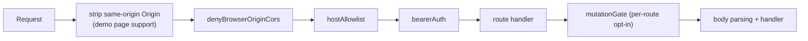
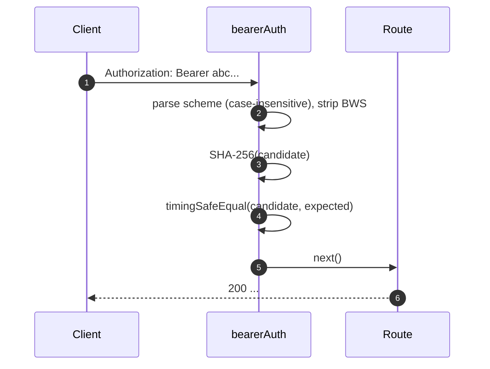
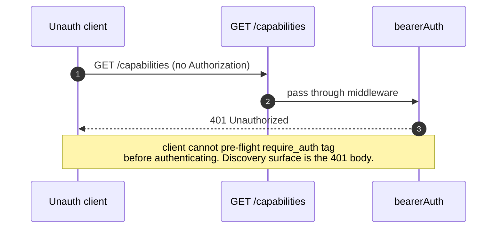
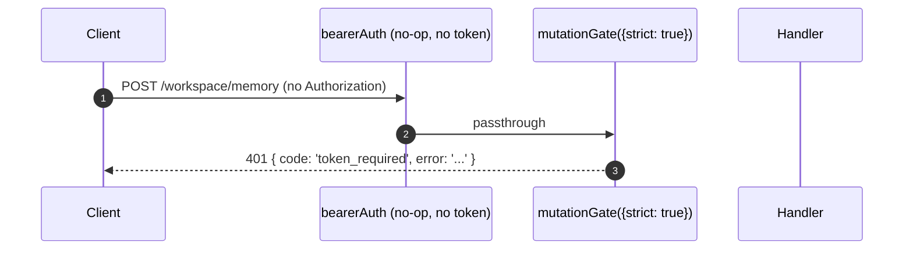

# Auth & Security Model

## Overview

`qwen serve` is a local daemon by default and an exposed surface in the wrong configuration. Its security model is **layered** so that misconfiguration fails closed:

1. **Bind** — non-loopback bind without a bearer token **refuses to start**.
2. **Bearer auth** — `bearerAuth` middleware with constant-time SHA-256 compare protects every route except `/health` on loopback (`require_auth` extends this to loopback and `/health` too).
3. **Host header allowlist** — on loopback, only `localhost`, `127.0.0.1`, `[::1]`, `host.docker.internal` (plus port) are accepted; defense against DNS rebinding.
4. **Origin deny** — any request carrying an `Origin` header is `403`'d. CLI / SDK never send `Origin`; only browsers do.
5. **Per-route mutation gate** — Wave 4 mutating routes can opt-in to "401 even on loopback no-token defaults" with a distinct `code: 'token_required'` error.
6. **Device-flow auth** — separate OAuth surface for providers (`POST /workspace/auth/device-flow` + GET/DELETE on `/:id`).

This doc walks through each layer and the explicit invariants the boot path enforces.

## Responsibilities

- Refuse to boot in unsafe configurations.
- Gate every HTTP request through bearer (when configured) + host (loopback) + origin checks.
- Provide a per-route mutation gate Wave 4 routes opt into.
- Host the device-flow registry that drives provider OAuth flows visible via SSE events.

## Architecture

### Boot-time refuse rules

In `runQwenServe.ts`:

```ts
if (!isLoopbackBind(opts.hostname) && !token) {
  throw new Error('Refusing to bind <host>:<port> without a bearer token. ...');
}
if (opts.requireAuth && !token) {
  throw new Error(
    'Refusing to start with --require-auth set but no bearer token configured. ...',
  );
}
```

Both refusals are boot-loud (visible in stderr / thrown to the embedder), never silent. The threat model from #3803 explicitly forbids silently letting a daemon bind beyond loopback in the open.

### Middleware chain (HTTP request order)



(`mutationGate` is applied as per-route middleware so it can be `strict: true` selectively. See `packages/cli/src/serve/auth.ts:1-294`.)

### `bearerAuth`

- **No token configured** → middleware is a no-op (loopback developer default).
- **Token configured** → SHA-256 the configured token once at construction; on every request hash the candidate and `timingSafeEqual` compare. No string-equality short-circuit; no time-leak.
- **Scheme parsing**: case-insensitive `Bearer` per RFC 7235 §2.1; tolerant of `SP\tHTAB` between scheme and credentials per RFC 7230 §3.2.6 BWS; rejects pure-HTAB-as-separator.
- **CodeQL hardening**: hand-rolled `indexOf` parsing rather than regex with `\s+` / `.+` overlap (no polynomial-regex risk).

### `hostAllowlist`

Loopback-only. Maintains a `Set<string>` keyed by port. Allowed Hosts:

- `localhost:<port>`, `127.0.0.1:<port>`, `[::1]:<port>`, `host.docker.internal:<port>`.
- Plus no-port forms (`localhost`, `127.0.0.1`, `[::1]`, `host.docker.internal`) **only** when bound to port 80 (per RFC 7230 §5.4 default-port omission).

Host comparison is **case-insensitive** — Express normalizes header names but not values, so Docker proxies that capitalize Hosts (`Localhost:4170`, `HOST.docker.internal`) would 403 with an exact-string compare.

Non-loopback binds bypass this middleware (operator chose the surface area; bearer token gates Host spoofing instead).

### `denyBrowserOriginCors`

Reject any request with an `Origin` header. CLI/SDK never set Origin; only browsers do. Returns deterministic `403 { error: 'Request denied by CORS policy' }` rather than the 500 HTML the `cors` package's error-callback would produce.

Exception: the demo page's same-origin XHRs are handled by a separate middleware (in `server.ts`) that strips `Origin` when it matches the daemon's own address.

### `createMutationGate`

Per-route opt-in gate. Behavior matrix:

| daemon config           | route opts      | result                           |
| ----------------------- | --------------- | -------------------------------- |
| `requireAuth=true`      | any             | passthrough¹                     |
| `token` configured      | any             | passthrough²                     |
| no token (loopback dev) | `strict: false` | passthrough                      |
| no token (loopback dev) | `strict: true`  | `401 { code: 'token_required' }` |

¹ `--require-auth` boots only with a token, so global `bearerAuth` already 401'd unauthenticated callers.
² Any token configuration makes global `bearerAuth` enforce bearer-required-everywhere; the gate is redundant but harmless.

The `code: 'token_required'` shape is distinct from `bearerAuth`'s plain `Unauthorized` so SDK clients can render a "configure --token / --require-auth" hint instead of a generic 401.

**Wave 4 strict routes**: `/workspace/memory`, `/workspace/agents/*`, `/file/write`, `/file/edit`, `/workspace/tools/:name/enable`, `/workspace/mcp/:server/restart`, `/workspace/auth/device-flow`, `/workspace/init`, `/session/:id/approval-mode`.

### `/health` exemption

On loopback binds, `/health` is registered **before** the bearer middleware so liveness probes inside the pod don't need to carry the token. Non-loopback binds gate `/health` behind bearer like every other route. `--require-auth` drops the exemption: `/health` requires `Authorization: Bearer <token>` on loopback too.

### Device-flow auth

Separate OAuth surface for provider authentication (Qwen OAuth, etc.):

- `POST /workspace/auth/device-flow` — start a flow; returns `{deviceFlowId, providerId, expiresAt, verificationUrl, userCode}`.
- `GET /workspace/auth/device-flow/:id` — poll state.
- `DELETE /workspace/auth/device-flow/:id` — cancel.
- `GET /workspace/auth/status` — current account / provider snapshot.

SSE events `auth_device_flow_{started, throttled, authorized, failed, cancelled}` fan-out flow state to all subscribers so multi-client UIs stay in sync. See [`09-event-schema.md`](./09-event-schema.md).

Implementation: `packages/cli/src/serve/auth/deviceFlow.ts` + `qwenDeviceFlowProvider.ts`.

The `auth_device_flow` capability tag is advertised **unconditionally**; the routes themselves return `400 unsupported_provider` if the daemon can't satisfy a specific provider. The supported-providers list is on `/workspace/auth/status` rather than `/capabilities` to keep the descriptor shape uniform.

## Workflow

### Bearer auth happy path



### Bearer auth failure modes

All return `401 { error: 'Unauthorized' }` (uniform across `missing header` / `wrong scheme` / `wrong token` so probing can't distinguish).

### `--require-auth` shadow



After authenticating, `caps.features.includes('require_auth')` confirms the deployment is hardened.

### Wave-4 mutation gate on no-token loopback



## State & Lifecycle

- Bearer token is read at boot and trimmed (newlines from `cat token.txt` would otherwise silently break comparison).
- Allowed-Host Set is cached per port; rebuilt on port change (ephemeral `0` → real port post-`listen`).
- Mutation gate constructs `passthrough` and `strictDenier` once per app build; per-route call returns the cached closure (no per-request allocation).
- Device-flow registry is disposed on `shutdown()` Phase 1 so pending flows resolve as `cancelled` before HTTP teardown.

## Dependencies

- `node:crypto` — `createHash`, `timingSafeEqual`.
- `packages/cli/src/serve/loopbackBinds.ts` — `isLoopbackBind`.
- `packages/cli/src/serve/auth/deviceFlow.ts` — device-flow state machine.
- `@qwen-code/acp-bridge` — surfaces device-flow events on the per-session SSE bus.

## Configuration

| Source          | Knob                                                      | Effect                                                                  |
| --------------- | --------------------------------------------------------- | ----------------------------------------------------------------------- |
| Env             | `QWEN_SERVER_TOKEN`                                       | Bearer token (trimmed).                                                 |
| Flag            | `--token`                                                 | Bearer token (overrides env).                                           |
| Flag            | `--require-auth`                                          | Extends bearer to loopback + `/health`. Boots only with a token.        |
| Flag            | `--hostname`                                              | Non-loopback bind requires `--token` (or env).                          |
| Capability tags | `require_auth` (conditional), `auth_device_flow` (always) | See [`11-capabilities-versioning.md`](./11-capabilities-versioning.md). |

## Caveats & Known Limits

- **`--require-auth` shadows feature pre-flight.** Unauthenticated clients can't discover the `require_auth` tag; their discovery surface is the 401 body itself.
- **Mutation gate body-parser ordering**: `mutationGate({strict: true})` 401s fire **after** `express.json()` parses the body. Worst case on a saturated loopback listener: `--max-connections × express.json({limit: '10mb'})` ≈ 2.5 GB transient. Loopback-only attack surface, intentionally accepted.
- **Same-origin Origin stripping** in `server.ts` happens _before_ `denyBrowserOriginCors`. If a future change moves the strip elsewhere, the demo page breaks.
- **Token comparison is over the SHA-256 digest**, not the raw token. Reduces timing leakage by collapsing variable-length token compares to a fixed-size digest compare.
- The daemon does **not** carry mTLS, request signing, or per-client rate limiting today. Those are F-series Wave 5+ items.

## References

- `packages/cli/src/serve/auth.ts:1-294` (entire file)
- `packages/cli/src/serve/runQwenServe.ts:341-360` (refuse rules)
- `packages/cli/src/serve/loopbackBinds.ts`
- `packages/cli/src/serve/auth/deviceFlow.ts`
- `packages/cli/src/serve/auth/qwenDeviceFlowProvider.ts`
- User-facing threat model: [`../../users/qwen-serve.md`](../../users/qwen-serve.md).
- Wire reference: [`../qwen-serve-protocol.md`](../qwen-serve-protocol.md).
