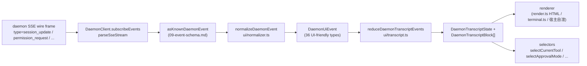

# 共享 UI Transcript 层

> **当前状态**：`packages/cli/src/ui/daemon/DaemonTuiAdapter.ts` 仍在 main，作为 CLI 侧 legacy 实验适配器存在。本文介绍的「共享 UI Transcript 层」是 SDK 侧的新复用层：任何 UI 宿主（Web、TUI、IDE、IM 渠道）都可消费同一套 daemon 事件归一与转录原语。CLI TUI、channel、VSCode IDE 的迁移会在后续 PR 落地。

## 概览

`packages/sdk-typescript/src/daemon/ui/` 是 SDK 新增的 `ui/*` 子包，把「daemon SSE 事件 → UI 可渲染 transcript blocks」这条变换链做成可复用原语：

- **归一化层** (`normalizer.ts`)：把 daemon wire 上 43 种 known event（详见 [`09-event-schema.md`](./09-event-schema.md)）映射成 UI 友好的 `DaemonUiEventType`（36 种语义事件，命名风格 `assistant.text.delta` / `tool.update` / `session.metadata.changed`）。
- **状态机** (`transcript.ts`, `store.ts`)：纯函数 reducer + 可订阅 store，把 UI 事件流投到一个有序的 `DaemonTranscriptBlock[]`。
- **渲染器** (`render.ts`, `terminal.ts`, `toolPreview.ts`)：transcript blocks → HTML / 终端字符 / tool preview 字符串。宿主可挑用。
- **conformance** (`conformance.ts`)：跨宿主一致性测试套件，channel / TUI / IDE 迁移到这套时用来确保渲染等价。

第一个真实消费方是 **`packages/webui/src/daemon/`**（[#4328](https://github.com/QwenLM/qwen-code/pull/4328)）—— React `DaemonSessionProvider` + transcriptAdapter，把 webui 从「只渲染 host postMessage」升级成可以直接接 daemon HTTP+SSE 的前端。CLI TUI、channel base、VSCode IDE 后续会复用这套（[`../daemon-ui/MIGRATION.md`](../daemon-ui/MIGRATION.md) 列出了 v2 增量适配指南）。

## 职责

- 把 43 种 daemon wire event 归一成稳定 UI 词汇（`DaemonUiEventType`），让 renderer 不再去读 `rawEvent.data`。
- 维护 daemon-monotonic SSE 游标（`eventId`）作为**主排序键**，多端 transcript 同序。
- 用纯 reducer 投到 transcript block 列表（带 selectors 拿 pending permission / current tool / approval mode / tool progress 等）。
- 提供 HTML 与终端两种基线渲染（宿主可自定义）。
- 暴露 `DAEMON_PLAN_TOOL_CALL_ID` 等公开常量供宿主拼计划面板。
- 与 wire 层保持加法语义：未知 type → 归一为 `debug` 事件，永不丢。

## 架构

### 包结构

| 文件                                             | 暴露                                                                                                                                                                      | 用途                      |
| ------------------------------------------------ | ------------------------------------------------------------------------------------------------------------------------------------------------------------------------- | ------------------------- |
| `packages/sdk-typescript/src/daemon/ui/index.ts` | 子包 barrel                                                                                                                                                               | 唯一公开入口              |
| `ui/types.ts`                                    | `DaemonUiEventType`、`DaemonUiEvent*`（按 type 一类一 interface）、`DaemonTranscriptBlock`、`DaemonTranscriptState`、`DaemonUiToolProvenance`、`DAEMON_PLAN_TOOL_CALL_ID` | 全部类型                  |
| `ui/normalizer.ts`                               | `normalizeDaemonEvent(evt) → DaemonUiEvent`、`getSessionUpdatePayload(evt)`                                                                                               | wire → UI 词汇映射        |
| `ui/transcript.ts`                               | `createDaemonTranscriptState()`、`appendLocalUserTranscriptMessage()`、`reduceDaemonTranscriptEvents()`、`rebuildDaemonTranscriptBlockIndex()`、selectors（见下）         | 状态机 + 选择器           |
| `ui/store.ts`                                    | `createDaemonTranscriptStore(initial?)`                                                                                                                                   | 可订阅 store 封装 reducer |
| `ui/toolPreview.ts`                              | `createDaemonToolPreview(toolEvent)`                                                                                                                                      | tool call summary 文案    |
| `ui/render.ts`                                   | `DaemonHtmlRenderOptions`、`DaemonRenderOptions` 加渲染函数                                                                                                               | HTML / 通用渲染           |
| `ui/terminal.ts`                                 | terminal 专用渲染                                                                                                                                                         | 给 TUI 准备               |
| `ui/conformance.ts`                              | 跨宿主一致性测试套件                                                                                                                                                      | 迁移老 adapter 时用       |
| `ui/utils.ts`                                    | `DaemonUiContentPart` 等辅助                                                                                                                                              | 内部公用                  |

### `DaemonUiEventType` 词汇（36 种）

来自 `ui/types.ts`。按域分组：

**Chat-stream（Stage 1）**

- `user.text.delta`、`user.image.delta`、`user.shell.command`、`assistant.text.delta`、`assistant.done`、`thought.text.delta`
- `tool.update`、`shell.output`、`user.shell.output`
- `permission.request`、`permission.resolved`
- `model.changed`、`status`、`error`、`debug`

**Session-meta**

- `session.metadata.changed`、`session.approval_mode.changed`
- `session.available_commands`、`session.state_resync_required`、`session.replay_complete`

**Prompt lifecycle（跨客户端）**

- `prompt.cancelled`、`followup.suggestion`

**Workspace（Wave 3-4）**

- `workspace.memory.changed`、`workspace.agent.changed`
- `workspace.tool.toggled`、`workspace.settings.changed`、`workspace.initialized`
- `workspace.mcp.budget_warning`、`workspace.mcp.child_refused`
- `workspace.mcp.server_restarted`、`workspace.mcp.server_restart_refused`

**Auth flow（Wave 4 OAuth）**

- `auth.device_flow.started`、`auth.device_flow.throttled`、`auth.device_flow.authorized`
- `auth.device_flow.failed`、`auth.device_flow.cancelled`

`normalizeDaemonEvent` 把 daemon wire 上的 43 种 known event（见 [`09-event-schema.md`](./09-event-schema.md)）映射进来；未知、未建模或 malformed 的 type 归一为 `debug`，保留 `rawEvent` 给宿主诊断。

### Reducer / selectors

```ts
// 创建初态
const state = createDaemonTranscriptState();

// 应用 SSE 事件序列
const next = reduceDaemonTranscriptEvents(state, daemonUiEvents);

// selectors
selectTranscriptBlocks(state); // 全部 blocks
selectTranscriptBlocksOrderedByEventId(state); // 按 eventId 排序（推荐主键）
selectPendingPermissionBlocks(state);
selectCurrentTool(state);
selectApprovalMode(state);
selectToolProgress(state, toolCallId);
selectSubagentChildBlocks(state, parentBlockId);
isSubagentChildBlock(block);
formatBlockTimestamp(block.clientReceivedAt);
formatMissedRange(state); // state_resync_required 后的 "you missed X" 文案
```

### Store

`createDaemonTranscriptStore()` 提供订阅 / 派发：

```ts
const store = createDaemonTranscriptStore();
store.subscribe(() => render(store.getState()));
store.dispatch(uiEvents); // 内部走 reducer
```

webui 的 `DaemonSessionProvider` 就是基于它实现 React Context（详见下面「消费方」一节）。

## 流程

### 单条 SSE 事件的端到端



宿主可以选在 `(E)` 落地（自己写 reducer），也可以接 `(G)` 用现成 selectors。webui 走完整 `(B)→(H)`，TUI 迁移后可能在 `(G)` 接自己的 Ink renderer。

### 与 `state_resync_required` 的配合

`session.state_resync_required` 在 reducer 里被映射成 transcript 的 "missed range" 标记，UI 用 `formatMissedRange(state)` 拿到 "missed events X–Y" 文案。reducer 之后**继续 apply 后续事件**，但会标 block 为 `resyncRecovery: true`，渲染层可加视觉提示。具体语义见 [`10-event-bus.md`](./10-event-bus.md) 的「环驱逐 → state_resync_required」一节。

## 消费方

### `packages/webui/src/daemon/`（[#4328](https://github.com/QwenLM/qwen-code/pull/4328) 一起落地）

| 文件                        | 暴露                                                                                                                                                                                                                                                                                                                                     |
| --------------------------- | ---------------------------------------------------------------------------------------------------------------------------------------------------------------------------------------------------------------------------------------------------------------------------------------------------------------------------------------- |
| `DaemonSessionProvider.tsx` | React `<DaemonSessionProvider />` Provider；`useDaemonSession()`、`useDaemonTranscriptStore()`、`useDaemonTranscriptState()`、`useDaemonTranscriptBlocks()`、`useDaemonPendingPermissions()`、`useDaemonActions()`、`useDaemonConnection()` hooks；`DaemonConnectionStatus` / `DaemonConnectionState` / `DaemonSessionContextValue` 类型 |
| `transcriptAdapter.ts`      | 把 SDK 的 `DaemonTranscriptBlock` 适配成 webui 的 `UnifiedMessage`，包括 markdown 流式 chunk 合并、tool call 摘要等                                                                                                                                                                                                                      |
| `index.ts`                  | 子包 barrel                                                                                                                                                                                                                                                                                                                              |

webui 现在能直接连 daemon HTTP+SSE 跑 transcript，不再仅依赖宿主 postMessage 传 ACP 消息（老 `ACPAdapter` 路径仍保留）。

### 后续待迁移

[`../daemon-ui/MIGRATION.md`](../daemon-ui/MIGRATION.md) 给「web chat 和 web terminal 适配器」写了 v2 增量指南。MIGRATION.md 明文说 **CLI TUI、channel base、VSCode IDE 这三条默认产品路径本 PR 没迁**，会在各自后续 PR 落地（共用 conformance 套件确保渲染等价）。

## 与 legacy `DaemonTuiAdapter.ts` 的关系

| 维度         | CLI legacy DaemonTuiAdapter                                          | 新共享 transcript 层                                                 |
| ------------ | -------------------------------------------------------------------- | -------------------------------------------------------------------- |
| 所在包       | `packages/cli/src/ui/daemon/`                                        | `packages/sdk-typescript/src/daemon/ui/`                             |
| 公开 surface | `DaemonTuiAdapter`、`DaemonTuiUpdate`、`DaemonTuiSessionClient` 接口 | `DaemonUiEventType`、`reduceDaemonTranscriptEvents` + 一组 selectors |
| 适用范围     | 仅 CLI Ink TUI                                                       | Web / TUI / IDE / IM 任一 UI                                         |
| 状态形态     | TUI 内部 update union                                                | 纯 transcript block 列表 + state 字段                                |
| 排序         | 用 `createdAt`                                                       | 用 `eventId`（daemon-monotonic，多端同序）                           |
| 未知 type    | 在 `reduceDaemonEventToTuiUpdates` 里被丢                            | 归一为 `debug` 事件保留                                              |
| 测试         | 单包内单测                                                           | 全局 conformance 套件确保跨宿主等价                                  |

## 依赖

- 上游 wire 类型：`packages/sdk-typescript/src/daemon/events.ts`（详见 [`09-event-schema.md`](./09-event-schema.md)）。
- 下游真实消费方：`packages/webui/src/daemon/`（在用）；`packages/cli/src/ui/` 的 TUI、`packages/channels/base/`、`packages/vscode-ide-companion/src/services/daemonIdeConnection.ts` 后续迁移。
- 平行参考：`docs/developers/daemon-ui/README.md`（upstream 写的子包总览）、`docs/developers/daemon-ui/MIGRATION.md`（v2 迁移指南）、`docs/developers/daemon-client-adapters/web-ui.md`（webui 适配器草案，替代了原 `tui.md`）。

## 配置

- 无运行时配置 —— 全部 reducer / selectors 是纯函数。
- 宿主自选渲染层：HTML（`render.ts`）/ 终端（`terminal.ts`）/ 自实现。
- 调试用：`render.ts` 的选项支持 `includeRawEvent: true` 把原始 wire frame 一起放进渲染输出。

## 注意 & 已知局限

- **`DaemonTuiAdapter.ts` 仍存在** —— 它是 CLI 包内的 legacy 实验适配器；新代码应优先复用 SDK `ui/*` 的 `normalizeDaemonEvent` / `reduceDaemonTranscriptEvents` / `DaemonTranscriptBlock`。
- **CLI TUI / channel base / VSCode IDE 还没迁过来** —— 它们当前各自仍维护渲染胶水。`docs/developers/daemon-client-adapters/` 下还剩 `ide.md`、`channel-web.md` 和历史 `tui.md` 草案；新的 `web-ui.md` 是 web UI 适配器的设计草案。
- **`eventId` 是主排序键** —— `createdAt` 仍保留为 `@deprecated` 别名（`clientReceivedAt`），新代码必须用 `selectTranscriptBlocksOrderedByEventId(state)`。MIGRATION.md 详细给出从 `createdAt` 排序切到 `eventId` 排序的代码差异。
- **未知 wire type 归一为 `debug`** —— 不再像老 adapter 那样直接丢，保留 `rawEvent`，但 renderer 默认不渲染 `debug`，宿主需要主动 opt-in 才看得到。
- **包大小**：`ui/*` 子包以 ESM 子路径独立导出（`@qwen-code/sdk/daemon`），不引入额外 React / DOM 依赖；webui 端用 `DaemonSessionProvider` 时才把 React glue 拉进来。

## 参考

- `packages/sdk-typescript/src/daemon/ui/types.ts`（`DaemonUiEventType` 词汇）
- `packages/sdk-typescript/src/daemon/ui/transcript.ts`（reducer + selectors，完整列表见上）
- `packages/sdk-typescript/src/daemon/ui/normalizer.ts`（wire → UI 映射）
- `packages/sdk-typescript/src/daemon/ui/store.ts`、`render.ts`、`terminal.ts`、`toolPreview.ts`、`conformance.ts`
- `packages/sdk-typescript/src/daemon/index.ts` 中 `ui/*` 的 re-export 段
- `packages/webui/src/daemon/DaemonSessionProvider.tsx`、`transcriptAdapter.ts`
- Upstream 文档：[`../daemon-ui/README.md`](../daemon-ui/README.md)、[`../daemon-ui/MIGRATION.md`](../daemon-ui/MIGRATION.md)、[`../daemon-client-adapters/web-ui.md`](../daemon-client-adapters/web-ui.md)
- 上下文 PR：[#4328](https://github.com/QwenLM/qwen-code/pull/4328)（v1 transcript layer + webui Provider）、[#4353](https://github.com/QwenLM/qwen-code/pull/4353)（v2 unified completeness follow-up：扩到 29 类型 + `render.ts` + conformance）
