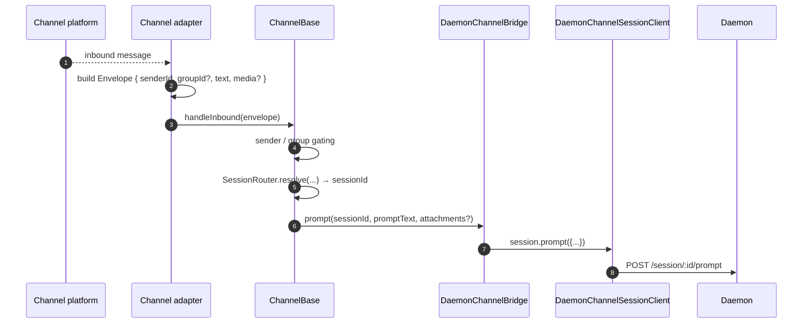
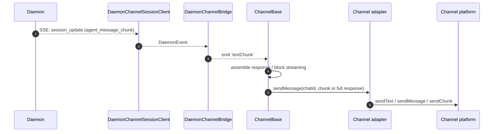
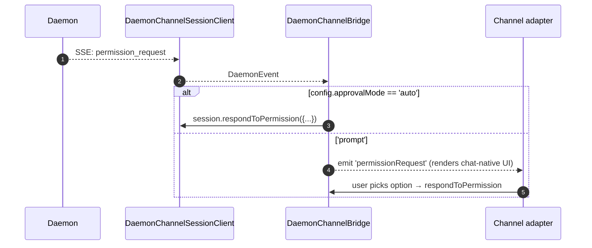

# Channel Adapters

## Overview

`packages/channels/` contains the **IM channel adapters** that turn a chat platform's incoming message into an agent prompt and send the agent response back to the chat platform. Four concrete channels ship today: DingTalk, WeChat (Weixin), Telegram, and Feishu. They share a base layer (`packages/channels/base/`) and an adapter-facing `ChannelAgentBridge` contract.

There are two current host modes:

- `qwen channel start [name]` is the standalone ACP-backed channel service. It passes adapters an `AcpBridge` implementation of `ChannelAgentBridge`.
- `qwen serve --channel <name>` and `qwen serve --channel all` are experimental daemon-managed modes. Named selections are grouped by owning workspace and `qwen serve` starts one out-of-process worker per owning runtime; each worker connects to the daemon through the SDK and adapters receive a `DaemonChannelBridge`-backed `ChannelAgentBridge` facade. `--channel all` remains a primary-only selection.

In daemon-managed mode, each channel maps inbound chat traffic to daemon sessions under a configurable `SessionScope` (`user`, `thread`, or `single`). The adapter delegates to `DaemonChannelBridge`, which delegates to the SDK's `DaemonSessionClient` (see [`13-sdk-daemon-client.md`](./13-sdk-daemon-client.md)). Every named channel must resolve to one registered, trusted workspace. The worker uses that runtime's canonical cwd, `QWEN_DAEMON_WORKSPACE`, and environment overlay; ownership resolution never falls back to primary.

### Webhook-triggered channel tasks

Webhook-triggered tasks are hosted by `qwen serve` and executed inside the daemon-managed channel worker. The HTTP route validates the source and forwards a `ChannelWebhookTask` to the worker over IPC. The worker calls `ChannelBase.runWebhookTask()`, so adapters do not implement webhook parsing.

Adapters still participate through proactive send support: `supportsProactiveSend()` tells the host whether a channel can send without an inbound message, `supportsProactiveTarget()` handles delivery limits for specific target shapes, and `pushProactive()` carries the outbound content.

## Responsibilities

- Receive inbound messages from the channel's native transport (DingTalk WebSocket stream, WeChat HTTP long-poll, Telegram Bot long-poll, Feishu WebSocket or HTTP webhook).
- Resolve `(senderId, groupId?)` into a daemon session via `DaemonChannelSessionFactory`.
- Forward the user message as a daemon prompt and stream the response back as outbound chat messages, possibly chunked.
- Render permission requests as chat-native prompts when interactive; otherwise auto-approve according to `ChannelConfig.approvalMode`.
- Apply sender gating (allowlists / denylists), group gating, and content normalization (markdown / HTML per channel).

## Architecture

### `DaemonChannelBridge` (shared base, `packages/channels/base/src/DaemonChannelBridge.ts`)

```ts
class DaemonChannelBridge extends EventEmitter {
  constructor(opts: {
    cwd: string;
    sessionFactory: DaemonChannelSessionFactory;
    modelServiceId?: string;
    sessionScope?: SessionScope;
  });
  newSession(cwd: string): Promise<string>;
  loadSession(sessionId: string, cwd: string): Promise<string>;
  prompt(sessionId: string, text: string, options?): Promise<string>;
  cancelSession(sessionId: string): Promise<void>;
  stop(): void;
}
```

Holds daemon session clients keyed by daemon `sessionId`; `ChannelBase` and `SessionRouter` decide which inbound chat target maps to that session. Each attached session has:

- A `DaemonChannelSessionClient` (shape of `DaemonSessionClient` minus channel-irrelevant methods).
- A live SSE consumer pump.
- A debounced prompt assembler (for adapters that fragment user input across multiple inbound messages).
- An auto-approve policy per request.

Events emitted: `textChunk`, `toolCall`, `sessionUpdate`, `permissionRequest`, `permissionResolved`, `modelSwitched`, `modelSwitchFailed`, `sessionDied`, `promptComplete`, and `error`. Channel adapters wire these into platform-native APIs.

### `ChannelBase` (`packages/channels/base/src/ChannelBase.ts`)

Abstract base every adapter extends:

```ts
abstract class ChannelBase {
  abstract connect(): Promise<void>;
  abstract sendMessage(chatId: string, text: string): Promise<void>;
  abstract disconnect(): void;
  handleInbound(envelope: Envelope): Promise<void>; // → SessionRouter.resolve + bridge.prompt
}
```

Handles common cross-cutting concerns: sender gating (allowlist / denylist), group gating, message block streaming (chunk size, throttling), inbound debounce.

### Per-channel adapters

| Adapter         | File                                                | Transport                                              | Notes                                                                                                        |
| --------------- | --------------------------------------------------- | ------------------------------------------------------ | ------------------------------------------------------------------------------------------------------------ |
| DingTalk        | `packages/channels/dingtalk/src/DingtalkAdapter.ts` | DingTalk Stream SDK WebSocket                          | Sends via `sessionWebhook` POST; media images downloaded via DT API, base64 in envelope.                     |
| WeChat (Weixin) | `packages/channels/weixin/src/WeixinAdapter.ts`     | iLink Bot HTTP long-poll                               | Sends via proprietary `sendText` / `sendImage` API; typing indicators.                                       |
| Telegram        | `packages/channels/telegram/src/TelegramAdapter.ts` | Telegram Bot API long-poll (grammy)                    | Sends HTML chunks via `sendMessage`.                                                                         |
| Feishu          | `packages/channels/feishu/src/FeishuAdapter.ts`     | Feishu/Lark Stream WebSocket (default) or HTTP webhook | Sends via Lark SDK as interactive cards; webhook mode requires `encryptKey` for HMAC signature verification. |

Each adapter implements:

1. Inbound transport (subscribe / poll for messages).
2. Envelope construction (`{ senderId, groupId?, text, media?, raw }`).
3. Sender / group gating (delegates to `ChannelBase`).
4. Outbound serialization (markdown → HTML / WeChat-native / DingTalk-native).
5. Lifecycle (start / shutdown).

### Adapter matrix

| Adapter      | Transport                       | Identity                                                 | Permission UX                       | Auto-approve config                               |
| ------------ | ------------------------------- | -------------------------------------------------------- | ----------------------------------- | ------------------------------------------------- |
| **DingTalk** | WebSocket stream                | `senderStaffId` (+ optional `conversationId` for groups) | Inline buttons via DT markdown      | `ChannelConfig.approvalMode = 'auto' \| 'prompt'` |
| **WeChat**   | HTTP long-poll                  | `senderWxid` (+ optional `groupWxid`)                    | Text-only prompts with reply tokens | Same                                              |
| **Telegram** | Bot API long-poll               | `from.id` (+ optional `chat.id` for groups)              | Inline keyboard buttons             | Same                                              |
| **Feishu**   | WebSocket stream / HTTP webhook | `sender.open_id` (+ optional `chat_id` for groups)       | Interactive card buttons            | Same                                              |

> **Note:** The "Permission UX" column describes each platform's native affordance, but none is wired up yet — `AcpBridge.requestPermission` currently auto-approves every request (`packages/channels/base/src/AcpBridge.ts`), and `ChannelConfig.approvalMode` is declared but not yet read. Interactive approval is planned (Phase 5).

## Workflow

### Inbound prompt



### SSE-driven outbound



### Permission auto-approve



## State & Lifecycle

- `DaemonChannelBridge` lives for the lifetime of the channel adapter; sessions inside it live according to the configured `SessionScope`.
- Each active session reconnects automatically if SSE drops — `DaemonSessionClient.events()` tracks `lastSeenEventId` so replay is correct.
- `shutdown()` closes every active session and the underlying transport (the channel's WebSocket / long-poll).
- DingTalk's WebSocket stream supports server-push; WeChat's long-poll requires a backoff strategy on idle responses; Telegram's long-poll has a built-in `timeout` parameter.

### Runtime selection and settings reload

The long-lived `ChannelWorkerManager` owns the committed daemon selection and workspace-grouped supervisors. A daemon may boot without an effective selection when neither `--channel` nor the primary workspace's `serve.channels` selects an instance; the first strict-gated `PUT /workspace/channel` then dynamically loads the channel runtime, reserves the service pidfile, resolves workspace ownership, and starts the selected workers. `GET /workspace/channel` reads the manager snapshot and `DELETE /workspace/channel` stops it idempotently. SDK helpers are `getChannelWorkerControl()`, `setChannelWorkerSelection()`, and `stopChannelWorker()`; the CLI entry is `qwen channel set` plus remote `status` and `stop` variants.

The daemon reads channel settings from `settings.json` when each worker starts (`packages/cli/src/commands/channel/daemon-worker.ts` → `loadSettings` → `loadChannelsConfig`). `POST /workspace/channel/reload` re-reads those settings and force-reconciles the committed selection. All lifecycle mutations share one FIFO lane. Unchanged workspace groups survive ordinary selection replacement; changed groups stop and start sequentially while the serve-owned PID lease remains held.

If a replacement fails, newly started workers are stopped and old workers are restored before the request returns. A supervisor that cannot observe exit after SIGTERM and SIGKILL retains its child reference and fails stop; the manager keeps the PID lease and never starts a second worker. Webhook configuration and routing change only when selection commit succeeds. Runtime selections are process-local and disappear on daemon restart.

Adapter `connect()` failures are reported separately from worker lifecycle errors. The worker sends each bounded, credential-redacted failure over startup IPC and waits for a supervisor acknowledgement before trying the next adapter. A partially connected worker remains running and exposes `startupFailures` in its snapshot. If every adapter in a dynamic attempt fails, the `502 channel_worker_start_failed` response carries workspace-annotated attempted failures while `state` reflects the rollback result; subsequent GET responses do not retain the attempt. Daemon boot with no connected adapter remains fail-fast. The optional adapter `code` is diagnostic only, and the current `phase` is `connect`.

### Phase 1 configuration management contract

Configuration management is a separate projection over workspace settings and
the existing `ChannelWorkerManager`; it is not a second lifecycle owner. The
`channel_management` capability is advertised only when the service resolver
is wired.

Primary routes use `/workspace`; qualified routes replace that prefix with
`/workspaces/:workspace`, where the selector is an encoded canonical cwd:

```text
GET    /workspace/channel-types
GET    /workspace/channels
PUT    /workspace/channels/:name
DELETE /workspace/channels/:name
PUT    /workspace/channels/:name/startup
POST   /workspace/channels/:name/start
POST   /workspace/channels/:name/stop
POST   /workspace/channels/:name/restart
```

Both forms resolve and require a trusted `WorkspaceRuntime` before resolving
its management service. Unknown, ambiguous, untrusted, draining, or removed
targets fail closed; qualified routes never reuse the primary service. Every
mutation uses the strict bearer gate and validates the client ID against the
resolved runtime. Instance names must be portable filesystem components of at
most 255 UTF-8 bytes.

`GET .../channel-types` returns the serializable projection of
`ChannelPlugin.management`: type, display name, `manageable`, safe field
descriptors, and declared `credentials` or `qr` auth modes. It never exposes
`createChannel`. A plugin without management metadata remains runnable through
the existing Channel paths but cannot be written through this API because its
secret fields cannot be identified safely.

`GET .../channels` returns:

```ts
interface DaemonChannelsSnapshot {
  revision: string;
  instances: Record<
    string,
    {
      name: string;
      config: Record<string, unknown>; // descriptor-declared secrets removed
      secrets: Record<
        string,
        {
          present: boolean;
          source?: 'literal' | 'environment';
        }
      >;
      startsWithServe: boolean;
      runtime: {
        state: 'stopped' | 'starting' | 'connected' | 'partial' | 'error';
        lastError?: string;
      };
    }
  >;
}
```

The revision is a deterministic SHA-256 digest of the workspace-scope
`channels` map and ordered `serve.channels` list. PUT and DELETE require the
latest value as `expectedRevision`; mismatch returns
`409 channel_settings_conflict` before writing.

Instance names must be non-empty portable filesystem components of at most 255
UTF-8 bytes and must not trim to the reserved startup sentinel `all`. Portable
components exclude path separators, control and Windows-forbidden characters,
trailing dots or spaces, and Windows device names. The management service uses
the channel-selection canonicalization as a domain invariant for configuration,
lifecycle, and per-instance startup mutations; routes map
`invalid_channel_instance_name` to 400. List may still expose a legacy
`channels.all` entry, and DELETE alone accepts that name for cleanup.

PUT accepts non-secret fields under `config` and descriptor-declared secret
fields only under `secrets`:

```json
{
  "expectedRevision": "<latest revision>",
  "config": { "type": "telegram" },
  "secrets": {
    "token": { "operation": "replace", "value": "$TELEGRAM_BOT_TOKEN" }
  }
}
```

Secret operations are explicit: `preserve` retains the prior value, `replace`
requires a non-empty string, and `clear` removes it. Omitted descriptor secret
operations default to Preserve. A secret key under `config`, or a `secrets`
key not declared secret by the selected plugin, is rejected with
`channel_settings_invalid_secret`. Read responses expose presence/source only;
resolved environment values never enter the response.

The persistence/lifecycle ordering is intentional:

- PUT persists the workspace configuration first. If active, it calls
  `reloadWorkspace(workspaceCwd, name)`. Failure retains the new settings,
  removes the failed instance from committed runtime selection, and retains a
  bounded, credential-redacted instance diagnostic.
- DELETE confirms Stop before removing settings and also removes the name from
  `serve.channels`. Unconfirmed exit leaves both untouched. Deleting a legacy
  `channels.all` entry, including a key with surrounding whitespace, never
  treats the sentinel as a runtime instance. It canonicalizes the saved
  sentinel to `serve.channels: ['all']` while other selectable configurations
  remain and writes `[]` when none remain.
- PUT `.../:name/startup` requires an own configured instance, then adds its
  name once to or removes it from the ordered `serve.channels` list through
  the same revision check. It does not touch the manager or the instance
  configuration. With the `all` sentinel active, every configured instance
  projects `startsWithServe: true`; enabling one is a revision-checked no-op,
  while disabling one expands the sentinel to all other selectable configured
  names in persisted object order (or `[]`). The service never writes a mixed
  `['all', ...]` list.
- Start adds the name to the manager's ordered, process-local committed
  selection after unique workspace ownership preflight. Stop removes it;
  Restart performs the same targeted owning-workspace reload as an active PUT.
  None of these runtime actions edits `serve.channels`.

`WorkspaceChannelSettingsStore.setStartupNames()` persists the ordered
workspace `serve.channels` list separately from `channels.<name>`, and the
snapshot exposes list membership as `startsWithServe`. Merely configuring an
instance never opts it into startup.

`commands/serve.ts` resolves startup selection in this order: explicit
`argv.channel`, the primary workspace-scope `serve.channels`, then disabled.
It sends either source through `normalizeServeChannelSelection`, so trimming,
first-occurrence deduplication, and `all` exclusivity are identical. An absent
or empty saved list disables startup, and configured instances alone never
imply startup. Resolution is read-only: an explicit CLI selection remains
process-local and never rewrites the stored list. Only the primary workspace's
list is consulted at process boot; qualified secondary lists remain scoped to
their workspace and apply when that workspace is launched as primary.

The TypeScript SDK mirrors both scopes. `DaemonClient` targets primary routes;
`client.workspaceByCwd(cwd)` returns a `WorkspaceDaemonClient` for qualified
routes. Both expose `workspaceChannelTypes`, `workspaceChannels`,
`upsertWorkspaceChannel`, `deleteWorkspaceChannel`,
`setWorkspaceChannelStartup`, `startWorkspaceChannel`,
`stopWorkspaceChannel`, and `restartWorkspaceChannel`. Mutation helpers use
the existing extended Channel control timeout and propagate stable HTTP
failures as `DaemonHttpError`.

Phase 1 stops at descriptors, sanitized configuration CRUD, revisions,
instance lifecycle, and SDK helpers. `auth: ['qr']` on QQ and WeChat is
forward-looking metadata only. Browser QR auth sessions, the `channel_auth`
capability, credential commit/storage isolation, and the Web Shell Channels UI
belong to later phases and are not implemented by this contract.

## Dependencies

- `packages/channels/base/` — `ChannelBase`, `DaemonChannelBridge`, `types.ts` (`ChannelConfig`, `Envelope`, `SessionScope`, `ChannelPlugin`).
- `packages/sdk-typescript/src/daemon/` — `DaemonSessionClient` and friends.
- Per-channel SDKs: `@dingtalk/stream` (DingTalk), proprietary iLink Bot HTTP (Weixin), `grammy` (Telegram).

## Configuration

`ChannelConfig` (from `packages/channels/base/src/types.ts`):

| Knob                                     | Effect                                                                                                    |
| ---------------------------------------- | --------------------------------------------------------------------------------------------------------- |
| `sessionScope`                           | `'user'` (sender + chat), `'thread'` (thread id or chat), or `'single'` (one shared session per channel). |
| `approvalMode`                           | `'auto'` (auto-respond) / `'prompt'` (render UI).                                                         |
| `allowlist?: string[]`                   | Sender ids allowed; missing = open.                                                                       |
| `denylist?: string[]`                    | Sender ids denied.                                                                                        |
| `chunkSize`, `chunkIntervalMs`           | Outbound block streaming settings.                                                                        |
| `daemon: { baseUrl, token?, clientId? }` | Forwarded to `DaemonChannelSessionFactory`.                                                               |

Channel-specific keys layer on top (DingTalk: `streamCredentials`; WeChat: `ilinkUrl`, `botId`; Telegram: `botToken`; Feishu: `clientId` (appId), `clientSecret` (appSecret), `verificationToken`, `encryptKey` (webhook mode)).

## Caveats & Known Limits

- **Channels do not directly import `@qwen-code/sdk`.** They go through `ChannelBase` → `DaemonChannelBridge` → `DaemonChannelSessionClient` (which the bridge constructs from the SDK). The indirection lets the bridge swap implementations, such as a test stub, without requiring channel changes.
- **Permission UX is per-channel.** DingTalk uses markdown buttons; WeChat is text-only; Telegram uses inline keyboards; Feishu uses interactive card buttons. (All currently auto-approve via `AcpBridge`; interactive approval is planned.) No common "interactive permission widget" abstraction yet.
- **Auto-approve is a deployment-side decision**, not a daemon-side one. The daemon's `permission_mediation` policy still applies; auto-approve only means the channel responds without prompting the human. Do not combine `auto` with `enforce`-grade workflows.
- **Per-channel rate limits / message-size limits are the adapter's job.** `DaemonChannelBridge` only handles chunking; pushing past WeChat's per-message size or Telegram's flood limit is on the adapter.
- **No DingTalk / WeChat / Telegram / Feishu reverse-call** — channels are one-way (chat → daemon → chat). The IM platform's native push path, such as a DingTalk card callback, is not wired into the bridge yet.

## References

- `packages/channels/base/src/DaemonChannelBridge.ts`
- `packages/channels/base/src/ChannelBase.ts`
- `packages/channels/base/src/types.ts`
- `packages/cli/src/serve/channel-worker-manager.ts` (selection lifecycle + serialization)
- `packages/cli/src/serve/channel-worker-group.ts` (workspace-differential reconcile)
- `packages/cli/src/serve/channel-worker-supervisor.ts` (child supervision)
- `packages/cli/src/serve/routes/workspace-channel-control.ts` (GET/PUT/DELETE/reload resource)
- `packages/channels/dingtalk/src/DingtalkAdapter.ts`
- `packages/channels/weixin/src/WeixinAdapter.ts`
- `packages/channels/telegram/src/TelegramAdapter.ts`
- `packages/channels/plugin-example/` (reference plugin scaffold)
- Channel plugin guide: [`../channel-plugins.md`](../channel-plugins.md).
- SDK reference: [`13-sdk-daemon-client.md`](./13-sdk-daemon-client.md).
