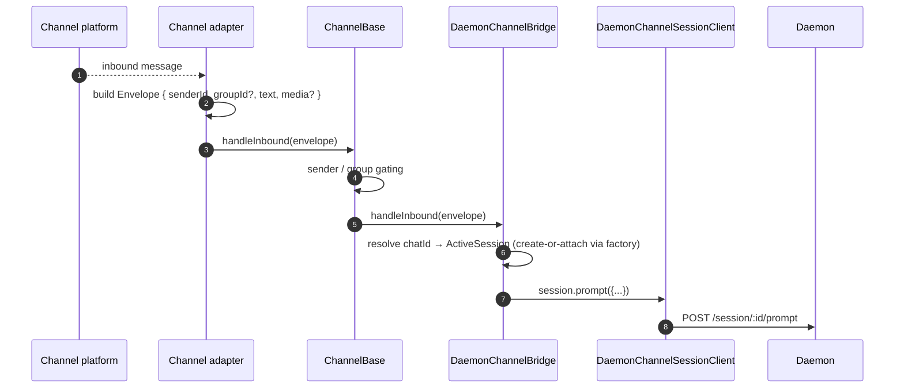
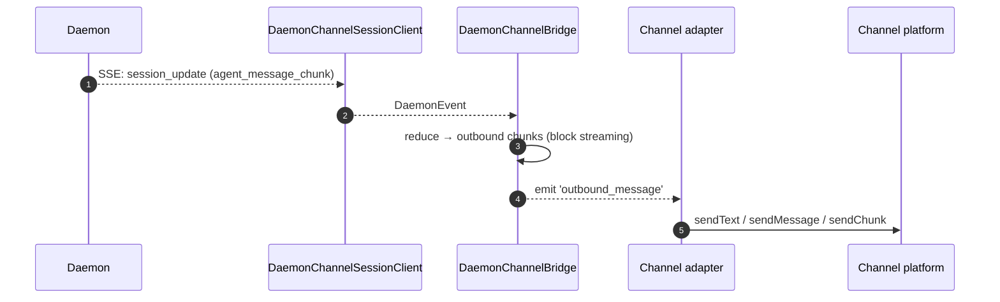
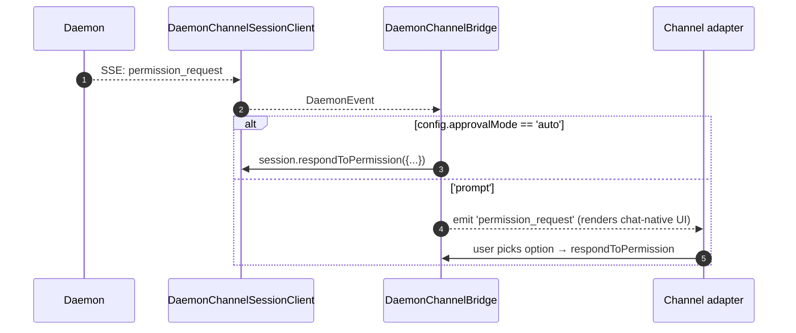

# Channel Adapters

## Overview

`packages/channels/` contains the **IM channel adapters** that turn a chat platform's incoming message into a daemon prompt and the daemon's outbound events into chat-platform messages. Three concrete channels ship today: DingTalk, WeChat (Weixin), and Telegram. They share a base layer (`packages/channels/base/`) plus a `DaemonChannelBridge` that does the session multiplexing + SSE consumption.

Each channel maps one chat (or chat group) to one daemon session under a configurable `SessionScope` (`per-sender` / `per-group`/...). The adapter delegates to `DaemonChannelBridge`, which delegates to the SDK's `DaemonSessionClient` (see [`13-sdk-daemon-client.md`](./13-sdk-daemon-client.md)).

## Responsibilities

- Receive inbound messages from the channel's native transport (DingTalk WebSocket stream, WeChat HTTP long-poll, Telegram Bot long-poll).
- Resolve `(senderId, groupId?)` into a daemon session via `DaemonChannelSessionFactory`.
- Forward the user message as a daemon prompt and stream the response back as outbound chat messages, possibly chunked.
- Render permission requests as chat-native prompts when interactive; auto-approve per `ChannelConfig.approvalMode` otherwise.
- Apply sender gating (allowlists / denylists), group gating, and content normalization (markdown / HTML per channel).

## Architecture

### `DaemonChannelBridge` (shared base, `packages/channels/base/src/DaemonChannelBridge.ts:1-179+`)

```ts
class DaemonChannelBridge extends EventEmitter {
  constructor(opts: {
    sessionFactory: DaemonChannelSessionFactory;
    config: ChannelConfig;
  });
  handleInbound(envelope: Envelope): Promise<void>;
  shutdown(): Promise<void>;
}
```

Holds a `Map<chatId, ActiveSession>` keyed by the channel's chat id (sender / group). Each entry has:

- A `DaemonChannelSessionClient` (shape of `DaemonSessionClient` minus channel-irrelevant methods).
- A live SSE consumer pump.
- A debounced prompt assembler (for adapters that fragment user input across multiple inbound messages).
- An auto-approve policy per request.

Events emitted: `permission_request`, `permission_resolved`, `outbound_message`, `stream_error`, `session_died`. Channel adapters wire these into platform-native APIs.

### `ChannelBase` (`packages/channels/base/src/ChannelBase.ts`)

Abstract base every adapter extends:

```ts
abstract class ChannelBase {
  abstract start(): Promise<void>;
  abstract sendOutbound(target, payload): Promise<void>;
  handleInbound(envelope: Envelope): Promise<void>; // → bridge.handleInbound
  shutdown(): Promise<void>;
}
```

Handles common cross-cutting concerns: sender gating (allowlist / denylist), group gating, message block streaming (chunk size, throttling), inbound debounce.

### Per-channel adapters

| Adapter         | File                                                       | Transport                           | Notes                                                                                    |
| --------------- | ---------------------------------------------------------- | ----------------------------------- | ---------------------------------------------------------------------------------------- |
| DingTalk        | `packages/channels/dingtalk/src/DingtalkAdapter.ts:79-586` | DingTalk Stream SDK WebSocket       | Sends via `sessionWebhook` POST; media images downloaded via DT API, base64 in envelope. |
| WeChat (Weixin) | `packages/channels/weixin/src/WeixinAdapter.ts:33-309`     | iLink Bot HTTP long-poll            | Sends via proprietary `sendText` / `sendImage` API; typing indicators.                   |
| Telegram        | `packages/channels/telegram/src/TelegramAdapter.ts:19-308` | Telegram Bot API long-poll (grammy) | Sends HTML chunks via `sendMessage`.                                                     |

Each adapter implements:

1. Inbound transport (subscribe / poll for messages).
2. Envelope construction (`{ senderId, groupId?, text, media?, raw }`).
3. Sender / group gating (delegates to `ChannelBase`).
4. Outbound serialization (markdown → HTML / WeChat-native / DingTalk-native).
5. Lifecycle (start / shutdown).

### Adapter matrix

| Adapter      | Transport         | Identity                                                 | Permission UX                       | Auto-approve config                               |
| ------------ | ----------------- | -------------------------------------------------------- | ----------------------------------- | ------------------------------------------------- |
| **DingTalk** | WebSocket stream  | `senderStaffId` (+ optional `conversationId` for groups) | Inline buttons via DT markdown      | `ChannelConfig.approvalMode = 'auto' \| 'prompt'` |
| **WeChat**   | HTTP long-poll    | `senderWxid` (+ optional `groupWxid`)                    | Text-only prompts with reply tokens | Same                                              |
| **Telegram** | Bot API long-poll | `from.id` (+ optional `chat.id` for groups)              | Inline keyboard buttons             | Same                                              |

## Workflow

### Inbound prompt



### SSE-driven outbound



### Permission auto-approve



## State & Lifecycle

- `DaemonChannelBridge` lives for the lifetime of the channel adapter; sessions inside it live per chat.
- Each chat session reconnects automatically if SSE drops — `DaemonSessionClient.events()` tracks `lastSeenEventId` so replay is correct.
- `shutdown()` closes every active session and the underlying transport (the channel's WebSocket / long-poll).
- DingTalk's WebSocket stream supports server-push; WeChat's long-poll requires a backoff strategy on idle responses; Telegram's long-poll has a built-in `timeout` parameter.

## Dependencies

- `packages/channels/base/` — `ChannelBase`, `DaemonChannelBridge`, `types.ts` (`ChannelConfig`, `Envelope`, `SessionScope`, `ChannelPlugin`).
- `packages/sdk-typescript/src/daemon/` — `DaemonSessionClient` and friends.
- Per-channel SDKs: `@dingtalk/stream` (DingTalk), proprietary iLink Bot HTTP (Weixin), `grammy` (Telegram).

## Configuration

`ChannelConfig` (from `packages/channels/base/src/types.ts:1-121`):

| Knob                                     | Effect                                                           |
| ---------------------------------------- | ---------------------------------------------------------------- |
| `sessionScope`                           | `'per-sender'`, `'per-group'`, `'per-thread'` (channel-defined). |
| `approvalMode`                           | `'auto'` (auto-respond) / `'prompt'` (render UI).                |
| `allowlist?: string[]`                   | Sender ids allowed; missing = open.                              |
| `denylist?: string[]`                    | Sender ids denied.                                               |
| `chunkSize`, `chunkIntervalMs`           | Outbound block streaming knobs.                                  |
| `daemon: { baseUrl, token?, clientId? }` | Forwarded to `DaemonChannelSessionFactory`.                      |

Channel-specific keys layer on top (DingTalk: `streamCredentials`; WeChat: `ilinkUrl`, `botId`; Telegram: `botToken`).

## Caveats & Known Limits

- **Channels don't directly import `@qwen-code/sdk`.** They go through `ChannelBase` → `DaemonChannelBridge` → `DaemonChannelSessionClient` (which the bridge constructs from the SDK). The indirection lets the bridge swap implementations (e.g. a test stub) without channels noticing.
- **Permission UX is per-channel.** DingTalk uses markdown buttons; WeChat is text-only; Telegram uses inline keyboards. No common "interactive permission widget" abstraction yet.
- **Auto-approve is a deployment-side decision**, not a daemon-side one. The daemon's `permission_mediation` policy still applies; auto-approve just means the channel responds without prompting the human. Don't combine `auto` with `enforce`-grade workflows.
- **Per-channel rate limits / message-size limits are the adapter's job.** `DaemonChannelBridge` only handles chunking; pushing past WeChat's per-message size or Telegram's flood limit is on the adapter.
- **No DingTalk / WeChat / Telegram reverse-call** — channels are one-way (chat → daemon → chat). The IM platform's native push (e.g. DT card callback) isn't wired into the bridge yet.

## References

- `packages/channels/base/src/DaemonChannelBridge.ts:1-179+`
- `packages/channels/base/src/ChannelBase.ts`
- `packages/channels/base/src/types.ts:1-121`
- `packages/channels/dingtalk/src/DingtalkAdapter.ts:79-586`
- `packages/channels/weixin/src/WeixinAdapter.ts:33-309`
- `packages/channels/telegram/src/TelegramAdapter.ts:19-308`
- `packages/channels/plugin-example/` (reference plugin scaffold)
- Channel plugin guide: [`../channel-plugins.md`](../channel-plugins.md).
- SDK reference: [`13-sdk-daemon-client.md`](./13-sdk-daemon-client.md).
