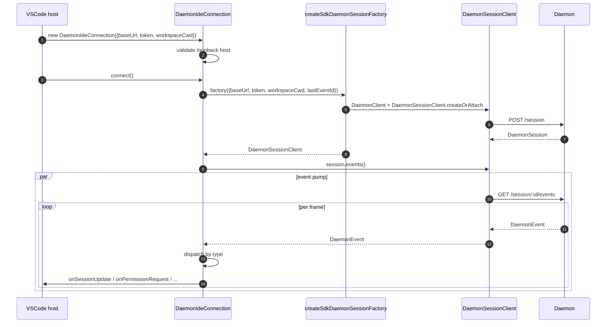
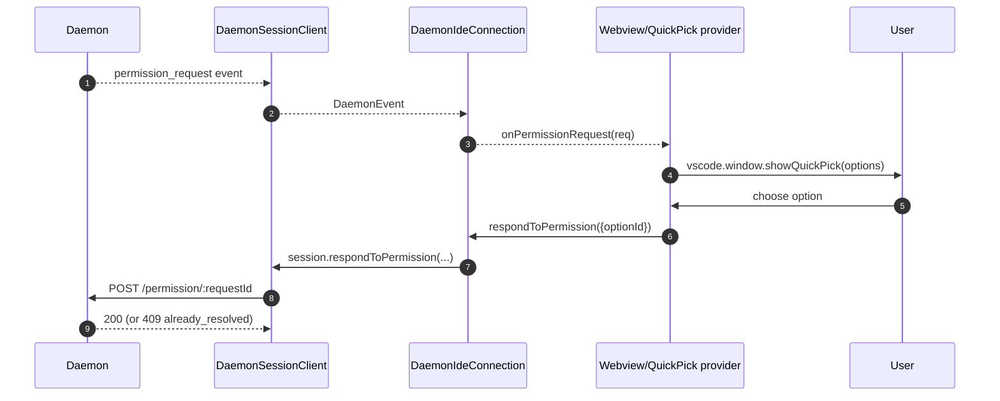

# VSCode IDE Daemon Adapter

## Overview

`packages/vscode-ide-companion/src/services/daemonIdeConnection.ts` is the **VSCode extension's daemon adapter**. It lets the IDE companion talk to a running `qwen serve` daemon over HTTP + SSE instead of launching an in-process `qwen --acp` stdio child (the legacy `AcpConnectionState` path). It is the sibling-transport equivalent of [`14-cli-tui-adapter.md`](./14-cli-tui-adapter.md) for VSCode hosts.

The IDE's chat webview consumes daemon events through this adapter; permission prompts surface as native VSCode quick-pick dialogs.

## Responsibilities

- Construct a `DaemonClient` + `DaemonSessionClient` from a loopback-validated `baseUrl`.
- Pump SSE events from the session client into per-callback dispatch (`onSessionUpdate`, `onPermissionRequest`, `onAskUserQuestion`, `onEndTurn`, `onDisconnected`).
- Enforce a **loopback-only** invariant at construction (the IDE should only ever talk to a daemon on the same host).
- Bridge daemon events into webview `postMessage`s so the chat panel stays in sync.
- Surface permission requests through VSCode's native quick-pick UI.
- Serialize calls into a queue so a fast double-`connect()` from the host doesn't race.

## Architecture

### Public surface

```ts
class DaemonIdeConnection {
  constructor(opts: DaemonIdeConnectionOptions);
  connect(): Promise<void>;
  disconnect(): Promise<void>;
  prompt(req): Promise<PromptResult>;
  cancel(): Promise<void>;
  respondToPermission(req): Promise<void>;
  setModel(modelServiceId): Promise<void>;

  onSessionUpdate(cb: (update) => void): Disposable;
  onPermissionRequest(cb: (req) => void): Disposable;
  onAskUserQuestion(cb: (q) => void): Disposable;
  onEndTurn(cb: () => void): Disposable;
  onDisconnected(cb: (reason) => void): Disposable;
}

interface DaemonIdeConnectionOptions {
  baseUrl: string; // MUST be loopback (127.0.0.1 / localhost / [::1])
  token?: string;
  workspaceCwd: string;
  modelServiceId?: string;
  lastEventId?: number;
}
```

### Loopback validation

At construction (`daemonIdeConnection.ts:161-628`):

```ts
const parsed = new URL(opts.baseUrl);
if (!isLoopbackHost(parsed.hostname)) {
  throw new Error('DaemonIdeConnection: baseUrl must be loopback (...)');
}
```

This is a **client-side hard constraint** distinct from the daemon's own `hostAllowlist` (see [`12-auth-security.md`](./12-auth-security.md)). The IDE companion will never connect to a remote daemon — even if the operator configured one. Rationale: VSCode's threat model assumes the workspace and the daemon share the same host (filesystem trust, etc.).

### `createSdkDaemonSessionFactory()`

A factory function at `daemonIdeConnection.ts:144-159` that constructs `DaemonClient` + calls `DaemonSessionClient.createOrAttach()` from `@qwen-code/sdk`. The connection class holds the factory rather than instantiating directly so tests can inject a fake.

### Event dispatch

The connection runs one SSE consumer (`for await` over `session.events()`) and routes each event by type:

| Daemon event                                                       | IDE callback                                          |
| ------------------------------------------------------------------ | ----------------------------------------------------- |
| `session_update` (most subtypes)                                   | `onSessionUpdate`                                     |
| `session_update` (ask-user-question variant)                       | `onAskUserQuestion`                                   |
| `session_update` (end-turn marker)                                 | `onEndTurn`                                           |
| `permission_request`                                               | `onPermissionRequest`                                 |
| `session_died`, `session_closed`, `client_evicted`, `stream_error` | `onDisconnected` (terminal)                           |
| Others (model, MCP, mutation, auth)                                | (currently no-op or logged; future webview surfacing) |

### Webview bridging

The connection class is **transport-only**. The actual VSCode integration lives in `packages/vscode-ide-companion/src/webview/providers/ChatWebviewViewProvider.ts` (and friends). The provider subscribes to the connection's callbacks and translates them into webview `postMessage` calls. The webview itself uses the shared `packages/webui/` component library to render — see Adapter Matrix in [`01-architecture.md`](./01-architecture.md).

### Connect serialization

`connect()` uses an internal queue so a fast double-call from the host (e.g. user opens the panel twice during an in-flight handshake) doesn't race. The second call awaits the first; the connection ends up in a single, deterministic state.

## Workflow

### Initial connect



### Permission via quick-pick



### Disconnect / recover

```mermaid
sequenceDiagram
    autonumber
    participant D as Daemon
    participant SDK as DaemonSessionClient
    participant C as DaemonIdeConnection
    participant H as Host

    D-->>SDK: session_died (or other terminal)
    SDK-->>C: DaemonEvent
    C->>C: shut down pump
    C-->>H: onDisconnected(reason)
    H->>C: connect() (user-driven retry; resume lastEventId)
```

## State & Lifecycle

- Construction is synchronous; **no network I/O** until `connect()`.
- `connect()` is idempotent through the internal queue; calling twice serializes.
- `disconnect()` aborts the SSE iterator (`AbortController` on the pump) and clears callback registrations.
- `lastEventId` is captured from the SDK's `DaemonSessionClient` on disconnect and can be re-supplied on the next `connect()` for resume.

## Dependencies

- `packages/sdk-typescript/src/daemon/` — `DaemonClient`, `DaemonSessionClient` (the actual transport).
- VSCode extension API (`vscode.*`) — host APIs, quick-pick, webview.
- `packages/webui/src/adapters/ACPAdapter.ts` — webview rendering of ACP-shaped messages relayed via `postMessage`.

## Configuration

| Knob                                                | Where                      | Effect                                                            |
| --------------------------------------------------- | -------------------------- | ----------------------------------------------------------------- |
| `baseUrl`                                           | Constructor                | Daemon URL; must be loopback.                                     |
| `token`                                             | Constructor                | Bearer token (stamped via SDK).                                   |
| `workspaceCwd`                                      | Constructor                | Used on `POST /session`; must match the daemon's bound workspace. |
| `modelServiceId`                                    | Constructor / `setModel()` | Initial model.                                                    |
| `lastEventId`                                       | Constructor                | Resume cursor (typically restored from host state).               |
| VSCode setting `qwen.ide.daemonUrl` (or equivalent) | Workspace settings         | Operator-configured daemon URL.                                   |

## Caveats & Known Limits

- **Loopback-only — hard refusal at construction.** Operators who want to point the IDE at a remote daemon need to use SSH port-forward / local proxy; the adapter will not connect to a non-loopback URL.
- **The legacy `AcpConnectionState` path is still primary** in the IDE companion (stdio child). This adapter is the sibling-transport for Mode-B migration; see [`../daemon-client-adapters/ide.md`](../daemon-client-adapters/ide.md) for the migration blockers and the planned `BridgeFileSystem` parity work.
- **No reverse-RPC / editor-affordance surface yet over HTTP.** Features that require the agent to call back into the IDE (e.g. read-only buffer access, diff preview integration) currently live only on the stdio path.
- **Webview ↔ connection coupling is host-owned**, not in this adapter. Don't push webview-specific logic into `DaemonIdeConnection`.
- **`workspaceCwd` mismatch** with the daemon's bound workspace returns `400 workspace_mismatch` — surface this as a clear setup error rather than retrying.

## References

- `packages/vscode-ide-companion/src/services/daemonIdeConnection.ts:161-628`
- `packages/vscode-ide-companion/src/services/daemonIdeConnection.ts:144-159` (`createSdkDaemonSessionFactory`)
- `packages/vscode-ide-companion/src/types/connectionTypes.ts:1-42` (legacy `AcpConnectionState`)
- `packages/vscode-ide-companion/src/webview/providers/ChatWebviewViewProvider.ts` (webview bridge)
- `packages/webui/src/adapters/ACPAdapter.ts` (webview ACP-message adapter)
- Draft design: [`../daemon-client-adapters/ide.md`](../daemon-client-adapters/ide.md)
- SDK reference: [`13-sdk-daemon-client.md`](./13-sdk-daemon-client.md)
