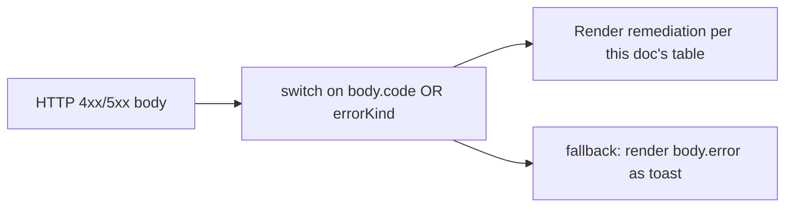
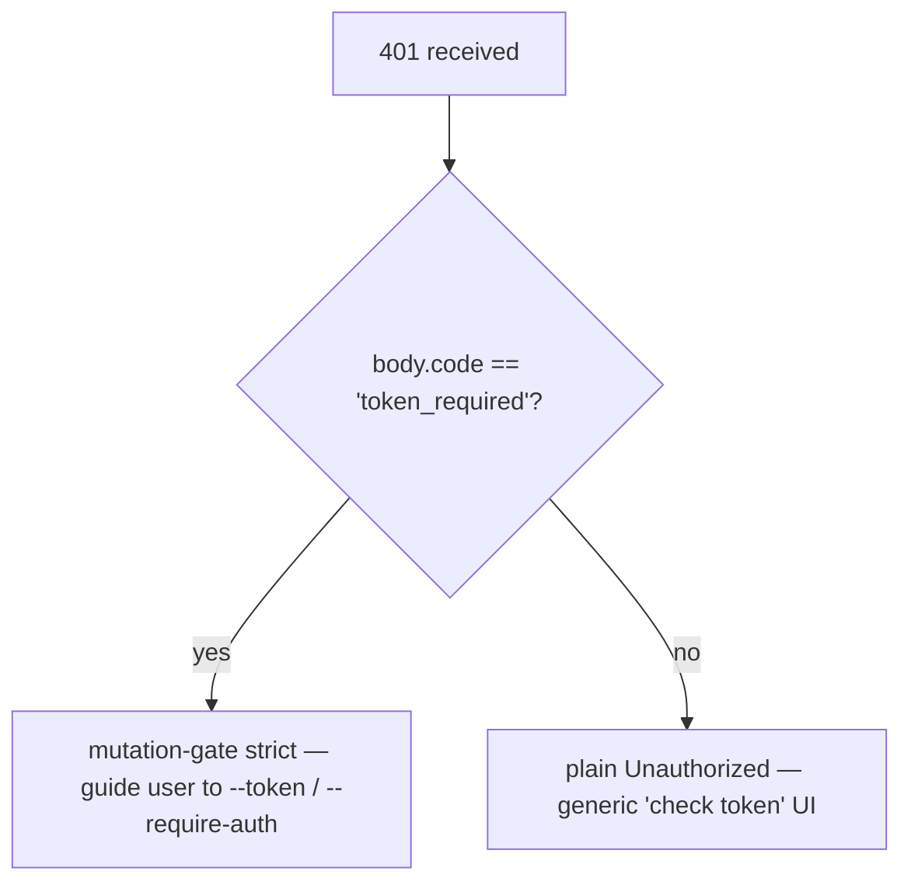

# Error Taxonomy & Remediation (English)

## Overview

The daemon's failure modes are deliberately closed unions so SDK consumers can exhaustively switch and route handlers can shape consistent HTTP responses. This doc catalogues every typed error class / kind across three layers:

1. **`packages/cli/src/serve/`** — boundary errors at the HTTP edge (auth, workspace filesystem, daemon-host preflight).
2. **`packages/acp-bridge/`** — bridge / mediator errors at the daemon-to-ACP-child seam.
3. **`packages/sdk-typescript/src/daemon/`** — SDK-side wrapping + structured error fields.

Wire-level error shapes are documented in [`../qwen-serve-protocol.md`](../qwen-serve-protocol.md); this doc adds the cause-and-remediation lens.

## Filesystem boundary (`packages/cli/src/serve/fs/errors.ts`)

`FsError` carries `{ kind, message, status, cause? }`. `FsErrorKind` union (13 kinds, default HTTP status):

| Kind | HTTP | Cause | Remediation |
|---|---|---|---|
| `path_outside_workspace` | 400 | Resolved path leaves the bound workspace. | Use a path inside the daemon's `workspaceCwd`; check `/capabilities`. |
| `symlink_escape` | 400 | Target is a symlink. | Address the resolved path directly; symlinks are rejected by design. |
| `path_not_found` | 404 | `ENOENT`. | Confirm the file exists; check case-sensitive paths on Linux. |
| `binary_file` | 422 | Content sniffed binary on a text route. | Use `GET /file/bytes` for raw bytes; the text route refuses binaries. |
| `file_too_large` | 413 | Above `MAX_READ_BYTES` (256 KiB) or `MAX_WRITE_BYTES` (5 MiB). | Use byte-range read; split the write. |
| `hash_mismatch` | 409 | Optimistic-concurrency `expectedSha256` failed. | Re-read the file and retry with the new hash. |
| `file_already_exists` | 409 | `mode: 'create'` against an existing file. | Use `mode: 'overwrite'` or pick a new path. |
| `text_not_found` | 422 | `POST /file/edit` search string not in file. | Re-check the search string; whitespace / encoding mismatch is the usual cause. |
| `ambiguous_text_match` | 422 | Multiple matches when one was required. | Add more surrounding context to the search string to make it unique. |
| `untrusted_workspace` | 403 | Write attempted in an untrusted workspace. | Mark the workspace trusted (`Config.isTrustedFolder()`) or use `runQwenServe` instead of `createServeApp` direct embed. |
| `permission_denied` | 403 | OS-level `EACCES` / `EPERM`. | Adjust filesystem ACLs; this is **not** a security alert. |
| `io_error` | 503 | `ENOSPC` / `EIO` / `EBUSY` / `ETXTBSY` / `ENAMETOOLONG` / `EMFILE` / `ENFILE`. | Host-level operational fix (disk full, fd exhaustion); page ops, not security. |
| `internal_error` | 500 | Non-errno error reaches the boundary. | Open a daemon bug. |
| `parse_error` | 400 / 422 | Request body parse error (400) or service-level invariant breach (422). | Validate request body; check SDK version. |

`io_error` vs `permission_denied` distinction is deliberate so monitoring pipelines key on `errorKind` for routing — folding ENOSPC into `permission_denied` pages security oncall for a `df -h` problem.

## Bridge errors (`packages/acp-bridge/src/bridgeErrors.ts`)

Typed classes thrown by the bridge / mediator. Most carry an HTTP status via the route handler's switch.

| Class | HTTP | Cause | Remediation |
|---|---|---|---|
| `SessionNotFoundError` | 404 | sessionId not in `byId`. | Re-create or attach; the session may have been reaped. |
| `WorkspaceMismatchError` | 400 | `POST /session` `cwd` ≠ daemon's `boundWorkspace`. | Omit `cwd` (uses bound) or route to a daemon bound to your `cwd`. |
| `SessionLimitExceededError` | 503 | `byId.size >= maxSessions`. | Close stale sessions; bump `--max-sessions`. |
| `InvalidClientIdError` | 400 | `X-Qwen-Client-Id` outside `[A-Za-z0-9._:-]{1,128}`. | Sanitize the client id. |
| `InvalidSessionMetadataError` | 400 | `displayName` > 256 chars or contains control chars. | Trim / sanitize. |
| `InvalidSessionScopeError` | 400 | Unknown `sessionScope` value. | Use `'single'` or `'per-client'`. |
| `RestoreInProgressError` | 409 | Concurrent `loadSession` / `resumeSession`. | Wait + retry. |
| `WorkspaceInitConflictError` | 409 | `POST /workspace/init` against an existing file without `force`. | Pass `force: true` or pick another path. |
| `WorkspaceInitPathEscapeError` | 400 | Init path leaves workspace. | Use a path inside `workspaceCwd`. |
| `WorkspaceInitSymlinkError` | 400 | Init path is a symlink. | Address the resolved path. |
| `WorkspaceInitRaceError` | 409 | TOCTOU race on init. | Retry. |
| `McpServerNotFoundError` | 404 | Restart for an unknown server. | Verify server name in `/workspace/mcp`. |
| `McpServerRestartFailedError` | 500 | Restart failed inside ACP child. | Check ACP child logs; may indicate broken MCP server. |
| `InvalidPermissionOptionError` | 400 | Wire vote tried to inject `CANCEL_VOTE_SENTINEL` via `optionId`. | Vote with `{outcome: 'cancelled'}` instead of an `optionId`. |
| `PermissionForbiddenError` | 403 | Policy refused the voter (`designated_mismatch` / `remote_not_allowed`). | Use the originator client id (designated), pre-register voter (consensus), or vote from loopback (local-only). See [`04-permission-mediation.md`](./04-permission-mediation.md). |
| `CancelSentinelCollisionError` | 500 | Agent published `'__cancelled__'` as a legitimate option label. | Agent bug — change the option label to anything other than the sentinel. |
| `PermissionPolicyNotImplementedError` | 500 | Requested policy not built into this daemon. | Update daemon, or change `policy.permissionStrategy`. |
| `BridgeChannelClosedError` | 503 | ACP child channel closed mid-call. | Reconnect / retry; check `session_died` for cause. |
| `BridgeTimeoutError` | 504 | Bridge-level wallclock exceeded. | Retry; investigate underlying slowness. |

## Boot-time configuration errors (`packages/cli/src/serve/runQwenServe.ts`)

| Class | When | Remediation |
|---|---|---|
| `InvalidPolicyConfigError` | `validatePolicyConfig()` rejected the merged settings: unknown `policy.permissionStrategy` (validated against `SERVE_CAPABILITY_REGISTRY.permission_mediation.modes` as the single source of truth) **OR** non-positive-integer `policy.consensusQuorum`. Boot fails loudly. | Fix the offending `settings.json` entry. The class is `instanceof`-checkable from tests; the boot catch in `runQwenServe` distinguishes it from settings-read I/O failures (which silently fall back to defaults). |

## Device-flow auth (`packages/cli/src/serve/auth/deviceFlow.ts`)

| Class | When | Caveat |
|---|---|---|
| `UpstreamDeviceFlowError` | The upstream IdP returned a structured error during device-flow polling. | `oauthError` field is sanitized through `sanitizeForStderr` (CVE-2021-42574 / Trojan-Source defense, see [`12-auth-security.md`](./12-auth-security.md)) before being interpolated into stderr / audit hints. |
| `DeviceFlowPollTimeoutError` | The registry's race timer fired before the provider returned. | **Provider code MUST NOT throw this type.** The class is exported only because the public-export caveat requires it for tests, but the registry uses a runtime brand `_isRegistryTimeout: boolean` (NOT `instanceof`) to gate `pollTimedOut`. Any provider that imports + throws `new DeviceFlowPollTimeoutError(ms)` STILL routes through the generic provider-throw audit path because `_isRegistryTimeout` defaults to `false`; the brand is set only by the internal `makeRegistryPollTimeoutError(ms)` factory the race timer calls. |

## Daemon-host error kinds (`packages/cli/src/serve/status.ts`)

`DaemonErrorKind` enum used by `GET /workspace/preflight` cells when the daemon-host check fails:

| Kind | Meaning |
|---|---|
| `missing_binary` | `ripgrep` / `git` / `npm` not on PATH. |
| `blocked_egress` | Outbound network probe failed. |
| `auth_env_error` | Auth-related env var malformed. |
| `init_timeout` | Daemon-side init step exceeded its wallclock. |
| `protocol_error` | ACP / HTTP protocol mismatch. |
| `missing_file` | Required local file missing. |
| `parse_error` | Local file parse error. |

These are surfaced through the preflight cell's `errorKind` so client UIs render structured remediation (not raw stack traces).

## Auth error shapes

| Status | Body | When |
|---|---|---|
| `401` | `{ error: 'Unauthorized' }` | Missing / wrong / no-scheme bearer token. Uniform across `missing header` / `wrong scheme` / `wrong token` so probing can't distinguish. |
| `401` | `{ error: '...', code: 'token_required' }` | Mutation-gate strict route on a no-token loopback daemon. SDKs render "configure --token / --require-auth" hint. |
| `403` | `{ error: 'Request denied by CORS policy' }` | `denyBrowserOriginCors` rejected an `Origin`-bearing request. |
| `403` | `{ error: 'Invalid Host header' }` | `hostAllowlist` rejected the `Host` header (DNS rebinding defense). |

See [`12-auth-security.md`](./12-auth-security.md) for the full auth model.

## Permission outcomes (wire-vs-audit overload)

`PermissionResolution` has two terminal kinds:
- `{kind: 'option', optionId}` — a vote won.
- `{kind: 'cancelled', reason: 'timeout' \| 'session_closed' \| 'agent_cancelled'}` — request was cancelled. The wire shape is single (`{outcome: 'cancelled'}`); the audit log distinguishes timeout / session_closed / voter-cancelled / agent-cancelled in `decisionReason.type`. This overload is preserved deliberately to avoid breaking the frozen `permission.ts` contract.

## SDK-side error wrapping

`DaemonClient` returns HTTP errors as rejected Promises with the parsed body as the rejection value. Methods that hit `404` for unknown sessions reject with `{error, sessionId}`; the SDK does not wrap them in a typed class today (callers `instanceof Error` + `.message.includes(...)` matching is discouraged — switch on `err.code` / `err.kind` from the body instead).

`parseSseStream` aborts the iterator on 16-MiB buffer overflow (defensive bound).

## Workflow

### Surface an error to a user

### Distinguish auth failure modes

## Dependencies

- All error classes are exported from their respective packages; SDK consumers can `instanceof` against `bridgeErrors.ts` types when running in the same Node process. Across the wire, route on `body.code` / `body.kind` / `body.errorKind`.

## Caveats & Known Limits

- **`io_error` vs `permission_denied`** are distinct on purpose. Don't conflate.
- **`PermissionForbiddenError` reasons (`designated_mismatch` / `remote_not_allowed`) are overloaded** across the `designated` and `consensus` policies; the audit log distinguishes them precisely but the wire form does not.
- **`CancelSentinelCollisionError` indicates an agent-side bug**, not a security event — the bridge refuses the request rather than silently letting the sentinel match a real option.
- **SDK-side typed errors are still evolving.** Callers should route on body fields rather than relying on JS class identity through the wire.
- **`internal_error` should always be investigated.** It signals an `FsError` constructor was called with a kind reserved for non-errno paths (programmer error); the response body's `cause` field may carry the original throw.

## References

- `packages/cli/src/serve/fs/errors.ts:1-80+` (`FsErrorKind`, `FsErrorStatus`)
- `packages/acp-bridge/src/bridgeErrors.ts` (every typed class)
- `packages/cli/src/serve/status.ts` (`DaemonErrorKind`)
- `packages/cli/src/serve/auth.ts:101-294` (auth bodies)
- Wire reference: [`../qwen-serve-protocol.md`](../qwen-serve-protocol.md).

---

# 错误分类与修复 (中文)

## 概览

daemon 的失败模式刻意做成封闭联合，SDK 消费方可以穷举 switch、路由 handler 给出一致 HTTP 响应。本文按三层列每个 typed 错误：

1. **`packages/cli/src/serve/`** —— HTTP 边界（auth、workspace 文件系统、daemon-host preflight）。
2. **`packages/acp-bridge/`** —— bridge / mediator（daemon ↔ ACP child 缝隙）。
3. **`packages/sdk-typescript/src/daemon/`** —— SDK 侧包装与结构化错误字段。

Wire 错误形状在 [`../qwen-serve-protocol.md`](../qwen-serve-protocol.md)；本文加 cause-and-remediation 视角。

## 文件系统边界（`packages/cli/src/serve/fs/errors.ts`）

`FsError` 带 `{ kind, message, status, cause? }`。`FsErrorKind` 联合（13 种，默认 HTTP 状态）：

| Kind | HTTP | 原因 | 修复 |
|---|---|---|---|
| `path_outside_workspace` | 400 | 解析后越出 workspace | 用 `workspaceCwd` 内的路径；查 `/capabilities` |
| `symlink_escape` | 400 | 目标是 symlink | 直接寻址解析后的路径；symlink 设计上被拒 |
| `path_not_found` | 404 | `ENOENT` | 确认存在；Linux 注意大小写敏感 |
| `binary_file` | 422 | 文本路由 sniff 到二进制 | 用 `GET /file/bytes`；文本路由拒二进制 |
| `file_too_large` | 413 | 超 `MAX_READ_BYTES`（256 KiB）或 `MAX_WRITE_BYTES`（5 MiB） | byte-range 读；切分写 |
| `hash_mismatch` | 409 | 乐观并发 `expectedSha256` 不匹配 | 重读文件用新 hash 重试 |
| `file_already_exists` | 409 | `mode: 'create'` 而文件已存在 | 用 `mode: 'overwrite'` 或换路径 |
| `text_not_found` | 422 | `POST /file/edit` search 字符串不在文件 | 复核 search；空白/编码不一致最常见 |
| `ambiguous_text_match` | 422 | 需要唯一匹配但匹到多处 | 在 search 字符串前后加更多上下文使其唯一 |
| `untrusted_workspace` | 403 | 不被信任的 workspace 上写 | 把 workspace 标信任（`Config.isTrustedFolder()`），或用 `runQwenServe` 而不是 `createServeApp` 直嵌 |
| `permission_denied` | 403 | OS 级 `EACCES` / `EPERM` | 调整文件 ACL；**不是**安全告警 |
| `io_error` | 503 | `ENOSPC` / `EIO` / `EBUSY` / `ETXTBSY` / `ENAMETOOLONG` / `EMFILE` / `ENFILE` | 宿主级运维问题（磁盘满、fd 耗尽），叫 ops 而不是安全 |
| `internal_error` | 500 | 非 errno 错误到达边界 | 报 daemon bug |
| `parse_error` | 400 / 422 | 请求体解析（400）或服务级不变式破坏（422） | 校验请求体；查 SDK 版本 |

`io_error` 与 `permission_denied` 严格区分是刻意的，监控按 errorKind 路由 —— 把 ENOSPC 折进 `permission_denied` 会让 `df -h` 问题误叫安全 oncall。

## Bridge 错误（`packages/acp-bridge/src/bridgeErrors.ts`）

bridge / mediator 抛的 typed class，多数路由 handler 通过 switch 给出 HTTP 状态。

| 类 | HTTP | 原因 | 修复 |
|---|---|---|---|
| `SessionNotFoundError` | 404 | sessionId 不在 `byId` | 重建或附加；可能被回收 |
| `WorkspaceMismatchError` | 400 | `POST /session` `cwd` ≠ daemon `boundWorkspace` | 省略 `cwd`（走 bound）或路由到绑定该 `cwd` 的 daemon |
| `SessionLimitExceededError` | 503 | `byId.size >= maxSessions` | 关旧 session；调 `--max-sessions` |
| `InvalidClientIdError` | 400 | `X-Qwen-Client-Id` 不在 `[A-Za-z0-9._:-]{1,128}` | 清洗 clientId |
| `InvalidSessionMetadataError` | 400 | `displayName` > 256 或含控制字符 | trim / 清洗 |
| `InvalidSessionScopeError` | 400 | 未知 `sessionScope` | `'single'` 或 `'per-client'` |
| `RestoreInProgressError` | 409 | 并发 `loadSession` / `resumeSession` | 等待重试 |
| `WorkspaceInitConflictError` | 409 | `POST /workspace/init` 文件已存在且无 `force` | 传 `force: true` 或换路径 |
| `WorkspaceInitPathEscapeError` | 400 | init 路径越出 workspace | 用 `workspaceCwd` 内路径 |
| `WorkspaceInitSymlinkError` | 400 | init 路径是 symlink | 直接寻址解析后路径 |
| `WorkspaceInitRaceError` | 409 | init 上 TOCTOU 竞态 | 重试 |
| `McpServerNotFoundError` | 404 | 未知 server 的 restart | 在 `/workspace/mcp` 核对名字 |
| `McpServerRestartFailedError` | 500 | ACP child 内部 restart 失败 | 查 ACP child 日志；可能 MCP server 坏了 |
| `InvalidPermissionOptionError` | 400 | wire 投票通过 `optionId` 注入 `CANCEL_VOTE_SENTINEL` | 改用 `{outcome: 'cancelled'}` 投票而不是 `optionId` |
| `PermissionForbiddenError` | 403 | 策略拒了投票者（`designated_mismatch` / `remote_not_allowed`） | designated → 用 originator clientId；consensus → 预先注册 voter；local-only → 从 loopback 投票（详见 [`04-permission-mediation.md`](./04-permission-mediation.md)） |
| `CancelSentinelCollisionError` | 500 | agent 发布 `'__cancelled__'` 作为合法 option 标签 | agent bug —— 改 option 标签 |
| `PermissionPolicyNotImplementedError` | 500 | 请求的策略未在本 daemon 构建 | 升级 daemon 或改 `policy.permissionStrategy` |
| `BridgeChannelClosedError` | 503 | ACP child channel 在调用中关闭 | 重连 / 重试；查 `session_died` 找原因 |
| `BridgeTimeoutError` | 504 | bridge 级 wallclock 超 | 重试；排查底层慢 |

## Boot 时配置错误（`packages/cli/src/serve/runQwenServe.ts`）

| 类 | 何时 | 修复 |
|---|---|---|
| `InvalidPolicyConfigError` | `validatePolicyConfig()` 拒了合并后的 settings：未知的 `policy.permissionStrategy`（按 `SERVE_CAPABILITY_REGISTRY.permission_mediation.modes` 单一事实源校验）**或** `policy.consensusQuorum` 不是正整数。boot 显式失败 | 改 `settings.json` 里的违规字段。该类支持 `instanceof` 测试；`runQwenServe` 的 boot catch 用它区分配置错配与 settings 读 I/O 失败（后者静默回退默认） |

## Device Flow auth（`packages/cli/src/serve/auth/deviceFlow.ts`）

| 类 | 何时 | 注意 |
|---|---|---|
| `UpstreamDeviceFlowError` | 上游 IdP 在 device-flow 轮询时返了结构化错误 | `oauthError` 字段在插值进 stderr / audit hint 之前过 `sanitizeForStderr` 净化（CVE-2021-42574 / Trojan-Source 防御，见 [`12-auth-security.md`](./12-auth-security.md)） |
| `DeviceFlowPollTimeoutError` | registry 的 race 定时器在 provider 返回前就触发了 | **provider 代码不能抛此类型**。导出该类只是因为测试需要，但 registry 用运行时品牌 `_isRegistryTimeout: boolean`（**不是** `instanceof`）来闸 `pollTimedOut`。provider 自己 import + 抛 `new DeviceFlowPollTimeoutError(ms)` 仍走 generic provider-throw 审计路径（因为 `_isRegistryTimeout` 默认 `false`），品牌只在内部工厂 `makeRegistryPollTimeoutError(ms)`（race 定时器调用点）设 |

## Daemon-host 错误 kind（`packages/cli/src/serve/status.ts`）

`DaemonErrorKind` 枚举，给 `GET /workspace/preflight` 单元在 daemon-host check 失败时用：

| Kind | 含义 |
|---|---|
| `missing_binary` | `ripgrep` / `git` / `npm` 不在 PATH |
| `blocked_egress` | 出站网络探测失败 |
| `auth_env_error` | auth 相关 env 错 |
| `init_timeout` | daemon 侧 init 步骤超 wallclock |
| `protocol_error` | ACP / HTTP 协议不匹配 |
| `missing_file` | 需要的本地文件缺失 |
| `parse_error` | 本地文件解析错 |

通过 preflight cell 的 `errorKind` 暴露，让客户端 UI 渲染结构化修复（而不是裸 stack trace）。

## Auth 错误形状

| 状态 | Body | 何时 |
|---|---|---|
| `401` | `{ error: 'Unauthorized' }` | 缺失 / 错 token / 无 scheme。`missing header` / `wrong scheme` / `wrong token` 一致防探测 |
| `401` | `{ error: '...', code: 'token_required' }` | 无 token loopback daemon 上的 mutation-gate strict 路由。SDK 渲染「请配 --token / --require-auth」 |
| `403` | `{ error: 'Request denied by CORS policy' }` | `denyBrowserOriginCors` 拒带 `Origin` 的请求 |
| `403` | `{ error: 'Invalid Host header' }` | `hostAllowlist` 拒 `Host` 头（防 DNS rebinding） |

完整 auth 模型见 [`12-auth-security.md`](./12-auth-security.md)。

## 权限结果（wire-vs-audit 重载）

`PermissionResolution` 两种终态：
- `{kind: 'option', optionId}` — 投票胜。
- `{kind: 'cancelled', reason: 'timeout' \| 'session_closed' \| 'agent_cancelled'}` — 被取消。wire 形状是单一 `{outcome: 'cancelled'}`；审计日志通过 `decisionReason.type` 区分 timeout / session_closed / voter-cancelled / agent-cancelled。这种重载是为了不破坏 `permission.ts` 冻结契约而刻意保留。

## SDK 侧错误包装

`DaemonClient` 把 HTTP 错误转成 rejected Promise，rejection value 是解析后的 body。命中 `404` unknown session 的方法 reject `{error, sessionId}`；SDK 当下没把它们包成 typed class（不鼓励调用方 `instanceof Error` + `.message.includes(...)`，改成 switch body 的 `err.code` / `err.kind`）。

`parseSseStream` 16 MiB 缓冲溢出时中断 iterator（防御性边界）。

## 流程

### 把错误浮给用户

> 见英文版「Surface an error to a user」flowchart。

### 区分 auth 失败

> 见英文版「Distinguish auth failure modes」flowchart。

## 依赖

- 所有错误类从各自包导出；SDK 消费方在同一 Node 进程里可以对 `bridgeErrors.ts` 类型用 `instanceof`。跨 wire 改用 `body.code` / `body.kind` / `body.errorKind` 路由。

## 注意 & 已知局限

- **`io_error` 与 `permission_denied`** 严格区分是刻意的，不要混。
- **`PermissionForbiddenError` 的 reason（`designated_mismatch` / `remote_not_allowed`）** 在 `designated` 和 `consensus` 之间重载；审计精确区分，wire 不区分。
- **`CancelSentinelCollisionError` 指示 agent 侧 bug**，不是安全事件 —— bridge 拒掉请求而不是让哨兵默默匹到真实 option。
- **SDK 侧 typed error 仍在演进**。调用方应当 route on body 字段，而不是依赖 wire 上的 JS 类身份。
- **`internal_error` 必须查**。它表示 `FsError` 构造时用了为非 errno 路径预留的 kind（程序员错），响应 body 的 `cause` 字段可能带原 throw。

## 参考

- `packages/cli/src/serve/fs/errors.ts:1-80+`（`FsErrorKind`、`FsErrorStatus`）
- `packages/acp-bridge/src/bridgeErrors.ts`（所有 typed class）
- `packages/cli/src/serve/status.ts`（`DaemonErrorKind`）
- `packages/cli/src/serve/auth.ts:101-294`（auth body）
- wire 参考：[`../qwen-serve-protocol.md`](../qwen-serve-protocol.md)。
