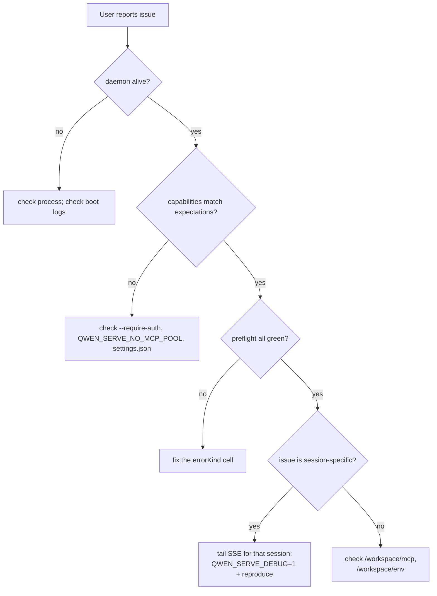

# Observability & Debugging (English)

## Overview

`qwen serve` ships **today** with debug logging, structured preflight cells, and an in-memory permission audit ring. It does **not** today ship OpenTelemetry spans, Prometheus metrics, or a structured-log format — those land in Stage 1.5+. This doc is a pragmatic guide for the current surface plus the gaps to be aware of when triaging issues.

## What's available today

| Surface | Where | Use |
|---|---|---|
| `QWEN_SERVE_DEBUG` stderr logging | `bridge.ts:287-295` and call sites | Set the env var to `1` / `true` / `on` / `yes` (case-insensitive) to get verbose `qwen serve debug: ...` lines on stderr. |
| `/health` | route in `server.ts` | Liveness probe. `?deep=1` returns extended info. |
| `/capabilities` | route in `server.ts` | Pre-flight feature surface (see [`11-capabilities-versioning.md`](./11-capabilities-versioning.md)). |
| `/workspace/preflight` | route → `DaemonStatusProvider` | Structured readiness cells (Node version, CLI entry, ripgrep, git, npm, ACP-level cells when child is alive). |
| `/workspace/env` | route → `DaemonStatusProvider` | Daemon process env snapshot (presence of secret env vars, never values; proxy URLs stripped of creds). |
| `/workspace/mcp` | route → bridge extMethod | Pool / budget / refusal snapshot. |
| `/workspace/skills`, `/workspace/providers` | routes | Live ACP-side snapshots (returns idle empty when no session). |
| Per-session SSE | `GET /session/:id/events` | Real-time event firehose. |
| `/demo` debug console | `GET /demo` (`packages/cli/src/serve/demo.ts`) | Browser-accessible single-page console (chat + event log + workspace inspector + permission UX). Open `http://127.0.0.1:4170/demo` on loopback — the fastest way to exercise the daemon end-to-end without writing SDK code. See [`02-serve-runtime.md`](./02-serve-runtime.md) for the loopback-vs-auth registration rules. |
| `PermissionAuditRing` | `permissionAudit.ts:1-60` | In-memory FIFO (512 entries) of permission decisions. |
| `mediator`'s `decisionReason` audit trail | `permissionMediator.ts:80-100+` | Internal structured "why did this resolve like that" records. |

## What's NOT there yet

- **No OpenTelemetry spans / traces.** The `docs/developers/development/telemetry.md` reference mentions only one daemon-relevant field (`mcp_servers`).
- **No Prometheus / metrics endpoint.** No `process_cpu_seconds_total`, `http_requests_total`, `event_bus_queue_depth` etc.
- **Stderr logging is unstructured.** Lines are prefixed `qwen serve debug:` / `qwen serve:` but they are plain strings, not JSON.
- **No per-request `requestId` correlation.** Multi-line debug output for one HTTP request isn't trivially groupable.
- **No external audit sink wiring** for `PermissionAuditRing` — the ring exists but the hooks to fan-out to a SIEM / external store aren't there yet.

Stage 1.5+ is where these gaps close (the issue [#3803](https://github.com/QwenLM/qwen-code/issues/3803) §08 Roadmap items).

## Debugging recipes

### 1. Is the daemon alive?

```bash
curl -s http://127.0.0.1:4170/health
# {"status":"ok"}

curl -s 'http://127.0.0.1:4170/health?deep=1' | jq
# {"status":"ok","workspaceCwd":"/path","sessions":N,...}
```

If 401 on loopback, check `--require-auth` is on (or `QWEN_SERVE_DEBUG=1` for boot logs).

### 2. What features does this daemon advertise?

```bash
curl -s http://127.0.0.1:4170/capabilities | jq
```

Look for: `mcp_workspace_pool` (F2 on?), `require_auth` (hardened?), `permission_mediation.modes` (which policies?), `policy.permission` (which one is active?).

### 3. What's the daemon-host readiness?

```bash
curl -s http://127.0.0.1:4170/workspace/preflight | jq
```

Cells with `status: 'not_started'` are ACP-level; they populate after the first session attaches. Cells with `status: 'fail'` come with a closed `errorKind` (see [`18-error-taxonomy.md`](./18-error-taxonomy.md)) — render structured remediation.

### 4. Tail a session's SSE in the terminal

```bash
curl -N -H 'Accept: text/event-stream' \
     -H 'Authorization: Bearer XYZ' \
     -H 'X-Qwen-Client-Id: debug-tail' \
     'http://127.0.0.1:4170/session/<sid>/events?lastEventId=0'
```

`-N` disables curl's output buffering. `lastEventId=0` replays from start.

### 5. Why did a permission resolve that way?

The `PermissionAuditRing` is in-memory; no HTTP surface today exposes it. Set `QWEN_SERVE_DEBUG=1` and re-run; the mediator emits structured stderr lines on every vote / resolution carrying `decisionReason.type`. Future PR will expose the ring via an HTTP route.

### 6. Where's the slow client?

`slow_client_warning` fires once per overflow episode at 75% queue fill. Subscribe to a session's SSE and watch for the synthetic frame; its payload carries `queueSize`, `maxQueued`, `lastEventId`. Repeated warnings = a sticky slow consumer; investigate the SDK consumer's `for await` loop.

### 7. Why was an MCP server refused?

`/workspace/mcp` snapshot's per-cell `disabledReason: 'budget'` + `refusedServerNames` list + the `mcp_child_refused_batch` SSE event together tell you what got refused this pass. Cross-check against `/capabilities`'s `mcp_guardrails.modes` (is `enforce` even active?) and the live `--mcp-client-budget` (visible in `getReservedSlots()`).

### 8. The daemon won't shut down

First signal triggers graceful shutdown (see [`02-serve-runtime.md`](./02-serve-runtime.md)). If it's hung past 10s, look at:
- A wedged ACP child not responding to graceful close.
- Long-lived SSE connections holding the HTTP `server.close()` open past `SHUTDOWN_FORCE_CLOSE_MS` (5s).

A **second** SIGTERM/SIGINT triggers `bridge.killAllSync()` + `process.exit(1)`. Use it deliberately.

## Workflow

### A typical triage flow



## State & Lifecycle

- `QWEN_SERVE_DEBUG` is read on every check (`isServeDebugLoggingEnabled()`), so toggling it doesn't require a restart — but the daemon was already booted, so boot logs are gone unless the env was set at boot.
- `PermissionAuditRing` is bounded (512 entries, FIFO). Older entries are silently dropped.
- `DaemonStatusProvider` rebuilds cells per request (no caching) — preflight calls are not free; don't poll harder than necessary.

## Dependencies

- `process.stderr.write` (no external logging framework).
- `node:process` for env / signals.
- No OTel SDK, no Prometheus client, no external sink wiring today.

## Configuration

| Knob | Effect |
|---|---|
| `QWEN_SERVE_DEBUG` | Enable verbose stderr (see [`17-configuration.md`](./17-configuration.md)). |
| `PermissionAuditRing` size | Hard-coded 512; not configurable today. |
| `slow_client_warning` thresholds | `0.75` / `0.375` hard-coded in `eventBus.ts`. |

## Caveats & Known Limits

- **Unstructured logs.** Lines are plaintext; parsing them programmatically is fragile. Don't build dashboards off `stderr` grep.
- **No correlation id.** Tying a "permission denied" stderr line to the originating HTTP request is by-eye; structured logs land in Stage 1.5+.
- **`/workspace/preflight`'s ACP-level cells require a session to be alive.** An idle daemon will show `status: 'not_started'` for auth / MCP / skills / providers — that's expected, not a failure.
- **`/workspace/env` redacts secret values** but reports their presence; never log the response in places that would expose presence to an untrusted audience.
- **The audit ring is process-local.** Daemon restart loses the history.
- **No load-test recipes.** Performance baselines live in `test/perf-daemon-baseline` (a branch); this doc isn't the right place for them.

## References

- `packages/cli/src/serve/daemonStatusProvider.ts:41-287`
- `packages/cli/src/serve/permissionAudit.ts:1-60`
- `packages/acp-bridge/src/bridge.ts:287-295` (`isServeDebugLoggingEnabled`, `writeServeDebugLine`)
- `packages/acp-bridge/src/permissionMediator.ts:80-100+` (`PermissionDecisionReason`)
- Configuration: [`17-configuration.md`](./17-configuration.md).
- Error taxonomy: [`18-error-taxonomy.md`](./18-error-taxonomy.md).
- User-facing operator guide: [`../../users/qwen-serve.md`](../../users/qwen-serve.md).

---

# 可观测性与调试 (中文)

## 概览

`qwen serve` **当下**带 debug 日志、结构化 preflight cell、内存权限审计环。**没有**当下提供 OpenTelemetry span、Prometheus 指标、结构化日志格式 —— 这些落在 Stage 1.5+。本文是一份针对当前 surface 的实用指南，外加排查时应当意识到的现状缺口。

## 当下有什么

| Surface | 位置 | 用途 |
|---|---|---|
| `QWEN_SERVE_DEBUG` stderr 日志 | `bridge.ts:287-295` 及调用点 | env 设 `1` / `true` / `on` / `yes`（不区分大小写），stderr 出现 `qwen serve debug: ...` 行 |
| `/health` | `server.ts` 路由 | Liveness 探针；`?deep=1` 返回扩展信息 |
| `/capabilities` | `server.ts` 路由 | pre-flight feature（见 [`11-capabilities-versioning.md`](./11-capabilities-versioning.md)） |
| `/workspace/preflight` | 路由 → `DaemonStatusProvider` | 结构化 readiness cell（Node 版本、CLI 入口、ripgrep、git、npm，子进程活着后多出 ACP 级 cell） |
| `/workspace/env` | 路由 → `DaemonStatusProvider` | daemon 进程 env 快照（机密 env 只报存在性、剥去 proxy URL 凭证） |
| `/workspace/mcp` | 路由 → bridge extMethod | 池 / 预算 / 拒绝快照 |
| `/workspace/skills`、`/workspace/providers` | 路由 | ACP 侧实时快照（无 session 时返回空 idle） |
| per-session SSE | `GET /session/:id/events` | 实时事件流 |
| `/demo` 调试控制台 | `GET /demo`（`packages/cli/src/serve/demo.ts`） | 浏览器可访问的单页控制台（聊天 + 事件日志 + workspace 检视 + 权限 UX）。loopback 上 `http://127.0.0.1:4170/demo` 直接开 —— 不写 SDK 就能端到端把 daemon 跑起来的最快方式。loopback-vs-auth 注册规则见 [`02-serve-runtime.md`](./02-serve-runtime.md) |
| `PermissionAuditRing` | `permissionAudit.ts:1-60` | 内存 FIFO（512 条）权限决策 |
| mediator 的 `decisionReason` 审计 | `permissionMediator.ts:80-100+` | 内部结构化「为什么这样裁决」记录 |

## 当下**没有**什么

- **没有 OpenTelemetry span / trace**。`docs/developers/development/telemetry.md` 只提到一个 daemon 相关字段（`mcp_servers`）。
- **没有 Prometheus / metrics 端点**。没有 `process_cpu_seconds_total`、`http_requests_total`、`event_bus_queue_depth` 等。
- **stderr 日志非结构化**。行带 `qwen serve debug:` / `qwen serve:` 前缀但是纯字符串，不是 JSON。
- **没有 per-request `requestId` 关联**。一次 HTTP 请求的多行 debug 输出不易整组。
- **`PermissionAuditRing` 无外部 audit sink 接线** —— 环存在，但向 SIEM / 外部存储扇出的钩子还没。

Stage 1.5+ 会闭合这些缺口（issue [#3803](https://github.com/QwenLM/qwen-code/issues/3803) §08 Roadmap）。

## 调试套路

### 1. daemon 还活着吗？

```bash
curl -s http://127.0.0.1:4170/health
# {"status":"ok"}

curl -s 'http://127.0.0.1:4170/health?deep=1' | jq
# {"status":"ok","workspaceCwd":"/path","sessions":N,...}
```

loopback 上 401 → 看 `--require-auth` 是否开（或 `QWEN_SERVE_DEBUG=1` 看启动日志）。

### 2. daemon 广播了哪些 feature？

```bash
curl -s http://127.0.0.1:4170/capabilities | jq
```

看：`mcp_workspace_pool`（F2 开？）、`require_auth`（加固？）、`permission_mediation.modes`（支持哪些策略？）、`policy.permission`（激活哪一条？）。

### 3. daemon-host readiness 如何？

```bash
curl -s http://127.0.0.1:4170/workspace/preflight | jq
```

`status: 'not_started'` 是 ACP 级；首次 session attach 后才填。`status: 'fail'` 带封闭 `errorKind`（见 [`18-error-taxonomy.md`](./18-error-taxonomy.md)），渲染结构化修复。

### 4. 终端里 tail 一个 session 的 SSE

```bash
curl -N -H 'Accept: text/event-stream' \
     -H 'Authorization: Bearer XYZ' \
     -H 'X-Qwen-Client-Id: debug-tail' \
     'http://127.0.0.1:4170/session/<sid>/events?lastEventId=0'
```

`-N` 关 curl 输出 buffer。`lastEventId=0` 从头重放。

### 5. 这次权限为什么这么 resolve？

`PermissionAuditRing` 是内存的；今天没 HTTP surface 暴露。开 `QWEN_SERVE_DEBUG=1` 重跑；mediator 每次投票 / 裁决在 stderr 出结构化行，带 `decisionReason.type`。后续 PR 会通过 HTTP 路由暴露 ring。

### 6. 慢消费者在哪？

`slow_client_warning` 每个 overflow episode 在队列 75% 满时发一次。订阅 session SSE 看合成帧；payload 带 `queueSize`、`maxQueued`、`lastEventId`。重复警告 = 一个粘住的慢消费者；查 SDK 消费方的 `for await` 循环。

### 7. 为什么某 MCP server 被拒？

`/workspace/mcp` 快照的 per-cell `disabledReason: 'budget'` + `refusedServerNames` 列表 + `mcp_child_refused_batch` SSE 事件合起来告诉你这一 pass 拒了什么。对照 `/capabilities` 的 `mcp_guardrails.modes`（`enforce` 是否激活？）与 live `--mcp-client-budget`（在 `getReservedSlots()` 可见）。

### 8. daemon 关不掉

第一信号触发优雅退出（见 [`02-serve-runtime.md`](./02-serve-runtime.md)）。卡过 10s 时看：
- 卡住的 ACP 子进程不响应 graceful close。
- 长 SSE 把 HTTP `server.close()` 挂过 `SHUTDOWN_FORCE_CLOSE_MS`（5s）。

**第二个** SIGTERM/SIGINT 触发 `bridge.killAllSync()` + `process.exit(1)`，刻意用。

## 流程

### 典型 triage 流

> 见英文版「A typical triage flow」flowchart。

## 状态与生命周期

- `QWEN_SERVE_DEBUG` 每次检查时读（`isServeDebugLoggingEnabled()`），切换不需重启 —— 但 daemon 已启动后启动日志就没了，除非启动时就配上。
- `PermissionAuditRing` 有界（512 条，FIFO），老记录静默丢。
- `DaemonStatusProvider` 每请求重建 cell（无缓存），preflight 不便宜，别没必要狂轮询。

## 依赖

- `process.stderr.write`（无外部日志框架）。
- `node:process` 看 env / 信号。
- 当下无 OTel SDK、无 Prometheus client、无外部 sink。

## 配置

| 旋钮 | 效果 |
|---|---|
| `QWEN_SERVE_DEBUG` | 开 stderr 详细（见 [`17-configuration.md`](./17-configuration.md)） |
| `PermissionAuditRing` size | 硬编码 512，当下不可配 |
| `slow_client_warning` 阈值 | `0.75` / `0.375` 硬编码在 `eventBus.ts` |

## 注意 & 已知局限

- **非结构化日志**。纯文本；程序解析脆弱。别用 `stderr` grep 建 dashboard。
- **没有 correlation id**。把「permission denied」stderr 行与触发 HTTP 请求关联是肉眼活；结构化日志在 Stage 1.5+。
- **`/workspace/preflight` 的 ACP 级 cell 需要 session 活着**。idle daemon 上 auth / MCP / skills / providers 都 `status: 'not_started'`，是预期不是失败。
- **`/workspace/env` 对机密只报存在不报值**；响应不要扔到对不可信受众暴露存在性也敏感的位置。
- **审计环是进程局部**，daemon 重启历史丢。
- **没有压测套路**。性能 baseline 在 `test/perf-daemon-baseline` 分支；本文不是合适的地方。

## 参考

- `packages/cli/src/serve/daemonStatusProvider.ts:41-287`
- `packages/cli/src/serve/permissionAudit.ts:1-60`
- `packages/acp-bridge/src/bridge.ts:287-295`（`isServeDebugLoggingEnabled`、`writeServeDebugLine`）
- `packages/acp-bridge/src/permissionMediator.ts:80-100+`（`PermissionDecisionReason`）
- 配置：[`17-configuration.md`](./17-configuration.md)。
- 错误分类：[`18-error-taxonomy.md`](./18-error-taxonomy.md)。
- 用户运维指南：[`../../users/qwen-serve.md`](../../users/qwen-serve.md)。
