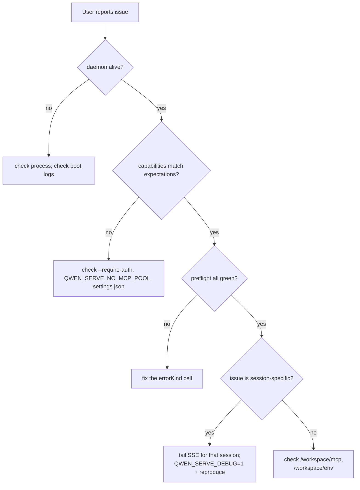

# 可观测性与调试

## 概览

`qwen serve` 当下带 **OpenTelemetry span instrumentation**、**结构化文件日志**（`DaemonLogger`）、**per-request access-log**、debug stderr 日志、结构化 preflight cell、内存权限审计环。本文是一份针对当前 surface 的实用指南，外加排查时应当意识到的现状缺口。

## 当下有什么

| Surface                                     | 位置                                            | 用途                                                                                                                                                                                                                                                 |
| ------------------------------------------- | ----------------------------------------------- | ---------------------------------------------------------------------------------------------------------------------------------------------------------------------------------------------------------------------------------------------------- |
| `QWEN_SERVE_DEBUG` stderr 日志              | `bridge.ts` 及调用点                            | env 设 `1` / `true` / `on` / `yes`（不区分大小写），stderr 出现 `qwen serve debug: ...` 行                                                                                                                                                           |
| OpenTelemetry span instrumentation          | `server.ts` `daemonTelemetryMiddleware`         | 每个 HTTP 请求包在 `withDaemonRequestSpan` 中；属性含 route、sessionId、clientId、status code。权限路由有独立 span。prompt lifecycle 全程 tracing。配置见 `settings.json` 的 `telemetry` 段                                                          |
| `DaemonLogger` 结构化文件日志               | `serve/daemonLogger.ts`                         | 结构化 JSON-like 日志行写入文件（启动时打印路径 `daemon log -> <path>`）；支持 `info`/`warn`/`error` 级别，上下文含 `route`、`sessionId`、`clientId`、`childPid`、`channelId` 等结构化字段                                                           |
| per-request access-log middleware           | `server.ts`（`bearerAuth` 之前注册）            | 每请求完成时记录 `method`、`path`、`status`、`durationMs`、`sessionId`、`clientId`（跳过 `GET /health` 和 heartbeat）。4xx+ 用 `warn` 级，成功用 `info` 级                                                                                           |
| `/health`                                   | `server.ts` 路由                                | Liveness 探针；`?deep=1` 返回扩展信息                                                                                                                                                                                                                |
| `/capabilities`                             | `server.ts` 路由                                | pre-flight feature（见 [`11-capabilities-versioning.md`](./11-capabilities-versioning.md)）                                                                                                                                                          |
| `/workspace/preflight`                      | 路由 → `DaemonStatusProvider`                   | 结构化 readiness cell（Node 版本、CLI 入口、ripgrep、git、npm，子进程活着后多出 ACP 级 cell）                                                                                                                                                        |
| `/workspace/env`                            | 路由 → `DaemonStatusProvider`                   | daemon 进程 env 快照（机密 env 只报存在性、剥去 proxy URL 凭证）                                                                                                                                                                                     |
| `/workspace/mcp`                            | 路由 → bridge extMethod                         | 池 / 预算 / 拒绝快照                                                                                                                                                                                                                                 |
| `/workspace/skills`、`/workspace/providers` | 路由                                            | ACP 侧实时快照（无 session 时返回空 idle）                                                                                                                                                                                                           |
| per-session SSE                             | `GET /session/:id/events`                       | 实时事件流                                                                                                                                                                                                                                           |
| `/demo` 调试控制台                          | `GET /demo`（`packages/cli/src/serve/demo.ts`） | 浏览器可访问的单页控制台（聊天 + 事件日志 + workspace 检视 + 权限 UX）。loopback 上 `http://127.0.0.1:4170/demo` 直接开 —— 不写 SDK 就能端到端把 daemon 跑起来的最快方式。loopback-vs-auth 注册规则见 [`02-serve-runtime.md`](./02-serve-runtime.md) |
| `PermissionAuditRing`                       | `permissionAudit.ts`                            | 内存 FIFO（512 条）权限决策                                                                                                                                                                                                                          |
| mediator 的 `decisionReason` 审计           | `permissionMediator.ts`                         | 内部结构化「为什么这样裁决」记录                                                                                                                                                                                                                     |

## 当下**没有**什么

- **没有 Prometheus / metrics 端点**。没有 `process_cpu_seconds_total`、`http_requests_total`、`event_bus_queue_depth` 等。
- **`PermissionAuditRing` 无外部 audit sink 接线** —— 环存在，但向 SIEM / 外部存储扇出的钩子还没。

## 调试套路

### 1. daemon 还活着吗？

```bash
curl -s http://127.0.0.1:4170/health
# {"status":"ok"}

curl -s 'http://127.0.0.1:4170/health?deep=1' | jq
# {"status":"ok","workspaceCwd":"/path","sessions":N,...}
```

loopback 上 401 → 看 `--require-auth` 是否开（或 `QWEN_SERVE_DEBUG=1` 看启动日志）。

### 2. daemon 广播了哪些 feature？

```bash
curl -s http://127.0.0.1:4170/capabilities | jq
```

看：`mcp_workspace_pool`（F2 开？）、`require_auth`（加固？）、`permission_mediation.modes`（支持哪些策略？）、`policy.permission`（激活哪一条？）。

### 3. daemon-host readiness 如何？

```bash
curl -s http://127.0.0.1:4170/workspace/preflight | jq
```

`status: 'not_started'` 是 ACP 级；首次 session attach 后才填。`status: 'fail'` 带封闭 `errorKind`（见 [`18-error-taxonomy.md`](./18-error-taxonomy.md)），渲染结构化修复。

### 4. 终端里 tail 一个 session 的 SSE

```bash
curl -N -H 'Accept: text/event-stream' \
     -H 'Authorization: Bearer XYZ' \
     -H 'X-Qwen-Client-Id: debug-tail' \
     -H 'Last-Event-ID: 0' \
     'http://127.0.0.1:4170/session/<sid>/events'
```

`-N` 关 curl 输出 buffer。`Last-Event-ID: 0` 请求重放 ring 内 `id > 0` 的事件。

### 5. 这次权限为什么这么 resolve？

`PermissionAuditRing` 是内存的；今天没 HTTP surface 暴露。开 `QWEN_SERVE_DEBUG=1` 重跑；mediator 每次投票 / 裁决在 stderr 出结构化行，带 `decisionReason.type`。后续 PR 会通过 HTTP 路由暴露 ring。

### 6. 慢消费者在哪？

`slow_client_warning` 每个 overflow episode 在队列 75% 满时发一次。订阅 session SSE 看合成帧；payload 带 `queueSize`、`maxQueued`、`lastEventId`。重复警告 = 一个粘住的慢消费者；查 SDK 消费方的 `for await` 循环。

### 7. 为什么某 MCP server 被拒？

`/workspace/mcp` 快照的 per-cell `disabledReason: 'budget'` + `refusedServerNames` 列表 + `mcp_child_refused_batch` SSE 事件合起来告诉你这一 pass 拒了什么。对照 `/capabilities` 的 `mcp_guardrails.modes`（`enforce` 是否激活？）与 live `--mcp-client-budget`（在 `getReservedSlots()` 可见）。

### 8. daemon 关不掉

第一信号触发优雅退出（见 [`02-serve-runtime.md`](./02-serve-runtime.md)）。卡过 10s 时看：

- 卡住的 ACP 子进程不响应 graceful close。
- 长 SSE 把 HTTP `server.close()` 挂过 `SHUTDOWN_FORCE_CLOSE_MS`（5s）。

**第二个** SIGTERM/SIGINT 触发 `bridge.killAllSync()` + `process.exit(1)`，刻意用。

## 流程

### 典型 triage 流



## 状态与生命周期

- `QWEN_SERVE_DEBUG` 每次检查时读（`isServeDebugMode()`，从 `debugMode.ts` 导出），切换不需重启 —— 但 daemon 已启动后启动日志就没了，除非启动时就配上。
- `PermissionAuditRing` 有界（512 条，FIFO），老记录静默丢。
- `DaemonStatusProvider` 每请求重建 cell（无缓存），preflight 不便宜，别没必要狂轮询。

## 依赖

- `process.stderr.write`（debug stderr）。
- `DaemonLogger`（结构化文件日志）。
- OpenTelemetry SDK（`initializeTelemetry`、`createDaemonBridgeTelemetry`）。
- `node:process` 看 env / 信号。

## 配置

| 旋钮                           | 效果                                                                              |
| ------------------------------ | --------------------------------------------------------------------------------- |
| `QWEN_SERVE_DEBUG`             | 开 stderr 详细（见 [`17-configuration.md`](./17-configuration.md)）               |
| `settings.json` `telemetry` 段 | 控制 OTel 行为：`enabled`、`otlpEndpoint`、`otlpProtocol`、per-signal endpoint 等 |
| `DaemonLogger` 日志路径        | boot 时自动生成，打印到 stderr `daemon log -> <path>`                             |
| `PermissionAuditRing` size     | 硬编码 512，当下不可配                                                            |
| `slow_client_warning` 阈值     | `0.75` / `0.375` 硬编码在 `eventBus.ts`                                           |

## 注意 & 已知局限

- **DaemonLogger 文件日志是结构化的**，可按 `route`/`sessionId`/`clientId` 过滤。`QWEN_SERVE_DEBUG` stderr 日志仍是非结构化纯文本。
- **OpenTelemetry span 已包含 per-request 关联**。每个 HTTP 请求的 span 属性带 route、sessionId、clientId，可通过 trace backend 关联。
- **`/workspace/preflight` 的 ACP 级 cell 需要 session 活着**。idle daemon 上 auth / MCP / skills / providers 都 `status: 'not_started'`，是预期不是失败。
- **`/workspace/env` 对机密只报存在不报值**；响应不要扔到对不可信受众暴露存在性也敏感的位置。
- **审计环是进程局部**，daemon 重启历史丢。
- **没有压测套路**。性能 baseline 在 `test/perf-daemon-baseline` 分支；本文不是合适的地方。

## 参考

- `packages/cli/src/serve/daemonStatusProvider.ts`
- `packages/cli/src/serve/daemonLogger.ts`（`DaemonLogger`、`buildDaemonLogLine`）
- `packages/cli/src/serve/debugMode.ts`（`isServeDebugMode`）
- `packages/acp-bridge/src/permissionMediator.ts`（`PermissionDecisionReason`）
- `packages/cli/src/serve/server.ts`（`daemonTelemetryMiddleware`、access-log middleware）
- 配置：[`17-configuration.md`](./17-configuration.md)。
- 错误分类：[`18-error-taxonomy.md`](./18-error-taxonomy.md)。
- 用户运维指南：[`../../users/qwen-serve.md`](../../users/qwen-serve.md)。
