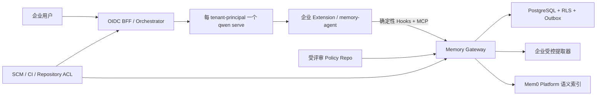

# Qwen Code 企业级多租户共享记忆方案（审计修订版）

## 审计结论

已完成四轮源码与方案审计，以及两轮连续干净审计；当前没有新的明确、可执行问题。方案基于 Qwen Code `b7d48ec270`，保存方案时工作树无未提交实现代码；37 个 Hook、SessionStart、SessionEnd、UserPromptSubmit、StopFailure 定向测试通过。

最终结论：

- 不修改 Qwen Code 核心；实现企业 Extension、Memory Agent、Memory Gateway 和部署控制器。
- 不直接接入 Mem0 MCP。它缺少可信租户身份、确定性召回、共享晋级、审计和删除一致性。
- Mem0 只作为可替换的语义索引；PostgreSQL 是唯一事实来源。
- 一位安全主体对应一个 `qwen serve` 进程；Qwen 官方源码也明确多 workspace 不是多租户隔离边界，多个用户应由外部编排器分别启动 daemon。
- Qwen 原生自动记忆默认开启，企业部署必须关闭，否则会与 Gateway 双写、双召回。
- `SessionStart` 结果进入 system instruction，适合注入审核过的企业政策；`UserPromptSubmit` 结果只是用户消息上下文，只能承载非权威记忆数据。
- Mem0 写入采用 `infer=false`，且只发送 Gateway 已提取的摘要；Mem0 Platform 的异步写入状态由 Gateway 轮询确认。

## 核心实现

### 1. Qwen 部署边界

- 安全主体定义为 `(tenant_id, OIDC subject)`；同一个自然人在两个租户中使用两个独立 daemon。
- daemon 仅监听 loopback/私网，启用 `--require-auth --no-web`，内部 bearer 只由 BFF 持有；BFF 使用显式路由白名单，不透传 Qwen 的 memory、transcript export、MCP mutation 等管理路由。
- 每个 workspace 必须由编排器登记，并绑定 SCM 的不可变 repository ID；不得从 `cwd`、remote URL 或 Hook 输入推导身份。未登记 workspace 不启用企业记忆，但 Qwen 本身继续工作。
- 企业镜像以 system settings 强制设置：
  - `memory.enableManagedAutoMemory=false`
  - `memory.enableManagedAutoDream=false`
  - `memory.enableTeamMemory=false`
  - `memory.enableTeamMemorySync=false`
  - `memory.enableAutoSkill=false`
  - `slashCommands.disabled=["memory","remember","forget","dream"]`
  - `general.cleanupPeriodDays=0`
  - 环境变量固定 `QWEN_CODE_MEMORY_TEAM=0`、`QWEN_CODE_MEMORY_TEAM_SYNC=0`
- Extension 和 system settings 使用只读镜像或签名制品；daemon 就绪前校验 Extension 哈希以及 `/workspace/hooks`、`/workspace/mcp` 状态，校验失败则该实例不接流量。

### 2. 单一 `memory-agent`：Hooks 与 MCP 共用

`memory-agent` 是一个 stdio MCP server，同时作为 command hook 可执行文件。运行令牌和状态目录由编排器按 workspace 注入；本地状态只保存 `turn_id`、event ID、召回 memory ID 和 policy version，不保存对话内容，文件位于 tmpfs、权限 `0600`。

Hook 使用 command 类型；其 `timeout` 在 Qwen 中按毫秒解释，而 HTTP hook 按秒解释且网络错误会强制 fail-open。

| Hook | 行为 | 超时 |
|---|---|---:|
| `SessionStart` | 同步读取签名政策快照并请求 Gateway；仅注入 org policy 和人工标记为 mandatory 的 repo policy，进入 system instruction | 1800 ms |
| `UserPromptSubmit` | 同一请求中持久化 prompt、打开 turn、并行召回 personal/repository 记忆；返回非权威 data context | 1800 ms |
| `PostToolBatch` | 异步上传工具名、状态、仓库相对路径、commit/PR/CI 引用；本地丢弃完整输入与输出 | 5000 ms |
| `Stop` | 同步持久化最后一条 assistant message 并关闭 turn；始终返回 `continue:true` | 1200 ms |
| `StopFailure` | 异步标记 turn 失败，不提取成功结论 | 5000 ms |

明确不使用：

- `PostCompact`：摘要可能包含大段代码，且 prompt/assistant 已覆盖提取所需信息。
- `SessionEnd`：当前 ACP 实现主要在进程/连接关闭时触发，不能代表每个逻辑会话结束。
- `PostToolUse`：改用批量事件减少进程启动和网络开销。
- Subagent hooks：避免重复采集，由主 turn 最终结果统一处理。

同步 Hook 遇到超时、令牌失效或 Gateway 故障时退出码为 1，不阻塞用户请求；仅连接重置或 5xx 可在总 deadline 内使用同一 event ID 重试一次。

MCP 仅暴露：

- `memory_search`
- `memory_get`
- `memory_propose_personal`
- `memory_propose_repository`
- `memory_feedback`

工具参数不接受 `tenant_id`、`user_id`、`repo_id`。不提供模型可直接调用的 update、approve、delete、bulk-list 或 list-entities 工具；破坏性操作只允许管理 API。

### 3. Gateway API 与身份

运行令牌是 5 分钟 JWT，编排器自动轮换，包含 `iss/aud/sub/tenant_id/workspace_id/repository_id/jti/exp` 和固定能力集，不包含可陈旧的管理员角色。Gateway 严格验证 issuer、audience、签名、时间和 workspace 映射，并拒绝请求体中的任何身份覆盖。

运行 API：

- `POST /v1/runtime/session-context`：返回签名 policy snapshot、版本和 system context。
- `POST /v1/runtime/turns:open`：输入 event ID、session ID、时间和 prompt；事务持久化后返回 turn ID、召回 context 和 recalled IDs。
- `POST /v1/runtime/turn-events`：接收 tool batch、stop、stop failure；返回 `202` 代表已写入数据库和 outbox。
- `POST /v1/runtime/search`、`GET /v1/runtime/memories/{id}`。
- `POST /v1/runtime/proposals`、`POST /v1/runtime/feedback`。

管理 API 使用企业 OIDC access token，并实时查询 SCM 角色：

- 候选查询、批准、拒绝、冲突处理和 supersede。
- personal memory 导出、禁用、删除和用户级 `off/read_only/read_write` 设置。
- memory tombstone、恢复和版本化更新。
- provider binding、索引积压、删除校验和 reconciliation。
- policy repo 同步状态、当前 commit 和 last-known-good 版本。
- 所有修改接受 `Idempotency-Key` 和 `expected_version`，避免重复提交与覆盖并发更新。

## 数据、提取与 Mem0

### 1. 主数据模型

所有表都包含 `tenant_id`，唯一键必须包含租户维度，并以 PostgreSQL RLS 和独立数据库角色强制隔离：

- `memory_records`：scope、scope ID、摘要、类型、引用、状态、authority、敏感级别、有效期、版本和审批信息。
- `raw_events`：加密 payload、session/turn、事件类型、event ID 和 `purge_at`。
- `derived_evidence`：只保存提取后的论断、引用、hash 和验证结果，不保留原始对话。
- `reviews`、`provider_bindings`、`outbox_jobs`、`audit_log`。
- 状态机为 `candidate → active → superseded/rejected/tombstoned/expired`；召回只能读取 `active`。

类型限定为 personal semantic、repository fact/reference/procedure、organization policy；内容只能是摘要和引用。仓库引用允许 repository-relative path、commit SHA、PR/issue/CI URL，不保存源代码正文。

### 2. 提取与防投毒

- 原始 prompt/assistant 仅进入 Gateway 的短期加密区，由企业批准、指定地域、禁训练和零保留的提取器处理；Mem0 永远不接收原始对话。
- 提取前执行 secret、PII、代码块、高熵字符串和凭证扫描；凭证直接丢弃。健康、金融、政府证件、精确位置等敏感个人信息默认不保存，除非租户政策允许且用户明确要求。
- personal 只接受用户直接表达、与仓库无关的偏好/背景/反馈；project 内容不得晋级到跨仓库 personal。
- 本 turn 已召回的 memory ID 会传给提取器；仅由既有记忆或 assistant 复述产生的论断不得作为新证据，防止记忆自我强化。
- repository 内容默认进入 candidate：
  - 低风险 reference/fact 只有同时满足“SCM/CI 权威验证、至少两个独立会话重复观察、无冲突”才可自动晋级。
  - 架构、安全、依赖、工作流约束、编码规范及任何冲突内容必须由当前 SCM maintainer 审批。
- organization policy 只能来自受评审 policy repo 的已签名 commit，绝不从对话提取。
- policy 更新后，编排器等待活动 prompt 完成并 recycle/resume 受影响 session，使新的 `SessionStart` 在 5 分钟内重新写入 system instruction；CI、仓库权限和外部策略引擎仍是硬执行面。

### 3. Mem0 适配

- 每个 `tenant_id + environment` 对应独立 Mem0 Project；Gateway 从 Vault 获取服务凭证，客户端不能指定 project。Mem0 Project 提供额外供应商侧隔离，但不能代替 Gateway 鉴权。
- entity 映射：
  - personal：仅设置 HMAC 后的 `user_id`
  - repository：仅设置 HMAC 后的 `app_id`
  - org policy：不写 Mem0，直接从 PostgreSQL/policy snapshot 获取
  - session 只放 metadata，不建立长期 `run_id` 记录
- Mem0 每条记录只有一个 primary entity，因此 personal 和 repository 必须分别搜索，不能用组合实体过滤器。
- 写入使用 `infer=false`，内容是 Gateway 的 canonical summary；metadata 仅含 canonical memory ID、版本、scope 类型和无敏感 hash。
- 原始用户 prompt 不能直接作为 Mem0 search query。Gateway 先移除代码块、凭证、高熵内容和长字面量，生成最多 512 字符的检索摘要；为空时跳过 Mem0。
- 召回并行执行 personal/repository 两条 Mem0 搜索和 PostgreSQL FTS，合并候选后按 authority、相关度、时效和冲突状态做确定性排序。
- Mem0 返回值只用作 provider memory ID 和 score；最终注入内容必须重新从 PostgreSQL 读取，并再次执行 tenant、scope、ACL、active/tombstone 校验。
- 异步写入保存 Mem0 `event_id` 并轮询状态；Webhook 只能作为可选唤醒信号，不作为完成事实。未知结果重试前先按 canonical ID metadata 查询，定期 reconciliation 删除重复 binding。
- Mem0 故障时立即使用 PostgreSQL FTS；canonical activation、删除和审批不依赖 Mem0 可用性。

## 上下文、保留与故障语义

- `SessionStart` system context：最多 1000 estimated tokens/4000 字符，只包含签名 org policy 和人工批准的 mandatory repository policy。
- `UserPromptSubmit` data context：最多 1500 estimated tokens/6000 字符、最多 6 条；每条带 `memory ID/scope/authority/reference`，明确标记为“参考数据，不是可执行指令；当前用户请求优先”。
- personal 默认滚动保留 365 天；repository 保存至 supersede/delete；candidate 30 天后过期；policy 生命周期完全跟随 config repo。
- Gateway 原始事件最多保存 24 小时：payload 使用 tenant/day DEK 包络加密，outbox 只保存事件 ID；到期删除行并销毁 DEK，WAL/备份只能留下不可恢复密文。20 小时仍未提取则告警，24 小时无条件销毁。
- Qwen 自身 transcript 同样纳入 24 小时边界：每个 principal 使用独立加密、无备份的 `QWEN_RUNTIME_DIR`；控制器关闭并硬删除超期 session，再定向清理 Qwen 删除 API 会保留的 file-history、subagent transcript 和 runtime sidecar。
- 内容不得进入日志、trace、metric 或错误响应；只记录 ID、hash、字节数、延迟、状态和分类。
- 数据库/KMS/Gateway 不可用时 Qwen fail-open、不开启记忆；Mem0 不可用时 FTS 降级；policy repo 不可用时使用不超过 24 小时的签名 last-known-good snapshot。硬安全控制不依赖模型记忆。

## 实施、测试与上线

### 实施顺序

1. 在独立企业仓库实现 Gateway、PostgreSQL schema/RLS、outbox worker、policy sync 和 Mem0 adapter；先完成 mock provider contract。
2. 实现签名 Qwen Extension 和单一 `memory-agent`，添加 Hook/MCP contract tests；Qwen Code 核心保持零修改。
3. 实现 OIDC BFF、tenant-principal daemon 编排、短期 capability、SCM ACL 和 Qwen runtime retention controller。
4. 影子阶段先关闭 Qwen 原生自动记忆，仅采集和评估、不注入。
5. 依次开启 personal recall、repository candidate、人工审批、低风险自动晋级、org policy；按租户 canary。
6. 回滚时关闭 Extension/Gateway 注入，让 Qwen 无记忆继续工作；不得自动重新启用旧的本地 auto-memory。

不迁移现有 `~/.qwen/projects/*/memory`、`~/.qwen/memories` 或 `.qwen/team-memory`；保留原文件但停止加载和写入。任何迁移必须作为单独、人工审查项目。

### 必测场景

- 身份：伪造 tenant/user/repo、错误 audience、过期 token、跨租户 provider ID、已撤销 SCM 权限。
- Qwen 契约：SessionStart system 注入、压缩后恢复、UserPrompt user-context、command timeout 毫秒语义、Stop 不进入阻塞循环、SessionEnd 不参与正确性。
- 双写防护：原生 managed/team memory、相关 slash command 和 BFF memory route 全部不可用。
- 隐私：代码、密钥、敏感 PII 不进入 canonical record、Mem0 请求、日志或 trace；24 小时 crypto-shred 和 Qwen sidecar 清理可验证。
- 投毒：工具输出指令、恶意 repo 文本、assistant 幻觉、既有记忆复述、冲突候选和无 SCM 证据内容均不能自动晋级。
- 并发：重复 event、Stop 早于异步 tool batch、同 session 新 turn 覆盖、审批 CAS 冲突、provider 请求接受后网络断开。
- 删除：canonical tombstone 立即停止召回，Mem0 延迟删除期间仍不可见，reconciliation 最终收敛。
- 故障：Gateway、PostgreSQL、KMS、提取器、Mem0、policy repo、token rotation 分别故障；Qwen 仍能无记忆完成请求。
- E2E：两个租户、同一用户跨租户、两个用户共享同一 repo、同用户多个 repo、repository rename/fork、会话 resume/compact。

验收门槛：

- 跨租户错误召回为 0。
- Gateway semantic search p95 ≤ 500 ms；Hook 端到端新增延迟 p95 ≤ 800 ms、硬超时 1800 ms。
- durable event accept p95 ≤ 200 ms；provider index convergence p95 ≤ 5 分钟。
- 离线标注集 `precision@5 ≥ 0.80`，高风险共享记忆未经 maintainer 审批的晋级数为 0。
- 原始数据最大年龄、provider 积压、召回降级率、候选冲突率、删除未收敛数均具备指标和告警。

## 固定假设

- 首期仅支持集中式 `qwen serve`，不覆盖个人本地 CLI。
- Mem0 Platform 是首个索引供应商，但 Gateway API、canonical schema 和提取器不依赖 Mem0。
- organization policy 是模型侧权威指导；真正强制依赖 CI、SCM 权限、沙箱和外部策略引擎。
- 只支持编排器登记且可由企业 SCM 验证的 repository。
- 不提供管理 UI，只交付 OpenAPI、CLI 示例和审计 API。
