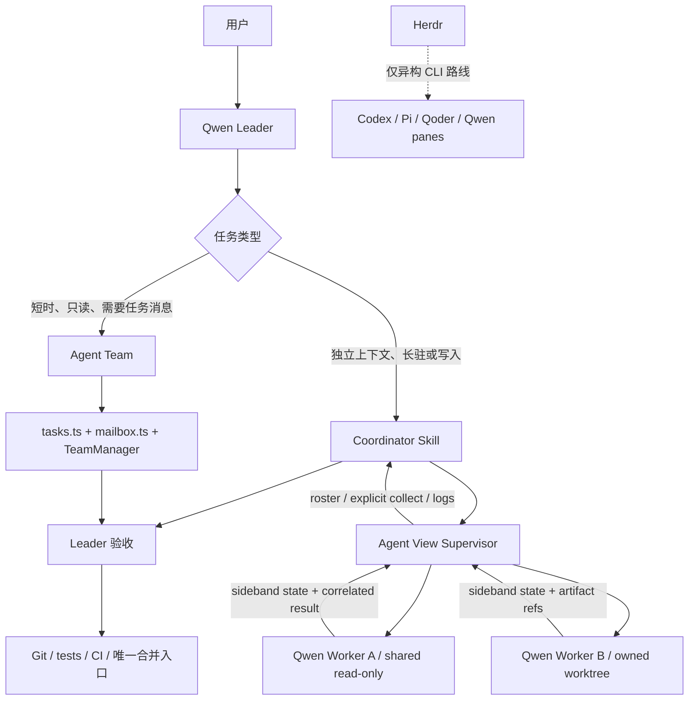

# Qwen Code 原生多 Agent 协作实施计划

> 状态：Proposed
> 调研基线：Qwen Code `8566385a`（2026-08-04）；Herdr `6f31149`、v0.8.0（2026-08-07）
> 关联：Qwen Code [#8718](https://github.com/QwenLM/qwen-code/issues/8718)、[#6383](https://github.com/QwenLM/qwen-code/issues/6383)、[#7799](https://github.com/QwenLM/qwen-code/pull/7799)–[#7803](https://github.com/QwenLM/qwen-code/pull/7803)；Herdr [Discussion #1597](https://github.com/herdrdev/herdr/discussions/1597)

## 1. 决策摘要

Qwen Code 不需要从零实现一套 Herdr，也不应该把 Herdr 变成原生多 Qwen 协作的强依赖。仓库里已经存在两块互补基础：

- **Agent Team** 已经负责同一 Qwen 进程内的协作语义：Leader、共享任务、owner、依赖、消息、plan approval 和 cooperative shutdown。
- **Agent View supervisor** 正在补独立 Qwen 会话的运行能力：PTY、持久会话、attach、logs、respawn 和 roster。

因此推荐路线是：

1. 先完成并加固 Agent View 的现有堆叠 PR，不另建进程管理框架。
2. 用一个显式启用的 Coordinator Skill 验证“Leader + 2–3 个只读独立 Qwen worker”的最小闭环。
3. 验证确有收益后，再让写入 worker 使用 Agent View 管理的独立 Git worktree。
4. Hands-up 先做成带任务关联的结构化求助；handoff 首版由 Leader 重新分派结果包完成，不做分布式 ownership 协议。
5. 只有明确需要 Codex、Pi、Qoder 等异构完整 CLI 时，才采用 Herdr，或另立设计把外部 runtime 接入 Agent Team。

这不是把 Agent Team 和 Agent View 强行合并成一个系统。首期两者分工如下：

| 使用场景 | 首选机制 |
| --- | --- |
| 短时搜索、分析、Review；需要任务板和队友消息 | Agent Team |
| 长驻、可重连、独立上下文或写入 worktree 的完整 Qwen 会话 | Agent View + Coordinator Skill |
| 同题多模型竞争和择优 | Arena |
| Qwen + Codex/Pi/Qoder 等异构 CLI | Herdr；后续再评估 Team runtime bridge |

首版禁止嵌套 fan-out：所有 Agent View worker profile（只读和 writer）都禁用 delegation、Team、Arena、background 和相关 Slash Command；`qwen --bg` 从 Agent View worker 或 Agent Team teammate 发起时直接拒绝。Coordinator 每次最多创建 3 个 worker，取得真实成本与效果数据后再放宽；这不是全局配额。

## 2. 当前事实与缺口

### 2.1 Qwen Code 当前已有能力

| 组件 | 已有能力 | 当前缺口 |
| --- | --- | --- |
| 普通 Subagent / Fork | 并行、前后台、消息续跑、模型和工具限制 | 都是 Qwen 内部 Agent；Fork 无 worktree |
| Agent Team | task DAG、owner、claim、mailbox、plan approval、shutdown | 实验性；同进程；named teammate 共享 cwd；活跃 runtime 不能冷恢复 |
| Arena | 多模型并行、独立 worktree、结果比较 | 是竞争模式，不是长期协作团队 |
| `create_sub_session` | daemon 中创建有独立 transcript 的 Qwen 子会话 | 只用于 `qwen serve`/ACP bridge；不是 Interactive Agent View driver |
| Agent View 主干 | 认证 supervisor socket、协议、session store、terminal bridge | 目前 handler 只有 status/list/shutdown；不能启动 managed worker |
| `GitWorktreeService` / `--worktree` | 创建、校验、恢复、清理工作树 | Agent Team 和 `qwen --bg` 尚未形成可靠的 ownership 闭环 |

截至 2026-08-08，Agent View 的用户可用部分仍在开放的堆叠 PR 中：

- #7800：PTY workers；状态为 open/blocked。
- #7801：session lifecycle；状态为 open/dirty，基于 #7800。
- #7802：CLI commands；状态为 open/unstable，基于 #7801。
- #7803：roster UI；状态为 open/dirty，基于 #7802。

所以不能把 #7799 已合并等同于“Agent View 已经可用”，也不应在这四个 PR 尚未收口时从 main 复制一套相同能力。

### 2.2 现有 Agent View 方案还需补的正确性边界

开放 PR 中的 runtime 方向是对的，但在自动协作之前必须补齐：

1. worker → supervisor 事件没有完整的单调顺序保证；旧的 `working` 不能覆盖新的 `idle`/`failed`。
2. `idle` 是进程/会话状态，不代表某个委派任务成功。
3. prompt、result 和 wait 尚需稳定的 turn/prompt correlation；不能用“最近一次 idle”作为某次委派的 ACK。
4. 输出末尾的 `?`/`？` 只能做 UI hint，不能作为 `needs_input` 的自动化真相源。
5. Agent View sideband token 不能泄露给 worker 启动的 shell、hook、MCP、monitor 或嵌套 Qwen 子进程。
6. 当前 `qwen --bg` 在 worktree startup 之前提前返回；`--bg --worktree` 不能被当成已经支持。

安全边界必须写实：同一 OS 用户下、获得任意代码执行权限的恶意进程仍可能检查兄弟进程或用户文件；Agent View 不是 OS sandbox。首期 token 设计防止持久化泄漏、误继承、旧 worker 重放和普通跨 session 冒充，不宣称抵抗同 UID 的主动恶意进程。

### 2.3 Herdr 当前真实边界

Herdr 是持久 PTY/进程/worktree/状态观察控制平面，不是共享任务和消息协议：

- 强项：完整 CLI 长驻、断线重连、pane/workspace、raw terminal control、跨厂商 Agent、worktree 和远程观察。
- 不提供：task DAG、owner、claim、可靠 mailbox、turn 级 ACK、task handoff 或自动 transcript 共享。
- `agent prompt --wait` 等待生命周期状态，不精确对应某一个 turn。
- custom Qwen report 可以进入 `agent list/read/wait/rename`，但当前未知 Qwen 不能使用原生 `agent prompt/send-keys`，需要退回 `pane send-text/send-keys`。
- custom session source 不能获得 Herdr 原生冷恢复；adapter 需要自行保存 Qwen session ID 并调用 `qwen --resume`。

因此 Herdr 可以承载多个 Agent，但“B 的结果交给 C”仍需要 Leader 显式读取、裁剪并重新投递；Herdr 不会自动把所有输出注入其他 Agent 的上下文。

## 3. 目标与非目标

### 3.1 首个可发布目标

用户显式要求协作后，一个 Leader 能够：

1. 把可并行任务拆成最多 3 个自包含任务。
2. 启动独立 Qwen worker，Leader 自身保持可交互。
3. 准确看到每个 worker 的运行、求助、失败和结果状态。
4. 对 worker 追问、回答定向问题、取消或重新启动。
5. 只读 profile 通过越权测试后才可共享当前 checkout；否则也使用 disposable worktree。写入 worker 始终使用独立 worktree。
6. 通过结构化结果摘要、commit/patch 和测试证据回传，不搬运完整 transcript。
7. 由唯一 Leader 验收和合并；worker 不直接合并到目标分支。

### 3.2 首期明确不做

- 不实现自动全员广播、共享 transcript 或全局共享记忆。
- 不在共享 cwd 中运行两个并发 writer，也不实现文件锁。
- 不把 `idle`、`done` 或终端问号当作任务成功。
- 不新增第二套 task database；Agent View store 只保存 runtime/session 投影。
- 不让 Core 反向依赖 CLI 的 Agent View 模块。
- 不把现有 Backend 接口硬扩成 Codex/Pi adapter；它混合了终端、导航、显示和 Agent handle 职责。
- 不首发原子 Hands-off/Handoff、自动重试、自动审批或 peer-to-peer 自治。
- 不首发远程 supervisor、跨机器一致性或数据库/端口/缓存隔离框架。
- 不复用 daemon-only `create_sub_session` 作为 Interactive Agent View driver。
- 不让 Agent View 和 Herdr 同时拥有同一个 PTY、进程或 worktree。

## 4. 推荐架构



### 4.1 三类状态必须分开

| 状态平面 | 示例 | 权威来源 | 不能代表什么 |
| --- | --- | --- | --- |
| Runtime/session | starting、working、needs_input、idle、stopped、failed | Agent View worker-sideband + supervisor | 任务是否验收成功 |
| Task/attempt | pending、running、input_required、result_ready、accepted、rejected、cancelled | 首期由 Leader/Coordinator 持有；以后可复用 Agent Team | PTY 是否还活着 |
| Artifact | result、commit、patch、test evidence | worker 产物 + Git/测试 | 谁当前拥有任务 |

`completed` 也必须带与该次 prompt 对应的 ID；仅看到 session 变成 idle 不得推进依赖任务。

### 4.2 最小任务包

首期不新增 TypeScript task schema。机器 dispatch 接口将任务复制到 Agent View supervisor 的 session-owned artifact directory，并以 `0600` 保存 `task.md`；不让 worker 共享一个 checkout-local 结果目录。任务文件至少包含：

```text
coordination_id
task_id
attempt_id
role
objective
allowed_scope
write_mode: read-only | worktree
completion_criteria
```

`coordination_id`、`task_id` 和 `attempt_id` 都由程序生成 UUID，不接受模型文本作为目录名。启动命令使用 `--task-file` 读取有大小上限的源文件，再由 supervisor 复制到自己的 session directory；不把任意模型文本直接拼进 shell 命令。只读 worker 通过 sideband 返回最终文本，由 supervisor 在 ID 匹配后持久化为 `result.md`；worker 本身不获得写权限。写代码时再附 commit/patch 和测试证据。

result 作为不可信 worker 输出处理：标明来源、限制大小、保持 tool/result 角色，并且绝不插值到 shell 命令或 system prompt。

Agent View activity 只持久化 `coordinationId/taskId/attemptId` 三个 lineage label，供 collect 定位 session；它们不是 task status、owner 或新的任务数据库。其余任务正文保持普通文本，只有出现第二个 API consumer 后才升级为 protocol schema。

### 4.3 通信拓扑

首期只支持 hub-and-spoke：

```text
Worker A ── result/help ──> Leader ── task/answer ──> Worker B
```

不允许 worker 直接控制其他 worker。这样可以避免权限冒充、循环转发、上下文污染和难以追踪的 owner 变化。

## 5. 分阶段实施

### Phase 0：收口并加固 Agent View 基础设施

#### 0.1 合并现有堆叠 PR

严格按 #7800 → #7801 → #7802 → #7803 处理依赖和冲突，但不能先暴露入口再补安全：

1. #7800 合入 PTY worker 基础。
2. 下节 token/generation/sequence/correlation/真实 `needs_input` hardening 折入 #7801 或堆叠在 #7801 与 #7802 之间，并先通过验收。
3. 安全门通过后才合入 #7802 commands 和 #7803 roster UI。
4. 如果无法调整现有 stack，就让 `--bg` 和 roster 保持 feature-gated，直到 hardening 落地。

每一层先通过自身 focused tests，再推进下一层。此阶段不增加 Coordinator 或异构 Agent 功能。

主要文件（合入后）：

- `packages/cli/src/agent-view/pty-host.ts`
- `packages/cli/src/agent-view/pty-host-process.ts`
- `packages/cli/src/agent-view/worker-sideband.ts`
- `packages/cli/src/agent-view/supervisor-dispatch.ts`
- `packages/cli/src/agent-view/supervisor-process.ts`
- `packages/cli/src/agent-view/supervisor-store.ts`
- `packages/cli/src/commands/agent-daemon.ts`
- `packages/cli/src/commands/agent-session.ts`
- `packages/cli/src/commands/agents.ts`
- `packages/cli/src/ui/AppContainer.tsx`
- `packages/cli/src/ui/agent-view/*`

#### 0.2 安全与状态 hardening

1. `launch.json` 不持久化 sideband 明文 token。supervisor 在每次 spawn/respawn 时生成新的 token 和 `workerGeneration`，通过非持久的受控启动边界注入；store 只保存 digest 和 generation。
2. 在 `packages/core/src/utils/sanitize-child-env.ts` 统一移除 worker 子进程中的全部 `QWEN_AGENT_VIEW_*` 凭据。只有受控 worker 启动边界可以显式重新注入最小变量。
3. worker → supervisor 的 heartbeat/state/question/result 共用一个串行发送队列并携带 `{workerGeneration, sequence}`；下一事件只在 supervisor 持久化并 ACK 前一事件后发送。重试复用同一 sequence，heartbeat 可合并但关键事件不可静默丢弃。同一 generation 内 sequence 单调；respawn 轮换 generation/token 并允许新 sequence 从 0 开始，旧 generation 的迟到事件全部拒绝。
4. dispatch/send 为每次 prompt 生成 opaque `promptId`；prompt、question、answer、result 和 stop 都携带同一关联值。
5. `answer` 同时校验 `sessionId + workerGeneration + promptId + callId`，并保证一次性消费。
6. `needs_input` 只接受真实的 permission/user-question 事件；问号启发式降级为 presentation hint。
7. supervisor restart 后从 state/worker/activity 文件重建投影；无法确认的状态标为 failed/unknown reason，不猜测 completed。
8. managed worker 禁止通过 `/clear`、`/resume` 或 session switch 静默换掉 supervisor 绑定的 session identity。

#7800–#7803 已经包含内部 `send`/`answer` 操作。Phase 0 只加固它们的认证与关联；Phase 1 仍限定“一 session 一个初始 prompt”。Phase 3 才把 multi-turn follow-up 作为 Coordinator 可调用的公开机器接口。

真实 `needs_input` 从 `AppContainer` 已持有的 active tool-confirmation / `ask_user_question` payload 接入 sideband，保留原始 correlation/call ID。`looksLikeUserQuestion(lastResult)` 只能影响 roster 的 soft hint，不能写入自动化状态或解锁 `answer`。增加从 Core tool confirmation → AppContainer → worker-sideband → supervisor 的 permission 与 `ask_user_question` 端到端用例。

#### 0.3 Phase 0 验收

- 跨 session token、伪造 token 和过期 token 全部被拒绝。
- 旧 worker/token/generation 的迟到事件在 respawn 后被拒绝，新 worker 的 sequence 可从 0 正常开始。
- 人为延迟 heartbeat/state/question/result 的连接不会导致高 sequence 越过低 sequence；ACK 丢失后的同 sequence 重试幂等。
- shell、hook、MCP、monitor 子进程中不可见 Agent View secret。
- 重复、并发和乱序 event 不会使状态倒退。
- `answer` 不会串 session、串 prompt 或重复执行。
- worker crash、supervisor restart、detach/reattach 后状态可解释且可恢复。
- 无 live worker 时执行 downgrade smoke test；旧版本要么兼容读取 store，要么明确拒绝，不能误清理新版本 activity/worktree。
- macOS、Linux、Windows 均通过 PTY 启动、输入、resize、detach、attach、stop 和 kill smoke test。
- 不在 Agent View worker 环境时，sideband 完全 no-op。

最窄验证命令：

```bash
cd packages/cli
npx vitest run src/agent-view/worker-sideband.test.ts
npx vitest run src/agent-view/pty-host.test.ts src/agent-view/pty-host-process.test.ts
npx vitest run src/agent-view/supervisor-process.test.ts src/agent-view/supervisor-server.test.ts
```

涉及 env 清理时再运行：

```bash
cd packages/core
npx vitest run src/utils/sanitize-child-env.test.ts
```

### Phase 1：只读 Coordinator MVP

这是第一个用户价值闭环，也是继续投入的 go/no-go gate。

#### 1.1 先提供稳定的机器接口

Coordinator 不能解析 `Started background agent ...` 之类的展示文本。先给 `--bg` 增加一个机器可读模式：

```bash
qwen --bg --read-only --task-file <absolute-task-file> --output-format json
```

输出合同只包含 dispatch ACK，不伪装成 worker result：

```json
{"coordinationId":"...","taskId":"...","attemptId":"...","sessionId":"...","promptId":"...","inputSnapshot":"...","state":"starting"}
```

非 Git 任务的 `inputSnapshot` 为 `null`。同时让 `qwen agents --json --all` 暴露 lineage labels、`activePromptId`、`lastCompletedPromptId`、`inputSnapshot`、`resultPath`、`staleReason` 和相应状态。Coordinator 只接受与自己 `promptId` 匹配、位于 supervisor session directory 内且未 stale 的 result；不得通过前后两次 list 差集猜测新 session，也不得解析短 ID 或 UI 文案。

dispatch 还必须传递一个受限 execution profile，而不是让模型提交任意 argv。该 profile 在 argv 解析后、任何 settings-derived side effect 之前锁定：启动只读取认证、模型等惰性配置，忽略自定义 sandbox command、extensions、hooks、MCP、skills、settings watcher 和其他可能执行代码的配置；如需 sandbox，只能选择仓库内置、不可被用户设置改写的 safe profile。完整 config 初始化不得先启动这些组件再从工具列表移除。

`--read-only` 冻结 mode/tool 配置，并在所有工具发现之后再用正向 allowlist 做第二层校验：`read_file`、`grep_search`、`glob`、`list_directory`、`ask_user_question`。LSP、shell、monitor、edit/write、mode switch、delegation/Team/Arena/background 和其他未列工具全部不可用；用户设置不能扩大清单。writer profile 后续使用用户明确选择的 approval mode，永不由 Coordinator 自动升级为 `yolo`，并同样禁用 delegation、Team、Arena、background 和嵌套 `qwen --bg`。

嵌套拒绝必须覆盖两条来源：Agent View 在受控 worker process-spawn boundary 注入不可持久化的 managed-worker identity；Agent Team 在 teammate 的 shell/process-spawn boundary 传播 denial-only teammate identity；`qwen --bg` 在创建 supervisor activity 前拒绝二者。writer 有 shell 权限时，这个标记是防止误递归的产品边界，不冒充抵抗主动清除环境的安全沙箱；支持 executable policy 的平台同时拒绝 worker 再启动 `qwen`，否则验收必须明确记录该限制。

主动 E2E 必须先配置会写 sentinel file 的自定义 sandbox command、hook、MCP server 和 extension，确认它们在只读 worker 启动期间从未执行；再核对最终工具清单，并让只读 worker 尝试 edit/write/shell/monitor/MCP/custom tool、切换 mode、启动 Team/Arena 和嵌套 `qwen --bg`，确认全部被拒绝。writer 和 Agent Team teammate 也分别尝试嵌套 dispatch。只要启动前净化或最终正向 allowlist 不能在任意用户配置下成立，就停止 shared-checkout Experiment，将 Phase 2 的 worktree ownership 交付提前；随后只以 disposable worktree 和“isolated investigation”文案继续，不能宣称 shared read-only。

主要文件：

- `packages/cli/src/config/config.ts`
- `packages/cli/src/gemini.tsx`
- `packages/cli/src/commands/agents.ts`
- `packages/cli/src/agent-view/protocol.ts`
- `packages/cli/src/agent-view/supervisor-dispatch.ts`
- `packages/core/src/config/config.ts`

`packages/core/src/config/**` 属于核心路径。这个改动只允许增加一个封闭的 read-only inventory，并必须枚举全部工具注册 consumer；无法达到 100% 确信时不合入，改走提前的 disposable-worktree 路线。

最窄单测：

```bash
cd packages/core
npx vitest run src/config/config.test.ts

cd packages/cli
npx vitest run src/config/config.test.ts src/commands/agents.test.ts
```

#### 1.2 先做项目级 Skill，不立即内置

在 dogfood 阶段使用 `.qwen/skills/agent-view-coordinator/SKILL.md`：

1. 只在用户明确要求并行协作时触发。
2. 最多拆 3 个互不依赖的只读任务。
3. 每个 worker 收到完整目标、范围、完成条件和 supervisor-owned 独立结果路径。
4. 第一次调用只用 `qwen --bg --read-only --task-file ... --output-format json` dispatch，并立即向用户返回 `coordinationId/sessionId/promptId`。
5. Leader 持续可交互；worker 的代码工具处于只读模式，结果经 sideband 返回并由 supervisor 写入 session directory。
6. Leader 只读取必要结果/证据，不把完整终端 transcript 广播给其他 worker。
7. 单个 worker 失败不取消其他 worker；Leader 可以接受部分结果或单独重试。

共享 checkout dispatch 时，supervisor 记录 repo identity、`HEAD`，以及 `allowed_scope` 内 staged/unstaged/untracked 文件和显式 artifact 的 canonical digest；collect 前重新计算，发生变化就把结果标为 `stale`，不得自动 accepted。需要稳定输入的任务直接使用 disposable worktree。Review 同一 diff 时，Leader 在 dispatch 前生成不可变 diff artifact 并将其引用写入任务包；worker 不依赖运行期间持续变化的 checkout 或被禁用的 shell/git 命令取得基线。

MVP 是明确的两段式交互：dispatch turn 不等待 worker；用户或后续 Leader turn 显式调用 `collect <coordination-id>`。collect 只读取一次 `qwen agents --json --all` 快照：已完成则按匹配 ID 汇总，仍运行则返回当前状态和待完成 session，不启动轮询循环。首期不增加后台 coordinator runner、通知唤醒或 continuation 机制。

Skill 证明有效前不新增通用 coordinator class、task service 或配置系统。

#### 1.3 只读 MVP 场景

- 两个 worker 分别调查互不重叠的代码路径，Leader 汇总结论。
- 一个 worker 查实现，一个 worker 查测试/文档，Leader 交叉验证。
- 两个 worker 独立 Review 同一 diff，但只返回 finding，不修改代码。
- 一个 worker crash 或超时，另一个仍完成，Leader 能明确看到部分失败。
- Coordinator 每次记录并返回本轮创建的完整 session ID；用户可据此手工 stop，不影响普通 Qwen 会话。

MVP 不承诺 Leader turn 被取消时自动停止 worker，也不承诺 Leader 重启后恢复 task ownership；background worker 默认继续运行。持久 lineage label 只让后续 collect 找回 session，不代表 durable owner/handoff。

#### 1.4 Phase 1 go/no-go

用固定的 10 个可分解真实任务做 paired run；同一任务的单 Agent 和 Coordinator 各运行 3 次，评分者看不到 runtime。每个任务预先写 0–4 分 rubric：0=失败，1=主要目标未完成，2=核心目标正确，3=完整且无关键错误，4=完整并有独立证据/额外有效覆盖。

2-worker 和 3-worker 结果分层报告，不能混成一个平均数。进入写入阶段必须同时满足：

- task/result 关联错误、跨 session 输入、误报 completed、漏报 stale 和 shared checkout 修改均为 0。
- Coordinator 的中位质量分不低于 paired 单 Agent。
- 至少 7/10 个任务满足其一：质量不降且 wall time 降低至少 20%；或 wall time 不恶化超过 20% 且质量提高至少 0.5 分。
- 2-worker 总 token 不超过单 Agent 的 2.5 倍；3-worker 不超过 3.5 倍。
- “人工纠偏”统一计为初始请求后用户额外发送的纠错、attach、重发或手工恢复动作，平均不超过每任务 0.5 次。
- edit/write/shell/monitor、MCP/custom tool、mode switch、Team/Arena 和嵌套 `qwen --bg` 的主动越权用例全部被拒绝。

未过门槛时保留 Agent View 本身，删除/隐藏项目 Skill，不继续做 worktree 和 handoff。

### Phase 2：单写者 worktree 闭环

首期只允许一个 writer；其他 worker 继续只读。先证明隔离、结果回收和清理安全，再考虑多个并行 writer。

#### 2.1 修正 `--bg` 与 `--worktree` 的启动顺序

当前 background route 早于 `setupStartupWorktree()`。需要明确支持：

```bash
qwen --bg --worktree <slug> --task-file <absolute-task-file> --output-format json
```

实现要求：

1. 复用 `packages/cli/src/startup/worktreeStartup.ts` 和 `GitWorktreeService`；不重写 Git 命令。
2. 复用并扩展现有 `WorktreeSession` sidecar + worktree marker 作为 ownership receipt，而不是再建一套账本；原子记录 creation ID、repo identity、base HEAD、branch、path 和 creator PID，此时 owner 仍是 launcher。
3. supervisor 成功持久化 state/launch/worktree receipt 并返回 dispatch ACK，才是 ownership handoff 点；ACK 后 launcher 不再清理，ACK 前 supervisor 也不清理。
4. 向 Agent View 传递 `activeCwd` 和 worktree metadata；state 中记录 `owner: agent-view`。用户传入的既有 cwd 记录为 `owner: user`。
5. crash recovery 按 receipt reconciliation：创建但未 handoff 的 orphan 只在全部安全检查通过后回收；无法判断时保留并报告。
6. `qwen rm <session>` 只清理 receipt、resolved path、Git registration、branch/HEAD 和 owner 全部匹配的 Agent View worktree。
7. staged、unstaged、untracked、unexpected ignored file、submodule 变化、locked worktree、base 之外的新 commit、metadata 损坏或 cleanup 失败时必须保留目录并回报路径；不能把 `git status` clean 等同于可删除。
8. 不自动 merge，不替 Leader 选择 commit，也不删除 caller-owned worktree。

主要文件：

- `packages/cli/src/gemini.tsx`
- `packages/cli/src/commands/agents.ts`
- `packages/cli/src/agent-view/protocol.ts`
- `packages/cli/src/agent-view/supervisor-dispatch.ts`
- `packages/cli/src/agent-view/supervisor-process.ts`
- `packages/cli/src/agent-view/supervisor-store.ts`
- `packages/cli/src/startup/worktreeStartup.ts`
- 复用 `packages/core/src/services/gitWorktreeService.ts`

#### 2.2 结果合同

writer 必须返回：

- 修改目标和简短摘要；
- worktree 绝对路径和分支；
- commit SHA 或 patch 路径；
- 实际运行的测试及结果；
- 未完成项和已知风险。

Leader 在主工作区复核 diff 和测试后，才选择 cherry-pick、手工移植或拒绝。一个 worker 的 runtime `completed` 不会自动触发 merge。

#### 2.3 Phase 2 验收

- shared checkout 在 writer 执行前后保持零修改。
- 每个 writer 获得唯一 worktree/branch；没有嵌套 worktree ownership。
- clean cancelled session 可安全清理。
- dirty 或有结果 commit 的 session 被保留并明确显示路径。
- 创建、dispatch、worker crash、remove 各阶段失败都不会误删用户目录。
- 在 worktree create、receipt write、supervisor persist 和 ACK 四个 crash window 中逐点故障注入，均能明确决定保留或安全回收。
- staged/untracked/ignored/submodule/locked/new-commit/receipt-corruption 场景全部保留。
- 数据库、端口、缓存冲突只作为显式警告；有真实重复冲突后再增加最小 namespace 配置，不首发通用隔离框架。

### Phase 3：Hands-up、追问与重新分派

Phase 1/2 证明真实收益后再增加双向控制；仍保持 Leader 中心化。

#### 3.1 Hands-up

Hands-up 的含义是“当前 owner 仍是该 worker，但需要输入”，不是放弃任务：

1. worker 上报 `needs_input`，携带 `promptId`、`callId`、问题摘要和可选选项。
2. roster 将其显示为 waiting，不改变 task owner。
3. Leader 或用户通过公开的 Agent View command/client 回答；回答以文件或结构化参数传递，避免把任意文本拼进 shell。
4. supervisor 仅把回答交给匹配的 call，并记录消费结果。
5. 超时只保持 input_required 或由 Leader cancel，不自动猜答案。

#### 3.2 Follow-up

公开最小的 `send`/`answer` CLI seam，复用 supervisor 已有操作，不增加第二套消息总线。`send` 返回新的 `promptId`；结果必须按该 ID 等待。

#### 3.3 Handback 与 Handoff

首版只实现 handback：worker 将结果包交还 Leader，Leader决定 accepted/rejected。

需要把 A 的未完成任务交给 B 时，Leader 创建新 attempt，引用 A 的 result/commit/patch，再 dispatch B。A 不直接控制 B，A 的 owner 也不会在 B 接受前消失。

以下证据同时出现后，才另立设计实现原子 handoff：

- 至少两个真实 workflow 频繁需要 worker 之间转移 ownership；
- Leader 重新分派造成可量化的重复工作或错误；
- 任务需要跨 supervisor restart 保持 owner/version。

届时应复用 Agent Team 的 task ownership，并采用 offer → accept → commit、owner version/epoch 和幂等校验；不能把 Agent View session state 冒充 task owner。

### Phase 4：产品化与文档

Phase 1/2 门槛通过后：

1. 将经过 dogfood 的 Coordinator Skill 移到 `packages/core/src/skills/bundled/`，保持显式调用，不默认自动 fan-out。
2. 为 Skill 添加一个高信号测试：只读模式不会要求共享 cwd 写入，写入模式一定要求 worktree，且最多 3 个 worker。
3. 新增 Agent View 用户文档，解释 `--bg`、roster、attach、logs、stop、worktree ownership 和恢复语义。
4. 更新 Agent Team/Arena 文档的过期描述，明确 micro/macro/competition 三种模式。
5. 提供一个失败恢复表，不承诺“自动恢复即成功”。

发布仍为 experimental/explicit opt-in。隐藏 bundled Skill 或关闭新入口只能阻止新 dispatch，不等于已经回滚。降级必须先进入 drain mode：停止接收新任务，collect 或 stop/kill 全部 managed worker，停止 supervisor，枚举 Agent View-owned worktree 并保留所有 dirty/unknown 项，备份 store，再确认目标旧版本能够读取或安全忽略 protocol/store version 后降级；最后执行普通 CLI 和无残留 worker 的 smoke test。旧版本不能理解 generation、lineage 或 receipt 时，不允许让它接管清理。

### Phase 5：异构 Team runtime（独立 RFC，默认不实施）

如果目标升级为“让 Codex/Pi/Qoder/独立 Qwen CLI 成为 Agent Team teammate，而不只是 Leader 委派的一次性 worker”，需要单独的 core 设计，不能用 terminal output parser 伪装完成。

最小正确边界应为：

1. `TeamManager` 继续是 team/task/message/shutdown 的唯一真相源。
2. 抽出小型 semantic runtime handle：status、event、send、requestStop、kill；不要要求每个外部 CLI 实现 Backend 的 pane/UI 方法。
3. CLI 注入 runtime factory；Core 不 import Agent View。
4. 建立本地认证 coordination bridge，把 token 固定绑定到 `{teamId, agentId, role}`。
5. bridge 复用 `tasks.ts`、`mailbox.ts` 和 TeamManager 规则；外部 Agent 不直接读写 `~/.qwen/teams`/`tasks` 文件。
6. runner 只能从用户预配置 allowlist 选择，模型不能传任意 executable/argv。
7. 不支持结构化事件/MCP/follow-up 的 CLI 只能处于一次性 delegate 模式，不能宣称支持 full team、claim 或 cooperative shutdown。

这会触及 `packages/core/src/**` 的核心架构，必须由 maintainer 主导并达到完整下游 consumer 100% 可解释的门槛。它不是前四个 Phase 的依赖。

## 6. 与 Herdr 的效果差异

### 6.1 能力对比

下表只标记已支持、部分支持或缺失；“当前 Qwen”列可能由不同现有组件提供，并不表示它们已经组成一个统一 Agent View 体验。

| 能力 | 当前 Qwen main | 完成 Phase 0–3 | Herdr `6f31149` / v0.8.0 |
| --- | --- | --- | --- |
| task DAG、owner、mailbox、shutdown | 支持，但 Agent Team 仍 experimental | 支持；macro worker 仍由 Leader 中介 | 缺失 |
| 独立完整 Qwen PTY、detach/attach、roster | 只有 #7799 foundation，用户路径缺失 | 支持，仍 experimental | 支持，已发布 |
| Qwen permission/session 状态 | 进程内支持；独立 worker 未接通 | 结构化 sideband 支持 | 部分支持，依赖 screen/reporter |
| prompt/result 关联 | Agent Team 有身份；Agent View 缺失 | 支持 `promptId` | 缺失；wait 只看生命周期 |
| 写入 worktree | Subagent/Arena/CLI 支持；Team/Agent View 未闭环 | Agent View 单写者支持 | 支持 |
| 异构完整 CLI | 缺失 | 缺失 | 支持，是核心优势 |
| 远程、多 workspace 运维 | 不属于现有核心路径 | 不在本计划范围 | 支持 |
| 额外服务与 adapter | 不需要 | 不需要 | 需要 Herdr server、Qwen adapter 和版本维护 |

因此差异应按使用场景描述，不能压缩成一个“效果百分比”：

- **今天就需要完整 CLI 长驻、跨厂商、远程重连**：Herdr 明显领先，Qwen 当前 Agent View 主干还不可替代它。
- **只需要多个 Qwen 协作**：Agent Team 已经拥有 Herdr 缺少的任务语义。Phase 0–3 完成后，两条路线都能覆盖“本地多 Qwen、持久 session、结果回收和 worktree”这组核心场景；Qwen 原生的差异是结构化状态与较低部署成本，Herdr 的差异仍是更成熟的 terminal runtime。
- **需要 Qwen + Codex/Pi/Qoder**：本计划的 Qwen-only 路线只覆盖 Herdr 差异化能力的很小一部分，直接使用 Herdr 更合理。
- **模型产出质量**：两者都不会自动提高。质量主要由任务拆分、prompt、模型、结果合同和验证门禁决定；在相同模型和任务下，runtime 本身不应先宣称有百分比提升。

### 6.2 Herdr 的推荐使用方式

如果现在就要异构协作：

```text
Qwen Leader：任务拆分、上下文裁剪、验收
Herdr：PTY、pane、进程、状态、worktree、跨 Agent 控制
Git/CI：结果证明和唯一合并入口
```

首选上游 Herdr + 外置 Qwen adapter。需要 `agent start/prompt` 时，可以维护 detection-only 薄 fork；不要一开始承担完整 hooks installer/session restore fork。

Qwen 原生 Agent View 路线和 Herdr 路线应是二选一的 runtime ownership：

- Agent View-managed worker：Agent View 拥有 PTY 和 worktree。
- Herdr-managed worker：Herdr 拥有 PTY 和 worktree，Qwen 仅提供 reporter/adapter。

不允许两者同时管理同一 worker。

### 6.3 Herdr 路线中的 Qwen Reporter

Reporter 不属于 Phase 0–4，也不负责调度其他 Agent。若单独实施 Herdr 路线，它只投影当前 Qwen pane 的顶层聚合状态：

- 仅在 `HERDR_ENV=1` 且 pane/bin/socket 标识齐全时启用，其他环境完全 no-op。
- 一个 pane 只有一个 reporter owner；内部 Subagent/Team teammate 不分别注册为 Herdr Agent。
- 从 Qwen 已聚合的 interactive 状态映射 `working / blocked / idle`，不让 Tool、Hook、Team 各自成为竞争状态源。
- session 切换只更新 session identity；Qwen 进程真正退出时才 release pane。
- 串行、去重、使用单调 sequence，并且 fail-open；Herdr 故障不得阻塞 Qwen 的模型、工具和退出流程。
- Reporter 只报告 Qwen 自己。Codex/Pi/Qoder 使用各自现有的 Herdr detection/integration，不需要因为 Qwen 再改一遍。

如果未来 Agent View worker 被放进 Herdr pane，必须先选定唯一 runtime owner；不能同时启用 Agent View PTY supervisor 和 Herdr PTY ownership 后再用双 reporter 仲裁。

## 7. A/B 验证计划

### 7.1 固定条件

- 同一仓库 commit、同一模型/provider、相同 approval mode 和工具集合。
- 预先写定 task split 和结果评分，不在看到结果后改标准。
- Qwen-native 与 Herdr-Qwen 使用相同 Leader/worker prompt 和 worker 数。
- 每个任务使用 paired run 和相同重复次数；记录全部失败和人工干预，不只保留成功样本，并报告中位数、IQR 和原始结果。
- Herdr 组固定为一个写入 benchmark manifest 的 commit/config：上游 Herdr、外置 Qwen reporter、raw pane prompt/read/wait；当前未知 Qwen 不使用不存在的 native `agent prompt/resume`。若测试 detection fork，作为单独一组并固定 fork commit。
- 结果评分者只看任务产物和证据，不看使用了 Agent View 还是 Herdr。

### 7.2 场景

1. 两个独立代码路径的只读调查。
2. 实现者 → Reviewer 的 handback，只有一个 writer。
3. 单 writer worktree 修改与 Leader 集成。
4. permission/user-question 阻塞与定向回答。
5. worker crash、runtime supervisor/server 重启、detach/attach 和恢复。
6. prompt 连续投递，验证旧 idle/result 不会满足新 prompt。

Qwen + Codex/Pi 混合任务是 Herdr capability demo，不与 Qwen-only 路线做 head-to-head A/B。多 writer 场景也在本计划增加相应 Phase 之后才进入 benchmark。

### 7.3 指标

| 指标 | 计算方式 |
| --- | --- |
| 任务成功率 | 预先定义的功能/调查验收通过比例 |
| 质量 | 漏项、错误 finding、测试有效性、最终 diff 评分 |
| wall time | 从 Leader dispatch 到 accepted result |
| token/费用 | Leader + 全部 worker 总和 |
| 重复劳动 | 多 worker 重复读取/实现的比例 |
| 冲突率 | worktree/patch 无法集成或共享资源冲突次数 |
| 人工干预 | attach、重发、纠错、手工恢复次数 |
| 状态准确率 | false idle/completed/blocked、串 prompt/session 次数 |
| 恢复成功率 | crash/restart 后可继续或可解释失败的比例 |
| 维护成本 | adapter 代码、额外服务、版本漂移修复工时 |

预期不是“Qwen 原生在所有项都赢”：纯 Qwen 场景应在状态准确、语义和部署成本上占优；Herdr 应在跨厂商、完整 CLI 生命周期和远程运维上占优。若实测不符合，按证据调整路线，不为既定架构辩护。

## 8. 交付切分与验收顺序

| 交付 | 内容 | 前置 | 回滚条件 |
| --- | --- | --- | --- |
| Gate 0a | #7800 PTY + #7801 lifecycle，并在用户入口前折入非持久 token、generation/sequence、内部 correlation 和真实 needs_input | 无 | 先 drain worker/supervisor，并通过 store downgrade smoke |
| Gate 0b | 安全门通过后才合入 #7802 commands + #7803 roster UI | Gate 0a | drain 后关闭 feature gate |
| PR 1 | `--task-file` 机器 dispatch、lineage/resultPath、只读 profile、嵌套拒绝、两段式 collect | Gate 0b | 停止新 dispatch，drain 已有 coordination |
| Experiment 1 | 项目级只读 Coordinator dogfood 与 benchmark；不发布 bundled Skill | PR 1 | drain 后删除本地 Skill |
| PR 2 | `--bg --worktree` ownership receipt、结果合同、清理安全 | Experiment 1 通过 go/no-go | drain；保留全部 dirty/unknown worktree；检查 receipt/store 兼容性 |
| PR 3 | 公开 send/answer、Hands-up、重新分派 | Experiment 1/PR 2 有真实需求 | drain 未完成 prompt/question 后关闭入口 |
| PR 4 | bundled Skill、用户文档、experimental rollout | 前述验收通过 | drain 后隐藏 Skill |
| RFC | 异构 Team runtime | 至少两个 full-team 异构用例 | 不属于本计划实现 |

每个实现 PR 都按风险运行 focused tests；完成阶段后运行：

```bash
npm run build
npm run typecheck
```

行为变更还需构建 bundle 并执行对应 E2E。每次修复后重新运行受影响检查，完整阅读最终 diff；不因为 roster 看起来正常就跳过协议、权限、worktree 和失败路径验证。

## 9. 最终建议

1. **本月要落地纯 Qwen 多 Agent**：先推动 #7800–#7803 收口和 Phase 0 hardening，然后只读 Coordinator dogfood；这是最短且可回滚的路径。
2. **本月就要 Qwen 调 Codex/Pi**：不要等待 Qwen 原生异构 bridge，直接采用 Herdr + 薄 adapter；但把 Herdr 当 runtime，不当 task/message 大脑。
3. **暂时不要做**：通用 ExternalAgentBackend、A2A gateway、全员 transcript、分布式 ownership、自动 merge 或 Agent View/Herdr 双控制面。
4. **真正的继续投资门槛**：只读 MVP 在真实任务上证明速度或质量有重复提升；否则已有 Agent Team、Subagent 和 Arena 已经足够，不再扩建新框架。
