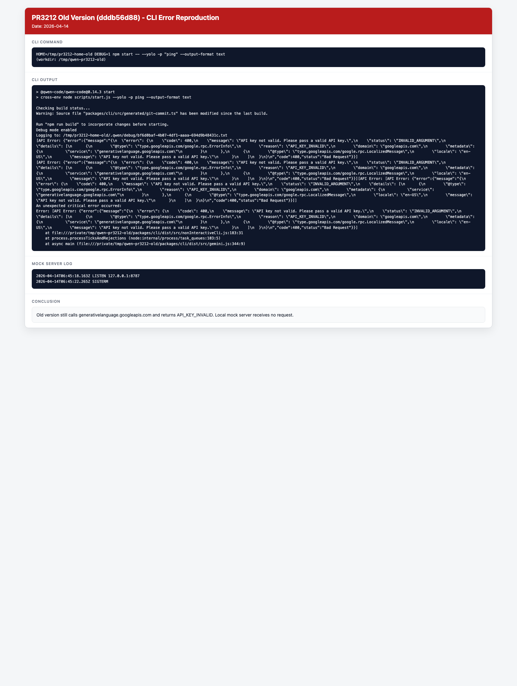
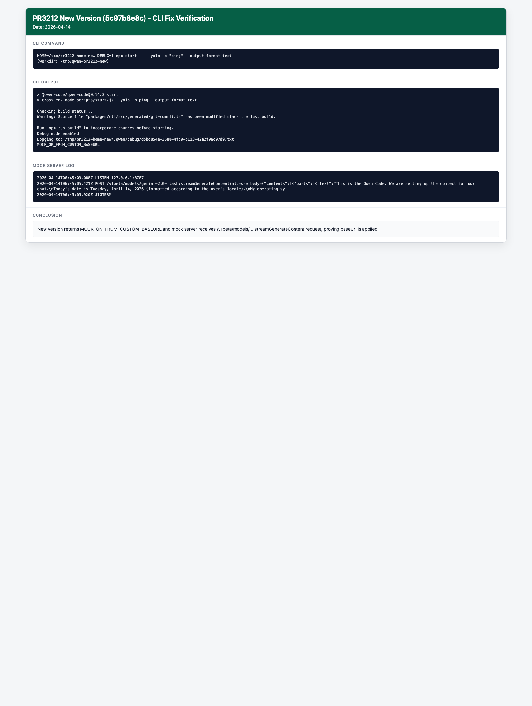

# Troubleshooting

This guide provides solutions to common issues and debugging tips, including topics on:

- Authentication or login errors
- Frequently asked questions (FAQs)
- Debugging tips
- Existing GitHub Issues similar to yours or creating new Issues

## Authentication or login errors

- **Error: `UNABLE_TO_GET_ISSUER_CERT_LOCALLY`, `UNABLE_TO_VERIFY_LEAF_SIGNATURE`, or `unable to get local issuer certificate`**
  - **Cause:** You may be on a corporate network with a firewall that intercepts and inspects SSL/TLS traffic. This often requires a custom root CA certificate to be trusted by Node.js.
  - **Solution:** Set the `NODE_EXTRA_CA_CERTS` environment variable to the absolute path of your corporate root CA certificate file.
    - Example: `export NODE_EXTRA_CA_CERTS=/path/to/your/corporate-ca.crt`

- **Error: `Device authorization flow failed: fetch failed`**
  - **Cause:** Node.js could not reach Qwen OAuth endpoints (often a proxy or SSL/TLS trust issue). When available, Qwen Code will also print the underlying error cause (for example: `UNABLE_TO_VERIFY_LEAF_SIGNATURE`).
  - **Solution:**
    - Confirm you can access `https://chat.qwen.ai` from the same machine/network.
    - If you are behind a proxy, set it via `qwen --proxy <url>` (or the `proxy` setting in `settings.json`).
    - If your network uses a corporate TLS inspection CA, set `NODE_EXTRA_CA_CERTS` as described above.

- **Issue: Unable to display UI after authentication failure**
  - **Cause:** If authentication fails after selecting an authentication type, the `security.auth.selectedType` setting may be persisted in `settings.json`. On restart, the CLI may get stuck trying to authenticate with the failed auth type and fail to display the UI.
  - **Solution:** Clear the `security.auth.selectedType` configuration item in your `settings.json` file:
    - Open `~/.qwen/settings.json` (or `./.qwen/settings.json` for project-specific settings)
    - Remove the `security.auth.selectedType` field
    - Restart the CLI to allow it to prompt for authentication again

## Frequently asked questions (FAQs)

- **Q: How do I update Qwen Code to the latest version?**
  - A: If you installed it globally via `npm`, update it using the command `npm install -g @qwen-code/qwen-code@latest`. If you compiled it from source, pull the latest changes from the repository, and then rebuild using the command `npm run build`.

- **Q: Where are the Qwen Code configuration or settings files stored?**
  - A: The Qwen Code configuration is stored in two `settings.json` files:
    1. In your home directory: `~/.qwen/settings.json`.
    2. In your project's root directory: `./.qwen/settings.json`.

    Refer to [Qwen Code Configuration](../configuration/settings) for more details.

- **Q: Why don't I see cached token counts in my stats output?**
  - A: Cached token information is only displayed when cached tokens are being used. This feature is available for API key users (Qwen API key or Google Cloud Vertex AI) but not for OAuth users (such as Google Personal/Enterprise accounts like Google Gmail or Google Workspace, respectively). This is because the Qwen Code Assist API does not support cached content creation. You can still view your total token usage using the `/stats` command.

## Common error messages and solutions

- **Error: `EADDRINUSE` (Address already in use) when starting an MCP server.**
  - **Cause:** Another process is already using the port that the MCP server is trying to bind to.
  - **Solution:**
    Either stop the other process that is using the port or configure the MCP server to use a different port.

- **Error: Command not found (when attempting to run Qwen Code with `qwen`).**
  - **Cause:** The CLI is not correctly installed or it is not in your system's `PATH`.
  - **Solution:**
    The update depends on how you installed Qwen Code:
    - If you installed `qwen` globally, check that your `npm` global binary directory is in your `PATH`. You can update using the command `npm install -g @qwen-code/qwen-code@latest`.
    - If you are running `qwen` from source, ensure you are using the correct command to invoke it (e.g. `node packages/cli/dist/index.js ...`). To update, pull the latest changes from the repository, and then rebuild using the command `npm run build`.

- **Error: `MODULE_NOT_FOUND` or import errors.**
  - **Cause:** Dependencies are not installed correctly, or the project hasn't been built.
  - **Solution:**
    1.  Run `npm install` to ensure all dependencies are present.
    2.  Run `npm run build` to compile the project.
    3.  Verify that the build completed successfully with `npm run start`.

- **Error: "Operation not permitted", "Permission denied", or similar.**
  - **Cause:** When sandboxing is enabled, Qwen Code may attempt operations that are restricted by your sandbox configuration, such as writing outside the project directory or system temp directory.
  - **Solution:** Refer to the [Configuration: Sandboxing](../features/sandbox) documentation for more information, including how to customize your sandbox configuration.

- **Qwen Code is not running in interactive mode in "CI" environments**
  - **Issue:** Qwen Code does not enter interactive mode (no prompt appears) if an environment variable starting with `CI_` (e.g. `CI_TOKEN`) is set. This is because the `is-in-ci` package, used by the underlying UI framework, detects these variables and assumes a non-interactive CI environment.
  - **Cause:** The `is-in-ci` package checks for the presence of `CI`, `CONTINUOUS_INTEGRATION`, or any environment variable with a `CI_` prefix. When any of these are found, it signals that the environment is non-interactive, which prevents the CLI from starting in its interactive mode.
  - **Solution:** If the `CI_` prefixed variable is not needed for the CLI to function, you can temporarily unset it for the command. e.g. `env -u CI_TOKEN qwen`

- **DEBUG mode not working from project .env file**
  - **Issue:** Setting `DEBUG=true` in a project's `.env` file doesn't enable debug mode for the CLI.
  - **Cause:** The `DEBUG` and `DEBUG_MODE` variables are automatically excluded from project `.env` files to prevent interference with the CLI behavior.
  - **Solution:** Use a `.qwen/.env` file instead, or configure the `advanced.excludedEnvVars` setting in your `settings.json` to exclude fewer variables.

## IDE Companion not connecting

- Ensure VS Code has a single workspace folder open.
- Restart the integrated terminal after installing the extension so it inherits:
  - `QWEN_CODE_IDE_WORKSPACE_PATH`
  - `QWEN_CODE_IDE_SERVER_PORT`
- If running in a container, verify `host.docker.internal` resolves. Otherwise, map the host appropriately.
- Reinstall the companion with `/ide install` and use “Qwen Code: Run” in the Command Palette to verify it launches.

## Exit Codes

The Qwen Code uses specific exit codes to indicate the reason for termination. This is especially useful for scripting and automation.

| Exit Code | Error Type                 | Description                                                                                         |
| --------- | -------------------------- | --------------------------------------------------------------------------------------------------- |
| 41        | `FatalAuthenticationError` | An error occurred during the authentication process.                                                |
| 42        | `FatalInputError`          | Invalid or missing input was provided to the CLI. (non-interactive mode only)                       |
| 44        | `FatalSandboxError`        | An error occurred with the sandboxing environment (e.g. Docker, Podman, or Seatbelt).               |
| 52        | `FatalConfigError`         | A configuration file (`settings.json`) is invalid or contains errors.                               |
| 53        | `FatalTurnLimitedError`    | The maximum number of conversational turns for the session was reached. (non-interactive mode only) |

## Debugging Tips

- **CLI debugging:**
  - Use the `--verbose` flag (if available) with CLI commands for more detailed output.
  - Check the CLI logs, often found in a user-specific configuration or cache directory.

- **Core debugging:**
  - Check the server console output for error messages or stack traces.
  - Increase log verbosity if configurable.
  - Use Node.js debugging tools (e.g. `node --inspect`) if you need to step through server-side code.

- **Tool issues:**
  - If a specific tool is failing, try to isolate the issue by running the simplest possible version of the command or operation the tool performs.
  - For `run_shell_command`, check that the command works directly in your shell first.
  - For _file system tools_, verify that paths are correct and check the permissions.

- **Pre-flight checks:**
  - Always run `npm run preflight` before committing code. This can catch many common issues related to formatting, linting, and type errors.

## Existing GitHub Issues similar to yours or creating new Issues

If you encounter an issue that was not covered here in this _Troubleshooting guide_, consider searching the Qwen Code [Issue tracker on GitHub](https://github.com/QwenLM/qwen-code/issues). If you can't find an issue similar to yours, consider creating a new GitHub Issue with a detailed description. Pull requests are also welcome!

## PR #3212: Gemini `baseUrl` fix verification (CLI reproduction)

This section documents a full CLI-level reproduction and validation for [PR #3212](https://github.com/QwenLM/qwen-code/pull/3212), which fixes Gemini `baseUrl` forwarding via `httpOptions`.

### What was broken

- Old behavior (`dddb56d88`): even when `modelProviders.gemini[].baseUrl` was configured, requests still went to Google's default endpoint (`generativelanguage.googleapis.com`).
- New behavior (`5c97b8e8c`): the configured `baseUrl` is forwarded and used for Gemini requests.

### Reproduction environment

- Old version commit: `dddb56d8859274fd86a304e9b13b8b7d61009dd7`
- New version commit: `5c97b8e8c21451df2d13ae274afd51deed008f9e`
- Common settings (`~/.qwen/settings.json`):

```json
{
  "security": { "auth": { "selectedType": "gemini" } },
  "model": { "name": "gemini-2.0-flash" },
  "env": { "GEMINI_API_KEY": "INVALID_KEY_FOR_REPRO" },
  "modelProviders": {
    "gemini": [
      {
        "id": "gemini-2.0-flash",
        "envKey": "GEMINI_API_KEY",
        "baseUrl": "http://127.0.0.1:8787"
      }
    ]
  },
  "$version": 3
}
```

### CLI command used

```bash
DEBUG=1 npm start -- --yolo -p "ping" --output-format text
```

### Mock server used for verification

- Local mock Gemini server: `127.0.0.1:8787`
- For stream endpoint, the server returns SSE payload (`data: {...}\n\n`) for:
  - `POST /v1beta/models/gemini-2.0-flash:streamGenerateContent?alt=sse`

### Result A: old version reproduces failure

- CLI output includes:
  - `API key not valid. Please pass a valid API key.`
  - `generativelanguage.googleapis.com`
- Mock server log shows no incoming request, proving old version did not use configured `baseUrl`.



### Result B: new version verifies fix

- CLI output returns mocked text:
  - `MOCK_OK_FROM_CUSTOM_BASEURL`
- Mock server log captures:
  - `POST /v1beta/models/gemini-2.0-flash:streamGenerateContent?alt=sse`
- This confirms new version sends Gemini traffic to configured `baseUrl`.



### Conclusion

PR #3212 is validated at CLI runtime level:

- old commit reproduces the bug
- new commit resolves it
