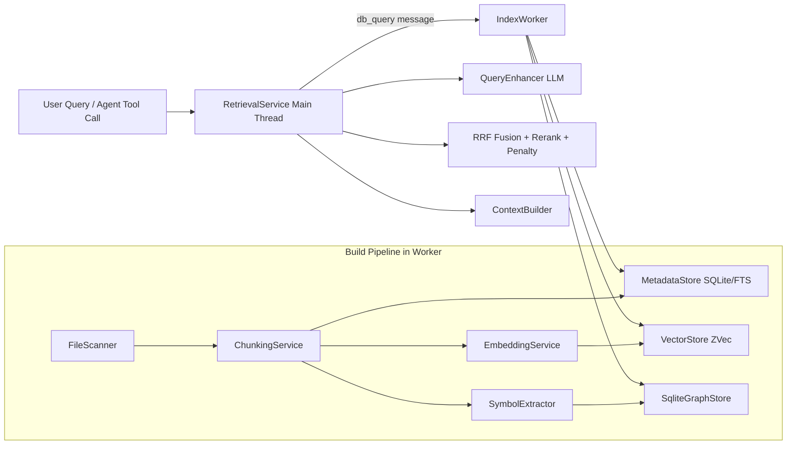
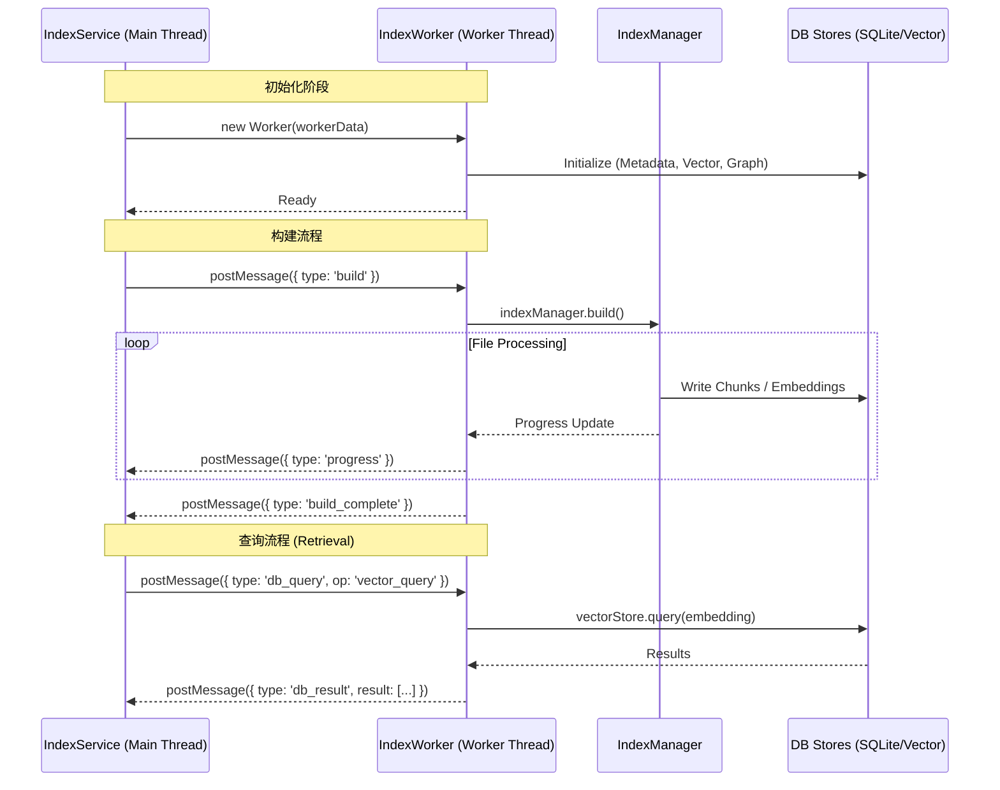
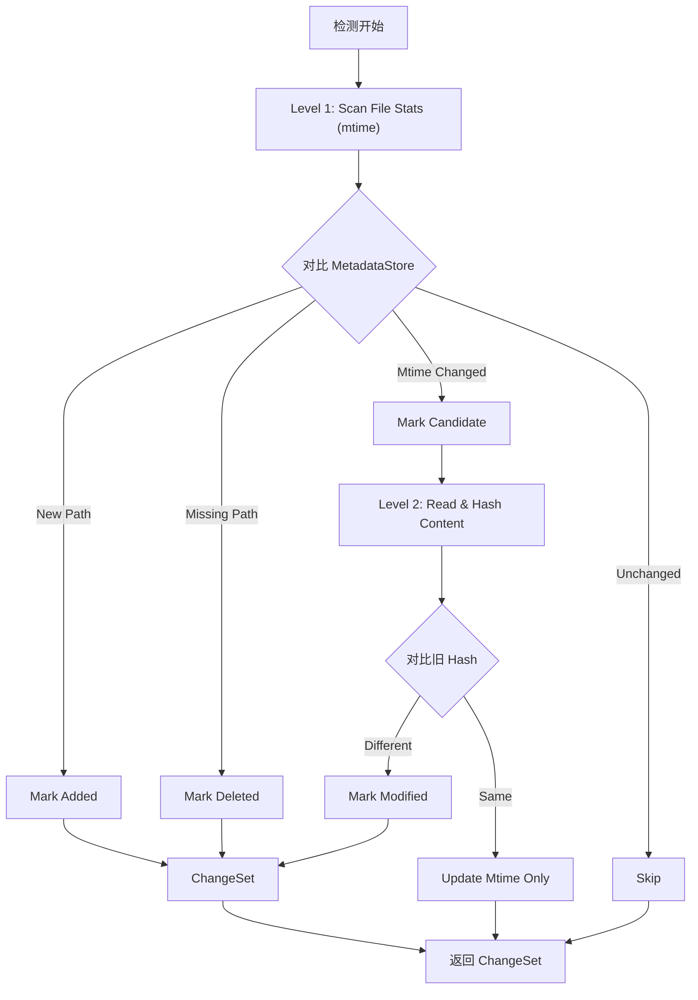
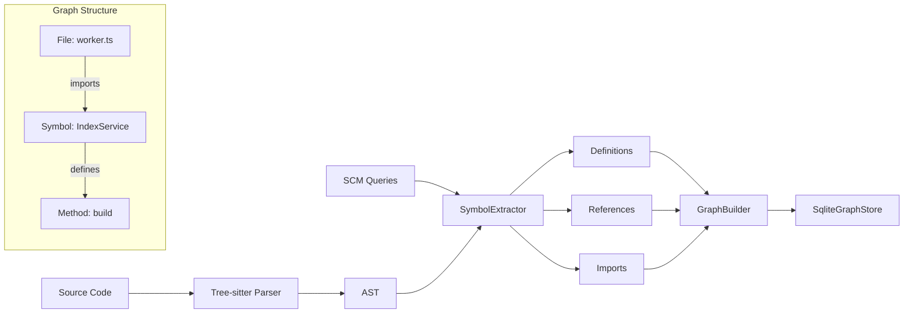
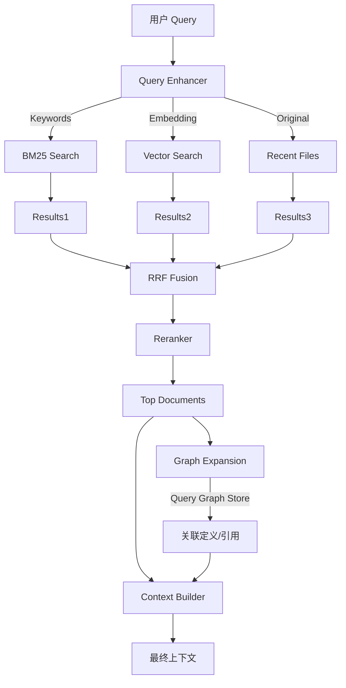
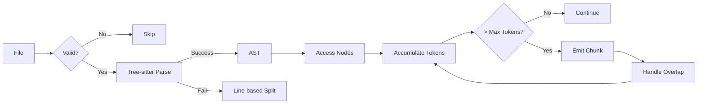

# Codebase Index进展

## 系统总览

Codebase Index 的运行形态是：

- **构建与存储 I/O 在 Worker 线程**进行（避免阻塞主线程）
- **检索编排逻辑在主线程**进行（Query 增强、RRF、重排、上下文构建）
- **检索所需 DB 查询通过消息协议转发给 Worker 执行**

核心存储层：

- `metadata.db`（SQLite + FTS5 trigram）
- `vectors/`（ZVec HNSW 向量索引）
- `graph.db`（SQLite 邻接表 + 递归 CTE）

### 1.1 总体流程图

---

## 索引建立（Build）流程

索引构建由 `IndexService`（主线程）发起，`IndexWorker` + `IndexManager`（Worker 线程）执行。

### 2.1 主线程控制（IndexService）

职责：

- Worker 生命周期管理（创建、退出、异常恢复）
- 外部 API：`startBuild` / `pause` / `resume` / `cancel`
- 进度事件广播：`progress`、`build_complete`、`error`
- 周期性轮询触发增量更新

关键点：

- 平台保护：当前只支持Mac/Linux系统Windows 直接阻断构建
- 崩溃恢复：有最大重启次数与重试间隔
- 构建前先读 `index_status`，若已 `done` 可跳过重复构建

### 2.2 Worker 执行（IndexWorker + IndexManager）

Worker 初始化内容：

1.  `MetadataStore`
2.  `VectorStore`（必要）
3.  `SqliteGraphStore`（可选，受 `enableGraph` 控制）
4.  `CheckpointManager`
5.  `EmbeddingLlmClient`
6.  `IndexManager`

IndexManager 主流程（`build`）：

1.  **Phase 1 扫描**：FileScanner 扫描可索引文件并写入 `file_meta`
2.  **Phase 2 切分**：按文件做 chunk + 符号提取，写入 `chunks` 和 graph 表
3.  **Phase 3 向量化**：批量生成 embedding，写入 ZVec
4.  **Phase 4 存储优化**：ZVec optimize
5.  **Phase 5 符号边收敛**：`resolveEdgesByName` 解决跨文件占位引用

#### 2.3 大仓库模式（Streaming Build）

当文件数超过 `streamThreshold`（默认 50k）时启用 `buildStreaming`：

- 以 batch 流式处理文件
- 每 batch 完成后更新进度与 checkpoint
- 避免一次性加载所有构建中间状态导致内存峰值过高

### 2.4 Checkpoint 与可恢复性

- checkpoint 记录阶段与最后处理路径
- Worker crash 后主线程可触发 resume build
- 关键阶段（embedding）中会周期性 `saveCheckpoint`

这使得构建具备“可中断、可续跑”的工程属性，而非一次性重做。

---

## 结果召回（Retrieval）流程

检索由 `RetrievalService` 执行，整体是“增强查询 + 多路召回 + 融合排序 + 扩展 + 上下文构建”。

### 3.1 多路召回

召回源：

1.  BM25（SQLite FTS5）
2.  Vector（ZVec）
3.  Recent（最近修改文件首块）
4.  可选图扩展（基于 seed chunk 的符号图遍历）

### 3.2 融合与后处理

使用 `rrfFusion`：

- 公式：$score(d)=\sum\frac{w\_i}{k+rank\_i(d)}$
- 支持 source weight
- 对同时命中 BM25 与 Vector 的结果加 multi-source boost

后处理 `postProcessResults`：

1.  最低分阈值过滤
2.  测试文件惩罚（`isTestRelated=true` 时跳过），解决测试文件混淆
3.  可选 rerank（DashScope reranker）
4.  TopK
5.  图扩展追加候选（衰减分）
6.  ContextBuilder 生成召回文本，在maxToken内展开chunk content

### 3.3 与 Worker 的边界

检索逻辑在主线程，但 DB 查询不落地在主线程。

- 主线程通过 `WorkerRetrievalDataSource` 发 `db_query`
- Worker 执行原子 DB 操作并返回结果

当前原子操作集：

- `fts_search`
- `recent_chunks`
- `chunks_by_ids`
- `primary_languages`
- `vector_query`
- `graph_expand`

这保证了“数据库句柄单归属（worker-only）”和“检索策略可快速迭代（main-thread）”两者兼得。

---

## 变更检测（Change Detection）流程

变更检测由 `ChangeDetector` + `BranchHandler` 在 `IndexService.pollCycle()` 驱动。

### 4.1 两级检测策略

为了降低轮询成本，采用两级检测：

- **Level 1**：`scanFileStats` 只看 mtime/size
- **Level 2**：仅对候选文件重算 hash

收益：在大仓库中显著减少“无变化文件”的哈希计算。

### 4.2 分支切换感知

`BranchHandler` 会：

1.  检测当前分支是否变化
2.  若变化，尝试计算 `git diff --name-only from...to`
3.  优先触发 `detectChangesForFiles(changedFiles)`（定向扫描）
4.  获取不到 changed files 再退化为全量检测

同时还有 quick dirty check（`git status --porcelain`）作为短路优化。

### 4.3 增量更新执行

增量更新由 `IndexManager.incrementalUpdate(changes)` 执行：

1.  先处理删除
2.  修改文件按“删旧 + 重建”
3.  新增与修改统一走 chunk + symbol + embedding + store
4.  最后统一 resolve cross-file edges

---

## 技术细节

### 5.1 Worker 线程架构

为了保证主线程（UI 响应）的流畅性，所有的重型计算（索引构建、Embedding 生成）和数据库 I/O 操作都被隔离在独立的 Worker 线程中。

**核心设计：**

- **单向控制流**：主线程 (`IndexService`) 负责发出指令（Build, Pause, Query），Worker 线程 (`IndexWorker`) 负责执行并反馈状态。
- **消息驱动通信**：通过 `postMessage` 传递类型化的消息 (`WorkerMessage` / `WorkerResponse`)。
- **资源隔离**：Worker 独占数据库连接 (`MetadataStore`, `VectorStore`, `GraphStore`)，主线程不直接操作 DB，而是发送 `db_query` 消息请求 Worker 查询。

**主要消息协议：**

| 消息类型 (`type`)    | 方向           | 描述               | Payload 示例                                  |
| -------------------- | -------------- | ------------------ | --------------------------------------------- |
| `build`              | Main -> Worker | 触发全量构建       | `{ resumeFromCheckpoint: boolean }`           |
| `incremental_update` | Main -> Worker | 触发增量更新       | `{ changes: ChangeSet }`                      |
| `db_query`           | Main -> Worker | 请求执行数据库操作 | `{ op: 'fts_search' \| 'vector_query', ... }` |
| `progress`           | Worker -> Main | 汇报构建进度       | `{ status, phase, overallProgress }`          |
| `db_result`          | Worker -> Main | 返回数据库查询结果 | `{ id, result }`                              |

**通信流程图:**

### 5.2 增量更新与变更检测

`ChangeDetector` 采用两级检测策略 (Two-Level Filtering)，在保证准确性的同时最大化性能。

**检测策略：**

1.  **Level 1: 快速筛选 (Stat-Only Scan)**
    - 调用 `fileScanner.scanFileStats()`。
    - 仅读取文件元数据 (mtime, size)，不读取文件内容。
    - **判断逻辑**：
      - `mtime` 变更 → 标记为 **Candidate (疑似变更)**。
      - 路径在 DB 中不存在 → 标记为 **Added**。
      - 路径在 DB 中存在但磁盘无 → 标记为 **Deleted**。

2.  **Level 2: 内容确认 (Content Hash Verification)**
    - 仅针对 **Candidate** 文件读取内容并计算 SHA-256 哈希。
    - 与 `MetadataStore` 中存储的旧哈希对比。
    - **判断逻辑**：
      - Hash 变更 → 确认为 **Modified**。
      - Hash 未变（仅 mtime 变） → 忽略（认为是 `touch` 操作），但更新 DB 中的 mtime 以避免下次误判。

**变更检测流程图:**

### 5.3 知识图谱构建

`SymbolExtractor` 利用 Tree-sitter 的强语法分析能力，通过 `.scm` (Scheme) 查询文件声明式地提取代码中的定义和引用，构建代码知识图谱。

**核心组件：**

- **Tree-sitter Parser**: 将代码解析为 AST (Abstract Syntax Tree)。
- **SCM Queries (**`**tag-queries/*.scm**`**)**: 针对每种语言编写的模式匹配查询，定义了哪些节点是 "定义"，哪些是 "引用"。
- **SymbolExtractor**: 执行查询，提取 `SymbolDefinition` 和 `SymbolEdge`。
- **Import Resolution**: 解析 import 语句，建立跨文件的引用关系。

**图谱构建流程：**

1.  **Parsing**: 代码 -> AST。
2.  **Extraction**: 应用 `.scm` 查询 -> 提取 Symbols (Function, Class, Variable) 和 References。
3.  **Local Resolution**: 建立文件内部的 Def-Ref 边。
4.  **Import Analysis**: 解析 Import 语句（如 `import { foo } from './bar'`）。
5.  **Cross-File Linking**: 将引用链接到目标文件的定义，生成 `Import` 类型边。

### 5.4 混合检索管道

`RetrievalService` 实现了一个 RAG 检索管道，结合了传统搜索 (BM25)、语义搜索 (Vector) 和 知识图谱 (Graph) 的优势。

**检索阶段详解：**

1.  **Query Enhancement (查询增强)**:
    - **HyDE**: 生成假设性代码文档。
    - **Decomposition**: 将复杂问题拆解为子查询。
    - **Keyword Extraction**: 提取关键词用于 BM25。

2.  **Multi-Path Retrieval (多路召回)**:
    - **BM25**: 关键词匹配，精确查找 (Recall via `fts_search`)。
    - **Vector**: 语义相似度查找 (Recall via `vector_query`)。
    - **Recent**: 召回最近修改的文件 (Contextual bias)。

3.  **RRF Fusion (倒数排名融合)**:
    - 将多路结果的排名进行加权融合：`Score = 1 / (k + rank_bm25) + 1 / (k + rank_vector)`。
    - 平衡精确匹配和语义相关性。

4.  **Reranking (重排序)**:
    - 使用 Cross-Encoder 或 LLM 对 Top-N 结果进行精细打分。

5.  **Graph Expansion (图谱扩展)**:
    - 以召回的 Chunk 为起点，在图谱中游走。
    - 寻找 "定义处" (Definition) 和 "引用处" (Reference)。
    - 补充上下文（例如：检索到函数调用，顺便把函数定义也拉取进来）。

**检索管道流程图:**

### 5.5 Chunking 策略

`ChunkingService` 采用 "Tree-sitter AST First" 策略，优先保证语义完整性。

**切分策略：**

- **AST 优先**：根据语法树节点（Function, Class）进行切分，避免将一个函数从中间截断。
- **Collapse (折叠)**：如果某个 Block (e.g. 大型函数) 超过 `maxChunkTokens`，尝试保留签名并省略主体，或进行内部拆分。
- **Token 累积**：小节点会被合并，直到达到 Chunk 大小限制。
- **Fallback**：如果解析失败或不支持该语言，回退到基于行号的滑动窗口切分。

**切分流程图:**

---

## codebaseSearch 工具

`codebaseSearch` 是对检索能力的工具化暴露，核心点：

1.  工具参数直接接收增强后 `bm25Queries` 与 `vectorQueries`
2.  支持 `isTestRelated`
3.  调用 `retrieveWithEnhancedQueries`，完整复用后处理管线
4.  工具注册与索引就绪状态联动（index ready / build_complete）
5.  注册后触发 `setTools()` 刷新可调用工具列表

## 测试结果

#### 测试案例

功能解释型：

- 测试1: 解释图片输入的处理流程
- 测试2: 解释代码库搜索工具的注册与可用性生效流程
- 测试3: 梳理代码库搜索工具的召回流水线

功能实现型

- 测试4: 增加一个配置项支持自定义 ignore 文件。
- 测试5: 为代码库搜索工具增加 languageFilter 参数，仅检索指定语言的文件。
- 测试6: 为codebase搜索命令的检索结果增加“来源权重可视化”信息。

Bug 修复型

- 测试7: 修复图扩展在无 graphStore 时的异常日志噪音（应降级为无图扩展）。
- 测试8: 修复这个问题：ACP模式下设置plan模式后，后续的会话仍然允许执行文件编辑等工具。

重构/性能优化型

- 测试9: 将代码库搜索召回中结果的去重策略改为基于 chunkId 优先。

| 测试案例 | 请求数 | 输入token | 输出token | 工具调用 | 耗时    |
| -------- | ------ | --------- | --------- | -------- | ------- |
| 测试1    | 18     | 1,049,189 | 4,425     | 29       | 1m 24s  |
| 测试1    | 4      | 151,266   | 2,305     | 7        | 43.8s   |
| 测试2    | 9      | 347,144   | 2,706     | 20       | 57.8s   |
| 测试2    | 5      | 196,964   | 2,191     | 10       | 1m 46s  |
| 测试3    | 8      | 384,024   | 384,024   | 20       | 1m 57s  |
| 测试3    | 5      | 185,152   | 3,539     | 6        | 1m 43s  |
| 测试4    | 56     | 3,336,629 | 14,131    | 62       | 7m 3s   |
| 测试4    | 50     | 2,836,930 | 14,419    | 52       | 9m 11s  |
| 测试5    | 64     | 3,757,493 | 16,981    | 61       | 8m 32s  |
| 测试5    | 37     | 2,044,647 | 12,850    | 37       | 6m 53s  |
| 测试6    | 43     | 2,538,500 | 16,886    | 49       | 6m 40s  |
| 测试6    | 15     | 599,866   | 2,762     | 14       | 5m 27s  |
| 测试7    | 44     | 1,826,268 | 11,603    | 43       | 6m 20s  |
| 测试7    | 23     | 1,089,731 | 4,159     | 24       | 2m 23s  |
| 测试8    | 39     | 2,723,803 | 11,135    | 49       | 7m 20s  |
| 测试8    | 50     | 3,056,575 | 13,533    | 49       | 10m 25s |
| 测试9    | 18     | 815,121   | 2,733     | 21       | 2m 40s  |
| 测试9    | 11     | 426,195   | 1,692     | 10       | 1m 47s  |

**测试结论：**优化效果主要体现在token的使用、工具调用次数和请求数的缩减，具体来说，主要优化了Session冷启动时的成本，通过codebaseSearch工具可以帮助LLM快速定位有效的chunk、上下游引用以及对应的文件。因此，在短任务或理解型任务中获得的提升较大，在长任务中，冷启动的优势会被逐渐稀释。
