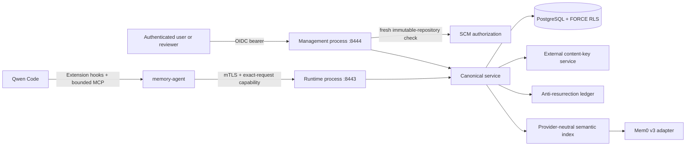

# Enterprise Memory integration

This workspace is the Qwen Code monorepo implementation of the enterprise multi-tenant memory architecture in [the design plan](../../docs/plans/2026-07-21-enterprise-multi-tenant-memory-gateway.md). It deliberately lives outside `packages/core` and `packages/cli`: Qwen Code consumes it through the existing Extension, Hook, and MCP contracts, while enterprise identity, storage, approval, retention, and provider dependencies remain independently deployable.

It is a reference implementation and integration boundary, not a turnkey production deployment. A deployment must supply the workload-identity broker, OIDC provider, SCM authorization service, PostgreSQL roles, external key-handle service, anti-resurrection ledger, Mem0 project, retention controller, network policy, quotas, audit pipeline, and operational reconciliation described below.

## Architecture



The two listeners run as separate OS processes and receive separate database and identity credentials. Each process is pinned to one `MEMORY_TENANT_ID`, and both runtime capability and management OIDC tenant claims must match it. Deploy one runtime/management pair per tenant and environment so its `MEM0_API_KEY` belongs to exactly one Mem0 Project; the PostgreSQL cluster may still be shared under RLS. A runtime deployment must not receive the management database URL, management OIDC configuration, or SCM authorization credential, and a management deployment must not receive the runtime database URL, capability HMAC, or runtime TLS client CA. Runtime capabilities have only `context:read`, `events:write`, `memory:read`, `proposal:write`, and `feedback:write`; they are rejected by the management OIDC verifier. Management access tokens require consistent `iat`/`exp` claims and default to a maximum one-hour issued lifetime. Personal activation and deletion require the authenticated data subject. Repository activation and deletion require a fresh authorization result for the immutable repository ID from the SCM service.

## Implemented vertical slice

- Sender-constrained ES256 runtime capabilities with issuer, audience, type, time, authorization-lease, revocation epoch, fixed capability, mTLS certificate, and exact method/route/operation/body binding checks.
- Live PostgreSQL workspace authorization and transaction-local tenant/principal/repository context.
- Tenant-qualified canonical records, personal preferences, provider bindings, raw events, and content-free feedback with `FORCE ROW LEVEL SECURITY`; raw-event and feedback idempotency fingerprints bind the complete opaque runtime identity as well as the payload.
- Personal memory default-off consent modes and separate personal/repository entity identifiers derived by purpose-separated HMAC.
- Candidate-only MCP writes, scope-authorized candidate review, scope-specific OIDC/SCM approval, optimistic version checks, canonical re-authorization on every recall, and provider results treated only as opaque candidate IDs and scores.
- Record-specific protected content handles, content-free source-operation receipts, canonical IDs equal to the agent's opaque operation UUID, mutually exclusive activation/erasure reservations, external origin-version anti-resurrection guards, deletion intent before invisibility, bound-provider deletion verification, key destruction, durable external erasure confirmation before ciphertext cleanup, and retryable monotonic erasure. Provider activation is reserved before any Mem0 write so deletion cannot declare completion while an unbound write is in flight. A missing canonical row with only a deletion intent is never treated as proof of provider/key erasure; unknown provider writes retain their activation reservation and remain a mandatory reconciliation gate.
- Mem0 v3 add/event/get-all/search/delete integration with `infer=false`, reranking disabled, exact canonical metadata filtering, local score-threshold enforcement, and no use of provider-returned text as memory truth.
- Qwen `SessionStart`, `UserPromptSubmit`, `PostToolUse`, `PostToolUseFailure`, `Stop`, and `StopFailure` integration plus a bounded MCP surface. Local state contains only session/turn IDs and up to 2,048 recent operation IDs and timestamps; it uses `0700`/`0600`, per-session inter-process locks, and atomic replacement. A workload-supplied stable operation-HMAC secret keeps exact Hook and MCP-write operation IDs unchanged across local-state loss, while retries inside the metadata window also reuse the originally captured turn, without persisting prompt, tool, or response content.
- Raw prompt/tool/assistant capture is disabled by default. It can be enabled only when `MEMORY_RETENTION_CONTROLLER_READY=true`; that assertion is a deployment gate, not a substitute for the required external 24-hour purge and reconciliation controller.

The implementation intentionally does not auto-promote model output, import existing Qwen memory/context files, expose administrative selectors to MCP, or modify Qwen Code Core.

`memory_propose_personal`, `memory_propose_repository`, and `memory_feedback` require a caller-generated UUID `operationId`. An exact retry must reuse it; a new logical write must use a new UUID. The agent purpose-separates and HMAC-derives the Gateway operation ID from the tool name and that UUID, and does not forward the caller UUID in the HTTP body. Candidate source fingerprints also bind the opaque proposing principal and personal or repository scope ID, so a UUID cannot be replayed by another principal or into another scope. JSON-RPC request IDs are transport-local and are never used as durable write identities. `memory_search` and `memory_get` derive an operation ID from a random MCP connection epoch, the JSON-RPC request ID, the tool name, and validated arguments, so request IDs that restart after reconnect cannot collide.

## Build and verify

From the repository root:

```bash
npm install
npm run build --workspace=@qwen-code/enterprise-memory
npm run typecheck --workspace=@qwen-code/enterprise-memory
npm test --workspace=@qwen-code/enterprise-memory
npm run start:runtime --workspace=@qwen-code/enterprise-memory
npm run start:management --workspace=@qwen-code/enterprise-memory
```

Apply `migrations/001-initial.sql` with a dedicated migration role. Runtime and management use distinct database roles; neither may own these tables or have `BYPASSRLS`. Grant each role only its route-specific statements; both processes need scoped reads of personal preferences so personal candidate insertion/activation can recheck consent at the SQL commit point, runtime inserts and reads tenant-scoped content-free source-operation receipts, management advances a receipt only while its canonical record remains visible in the current scope and before deleting that record in the same transaction, and runtime needs read-only access to erasure reservations so feedback fails closed once deletion wins. Only management/reconciliation roles may create or advance activation and erasure reservations. Missing transaction-local context must return no rows. Production readiness requires a real PostgreSQL role/connection-reuse isolation test, not only the included migration contract test.

Build output makes this directory installable as a Qwen extension. Both its Hook and MCP entries deliberately invoke a deployment-supplied `qwen-memory-agent-launcher`; there is no direct-node fallback. The launcher must be a signed executable resolved from a system-controlled `PATH`, authenticate the specific memory-agent workload rather than only its peer UID, obtain credentials through controlled local IPC/workload identity, clear inherited `MEMORY_*` values, and inject the variables below only into the child agent. The Qwen parent process, settings/manifest/hook files, workspace, and tool subprocess environment must not contain those values. Run the runtime and management services under separate workload identities, and prevent tool sandboxes from reading agent mTLS files/state or calling the launcher credential endpoint, broker, Gateway, SCM, key service, ledger, or Mem0 directly. A missing or failed launcher must leave Qwen running without external memory; operators must not replace it with direct `node` execution.

## Required configuration

All service URLs below must use HTTPS. The variables below describe the environment seen by the target process, not the Qwen parent environment. Deployment credentials are supplied by the workload platform and must not be committed to extension settings or persisted in agent state. The operation-ID secret must remain stable beyond every accepted event-replay, backup-restore, and anti-resurrection window; rotating it requires a reviewed dual-key/lineage migration before accepting old retries.

| Variable                                                                                              | Purpose                                                                                             |
| ----------------------------------------------------------------------------------------------------- | --------------------------------------------------------------------------------------------------- |
| `MEMORY_TENANT_ID`                                                                                    | Fixed tenant shard; must match runtime and management identity claims                               |
| `MEMORY_RUNTIME_DATABASE_URL`                                                                         | PostgreSQL connection for the read/proposal/event runtime role, with `sslmode=verify-full`          |
| `MEMORY_MANAGEMENT_DATABASE_URL`                                                                      | Separate PostgreSQL connection for the approval/preference/erasure role, with `sslmode=verify-full` |
| `MEMORY_CAPABILITY_ISSUER`, `MEMORY_CAPABILITY_AUDIENCE`, `MEMORY_CAPABILITY_JWKS_URL`                | Runtime capability trust domain                                                                     |
| `MEMORY_REQUEST_HMAC_SECRET`                                                                          | Broker/Gateway exact-request binding key, base64url and at least 32 bytes                           |
| `MEMORY_IDEMPOTENCY_HMAC_SECRET`                                                                      | Purpose-separated event and candidate fingerprint key                                               |
| `MEMORY_ENTITY_HMAC_SECRET`, `MEMORY_ENTITY_HMAC_VERSION`                                             | Opaque provider entity mapping key and version                                                      |
| `MEMORY_LEDGER_URL`, `MEMORY_LEDGER_TOKEN`                                                            | Strongly consistent ledger outside the PostgreSQL backup domain                                     |
| `MEMORY_CONTENT_PROTECTOR_URL`, `MEMORY_CONTENT_PROTECTOR_TOKEN`                                      | Record-specific key-handle protection service                                                       |
| `MEM0_API_KEY`                                                                                        | Dedicated credential for this tenant and environment's Mem0 Project                                 |
| `MEMORY_GATEWAY_TLS_CERT`, `MEMORY_GATEWAY_TLS_KEY`, `MEMORY_GATEWAY_TLS_CLIENT_CA`                   | TLS 1.3 runtime listener and required agent mTLS                                                    |
| `MEMORY_MANAGEMENT_OIDC_ISSUER`, `MEMORY_MANAGEMENT_OIDC_AUDIENCE`, `MEMORY_MANAGEMENT_OIDC_JWKS_URL` | Human management identity trust domain                                                              |
| `MEMORY_MANAGEMENT_TLS_CERT`, `MEMORY_MANAGEMENT_TLS_KEY`                                             | TLS 1.3 management listener                                                                         |
| `MEMORY_SCM_AUTHORIZATION_URL`, `MEMORY_SCM_AUTHORIZATION_TOKEN`                                      | Current immutable-repository maintainer authorization                                               |
| `MEMORY_RAW_CAPTURE_ENABLED`                                                                          | Optional; defaults to `false`                                                                       |
| `MEMORY_RETENTION_CONTROLLER_READY`                                                                   | Must be exactly `true` before raw capture can start                                                 |
| `MEMORY_BROKER_URL`, `MEMORY_GATEWAY_URL`                                                             | Agent-only capability broker and runtime Gateway endpoints                                          |
| `MEMORY_AGENT_TLS_CERT`, `MEMORY_AGENT_TLS_KEY`, `MEMORY_AGENT_TLS_CA`                                | Short-lived memory-agent workload identity                                                          |
| `MEMORY_AGENT_STATE_DIR`                                                                              | Per-runtime tmpfs state directory, inaccessible to tools                                            |
| `MEMORY_AGENT_OPERATION_HMAC_SECRET`                                                                  | Exactly 32 bytes, unpadded base64url; stable operation identity, inaccessible to tools              |

The Gateway listener defaults to `127.0.0.1:8443` and the management listener to `127.0.0.1:8444`; use `MEMORY_GATEWAY_HOST`, `MEMORY_GATEWAY_PORT`, `MEMORY_MANAGEMENT_HOST`, and `MEMORY_MANAGEMENT_PORT` to override them.

## External service contracts

The ledger endpoints must be strongly consistent and idempotent. They must never move `purged` back to `received` or `erased` back to `deletion_intent`. Erasing canonical version 2 or later also writes and completes a version-1 deletion guard for the deterministic canonical ID; proposal admission checks that guard before protecting content, while `memory_source_receipts` closes the remaining online check/insert race. The content-protection service must give every event or canonical record an independent deletion handle; `destroy` must be idempotent and return success only after the handle is unusable. It must tenant-scope and index `source_operation_id` so the reconciler can expire a handle created before a failed or crashed database commit without ordinary logs containing plaintext or identifiers. Both services must enforce tenant authorization independently of request bodies and must not log plaintext or bearer tokens.

The SCM authorization endpoint receives opaque tenant/principal/repository IDs and must echo those three IDs with `{ "authorized": true, "tenant_id": "...", "principal_id": "...", "repository_id": "...", "expires_at": "..." }` only for a current maintainer lease no longer than 60 seconds. Repository URLs, refs, or model-provided claims are not accepted as authority.

The public HTTP shape is recorded in `openapi.yaml`. Runtime request bodies never contain tenant, principal, workspace, or repository selectors; those come only from the verified capability and live binding.

The executable currently uses an empty `StaticPolicyResolver`, so `SessionStart` returns no organization policy until the deployment replaces it with the signed, reviewed policy projection described in the design plan. The built-in query sanitizer and candidate secret patterns are bounded defense in depth, not an enterprise secrets/PII/code DLP control. The external retention controller must expire 30-day candidates, reverify or expire repository records, run personal expiry through the same erasure saga, purge raw rows and handles, advance raw receipts to `purged`, reconcile activation reservations with unknown Mem0 outcomes, reconcile erasure reservations and deletion intents, orphan content handles, and orphan provider records, remove expired capability replay rows, and execute bounded entity-HMAC rotation/reindexing. Setting the readiness variable does not perform any of that work.

## Deployment gates

Do not enable recall or raw capture merely because the unit tests pass. The managed Qwen profile must first disable built-in automatic and team memory and reject unapproved local memory/context mutation, otherwise the two systems can double-write and double-recall. Before a tenant canary, complete the identity/revocation probe, launcher provenance and Qwen-parent/tool-environment secret-absence probes, real PostgreSQL RLS and pool-reuse test, reviewed DLP integration, external ledger/key failure drills, Mem0 residency/deletion contract validation, retention and offboarding rehearsal, sandbox/egress verification, quota and circuit-breaker validation, and the shadow-mode quality/security evaluation in the design plan. On any external-memory failure, Qwen Code must continue without memory rather than broadening scope or falling back to local memory.
