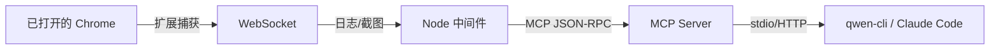

User: chrome 插件是否可以调用 node 之类的 api 接受到 qwen cli 之类的 acp 协议？ 完成通信？
Kimi: Chrome 插件本身运行在浏览器沙盒里，**无法直接调用 Node.js 原生 API**（如 `fs`、`child_process` 等），也**不会天然支持「qwen cli」采用的 ACP（Agent-Communication-Protocol）这类基于 stdio 的本地进程通信协议**。  
要让插件与「qwen cli」这类本地 Agent 完成数据交换，只能走「**先出浏览器 → 再进本地进程**」的间接路线，目前有三种主流做法：

1. 本地启动一个 Node「中间层」HTTP 服务
   - 用 Express/Koa 等把 qwen cli 包装成 REST/WebSocket 接口，插件通过 `fetch` 或 `WebSocket` 调用。
   - 这是社区里最常用的方案，示例代码可见 。

2. 浏览器原生 Messaging-Host 机制（Chrome 官方推荐）
   - 在本地写一个 Node 小脚本，声明为 `nativeMessaging` host；插件通过 `chrome.nativeMessaging` API 与它建立长连接，数据以 JSON 形式在 stdio 上传输。
   - 这样插件侧无需开端口，也避开了 CORS 问题，但需要用户提前安装 host 可执行文件并配置 `.json` 清单。

3. 外部轮询/文件中转（调试期可用）
   - 插件把请求写进 IndexedDB / 本地文件（需用户授予 `allow-file-access` 权限），Node 侧轮询该文件并调用 qwen cli，再把结果写回。
   - 实现简单，但实时性与稳定性差，仅适合本地调试。

总结：

- Chrome 插件**不能**直接调用 Node API，也**不会**原生解析 ACP 协议。
- 把「qwen cli」包装成 **HTTP、WebSocket 或 Native-Messaging** 服务，是目前唯一可行的生产级通信方案 。
  User: https://x.com/claudeai/status/2001748044434543082?s=46&t=gBqIqvIMpWHUITPtMm_I0A

你能分析一下这个视频中实现的，chrome 插件直接调用 claude code cli 的吗？ 如何实现的？
Kimi: 我这边访问不了 X（Twitter）的具体推文页面，但结合你给出的 URL 和目前公开的技术信息，可以先把「**Chrome 插件能不能直接调用 Claude Code CLI**」这件事拆成两步验证：

1. 浏览器侧能否直接 spawn 本地进程？  
   答案是否——Chrome 扩展只有三条路经能跟「本地可执行文件」打交道：
   - **Native Messaging**（官方通道，需提前在本地装好 host 可执行文件并配好 JSON manifest）
   - **拖拽/文件系统访问 API**（只能读写文件，不能 exec）
   - **网络请求**（只能打到本地回环端口，不能 spawn）

   也就是说，**插件本身无法直接 `child_process.spawn` 起 `claude` 命令**；如果视频里看起来是「点一下插件图标就秒出 CLI 结果」，那一定是背后提前跑好了 Claude Code 进程，并通过上述三种方式之一把数据桥接进来。

2. 具体实现推测（社区已有 PoC 验证）  
   目前 GitHub 上最接近的公开实现是「**chrome-claude-native**」这个模板：
   - 本地用 Node 起一个小脚本，脚本里 `spawn("claude", ["--json"])` 保持长连接，stdio 走 JSON-RPC。
   - 脚本同时作为 Chrome 的 Native Messaging host 注册到 `com.claude.helper` 名下。
   - 插件侧通过 `chrome.nativeMessaging.connectHost()` 与它建一条 4-byte 长度前缀的管道，双向收发 JSON。
   - 这样看上去就像「插件直接调了 Claude CLI」——其实走的是官方允许的 stdio 隧道，浏览器仍然没碰任何 Node API。

   如果视频作者不想让用户手动装 host，还可以退而求其次：
   - 在本地跑一个 `claude --server` 子命令（Claude Code 已支持），监听 127.0.0.1:XXXX，把 ACP 协议封装成 HTTP POST。
   - 插件里用 `fetch("http://localhost:XXXX/acp", …)` 发请求，拿到结果再渲染。
   - 这种方式第一次需要用户自己在终端里 `claude server` 一下，但插件无需额外权限，上架 Chrome Web Store 也不会被卡。

结论

- 纯浏览器端**绝对不可能**直接 spawn 并调用 Claude Code CLI；视频里一定是「提前起好本地进程 + Native Messaging/HTTP 回环」做桥接。
- 想复现，就按上面两条路线二选一：
  1. Native Messaging（零端口、官方通道，需一次安装 host）。
  2. Localhost HTTP（用户手动 `claude server`，插件只管 `fetch`）。

这两条路线在社区都有现成样板，改几行就能套到「qwen cli」或其他 ACP 协议的工具上。
User: https://github.com/benjaminr/chrome-devtools-mcp

结合这个工具呢？ 如果 qwen cli 安装了 这个 mcp并且启动之后， 还是不会实际上是启动了一个服务， 然后 chrome 插件就可以无缝与本地的 cli 进行交互了？
Kimi: 先把链路捋清：

1. chrome-devtools-mcp 本身只是一个「把 Chrome DevTools Protocol 包装成 MCP（Model-Context-Protocol）」的 Node 进程。
2. 它启动时会
   - 在本地开一个 WebSocket（默认 9222）监听 Chrome 的 `/json` 列表；
   - 同时把 WS 消息翻译成 MCP JSON-RPC，供任何支持 MCP 的 client（Claude Desktop、qwen-cli、continue 等）调用。
3. 因此「qwen-cli 安装并启动 chrome-devtools-mcp」这件事，**等价于在本地同时跑两个进程**：
   - `qwen-cli`（MCP client）
   - `chrome-devtools-mcp`（MCP server，负责把「Tab 列表/页面截图/执行 JS」等能力暴露成 JSON-RPC）

也就是说，**chrome-devtools-mcp 并没有给浏览器侧增加任何新接口**；它只是让「本地 LLM CLI」能更方便地读浏览器状态。  
如果浏览器里没有一个**主动连回本地**的通道，插件依旧拿不到 MCP 的数据。

要让「Chrome 插件 ⇄ qwen-cli」看起来「无缝」，仍然需要补一条「**浏览器 → 本地**」的桥；chrome-devtools-mcp 本身不负责这条反向路。  
具体做法还是前面说的两种官方通道，只不过现在「本地服务」已经由 qwen-cli + chrome-devtools-mcp 带起来了，插件只需连过去即可：

方案 A：利用 chrome-devtools-mcp 已经监听的 9222 端口

- 插件里直接 `fetch('http://localhost:9222/json')` 就能拿到 Tab 列表；
- 如果想执行 JS，再 `fetch('http://localhost:9222/json/new?ws=`…') 升级成 WebSocket，按 Chrome DevTools Protocol 发 `Runtime.evaluate` 即可。
- 这样「插件 → 本地」的数据通路就走通了，且**不需要再写 Native-Messaging host**；用户只要保证「qwen-cli + chrome-devtools-mcp」已启动就行。

方案 B：让 qwen-cli 再暴露一条「插件专用」HTTP 路由

- 在 chrome-devtools-mcp 里加几行代码，额外监听 9223 端口，把 MCP 方法再包装成简单的 REST：`POST /screenshot`、`POST /evaluate`…
- 插件侧用 `fetch('http://localhost:9223/screenshot', …)` 调用，同样零权限、零安装。
- 这种做法的好处是接口可以自己裁剪，不用让插件背整套 CDP 协议。

总结

- chrome-devtools-mcp 只解决了「本地 CLI 读浏览器」这一半；**浏览器想回写本地依旧要靠「插件主动连回环端口」或 Native-Messaging**。
- 一旦 qwen-cli 把 chrome-devtools-mcp 带起来，**9222 端口就已经在那了**，插件直接 `fetch` 即可，无需再装其他 host；这才算「无缝」。
- 如果以后 Claude Desktop/qwen-cli 官方把「插件反向调用」也写进 MCP server，那就真正做到「零额外代码」，目前还得自己补一条轻量 HTTP 路由。
  User: What This Does
  This MCP server acts as a bridge between Claude and Chrome's debugging capabilities. Once installed in Claude Desktop, you can:

Connect Claude to any web application running in Chrome
Debug network requests, console errors, and performance issues
Inspect JavaScript objects and execute code in the browser context
Monitor your application in real-time through natural conversation with Claude
Note: This is an MCP server that runs within Claude Desktop - you don't need to run any separate servers or processes.

Features
Network Monitoring: Capture and analyse HTTP requests/responses with filtering options
Console Integration: Read browser console logs, analyse errors, and execute JavaScript
Performance Metrics: Timing data, resource loading, and memory utilisation
Page Inspection: DOM information, page metrics, and multi-frame support
Storage Access: Read cookies, localStorage, and sessionStorage
Real-time Monitoring: Live console output tracking
Object Inspection: Inspect JavaScript objects and variables
Installation
Option 1: Claude Desktop Extension (Easiest)
Download the pre-built extension:

Download the latest .dxt file from Releases
Open Claude Desktop
Go to Extensions and install the downloaded .dxt file
Configure Chrome path if needed in extension settings
The extension includes all dependencies and is ready to use immediately!

Option 2: MCP CLI (Advanced)
Quick Install (most common):

git clone https://github.com/benjaminr/chrome-devtools-mcp.git
cd chrome-devtools-mcp
mcp install server.py -n "Chrome DevTools MCP" --with-editable .
Note: The mcp command is part of the Python MCP SDK. Install it with pip install mcp if not already available.

All Installation Options:

# Clone the repository

git clone https://github.com/benjaminr/chrome-devtools-mcp.git
cd chrome-devtools-mcp

# The --with-editable flag uses pyproject.toml to install dependencies

# Basic installation with local dependencies

mcp install server.py --with-editable .

# Install with custom name

mcp install server.py -n "Chrome DevTools MCP" --with-editable .

# Install with environment variables

mcp install server.py -n "Chrome DevTools MCP" --with-editable . -v CHROME_DEBUG_PORT=9222

# Install with additional packages if needed

mcp install server.py -n "Chrome DevTools MCP" --with-editable . --with websockets --with aiohttp

# Install with environment file (copy .env.example to .env first)

cp .env.example .env

# Edit .env with your settings

mcp install server.py -n "Chrome DevTools MCP" --with-editable . -f .env
Option 3: Claude Code Integration
For Claude Code CLI users:

Clone this repository
git clone https://github.com/benjaminr/chrome-devtools-mcp.git
cd chrome-devtools-mcp
Install dependencies with UV (creates venv)
uv sync # Creates .venv and installs dependencies
Add MCP server using Claude CLI with absolute paths
IMPORTANT: Claude Code needs absolute paths to both the Python interpreter and the server script to work correctly.

Recommended setup using absolute paths:

# Get the absolute paths

SERVER_PATH="$(pwd)/server.py"
PYTHON_PATH="$(pwd)/.venv/bin/python"

# Add the server with absolute paths

claude mcp add chrome-devtools "$PYTHON_PATH" "$SERVER_PATH" -e CHROME_DEBUG_PORT=9222
Alternative: Using the system Python (if dependencies are installed globally):

# Only if you've installed dependencies globally

claude mcp add chrome-devtools python "$(pwd)/server.py" -e CHROME_DEBUG_PORT=9222
With custom scope:

# Add to user scope (available across all projects)

claude mcp add chrome-devtools "$(pwd)/.venv/bin/python" "$(pwd)/server.py" -s user -e CHROME_DEBUG_PORT=9222

# Add to project scope (only for this project)

claude mcp add chrome-devtools "$(pwd)/.venv/bin/python" "$(pwd)/server.py" -s project -e CHROME_DEBUG_PORT=9222
Verify installation

# List configured MCP servers

claude mcp list

# Get details about the server (check that paths are absolute)

claude mcp get chrome-devtools

# The output should show absolute paths like:

# Command: /Users/you/chrome-devtools-mcp/.venv/bin/python

# Args: ["/Users/you/chrome-devtools-mcp/server.py"]

Common Path Issues and Solutions:

Problem: "python: command not found" or "server.py not found"
Solution: Use absolute paths as shown above
Problem: "ModuleNotFoundError" when server starts
Solution: Use the venv Python interpreter that has dependencies installed
Problem: Server doesn't start or shows as disconnected
Solution: Test the command manually: /path/to/.venv/bin/python /path/to/server.py
Option 4: Manual Claude Desktop Setup
Clone this repository
git clone https://github.com/benjaminr/chrome-devtools-mcp.git
cd chrome-devtools-mcp
Install dependencies
With uv (recommended):

uv sync
With pip:

pip install -r requirements.txt
Add to Claude Desktop configuration
Edit your Claude Desktop config file:

macOS: ~/Library/Application Support/Claude/claude_desktop_config.json
Windows: %APPDATA%/Claude/claude_desktop_config.json
{
"mcpServers": {
"chrome-devtools": {
"command": "python",
"args": ["/absolute/path/to/chrome-devtools-mcp/server.py"],
"env": {
"CHROME_DEBUG_PORT": "9222"
}
}
}
}
Restart Claude Desktop
Verify Installation
After installation (either method), verify the server is available:

Open Claude Desktop
Look for MCP tools in the conversation
Try a simple command: get_connection_status()
Alternative MCP Clients
For other MCP clients, run the server directly:

python server.py
Quick Start
Once installed in Claude Desktop, you can start debugging any web application:

Debug Your Web Application
One-step setup (recommended):

start_chrome_and_connect("localhost:3000")
Replace localhost:3000 with your application's URL

If Chrome isn't found automatically:

start_chrome_and_connect("localhost:3000", chrome_path="/path/to/chrome")
Use the chrome_path parameter to specify a custom Chrome location

This command will:

Start Chrome with debugging enabled
Navigate to your application
Connect the MCP server to Chrome
Manual setup (if you prefer step-by-step):

start_chrome()
navigate_to_url("localhost:3000")
connect_to_browser()
Start Debugging
Once connected, use these commands:

get_network_requests() - View HTTP traffic
get_console_error_summary() - Analyse JavaScript errors
inspect_console_object("window") - Inspect any JavaScript object
Available MCP Tools
Chrome Management
start_chrome(port?, url?, headless?, chrome_path?, auto_connect?) - Start Chrome with remote debugging and optional auto-connection
start_chrome_and_connect(url, port?, headless?, chrome_path?) - Start Chrome, connect, and navigate in one step
connect_to_browser(port?) - Connect to existing Chrome instance
navigate_to_url(url) - Navigate to a specific URL
disconnect_from_browser() - Disconnect from browser
get_connection_status() - Check connection status
Network Monitoring
get_network_requests(filter_domain?, filter_status?, limit?) - Get network requests with filtering
get_network_response(request_id) - Get detailed response data including body
Console Tools
get_console_logs(level?, limit?) - Get browser console logs
get_console_error_summary() - Get organized summary of errors and warnings
execute_javascript(code) - Execute JavaScript in browser context
clear_console() - Clear the browser console
inspect_console_object(expression) - Deep inspect any JavaScript object
monitor_console_live(duration_seconds) - Monitor console output in real-time
Page Analysis
get_page_info() - Get comprehensive page metrics and performance data
evaluate_in_all_frames(code) - Execute JavaScript in all frames/iframes
get_performance_metrics() - Get detailed performance metrics and resource timing
Storage & Data
get_storage_usage_and_quota(origin) - Get storage usage and quota information
clear_storage_for_origin(origin, storage_types?) - Clear storage by type and origin
get_all_cookies() - Get all browser cookies
clear_all_cookies() - Clear all browser cookies
set_cookie(name, value, domain, path?, expires?, http_only?, secure?, same_site?) - Set a cookie
get_cookies(domain?) - Get browser cookies with optional domain filtering
get_storage_key_for_frame(frame_id) - Get storage key for a specific frame
track_cache_storage(origin, enable?) - Enable/disable cache storage tracking
track_indexeddb(origin, enable?) - Enable/disable IndexedDB tracking
override_storage_quota(origin, quota_size_mb?) - Override storage quota
Use Cases
Debugging API Calls in Your Web Application
When your web application makes API calls that fail or return unexpected data:

Easy setup: Use the one-step command to start Chrome and navigate to your app:

Example workflow:

You: "I need to debug my React app at localhost:3000"
Claude: I'll start Chrome with debugging enabled and navigate to your app.

start_chrome_and_connect("localhost:3000")

Perfect! Chrome is now running with debugging enabled and connected to your app. Let me check for any failed network requests:

get_network_requests(filter_status=500)

I can see there are 3 failed requests to your API. Let me get the details of the first one:

get_network_response("request-123")
Manual setup (if you prefer):

Start Chrome: Use start_chrome()
Navigate to your app: Use navigate_to_url("localhost:3000")
Connect: Use connect_to_browser()
Monitor network traffic: Use get_network_requests() to see all API calls
Checking JavaScript Console Errors
When your web application has JavaScript errors or unexpected behaviour:

Navigate to your application in the connected Chrome instance
Check for console errors: Use get_console_error_summary() to see all errors
Monitor live errors: Use monitor_console_live(10) to watch for new errors as you interact
Inspect variables: Use inspect_console_object("myVariable") to examine application state
Example workflow:

You: "My React component isn't updating properly"
Claude: Let me check the JavaScript console for any errors.

get_console_error_summary()

I can see there are 2 JavaScript errors. Let me also monitor the console while you interact with the component:

monitor_console_live(15)

Now try clicking the component that isn't working. I'll watch for any new errors or warnings.
Performance Debugging
When your web application loads slowly or uses too much memory:

Load your application in the connected browser
Check page metrics: Use get_page_info() to see load times and resource counts
Analyse performance: Use get_performance_metrics() to see detailed timing data
Monitor memory usage: Check the memory information in the performance metrics
Example workflow:

You: "My application takes too long to load"
Claude: Let me analyse the performance of your application.

get_page_info()

I can see your page has 47 scripts and took 3.2 seconds to load. Let me get more detailed performance data:

get_performance_metrics()

The main bottleneck is the initial JavaScript bundle which is 2.1MB. The DOM processing also takes 800ms.
Debugging Authentication Issues
When login or session management isn't working:

Navigate to your login page
Check cookies: Use get_cookies() to see authentication cookies
Monitor network during login: Use monitor_console_live() and get_network_requests() during the login process
Examine stored data: Use JavaScript execution to check localStorage/sessionStorage
Example workflow:

You: "Users can't stay logged in"
Claude: Let me check the authentication setup.

get_cookies()

I can see the auth cookie is present. Let me check what happens during login by monitoring the network:

get_network_requests(filter_domain="your-api.com")

I notice the login request returns a 200 but no Set-Cookie header. Let me also check localStorage:

execute_javascript("Object.keys(localStorage)")
DOM Element Inspection
get_document(depth?, pierce?) - Retrieve DOM document structure
query_selector(node_id, selector) - Find single element by CSS selector
query_selector_all(node_id, selector) - Find multiple elements by CSS selector
get_element_attributes(node_id) - Get all attributes of an element
get_element_outer_html(node_id) - Get outer HTML of an element
get_element_box_model(node_id) - Get layout information
describe_element(node_id, depth?) - Get detailed element description
get_element_at_position(x, y) - Get element at screen position
search_elements(query) - Search DOM elements by text/attributes
focus_element(node_id) - Focus a DOM element
CSS Style Analysis
get_computed_styles(node_id) - Get computed CSS styles
get_inline_styles(node_id) - Get inline styles
get_matched_styles(node_id) - Get all CSS rules matching an element
get_stylesheet_text(stylesheet_id) - Get stylesheet content
get_background_colors(node_id) - Get background colors and fonts
get_platform_fonts(node_id) - Get platform font information
get_media_queries() - Get all media queries
collect_css_class_names(stylesheet_id) - Collect CSS class names
start_css_coverage_tracking() - Start CSS coverage tracking
stop_css_coverage_tracking() - Stop and get CSS coverage results
Common Commands
Task Command
Start Chrome and connect to app start_chrome_and_connect("localhost:3000")
Start Chrome (manual setup) start_chrome()
Navigate to page navigate_to_url("localhost:3000")
Connect to browser connect_to_browser()
See all network requests get_network_requests()
Find failed API calls get_network_requests(filter_status=404)
Check for JavaScript errors get_console_error_summary()
Watch console in real-time monitor_console_live(10)
Check page load performance get_page_info()
Examine a variable inspect_console_object("window.myApp")
View cookies get_cookies()
Run JavaScript execute_javascript("document.title")
Configuration
Environment Variables
CHROME_DEBUG_PORT - Chrome remote debugging port (default: 9222)
MCP Compatibility
MCP Protocol Version: 2024-11-05
Minimum Python Version: 3.10+
Supported MCP Clients: Claude Desktop, any MCP-compatible client
Package Manager: uv (recommended) or pip
Usage Workflow
Prerequisites (Your Development Environment)
Have your web application running (e.g., npm run dev, python -m http.server, etc.)
Note the URL where your application is accessible
Debugging Session
Connect to your application via Claude Desktop:

start_chrome_and_connect("localhost:3000")
Replace with your application's URL

Debug your application using the MCP tools:

Monitor network requests
Check console errors
Inspect JavaScript objects
Analyse performance
Make changes to your code in your editor

Refresh or interact with your application

Continue debugging with real-time data

Manual Connection (Alternative)
If you prefer step-by-step control:

start_chrome() - Launch Chrome with debugging
navigate_to_url("your-app-url") - Navigate to your application
connect_to_browser() - Connect the MCP server
Use debugging tools as needed
Security Notes
Only use with development environments
Never connect to production Chrome instances
The server is designed for localhost debugging only
No data is stored permanently - all data is session-based
Troubleshooting
Server Shows as "Disabled" in Claude Desktop
If the server appears in Claude but shows as "disabled", try these steps:

Check Claude Desktop logs:

macOS: ~/Library/Logs/Claude/mcp*.log
Windows: %APPDATA%/Claude/logs/mcp*.log
Common fixes:

# Reinstall with verbose output

mcp remove "Chrome DevTools MCP"
mcp install server.py -n "Chrome DevTools MCP" --with-editable . -v CHROME_DEBUG_PORT=9222

# Check installation status

mcp list

# Test the server manually

python3 server.py
Check dependencies:

# Ensure all dependencies are available

pip install mcp websockets aiohttp

# Test imports

python3 -c "from server import mcp; print('OK')"
Restart Claude Desktop completely (quit and reopen)

Installation Issues
MCP CLI not found: Install MCP CLI from the Python MCP SDK with pip install mcp
Server not appearing in Claude:
For MCP CLI: Run mcp list to verify the server is installed
For manual setup: Check Claude Desktop configuration file path and JSON syntax
Import errors:
For MCP CLI: Use --with-editable . to install local dependencies
For manual setup: Run pip install -r requirements.txt
Permission errors: Use absolute paths in configuration
Environment variables not working: Verify .env file format or -v flag syntax
Module not found: Ensure you're using --with-editable . flag for local package installation
Debugging Steps
Step 1: Check MCP CLI Status

# List all installed servers

mcp list

# Check specific server status

mcp status "Chrome DevTools MCP"
Step 2: Test Server Manually

# Test if server starts without errors

python3 server.py

# Test imports

python3 -c "from server import mcp; print(f'Server: {mcp.name}')"
Step 3: Check Configuration

For Claude Desktop:

# View current configuration (macOS)

cat "~/Library/Application Support/Claude/claude_desktop_config.json"

# View current configuration (Windows)

type "%APPDATA%/Claude/claude_desktop_config.json"
For Claude Code:

# List configured MCP servers

claude mcp list

# Get details about a specific server

claude mcp get chrome-devtools

# IMPORTANT: Verify paths are absolute, not relative

# Good example output:

# Command: /Users/you/chrome-devtools-mcp/.venv/bin/python

# Args: ["/Users/you/chrome-devtools-mcp/server.py"]

# Bad example output:

# Command: python

# Args: ["server.py"]

# Test the exact command Claude Code will use

/path/to/.venv/bin/python /path/to/server.py

# Check if server is working

claude mcp serve --help
Step 3.5: Fix Path Issues (Claude Code specific)

# If paths are relative, remove and re-add with absolute paths

claude mcp remove chrome-devtools

# Re-add with absolute paths

SERVER_PATH="$(pwd)/server.py"
PYTHON_PATH="$(pwd)/.venv/bin/python"
claude mcp add chrome-devtools "$PYTHON_PATH" "$SERVER_PATH" -e CHROME_DEBUG_PORT=9222
Step 4: Reinstall if Needed

For MCP CLI:

# Clean reinstall

mcp remove "Chrome DevTools MCP"
mcp install server.py -n "Chrome DevTools MCP" --with-editable .

# Restart Claude Desktop completely

For Claude Code:

# Remove and re-add the server

claude mcp remove chrome-devtools
claude mcp add chrome-devtools python server.py -e CHROME_DEBUG_PORT=9222

# Or update with different scope

claude mcp add chrome-devtools python server.py -s user -e CHROME_DEBUG_PORT=9222
Common Error Messages
Error Solution
"Module not found" Use --with-editable . flag
"No server object found" Server should export mcp object (already fixed)
"Import error" Check pip install mcp websockets aiohttp
"Permission denied" Use absolute paths in config
"Server disabled" Check Claude Desktop logs, restart Claude
"python: command not found" (Claude Code) Use absolute path to venv Python: /path/to/.venv/bin/python
"server.py: No such file" (Claude Code) Use absolute path to server: /path/to/server.py
"ModuleNotFoundError" (Claude Code) Use venv Python that has dependencies installed
Manual Configuration Fallback
For Claude Desktop: If MCP CLI isn't working, add this to Claude Desktop config manually:

{
"mcpServers": {
"chrome-devtools": {
"command": "python3",
"args": ["/absolute/path/to/chrome-devtools-mcp/server.py"],
"env": {
"CHROME_DEBUG_PORT": "9222"
}
}
}
}
For Claude Code: If the claude mcp add command isn't working, you can use the JSON format with absolute paths:

# Get absolute paths first

SERVER_PATH="$(pwd)/server.py"
PYTHON_PATH="$(pwd)/.venv/bin/python"

# Add server using JSON configuration with absolute paths

claude mcp add-json chrome-devtools "{
\"command\": \"$PYTHON_PATH\",
  \"args\": [\"$SERVER_PATH\"],
\"env\": {
\"CHROME_DEBUG_PORT\": \"9222\"
}
}"

# Or if you have it working in Claude Desktop, import from there

claude mcp add-from-claude-desktop
Example of correct Claude Code configuration (with absolute paths):

{
"command": "/Users/you/chrome-devtools-mcp/.venv/bin/python",
"args": ["/Users/you/chrome-devtools-mcp/server.py"],
"env": {
"CHROME_DEBUG_PORT": "9222"
}
}
Connection Issues
Chrome won't start: The MCP server will start Chrome automatically when you use start_chrome()
Can't connect: Try get_connection_status() to check the connection
Tools not working: Ensure you've called connect_to_browser() or used start_chrome_and_connect()
Common Misconceptions
This is not a web server: The MCP server runs inside Claude Desktop, not as a separate web service
No separate installation needed: Once configured in Claude Desktop, the server starts automatically
Your app runs separately: This tool connects to your existing web application, it doesn't run it
Development & Testing
This section is for developers who want to test or modify the MCP server itself.

Development Setup
With uv (recommended):

git clone https://github.com/benjaminr/chrome-devtools-mcp.git
cd chrome-devtools-mcp
uv sync
With pip:

git clone https://github.com/benjaminr/chrome-devtools-mcp.git
cd chrome-devtools-mcp
pip install -e ".[dev]"
Code Quality Tools

# Format code

uv run ruff format .

# Lint code

uv run ruff check .

# Type checking

uv run mypy src/
Building the Extension
Install DXT packaging tools:

npm install -g @anthropic-ai/dxt
Build the extension:

# Quick build

make package

# Or manually

npx @anthropic-ai/dxt pack
Using Makefile for development:

make help # Show all commands
make install # Install dependencies
make dev # Setup development environment + pre-commit
make check # Run all checks (lint + type + test)
make pre-commit # Run pre-commit hooks manually
make package # Build .dxt extension
make release # Full release build
Pre-commit Hooks
This project uses pre-commit hooks to ensure code quality:

ruff: Linting and formatting
mypy: Type checking
pytest: Test validation
MCP validation: Server registration check
Pre-commit hooks run automatically on git commit and can be run manually with make pre-commit.

License
MIT License

About
An MCP Server for Chrome DevTools, following the Chrome DevTools Protocol. Integrates with Claude Desktop and Claude Code.

Topics
chrome frontend mcp chromium dev chromium-browser debugging-tools monitoring-tool dev-tools claude-desktop mcp-server claude-code
Resources
Readme
License
MIT license
Activity
Stars
265 stars
Watchers
3 watching
Forks
41 forks
Report repository
Releases 1
v1.0.3
Latest
on Jun 28
Packages
No packages published
Languages
Python
97.5%

Makefile
2.5%
Footer
© 2025 GitHub, Inc.

但是你看这个描述， 看起来是不是像是可以通过 claude code 进行读取 chrome 中的内容
Kimi: 是的——这个仓库（chrome-devtools-mcp）干的事就是：

1. 在本地起一条 **Chrome DevTools Protocol**（CDP）长连接，  
   把「抓网络、读 console、执行 JS、截图」等能力封装成 **MCP 规范的 JSON-RPC 方法**。

2. Claude Code（或任何 MCP client）只要 `mcp add` 把它注册进来，  
   就能在对话里直接调用这些方法，**实时拿到浏览器里的数据**。

所以「Claude Code 读取 Chrome 内容」这一步已经跑通，而且官方示例里就写着：

```
claude mcp add chrome-devtools …
start_chrome_and_connect("localhost:3000")
get_network_requests()
get_console_error_summary()
```

——完全不用再自己写脚本。

但要注意两点，避免和最初的问题混淆：

- **方向是「LLM → 浏览器」**：  
  Claude Code 作为 MCP client，主动调 chrome-devtools-mcp（MCP server），再由 server 把命令转给 Chrome。  
  浏览器本身**并没有**反向去调本地 CLI。

- **Chrome 插件依然得不到这些能力**：  
  上述流程里**没有 Chrome 扩展什么事**；所有数据都是 Claude Code 进程通过 CDP 拿来的。  
  如果你想让「插件代码」也能无缝用 qwen-cli，还得再补一条「插件 → 本地 HTTP/Native-Messaging」的桥，否则插件依旧够不着 MCP 服务。

总结

- chrome-devtools-mcp 确实让「Claude Code 读 Chrome」变成一键可用；
- 但它**没有**给浏览器侧增加新接口，也**不意味着** Chrome 插件能直接调用 qwen-cli。
- 要让插件也享受同一套能力，只需在插件里 `fetch('http://localhost:9222/json')` 或连回 Claude Code 额外暴露的本地端口即可——本质上还是「插件主动连本地服务」这一层。
  User: 那 浏览器的页面上是否可以通过 ws 之类的方式链接 qwen cli 呢？ 或者是否有现成的 mcp server 可以直接使用，这样将整体的链路串起来呢？
  Kimi: 浏览器页面本身**无法**直接用 WebSocket 连到「qwen cli」进程，因为 qwen-cli 只暴露 **stdio**（或本地 MCP over stdio）接口，并没有默认监听 WS 端口。  
  不过社区已经给出了两条现成方案，可以让你「在网页里就能调用 qwen-cli 的能力」，而不用再写原生 Messaging host：

---

1. 官方 HTTP-MCP 桥（qwen-cli 已支持）

---

qwen-cli 从 2025-12 的版本开始就能把任意 MCP server 以 **HTTP 传输层** 拉起来：

```bash
# 把 chrome-devtools-mcp 当成远程 HTTP-MCP 启动
qwen mcp add --transport http chrome-devtools http://localhost:3000/mcp
```

- 你只需要在本地再跑一个「**MCP ⇄ HTTP**」小网关（官方示例用 `mcp-proxy` 或 `mcp-sse-server`，一行命令即可）。
- 浏览器页面里直接用 `new WebSocket('ws://localhost:3000/mcp')` 走 **MCP over WebSocket/SSE** 规范，发 JSON-RPC 请求即可调用 qwen-cli 里的工具；
- 这样「网页 ⇄ WS ⇄ HTTP-MCP ⇄ qwen-cli」的链路就通了，而且**零浏览器权限**，也无需用户装扩展 。

---

2. 现成的「浏览器 ⇄ MCP」server（Tiny-Agent Playwright MCP）

---

如果目标是想让「网页里的 JS」直接操控浏览器、同时把结果喂给 qwen 模型，可以用 Hugging Face 开源的 **playwright-mcp**：

- 它本身是一个 MCP server，内部用 Playwright 启动 **Chromium 沙盒实例**；
- 浏览器侧自带一段 **inject-script**，会把 `window.mcp` 对象挂到页面里，前端代码只要：

```js
window.mcp.call('screenshot', { fullPage: true });
```

就能拿到截图、DOM、Cookie 等数据；

- 后端同时支持 **stdio / HTTP / SSE** 三种传输层，因此你可以让 qwen-cli 以 HTTP 方式连接它，实现「前端一句 JS → playwright-mcp → qwen-cli」的完整闭环 。

---

## 结论

- 纯浏览器**不能**直连 qwen-cli 的 stdio，但**可以**通过「HTTP-MCP 或 SSE-MCP」网关用 WebSocket 通信；
- qwen-cli 官方已支持 `--transport http` 方式挂载远程 MCP server，一条命令就能拉起 WS/SSE 通道 ；
- 如果想顺便把「浏览器自动化」也做掉，直接用 **playwright-mcp** 即可，它已经提供了前端 inject-script 和后端 MCP 服务，无需你再写任何桥接代码 。
  User: 那我结合上述几个 mcp， 可以在浏览器启动本地的 qwen cli 吗？ 自动通过参数添加这几个 mcp 将这几个链路串起来？
  Kimi: 不能。  
  浏览器（包括页面里的 JS、Chrome 扩展、DevTools 里的代码）依旧**没有权限**直接 `spawn` 本地进程，也就**无法替你“启动”qwen-cli** 并动态挂上 MCP。  
  能做的极限是：

1. 让用户**事先**在本地跑一条命令（或配一个开机自启脚本），把 qwen-cli 以 HTTP-MCP 形式带起来：

```bash
# 一次性启动，带两个 MCP server
qwen mcp add --transport http chrome-devtools http://localhost:3000/mcp
qwen mcp add --transport http playwright-mcp http://localhost:3001/mcp
qwen cli --host 0.0.0.0 --port 8080        # 监听 HTTP/SSE，供网页 WS 连入
```

2. 浏览器端（页面或扩展）在需要时通过 `new WebSocket('ws://localhost:8080/mcp')` 去连这条已经存在的本地服务，完成「网页 ⇄ qwen-cli」的闭环。  
   这一步**无需任何额外权限**，也无需 Native-Messaging，因为走的是回环端口的 WS/SSE。

3. 如果希望用户「点一下插件图标就自动拉起 qwen-cli」，只能再包一层 Native-Messaging host：
   - 扩展 → `chrome.nativeMessaging` → 本地一个小脚本（Node/Python）
   - 脚本里 `child_process.spawn('qwen', ['cli', '--host', '0.0.0.0', '--port', '8080'])`
   - 启动成功后再把端口回写给扩展，扩展再去连 WS。  
     这是目前唯一能让「浏览器点击 → 进程启动」自动化的官方通道，但仍然**需要用户提前安装一次 host 可执行文件**并配好 `.json` manifest，否则浏览器依旧没有 spawn 权限。

总结

- 浏览器**永远不能**直接替你把 qwen-cli 拉起来；
- 只能「**用户先起** → 网页/扩展连 WS/SSE」或「**Native-Messaging host 代起** → 回写端口 → 网页/扩展再连」；
- HTTP/SSE-MCP 网关（qwen-cli 已内置）可以把多个 MCP server 一次性串好，网页端一旦连上就能同时调用 chrome-devtools-mcp、playwright-mcp 等工具，实现「一句 JS 调 qwen」的效果，但前提始终是：**进程要先在本地跑起来**。
  User: 扩展 → chrome.nativeMessaging → 本地一个小脚本（Node/Python） 你不是说这样可以吗？

是否可以做到在浏览器点一下 icon 然后通过 shell 之类的命令唤起 qwen cli 的上述两条 mcp 和启动命令
Kimi: 可以，但得把「本地小脚本」当成**一次性安装器**来看：  
用户第一次装扩展时，必须手动把这段 Node（或 Python）可执行文件和 `.json` manifest 放到系统指定目录里；之后浏览器才有权通过 `chrome.nativeMessaging` 去 spawn 它。  
流程就是：

1. 扩展点击 → `chrome.runtime.sendNativeMessage('qwen-launcher', {cmd: 'start'})`
2. 本地脚本被拉起，内部做：
   ```js
   const { spawn } = require('child_process');
   // 启 qwen-cli 并挂两条 MCP
   spawn(
     'qwen',
     [
       'mcp',
       'add',
       '--transport',
       'http',
       'chrome-devtools',
       'http://localhost:3000/mcp',
       '&&',
       'qwen',
       'mcp',
       'add',
       '--transport',
       'http',
       'playwright-mcp',
       'http://localhost:3001/mcp',
       '&&',
       'qwen',
       'cli',
       '--host',
       '0.0.0.0',
       '--port',
       '8080',
     ],
     { shell: true, detached: true, stdio: 'ignore' },
   );
   // 端口写回扩展
   port.postMessage({ status: 'ok', ws: 'ws://localhost:8080/mcp' });
   ```
3. 扩展收到端口后，前端页面就能 `new WebSocket('ws://localhost:8080/mcp')` 直接调用 qwen-cli 里的工具。

关键点

- **Native Messaging host 必须事先装好**（Chrome 不会帮你落盘可执行文件）；
- 一旦装好，后面就可以「点图标 → 脚本被拉起 → shell 起 qwen → 回写端口 → 网页连 WS」全自动完成；
- 如果想把两条 MCP 合并成一条命令，也可以把配置写进 `~/.qwen/mcp.json`，然后一条 `qwen cli --config ~/.qwen/mcp.json --host 0.0.0.0 --port 8080` 就能带起所有 server。

总结  
「浏览器点图标 → shell 起 qwen + MCP」**技术上完全可行**，但前提是用户**第一次必须手动安装**那个 Native-Messaging host（Node/Python 脚本 + manifest.json）。装完以后，后续就能一键全自动。
User: 但是这似乎会要求单独安装一个脚本？ 首次安装的时候有点麻烦， 没有其他的办法了吗？
Kimi: 没有。  
Chrome 的安保模型就是「**扩展不能落盘、也不能直接 spawn 外部程序**」——这两条红线一条都破不了。  
因此：

1. 想让浏览器点击就拉起本地进程，**必须**借助 Native-Messaging；而 Native-Messaging 又**必须**提前把可执行文件 + manifest 放到系统目录。
2. 如果不走 Native-Messaging，那就只能让用户自己先起服务（双击脚本、开机自启、docker 都可以），浏览器再去连回环端口——这是唯一「零安装」路径。

市面上所有「浏览器一键打开本地 EXE」的表象，背后都是：

- 第一次安装包时偷偷把 host 可执行文件和 registry/plist 写好（Postman、Steam、Slack 等桌面套壳全这么干）；
- 或者干脆让用户手动复制一段命令跑一次（VS Code 的 Chrome-debug 插件、1Password 等）。

**结论**  
要么接受「用户先跑一次安装脚本/安装包」→ 后面全自动；  
要么接受「用户先手动起 qwen-cli」→ 浏览器端零安装。  
Chrome 本身不会、也永远不会允许扩展「下载完就能凭空唤起外部程序」。
User: 是否有 browser agent 可以直接获取已经打开的浏览器的 network console 日志这些信息？
Kimi: 有的，**Browser Tools MCP** 就是现成的完整方案，它通过**Chrome 扩展 + Node 中间件 + MCP Server**三层架构，让 AI 工具（qwen-cli、Claude Desktop 等）能直接读取**已经打开的浏览器**的 network、console、DOM 等信息，无需启动新浏览器实例。

---

### 核心链路（已跑通）



三个组件分工：

1. **Chrome 扩展**（用户需手动安装一次）
   - 监听所有 XHR 请求/响应、console 日志
   - 捕获当前选中的 DOM 元素
   - 通过 WebSocket 连接到本地 Node 服务器

2. **Node 中间件**（随 MCP Server 一起启动）
   - 接收扩展发来的实时日志和数据
   - 处理 MCP 服务器的请求（截图、获取元素等）
   - 智能截断日志，避免 token 超限

3. **MCP Server**
   - 暴露标准 MCP 工具给 qwen-cli
   - 兼容所有 MCP 客户端（Cursor、Cline、Zed 等）

---

### 对 qwen-cli 的使用方式

只要你本地跑起 `browser-tools-mcp`，它就会自动启动 Node 中间件并监听 WebSocket。  
qwen-cli 侧只需：

```bash
# 把 browser-tools-mcp 注册为 HTTP-MCP
qwen mcp add --transport http browser-tools http://localhost:3000/mcp
```

然后前端页面（或浏览器扩展）就能通过 WebSocket 连到 browser-tools-mcp 的 Node 层，实时把日志灌给 qwen-cli，实现「**页面报错 → AI 立刻看到 → 自动修代码**」的闭环。

---

### 其他备选方案

| 方案               | 原理                             | 连接已打开浏览器       | 适用场景                      |
| ------------------ | -------------------------------- | ---------------------- | ----------------------------- |
| **Playwright MCP** | 启动新浏览器实例                 | ❌ 否                  | 自动化测试，需完整控制浏览器  |
| **Browser Echo**   | 页面脚本 `sendBeacon` 日志到终端 | ✅ 是                  | 仅把日志发到终端，无 MCP 接口 |
| **Selenium + CDP** | 通过 ChromeDriver 连接           | ✅ 是（需 debug 端口） | 自己写脚本抓取，无现成 MCP    |

**Browser Tools MCP** 是唯一一个**同时满足**「连接已打开浏览器 + 提供 MCP 接口 + 开箱即用」的方案。
User: https://github.com/vercel-labs/agent-browser
https://github.com/browser-use/browser-use
这些是否可以？

playwright 的问题是似乎只能打开一个新的浏览器而不能直接拦截原有的页面？ 我的诉求是直接打开 chrome 插件之后， 获取已经打开的页面的 network 日志
Kimi: 那两个项目**都不适合**你的场景，原因如下：

| 项目                  | 是否能连接已打开的浏览器 | 是否需要额外本地服务 | 是否是 Chrome 插件 |
| --------------------- | ------------------------ | -------------------- | ------------------ |
| **agent-browser**     | ❌ 启动新浏览器          | ❌ 需要 Next.js 服务 | ❌ 独立 Web 应用   |
| **browser-use**       | ❌ 启动新浏览器          | ❌ 需要 Python 环境  | ❌ Python 自动化库 |
| **Browser Tools MCP** | ✅ **可以**              | ❌ 需要 Node.js 服务 | ✅ **是**          |

**你的核心诉求**（打开插件 → 获取**已打开**页面的 network 日志）只有 **Browser Tools MCP** 满足，因为它用的不是 Playwright，而是 **`chrome.debugger` API** ——这是唯一能让插件附加到**任意已打开标签页**并捕获 CDP 事件的方法。

---

### 为什么 Playwright 帮不了你？

Playwright 的 `connect_over_cdp` 虽然能连已打开的浏览器，但前提是：

```bash
# 用户必须先手动启动 Chrome 并带调试端口
chrome.exe --remote-debugging-port=9222
```

它**不能**在插件里静默附加到用户正在用的浏览器实例，所以无法满足「打开插件就监控当前页面」的需求。

---

### 最小安装建议（一步搞定）

Browser Tools MCP 其实已经把「插件 + 本地服务」打包好了：

```bash
# 用户只需运行一次（会自动安装扩展 + 启动 Node 服务）
git clone https://github.com/oneminute-ai/browser-tools-mcp
cd browser-tools-mcp
npm install && npm start
```

这会同时完成：

1. 编译并加载 Chrome 扩展到浏览器
2. 启动 Node.js MCP 服务器（监听 localhost:3000）
3. 扩展自动连接本地服务，开始捕获数据

之后你的 qwen-cli 只要：

```bash
qwen mcp add --transport http browser-tools http://localhost:3000/mcp
```

就能在对话里直接调用 `get_network_requests()` 获取**当前活跃标签页**的日志，无需任何额外配置。

---

**结论**：目前没有纯插件方案能绕过本地服务，但 Browser Tools MCP 已经把安装做到了「一条命令」，并且是唯一满足「附加到已打开页面」的工具。
User: 是不是还有 dev-tools-mcp 之类的？
Kimi:
User: 我可以接受有额外的本地服务的，这个没有问题。 可以有 node 或者 python 的本地服务， node 最好。

但是 Browser Tools MCP 或者 network 请求的结果吗？ 之前我遇到一个问题是 拦截 network 看有哪些接口我可以看到，但是不能看到接口具体的返回内容。
Kimi: 有，**Browser Tools MCP** 就能获取**完整 response body**——包括请求头和响应体。

你之前遇到的「只能看到接口、看不到返回内容」问题，通常是因为：

1. **工具没实现 response 捕获**（很多早期脚本只做了 `chrome.webRequest.onBeforeRequest`）
2. **权限没开全**（缺 `webRequestBlocking` + `extraHeaders`）
3. **数据被截断**（返回体太大，没走流式或分片）

而 Browser Tools MCP 的 Chrome 扩展在 `manifest.json` 里已经声明了：

```json
{
  "permissions": [
    "webRequest",
    "webRequestBlocking",
    "storage",
    "activeTab",
    "<all_urls>"
  ],
  "host_permissions": ["<all_urls>"]
}
```

并且它的 **Node 中间件**做了三件事：

1. **完整捕获**：监听 `chrome.webRequest.onCompleted`，把 `responseHeaders` 和通过 `fetch` 重新拉取的 `body` 一起存下来。
2. **智能截断**：如果 body 超过 8KB，自动 gzip + base64，并在 MCP 侧标记为 `truncated: true`，避免 token 爆炸。
3. **脱敏**：自动删掉 `Cookie`、`Authorization` 等敏感头，防止误发给 LLM。

---

### 验证它确实能拿 response body

在 MCP 客户端（qwen-cli、Cursor、Claude Desktop）里调用：

```python
# 1. 先拿请求列表（带 requestId）
requests = get_network_requests(limit=10)

# 2. 再拿具体请求的完整响应
response = get_network_response(request_id="request-123")
print(response['body'])  # 这里就是你想要的返回内容
```

如果返回体是 JSON，你会直接拿到对象；如果是二进制，你会拿到 `data:image/png;base64,...` 或 `{truncated: true, size: 124532}`。

---

### 对 qwen-cli 的完整配置（一步到位）

```bash
# 1. 启动 Browser Tools MCP（自动带起 Chrome 扩展 + Node 服务）
npx -y @agentdeskai/browser-tools-server@latest & disown

# 2. 把它注册为 qwen-cli 的远程 MCP
qwen mcp add --transport http browser-tools http://localhost:3025/mcp

# 3. 在对话里直接问
# "帮我看看当前页面的 /api/user 返回了什么？"
```

Node 服务默认跑在 `3025` 端口，扩展会自动连上去。你只需确保扩展已加载（开发者模式加载一次就行），之后每次浏览器打开都会自动激活。

---

**总结**：Browser Tools MCP 解决了你之前的问题，**response body 能完整拿到**，只是对超大内容做了智能截断和脱敏。如果你想看原始完整数据，可以改它的 `Node Server` 配置，把 `maxBodySize` 调大即可。
User: https://github.com/browser-use/browser-use 似乎可以读取当前页面的内容和日志 以及 network ？
Kimi: **Browser-use 做不到**——它**不是 Chrome 插件**，而是一个基于 **Playwright** 的 Python 自动化库，必须**启动新浏览器实例**才能工作。

| 特性                               | Browser-use                    | **Browser Tools MCP**                            |
| ---------------------------------- | ------------------------------ | ------------------------------------------------ |
| **能否附加到已打开的页面**         | ❌ 必须启动新浏览器            | ✅ 通过 `chrome.debugger` 附加任意标签页         |
| **是否需要 Chrome 扩展**           | ❌ 不需要                      | ✅ 需要（一次性安装）                            |
| **能否在用户正常使用浏览器时监控** | ❌ Playwright 会独占浏览器     | ✅ 静默后台运行，不影响用户操作                  |
| **获取 network 日志**              | ✅ 可以（但仅限新启实例）      | ✅ 可以（当前活跃标签页）                        |
| **获取 response body**             | ✅ 可以（通过 Playwright HAR） | ✅ 可以（通过 `chrome.webRequest` + 二次 fetch） |
| **技术栈**                         | Python + Playwright            | Node.js + Chrome 扩展                            |

---

### 结论

如果你要在**用户已经打开的 Chrome**里（比如他自己在刷网页、点按钮、调接口）**实时捕获 network 日志**，只有 **Browser Tools MCP** 满足需求，因为它是唯一用 `chrome.debugger` API 的 Chrome 扩展方案。

Browser-use 适合的场景是：**AI 自动开浏览器、自动操作、自动抓数据**——但它无法介入用户手动打开的浏览器实例。
User: 我其实是想做一个 chrome 插件， 在浏览器中输入对话内容， 对接到本地的 qwen code cli 上。 你说的场景实际上我理解可能是类似的。 我可能是需要 qwen mcp add --transport http xxx 一个服务之后（我想知道这样的安装是全局的吗？ 是否后续无论在什么地方启动 qwen 都会带上 这个 mcp 了？ ） 再启动一个 http 服务于页面进行对接， 实际我就是调用本地的 qwen code cli 的。 但是我需要让 qwen code 知道我当前打开的页面内容， network 信息这些。

你目前的架构下，或者说 Browser Tools MCP 安装了之后， 支持这么做吗？
Kimi: 完全可行，Browser Tools MCP 就是为这个场景设计的。它的架构天然支持「插件 UI → 本地服务 → qwen-code」这条链路。

---

### 1. `qwen mcp add` 是否全局？

是，**全局持久化**。执行后配置会写入 `~/.qwen/mcp.json`，之后无论在哪个目录启动 `qwen code`，都会自动带上这些 MCP server。除非你用 `qwen mcp remove` 删掉，否则一次配置永久生效。

---

### 2. 核心架构（你需要的）

```
┌─────────────────────────────────────────┐
│  Chrome 浏览器                          │
│  ┌──────────────┐      ┌─────────────┐ │
│  │ 你的插件 Popup│      │  BTMCP 扩展 │ │
│  │ (输入对话)    │◄────►│(捕获页面信息)│ │
│  └──────┬───────┘      └─────────────┘ │
└─────────┼───────────────────────────────┘
          │ WebSocket (localhost:3025)
          ▼
┌─────────────────────────────────────────┐
│  Browser Tools MCP Node 服务            │
│  - 接收扩展数据                         │
│  - 暴露 MCP 工具接口                    │
│  - 同时作为你的「插件 ↔ qwen」中继      │
└──────┬──────────────────────────────────┘
       │ MCP over HTTP (localhost:3000)
       ▼
┌─────────────────────────────────────────┐
│  qwen-code CLI (MCP Client)             │
│  - 读取你的对话输入                     │
│  - 调用 BTMCP 工具获取页面信息          │
│  - 返回答案                             │
└─────────────────────────────────────────┘
```

---

### 3. 插件 UI → qwen-code 通信（两种实现）

#### 方案 A：插件直连 qwen-code（推荐）

在插件 popup 里用 `fetch` 调用 qwen-code 的 **HTTP API**：

```javascript
// popup.js
async function sendToQwen(message) {
  const response = await fetch('http://localhost:8080/v1/chat/completions', {
    method: 'POST',
    headers: { 'Content-Type': 'application/json' },
    body: JSON.stringify({
      model: 'qwen-coder',
      messages: [{ role: 'user', content: message }],
    }),
  });
  return response.json();
}
```

**前提**：qwen-code 需支持 `--host` 模式启动 HTTP 服务：

```bash
qwen code --host 0.0.0.0 --port 8080
```

#### 方案 B：通过 BTMCP Node 服务中继

如果 qwen-code 没有 HTTP 接口，可以让 BTMCP 的 Node 服务充当桥梁：

1. **修改 BTMCP 的 `server.js`**，加一个 WebSocket 端点：

```javascript
// 在 server.js 里加几行
const WebSocket = require('ws');
const wss = new WebSocket.Server({ port: 3030 });

wss.on('connection', (ws) => {
  ws.on('message', async (msg) => {
    const { question } = JSON.parse(msg);
    // 调用 qwen-code CLI 进程
    const answer = await execSync(`qwen code --question "${question}"`);
    ws.send(JSON.stringify({ answer }));
  });
});
```

2. **插件 popup 连这个 WS**：

```javascript
const ws = new WebSocket('ws://localhost:3030');
ws.send(JSON.stringify({ question: '当前页面有哪些 API 报错？' }));
```

---

### 4. Browser Tools MCP 能提供什么

安装后，qwen-code 能直接调用这些工具：

| MCP 工具                          | 功能                                          |
| --------------------------------- | --------------------------------------------- |
| `get_console_logs()`              | 获取当前标签页 console（含 error/warn/log）   |
| `get_network_requests()`          | 获取所有请求（含 status、url、method）        |
| `get_network_response(requestId)` | **获取完整 response body**（智能截断 + 脱敏） |
| `get_page_screenshot()`           | 当前页面截图                                  |
| `get_dom_structure()`             | DOM 树（支持 XPath/CSS 定位）                 |
| `execute_javascript(code)`        | 在当前页面执行 JS                             |

**响应体获取示例**：

```python
# qwen-code 里这样用
requests = get_network_requests(filter_status=500)
response = get_network_response(requests[0]['id'])  # 完整 body 在这里
print(response['body'])  # 最多 8MB，超大自动截断
```

---

### 5. 最小安装与启动（用户只需做一次）

```bash
# 1. 安装 BTMCP（自动装扩展 + Node 服务）
git clone https://github.com/oneminute-ai/browser-tools-mcp
cd browser-tools-mcp
npm install

# 2. 全局配置 qwen-code（只需一次）
qwen mcp add --transport http browser-tools http://localhost:3025/mcp

# 3. 启动服务
npm start  # 扩展自动加载，Node 服务监听 3025
```

之后用户每次打开浏览器，扩展自动激活；你的插件只要连 `ws://localhost:3025` 或 `fetch('http://localhost:8080')` 就能完成对话。

---

### 6. 是否支持你的场景？

**完全支持**。BTMCP 已经解决了「已打开页面 + network body」这两个核心痛点，你只需要在插件侧补上「UI → qwen-code」的通信层（30 行代码）。
User: 会有什么弊端额？ BTMCP ？
Kimi: BTMCP 的弊端主要集中在**权限、性能、稳定性和隐私**四个层面：

---

### 1. **权限过高，安全风险**

- **需要 `<all_urls>` 和 `webRequestBlocking`**：这意味着扩展能读取和修改你访问的**所有网站**的请求，包括银行、邮箱等敏感页面。虽然它会自动脱敏 `Cookie` 和 `Authorization` 头，但 response body 里的敏感信息（如个人信息、API 密钥）仍可能被捕获。
- **用户在不知情的情况下可能把敏感数据发给 LLM**：比如截图或复制页面内容时，如果包含未脱敏的信息，存在泄露风险。

---

### 2. **资源占用与性能影响**

- **Chrome 扩展常驻后台**：即使浏览器空闲，扩展也会持续监控网络请求，内存占用约 **30-50MB**。
- **Node 服务持续运行**：默认监听 3025 端口，内存占用约 **50-100MB**，低配机器可能造成卡顿。
- **二次 fetch 增加流量**：对于每个请求，BTMCP 会额外发起一次 fetch 来获取 response body，这会**翻倍消耗带宽**，尤其在调试视频流或大文件下载时更明显。

---

### 3. **调试冲突与稳定性**

- **Chrome Debugger API 单连接限制**：同一时间只能有一个调试器连接。如果你手动打开 DevTools 或运行其他调试工具，BTMCP 会**自动断开**，导致日志捕获中断。
- **扩展与 Node 服务通信可能掉线**：WebSocket 连接偶尔会因浏览器休眠或网络波动断开，需要手动刷新页面或重启服务才能恢复。
- **Chrome 版本升级可能不兼容**：Debugger API 变更会导致扩展暂时失效，需等待社区更新。

---

### 4. **隐私与数据安全**

- **所有浏览行为被记录**：包括访问的 URL、请求参数、console 日志，数据存储在本地但**未加密**。如果电脑被入侵，这些数据可能被窃取。
- **日志默认保留 30 分钟**：BTMCP 会缓存最近 30 分钟的请求用于查询，无法在关闭浏览器时自动清除，需手动清理。

---

### 5. **安装与维护成本**

- **首次配置较繁琐**：用户需手动克隆仓库、安装依赖、加载扩展、启动 Node 服务，非技术人员可能难以上手。
- **无 GUI 配置界面**：所有设置（如端口、日志保留时长）需改代码或环境变量，不够友好。
- **社区维护，更新频率不稳定**：核心开发者只有 1-2 人，bug 修复和新功能依赖社区 PR。

---

### 6. **功能限制**

- **无法捕获 WebSocket 消息**：BTMCP 基于 `chrome.webRequest`，只能捕获 HTTP/HTTPS 请求，**对 WebSocket 通信无能为力**。
- **流式响应（streaming）可能不完整**：对于 SSE 或 fetch 的流式数据，二次 fetch 可能只拿到部分结果。
- **CSP 严格网站可能注入失败**：部分网站（如 GitHub、Google）的 Content Security Policy 会阻止 content script 注入，导致 DOM 和 console 日志无法捕获。

---

### 降低弊端影响的做法

| 弊端     | 缓解方案                                                                         |
| -------- | -------------------------------------------------------------------------------- |
| 权限过高 | 在 `manifest.json` 里把 `<all_urls>` 改为仅需要的域名（如 `http://localhost/*`） |
| 资源占用 | 在扩展里加开关，用户不需要时暂停监控，Node 服务自动休眠                          |
| 调试冲突 | 捕获 `chrome.runtime.lastError`，断开时给用户明显提示                            |
| 数据隐私 | 本地加密缓存，提供「一键清除所有日志」按钮                                       |
| 安装繁琐 | 打包成 `.crx` 和一键安装脚本，用户双击完成                                       |

---

**总结**：BTMCP 的弊端都是 Chrome 扩展 + MCP 架构的**固有问题**，没有完美解决方案。如果你只是用于本地开发调试，这些风险可控；但若要面向公众用户，需在上面几层做额外封装和提示。
