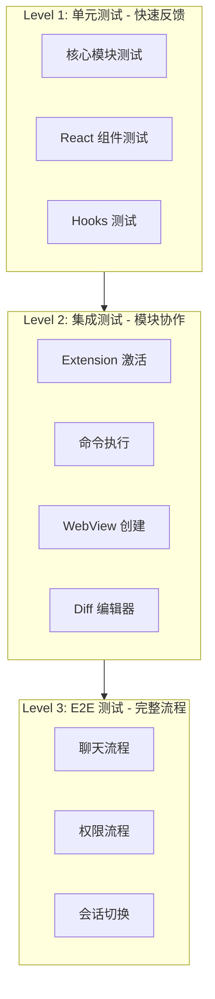
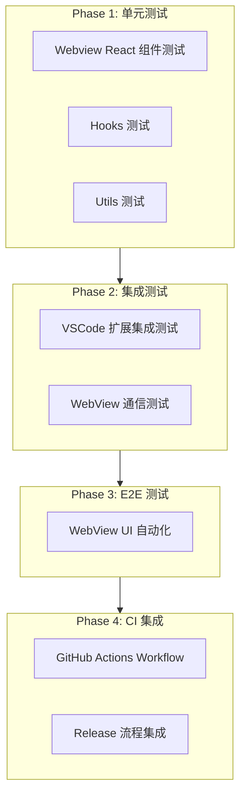
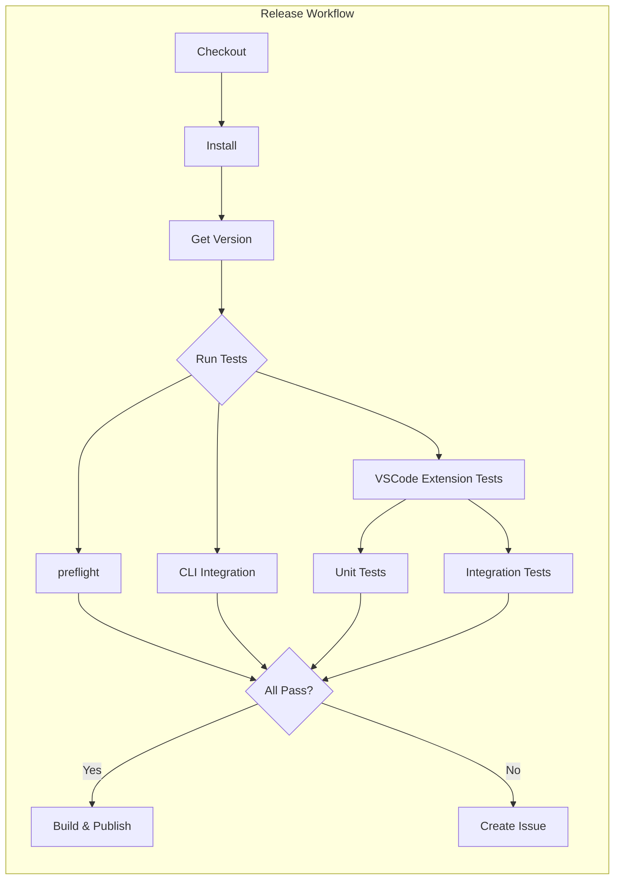

# VSCode IDE Companion 测试完善计划

> 本文档描述了为 `packages/vscode-ide-companion` 添加完整测试覆盖的计划，包括单元测试、集成测试、E2E 测试及 GitHub CI 集成。

## 目录

- [现状分析](#现状分析)
- [关键功能覆盖矩阵](#关键功能覆盖矩阵)
- [测试方案设计](#测试方案设计)
- [Phase 0: 核心模块单元测试](#phase-0-核心模块单元测试)
- [Phase 1: Webview 单元测试](#phase-1-webview-单元测试)
- [Phase 2: VSCode 扩展集成测试](#phase-2-vscode-扩展集成测试)
- [Phase 3: E2E UI 自动化测试](#phase-3-e2e-ui-自动化测试)
- [Phase 4: GitHub Actions CI 集成](#phase-4-github-actions-ci-集成)
- [与发布流程集成](#与发布流程集成)
- [实施计划](#实施计划)

---

## 现状分析

### 当前测试覆盖情况

| 测试文件 | 覆盖内容 | 覆盖率 |
|---------|---------|--------|
| `extension.test.ts` | 扩展激活逻辑 | 部分 |
| `ide-server.test.ts` | IDE Server HTTP 端点 | 良好 |
| `open-files-manager.test.ts` | 打开文件管理 | 良好 |
| `utils/acpModelInfo.test.ts` | ACP 模型信息工具 | 部分 |
| `webview/utils/utils.test.ts` | Webview 工具函数 | 部分 |

**关键缺口:**
- 测试环境为 `node`，不支持 DOM 测试
- **80+ 个 Webview 组件几乎没有测试覆盖**
- `WebViewContent` - HTML 生成已有基础测试（仍需补充更多边界）
- `PanelManager` - Tab/Panel 管理未测试
- `DiffManager` - Diff 编辑器未测试
- `MessageHandler/Router` - 消息路由未测试
- `WebViewProvider` - WebView 提供者核心逻辑未测试
- 已补 VSCode 扩展集成测试（openChat/openNewChatTab/showDiff）
- 已补 Webview UI 自动化（Playwright harness），但未覆盖完整流程
- 已补 VS Code 端到端 UI 基础用例（命令面板打开 Webview / 权限弹窗）

### 参考实现

`packages/cli` 已有完善的 React 组件测试：
- 使用 `@testing-library/react` + `jsdom`
- 使用 `ink-testing-library` 进行终端 UI 测试
- 提供 `renderWithProviders` 测试工具函数

---

## 关键功能覆盖矩阵

以下是确保插件基本功能正常的关键测试场景：

### 核心功能保障

| 功能场景 | 可能的问题 | 测试类型 | 测试文件 |
|---------|-----------|---------|---------|
| **WebView 渲染** | WebView 无法显示/白屏 | 单元+集成 | `WebViewContent.test.ts`, `test/suite/extension.test.cjs` |
| **Tab 打开** | 命令执行后无反应 | 单元+集成 | `PanelManager.test.ts`, `test/suite/extension.test.cjs` |
| **消息发送** | 用户输入无法提交 | 单元+E2E | `App.test.tsx`, `InputForm.test.tsx` |
| **消息接收** | AI 回复无法显示 | 单元+E2E | `useMessageHandling.test.ts`, `webview-send-message.spec.ts` |
| **Diff 编辑器** | 代码对比无法打开 | 单元+集成 | `diff-manager.test.ts`, `test/suite/extension.test.cjs` |
| **权限请求** | 权限弹窗无法响应 | 单元+E2E | `PermissionDrawer.test.tsx`, `webview-permission.spec.ts` |
| **会话管理** | 会话无法创建/切换 | 单元+集成 | `useSessionManagement.test.ts`, *(集成待补)* |
| **会话恢复** | VSCode 重启后状态丢失 | 集成 | *(待补: serialization)* |
| **Tool Call 显示** | 工具调用无法渲染 | 单元 | `ToolCall.test.tsx`, `*ToolCall.test.tsx` |
| **Extension↔WebView 通信** | 消息丢失/格式错误 | 单元+集成 | `MessageHandler.test.ts`, `test/suite/extension.test.cjs` |

### 测试层级说明



---

## 测试方案设计



---

## Phase 0: 核心模块单元测试

> **目标**: 确保插件的核心基础设施模块正常工作，防止 WebView 无法渲染、Tab 无法打开等严重问题。

### 0.1 WebViewContent 测试

**文件**: `src/webview/WebViewContent.test.ts`

```typescript
import { describe, it, expect, vi, beforeEach } from 'vitest';
import * as vscode from 'vscode';
import { WebViewContent } from './WebViewContent.js';

vi.mock('vscode', () => ({
  Uri: {
    joinPath: vi.fn((base, ...paths) => ({
      fsPath: `${base.fsPath}/${paths.join('/')}`,
    })),
  },
}));

describe('WebViewContent', () => {
  let mockPanel: vscode.WebviewPanel;
  let mockExtensionUri: vscode.Uri;

  beforeEach(() => {
    mockExtensionUri = { fsPath: '/path/to/extension' } as vscode.Uri;
    mockPanel = {
      webview: {
        asWebviewUri: vi.fn((uri) => ({
          toString: () => `vscode-webview://resource${uri.fsPath}`,
        })),
        cspSource: 'vscode-webview:',
      },
    } as unknown as vscode.WebviewPanel;
  });

  it('should generate valid HTML with required elements', () => {
    const html = WebViewContent.generate(mockPanel, mockExtensionUri);

    // 验证 HTML 结构完整性
    expect(html).toContain('<!DOCTYPE html>');
    expect(html).toContain('<html lang="en">');
    expect(html).toContain('<div id="root"></div>');
    expect(html).toContain('<script src=');
  });

  it('should include Content-Security-Policy meta tag', () => {
    const html = WebViewContent.generate(mockPanel, mockExtensionUri);

    expect(html).toContain('Content-Security-Policy');
    expect(html).toContain("default-src 'none'");
  });

  it('should include webview.js script reference', () => {
    const html = WebViewContent.generate(mockPanel, mockExtensionUri);

    expect(html).toContain('webview.js');
  });

  it('should set data-extension-uri attribute on body', () => {
    const html = WebViewContent.generate(mockPanel, mockExtensionUri);

    expect(html).toContain('data-extension-uri=');
  });

  it('should escape HTML in URIs to prevent XSS', () => {
    // 模拟包含特殊字符的 URI
    mockPanel.webview.asWebviewUri = vi.fn(() => ({
      toString: () => 'vscode-webview://resource<script>alert(1)</script>',
    }));

    const html = WebViewContent.generate(mockPanel, mockExtensionUri);

    // 确保特殊字符被转义
    expect(html).not.toContain('<script>alert(1)</script>');
    expect(html).toContain('&lt;script&gt;');
  });
});
```

### 0.2 PanelManager 测试

**文件**: `src/webview/PanelManager.test.ts`

```typescript
import { describe, it, expect, vi, beforeEach, afterEach } from 'vitest';
import * as vscode from 'vscode';
import { PanelManager } from './PanelManager.js';

vi.mock('vscode', () => ({
  window: {
    createWebviewPanel: vi.fn(),
    tabGroups: {
      all: [],
      activeTabGroup: { viewColumn: 1 },
    },
  },
  commands: {
    executeCommand: vi.fn(),
  },
  Uri: {
    joinPath: vi.fn((base, ...paths) => ({
      fsPath: `${base.fsPath}/${paths.join('/')}`,
    })),
  },
  ViewColumn: {
    One: 1,
    Two: 2,
    Beside: -2,
  },
}));

describe('PanelManager', () => {
  let panelManager: PanelManager;
  let mockExtensionUri: vscode.Uri;
  let onDisposeCallback: () => void;

  beforeEach(() => {
    vi.clearAllMocks();
    mockExtensionUri = { fsPath: '/path/to/extension' } as vscode.Uri;
    onDisposeCallback = vi.fn();
    panelManager = new PanelManager(mockExtensionUri, onDisposeCallback);
  });

  afterEach(() => {
    panelManager.dispose();
  });

  describe('createPanel', () => {
    it('should create a new panel when none exists', async () => {
      const mockPanel = {
        webview: {},
        iconPath: null,
        onDidDispose: vi.fn(),
        onDidChangeViewState: vi.fn(),
      };
      vi.mocked(vscode.window.createWebviewPanel).mockReturnValue(
        mockPanel as unknown as vscode.WebviewPanel,
      );
      vi.mocked(vscode.commands.executeCommand).mockResolvedValue(undefined);

      const result = await panelManager.createPanel();

      expect(result).toBe(true);
      expect(vscode.window.createWebviewPanel).toHaveBeenCalledWith(
        'qwenCode.chat',
        'Qwen Code',
        expect.any(Object),
        expect.objectContaining({
          enableScripts: true,
          retainContextWhenHidden: true,
        }),
      );
    });

    it('should return false if panel already exists', async () => {
      const mockPanel = {
        webview: {},
        iconPath: null,
        onDidDispose: vi.fn(),
        onDidChangeViewState: vi.fn(),
      };
      vi.mocked(vscode.window.createWebviewPanel).mockReturnValue(
        mockPanel as unknown as vscode.WebviewPanel,
      );
      vi.mocked(vscode.commands.executeCommand).mockResolvedValue(undefined);

      await panelManager.createPanel();
      const result = await panelManager.createPanel();

      expect(result).toBe(false);
    });

    it('should set panel icon', async () => {
      const mockPanel = {
        webview: {},
        iconPath: null,
        onDidDispose: vi.fn(),
        onDidChangeViewState: vi.fn(),
      };
      vi.mocked(vscode.window.createWebviewPanel).mockReturnValue(
        mockPanel as unknown as vscode.WebviewPanel,
      );
      vi.mocked(vscode.commands.executeCommand).mockResolvedValue(undefined);

      await panelManager.createPanel();

      expect(mockPanel.iconPath).toBeDefined();
    });
  });

  describe('getPanel', () => {
    it('should return null when no panel exists', () => {
      expect(panelManager.getPanel()).toBeNull();
    });

    it('should return panel after creation', async () => {
      const mockPanel = {
        webview: {},
        iconPath: null,
        onDidDispose: vi.fn(),
        onDidChangeViewState: vi.fn(),
      };
      vi.mocked(vscode.window.createWebviewPanel).mockReturnValue(
        mockPanel as unknown as vscode.WebviewPanel,
      );
      vi.mocked(vscode.commands.executeCommand).mockResolvedValue(undefined);

      await panelManager.createPanel();

      expect(panelManager.getPanel()).toBe(mockPanel);
    });
  });

  describe('dispose', () => {
    it('should dispose panel and set to null', async () => {
      const mockDispose = vi.fn();
      const mockPanel = {
        webview: {},
        iconPath: null,
        dispose: mockDispose,
        onDidDispose: vi.fn(),
        onDidChangeViewState: vi.fn(),
      };
      vi.mocked(vscode.window.createWebviewPanel).mockReturnValue(
        mockPanel as unknown as vscode.WebviewPanel,
      );
      vi.mocked(vscode.commands.executeCommand).mockResolvedValue(undefined);

      await panelManager.createPanel();
      panelManager.dispose();

      expect(mockDispose).toHaveBeenCalled();
      expect(panelManager.getPanel()).toBeNull();
    });
  });
});
```

### 0.3 DiffManager 测试

**文件**: `src/diff-manager.test.ts`

```typescript
import { describe, it, expect, vi, beforeEach, afterEach } from 'vitest';
import * as vscode from 'vscode';
import { DiffManager, DiffContentProvider } from './diff-manager.js';

vi.mock('vscode', () => ({
  Uri: {
    from: vi.fn(({ scheme, path, query }) => ({
      scheme,
      path,
      query,
      toString: () => `${scheme}://${path}?${query}`,
      fsPath: path,
    })),
    file: vi.fn((path) => ({ fsPath: path, scheme: 'file' })),
  },
  commands: {
    executeCommand: vi.fn(),
  },
  workspace: {
    openTextDocument: vi.fn(),
  },
  window: {
    onDidChangeActiveTextEditor: vi.fn(() => ({ dispose: vi.fn() })),
    activeTextEditor: undefined,
    tabGroups: {
      all: [],
      close: vi.fn(),
    },
  },
  EventEmitter: vi.fn(() => ({
    event: vi.fn(),
    fire: vi.fn(),
    dispose: vi.fn(),
  })),
}));

describe('DiffContentProvider', () => {
  let provider: DiffContentProvider;

  beforeEach(() => {
    provider = new DiffContentProvider();
  });

  it('should set and get content', () => {
    const uri = { toString: () => 'test-uri' } as vscode.Uri;
    provider.setContent(uri, 'test content');

    expect(provider.provideTextDocumentContent(uri)).toBe('test content');
  });

  it('should return empty string for unknown URI', () => {
    const uri = { toString: () => 'unknown-uri' } as vscode.Uri;

    expect(provider.provideTextDocumentContent(uri)).toBe('');
  });

  it('should delete content', () => {
    const uri = { toString: () => 'test-uri' } as vscode.Uri;
    provider.setContent(uri, 'test content');
    provider.deleteContent(uri);

    expect(provider.provideTextDocumentContent(uri)).toBe('');
  });
});

describe('DiffManager', () => {
  let diffManager: DiffManager;
  let mockLog: (message: string) => void;
  let mockContentProvider: DiffContentProvider;

  beforeEach(() => {
    vi.clearAllMocks();
    mockLog = vi.fn();
    mockContentProvider = new DiffContentProvider();
    diffManager = new DiffManager(mockLog, mockContentProvider);
  });

  afterEach(() => {
    diffManager.dispose();
  });

  describe('showDiff', () => {
    it('should create diff view with correct URIs', async () => {
      vi.mocked(vscode.commands.executeCommand).mockResolvedValue(undefined);

      await diffManager.showDiff('/test/file.ts', 'old content', 'new content');

      expect(vscode.commands.executeCommand).toHaveBeenCalledWith(
        'vscode.diff',
        expect.any(Object), // left URI
        expect.any(Object), // right URI
        expect.stringContaining('file.ts'), // title
        expect.any(Object), // options
      );
    });

    it('should set context when showing diff', async () => {
      vi.mocked(vscode.commands.executeCommand).mockResolvedValue(undefined);

      await diffManager.showDiff('/test/file.ts', 'old', 'new');

      expect(vscode.commands.executeCommand).toHaveBeenCalledWith(
        'setContext',
        'qwen.diff.isVisible',
        true,
      );
    });

    it('should deduplicate rapid duplicate calls', async () => {
      vi.mocked(vscode.commands.executeCommand).mockResolvedValue(undefined);

      await diffManager.showDiff('/test/file.ts', 'old', 'new');
      await diffManager.showDiff('/test/file.ts', 'old', 'new');

      // vscode.diff should only be called once
      const diffCalls = vi
        .mocked(vscode.commands.executeCommand)
        .mock.calls.filter((call) => call[0] === 'vscode.diff');
      expect(diffCalls.length).toBe(1);
    });
  });

  describe('acceptDiff', () => {
    it('should fire diffAccepted notification', async () => {
      // Setup: first show a diff
      vi.mocked(vscode.commands.executeCommand).mockResolvedValue(undefined);
      vi.mocked(vscode.workspace.openTextDocument).mockResolvedValue({
        getText: () => 'modified content',
      } as vscode.TextDocument);

      await diffManager.showDiff('/test/file.ts', 'old', 'new');

      // Get the right URI from the showDiff call
      const rightUri = vi.mocked(vscode.Uri.from).mock.results.find(
        (r) => r.value.query?.includes('new'),
      )?.value;

      if (rightUri) {
        await diffManager.acceptDiff(rightUri);

        expect(vscode.commands.executeCommand).toHaveBeenCalledWith(
          'setContext',
          'qwen.diff.isVisible',
          false,
        );
      }
    });
  });

  describe('closeAll', () => {
    it('should close all open diff editors', async () => {
      vi.mocked(vscode.commands.executeCommand).mockResolvedValue(undefined);

      await diffManager.showDiff('/test/file1.ts', 'old1', 'new1');
      await diffManager.showDiff('/test/file2.ts', 'old2', 'new2');

      await diffManager.closeAll();

      // Verify context is set to false
      expect(vscode.commands.executeCommand).toHaveBeenCalledWith(
        'setContext',
        'qwen.diff.isVisible',
        false,
      );
    });
  });
});
```

### 0.4 MessageHandler/Router 测试

**文件**: `src/webview/MessageHandler.test.ts`

```typescript
import { describe, it, expect, vi, beforeEach } from 'vitest';
import { MessageHandler } from './MessageHandler.js';
import type { QwenAgentManager } from '../services/qwenAgentManager.js';
import type { ConversationStore } from '../services/conversationStore.js';

describe('MessageHandler', () => {
  let messageHandler: MessageHandler;
  let mockAgentManager: QwenAgentManager;
  let mockConversationStore: ConversationStore;
  let mockSendToWebView: (message: unknown) => void;

  beforeEach(() => {
    mockAgentManager = {
      sendMessage: vi.fn(),
      createNewSession: vi.fn(),
      loadSessions: vi.fn(),
      switchSession: vi.fn(),
      cancelCurrentPrompt: vi.fn(),
    } as unknown as QwenAgentManager;

    mockConversationStore = {
      createConversation: vi.fn(),
      getConversation: vi.fn(),
      updateConversation: vi.fn(),
    } as unknown as ConversationStore;

    mockSendToWebView = vi.fn();

    messageHandler = new MessageHandler(
      mockAgentManager,
      mockConversationStore,
      null,
      mockSendToWebView,
    );
  });

  describe('route', () => {
    it('should route sendMessage to agent manager', async () => {
      await messageHandler.route({
        type: 'sendMessage',
        data: { content: 'Hello' },
      });

      expect(mockAgentManager.sendMessage).toHaveBeenCalled();
    });

    it('should route cancelStreaming to agent manager', async () => {
      await messageHandler.route({
        type: 'cancelStreaming',
        data: {},
      });

      expect(mockAgentManager.cancelCurrentPrompt).toHaveBeenCalled();
    });

    it('should route newSession to agent manager', async () => {
      await messageHandler.route({
        type: 'newSession',
        data: {},
      });

      expect(mockAgentManager.createNewSession).toHaveBeenCalled();
    });

    it('should route loadSessions to agent manager', async () => {
      vi.mocked(mockAgentManager.loadSessions).mockResolvedValue([]);

      await messageHandler.route({
        type: 'loadSessions',
        data: {},
      });

      expect(mockAgentManager.loadSessions).toHaveBeenCalled();
    });
  });

  describe('setCurrentConversationId', () => {
    it('should set and get conversation ID', () => {
      messageHandler.setCurrentConversationId('test-id');

      expect(messageHandler.getCurrentConversationId()).toBe('test-id');
    });
  });

  describe('setPermissionHandler', () => {
    it('should set permission handler', () => {
      const handler = vi.fn();
      messageHandler.setPermissionHandler(handler);

      // Trigger permission response
      messageHandler.route({
        type: 'permissionResponse',
        data: { optionId: 'allow_once' },
      });

      expect(handler).toHaveBeenCalledWith({
        type: 'permissionResponse',
        data: { optionId: 'allow_once' },
      });
    });
  });
});
```

### 0.5 Commands 测试

**文件**: `src/commands/index.test.ts`

```typescript
import { describe, it, expect, vi, beforeEach } from 'vitest';
import * as vscode from 'vscode';
import { registerNewCommands } from './index.js';
import type { DiffManager } from '../diff-manager.js';
import type { WebViewProvider } from '../webview/WebViewProvider.js';

vi.mock('vscode', () => ({
  commands: {
    registerCommand: vi.fn(() => ({ dispose: vi.fn() })),
  },
  window: {
    showInformationMessage: vi.fn(),
    showErrorMessage: vi.fn(),
  },
  workspace: {
    workspaceFolders: [{ uri: { fsPath: '/workspace' } }],
  },
  Uri: {
    joinPath: vi.fn((base, ...paths) => ({
      fsPath: `${base.fsPath}/${paths.join('/')}`,
    })),
  },
}));

describe('Commands', () => {
  let mockContext: vscode.ExtensionContext;
  let mockLog: (message: string) => void;
  let mockDiffManager: DiffManager;
  let mockProviders: WebViewProvider[];
  let mockCreateProvider: () => WebViewProvider;

  beforeEach(() => {
    vi.clearAllMocks();

    mockContext = {
      subscriptions: [],
    } as unknown as vscode.ExtensionContext;

    mockLog = vi.fn();

    mockDiffManager = {
      showDiff: vi.fn(),
    } as unknown as DiffManager;

    mockProviders = [];

    mockCreateProvider = vi.fn(() => ({
      show: vi.fn(),
      forceReLogin: vi.fn(),
    })) as unknown as () => WebViewProvider;
  });

  it('should register openChat command', () => {
    registerNewCommands(
      mockContext,
      mockLog,
      mockDiffManager,
      () => mockProviders,
      mockCreateProvider,
    );

    expect(vscode.commands.registerCommand).toHaveBeenCalledWith(
      'qwen-code.openChat',
      expect.any(Function),
    );
  });

  it('should register showDiff command', () => {
    registerNewCommands(
      mockContext,
      mockLog,
      mockDiffManager,
      () => mockProviders,
      mockCreateProvider,
    );

    expect(vscode.commands.registerCommand).toHaveBeenCalledWith(
      'qwenCode.showDiff',
      expect.any(Function),
    );
  });

  it('should register openNewChatTab command', () => {
    registerNewCommands(
      mockContext,
      mockLog,
      mockDiffManager,
      () => mockProviders,
      mockCreateProvider,
    );

    expect(vscode.commands.registerCommand).toHaveBeenCalledWith(
      'qwenCode.openNewChatTab',
      expect.any(Function),
    );
  });

  it('should register login command', () => {
    registerNewCommands(
      mockContext,
      mockLog,
      mockDiffManager,
      () => mockProviders,
      mockCreateProvider,
    );

    expect(vscode.commands.registerCommand).toHaveBeenCalledWith(
      'qwen-code.login',
      expect.any(Function),
    );
  });

  describe('openChat command execution', () => {
    it('should create new provider when none exists', async () => {
      registerNewCommands(
        mockContext,
        mockLog,
        mockDiffManager,
        () => [],
        mockCreateProvider,
      );

      // Get the registered handler
      const openChatCall = vi
        .mocked(vscode.commands.registerCommand)
        .mock.calls.find((call) => call[0] === 'qwen-code.openChat');
      const handler = openChatCall?.[1] as () => Promise<void>;

      await handler();

      expect(mockCreateProvider).toHaveBeenCalled();
    });

    it('should use existing provider when available', async () => {
      const mockProvider = {
        show: vi.fn(),
      } as unknown as WebViewProvider;
      mockProviders = [mockProvider];

      registerNewCommands(
        mockContext,
        mockLog,
        mockDiffManager,
        () => mockProviders,
        mockCreateProvider,
      );

      const openChatCall = vi
        .mocked(vscode.commands.registerCommand)
        .mock.calls.find((call) => call[0] === 'qwen-code.openChat');
      const handler = openChatCall?.[1] as () => Promise<void>;

      await handler();

      expect(mockProvider.show).toHaveBeenCalled();
      expect(mockCreateProvider).not.toHaveBeenCalled();
    });
  });
});
```

---

## Phase 1: Webview 单元测试

### 1.1 环境配置

修改 `vitest.config.ts`：

```typescript
import { defineConfig } from 'vitest/config';

export default defineConfig({
  test: {
    globals: true,
    environment: 'jsdom', // 切换为 jsdom 支持 DOM 测试
    include: ['src/**/*.test.ts', 'src/**/*.test.tsx'],
    setupFiles: ['./src/test-setup.ts'],
    coverage: {
      provider: 'v8',
      reporter: ['text', 'json', 'html', 'clover'],
      include: ['src/**/*.ts', 'src/**/*.tsx'],
      exclude: ['src/**/*.test.ts', 'src/**/*.test.tsx', 'src/**/*.d.ts'],
    },
  },
});
```

### 1.2 新增依赖

```bash
npm install -D @testing-library/react @testing-library/user-event jsdom
```

### 1.3 创建测试工具

#### `src/test-setup.ts`

```typescript
/**
 * 全局测试 setup
 */
import '@testing-library/react';
import { vi } from 'vitest';

// Mock VSCode API
vi.mock('vscode', () => ({
  window: {
    showInformationMessage: vi.fn(),
    showErrorMessage: vi.fn(),
    createOutputChannel: vi.fn(() => ({
      appendLine: vi.fn(),
      show: vi.fn(),
    })),
  },
  workspace: {
    workspaceFolders: [],
  },
  Uri: {
    file: (path: string) => ({ fsPath: path, scheme: 'file' }),
    joinPath: vi.fn(),
  },
  EventEmitter: vi.fn(() => ({
    event: vi.fn(),
    fire: vi.fn(),
    dispose: vi.fn(),
  })),
}));
```

#### `src/webview/test-utils/render.tsx`

```tsx
import React from 'react';
import { render, type RenderOptions } from '@testing-library/react';
import { vi } from 'vitest';

// Mock VSCode WebView API
export const mockVSCodeAPI = {
  postMessage: vi.fn(),
  getState: vi.fn(() => ({})),
  setState: vi.fn(),
};

// Mock window.acquireVsCodeApi
beforeEach(() => {
  (globalThis as any).acquireVsCodeApi = () => mockVSCodeAPI;
});

afterEach(() => {
  vi.clearAllMocks();
});

// Provider wrapper for tests
const AllTheProviders: React.FC<{ children: React.ReactNode }> = ({
  children,
}) => {
  return <>{children}</>;
};

export const renderWithProviders = (
  ui: React.ReactElement,
  options?: Omit<RenderOptions, 'wrapper'>,
) => render(ui, { wrapper: AllTheProviders, ...options });

export * from '@testing-library/react';
export { mockVSCodeAPI };
```

#### `src/webview/test-utils/mocks.ts`

```typescript
import { vi } from 'vitest';

export const createMockToolCall = (overrides = {}) => ({
  toolCallId: 'test-tool-call-id',
  kind: 'execute',
  title: 'Test Tool Call',
  status: 'pending',
  timestamp: Date.now(),
  ...overrides,
});

export const createMockMessage = (overrides = {}) => ({
  role: 'user',
  content: 'Test message',
  timestamp: Date.now(),
  ...overrides,
});

export const createMockSession = (overrides = {}) => ({
  id: 'test-session-id',
  title: 'Test Session',
  createdAt: Date.now(),
  updatedAt: Date.now(),
  ...overrides,
});
```

### 1.4 核心组件测试文件

| 组件 | 测试文件 | 优先级 | 测试内容 |
|------|---------|--------|---------|
| `App.tsx` | `App.test.tsx` | P0 | 主应用渲染、状态管理、消息流 |
| `InputForm.tsx` | `InputForm.test.tsx` | P0 | 输入、提交、取消、模式切换 |
| `ToolCall.tsx` | `ToolCall.test.tsx` | P1 | 不同类型工具调用渲染 |
| `PermissionDrawer.tsx` | `PermissionDrawer.test.tsx` | P1 | 权限请求、用户响应 |
| `SessionSelector.tsx` | `SessionSelector.test.tsx` | P2 | 会话列表、切换、搜索 |
| `useVSCode.ts` | `useVSCode.test.ts` | P1 | postMessage、状态同步 |
| `useSessionManagement.ts` | `useSessionManagement.test.ts` | P1 | 会话创建、切换、加载 |
| `useMessageHandling.ts` | `useMessageHandling.test.ts` | P1 | 消息添加、流式更新 |

#### 示例: `App.test.tsx`

```tsx
import { describe, it, expect, vi } from 'vitest';
import { screen, waitFor } from '@testing-library/react';
import userEvent from '@testing-library/user-event';
import { renderWithProviders, mockVSCodeAPI } from './test-utils/render';
import { App } from './App';

describe('App', () => {
  it('renders loading state initially', () => {
    renderWithProviders(<App />);
    expect(screen.getByText(/Preparing Qwen Code/i)).toBeInTheDocument();
  });

  it('renders onboarding when not authenticated', async () => {
    renderWithProviders(<App />);

    // Simulate auth state message
    window.dispatchEvent(
      new MessageEvent('message', {
        data: { type: 'authState', data: { authenticated: false } },
      }),
    );

    await waitFor(() => {
      expect(screen.getByText(/Sign in/i)).toBeInTheDocument();
    });
  });

  it('renders empty state when authenticated with no messages', async () => {
    renderWithProviders(<App />);

    // Simulate auth state message
    window.dispatchEvent(
      new MessageEvent('message', {
        data: { type: 'authState', data: { authenticated: true } },
      }),
    );

    await waitFor(() => {
      expect(screen.getByText(/Start a conversation/i)).toBeInTheDocument();
    });
  });

  it('sends message when form is submitted', async () => {
    const user = userEvent.setup();
    renderWithProviders(<App />);

    // Setup authenticated state
    window.dispatchEvent(
      new MessageEvent('message', {
        data: { type: 'authState', data: { authenticated: true } },
      }),
    );

    await waitFor(() => {
      expect(screen.getByRole('textbox')).toBeInTheDocument();
    });

    const input = screen.getByRole('textbox');
    await user.type(input, 'Hello, Qwen!');
    await user.keyboard('{Enter}');

    expect(mockVSCodeAPI.postMessage).toHaveBeenCalledWith(
      expect.objectContaining({
        type: 'sendMessage',
      }),
    );
  });
});
```

---

## Phase 2: VSCode 扩展集成测试

### 2.1 安装依赖

```bash
npm install -D @vscode/test-electron
```

> 说明：当前集成测试基于 `@vscode/test-electron` 直接启动 VS Code，不再依赖 `@vscode/test-cli`。

### 2.2 测试结构

```
test/
├── runTest.cjs               // 测试入口
├── suite/
│   └── extension.test.cjs    // 扩展激活 + 命令/Tab/Diff 测试
└── fixtures/
    └── workspace/            // 集成测试工作区
```

### 2.3 测试入口

#### `test/runTest.cjs`

```javascript
const path = require('node:path');
const { runTests } = require('@vscode/test-electron');

const extensionDevelopmentPath = path.resolve(__dirname, '..');
const extensionTestsPath = path.resolve(__dirname, 'suite/index.cjs');
const workspacePath = path.resolve(__dirname, 'fixtures/workspace');

runTests({
  extensionDevelopmentPath,
  extensionTestsPath,
  launchArgs: [workspacePath, '--disable-workspace-trust'],
});
```

### 2.4 测试场景

> 当前实现集中在 `test/suite/extension.test.cjs`，覆盖 `openChat` 复用、`openNewChatTab` 新建、`showDiff` 打开 `qwen-diff`。下面的分文件示例可作为后续拆分参考。

#### `extension.integration.test.ts`

```typescript
import * as assert from 'assert';
import * as vscode from 'vscode';

suite('Extension Test Suite', () => {
  vscode.window.showInformationMessage('Start all tests.');

  test('Extension should be present', () => {
    assert.ok(
      vscode.extensions.getExtension('qwenlm.qwen-code-vscode-ide-companion'),
    );
  });

  test('Extension should activate', async () => {
    const ext = vscode.extensions.getExtension(
      'qwenlm.qwen-code-vscode-ide-companion',
    );
    await ext?.activate();
    assert.ok(ext?.isActive);
  });

  test('Commands should be registered', async () => {
    const commands = await vscode.commands.getCommands(true);
    assert.ok(commands.includes('qwen-code.openChat'));
    assert.ok(commands.includes('qwen-code.runQwenCode'));
    assert.ok(commands.includes('qwen.diff.accept'));
    assert.ok(commands.includes('qwen.diff.cancel'));
  });

  test('Extension should not throw errors on activation', async () => {
    const ext = vscode.extensions.getExtension(
      'qwenlm.qwen-code-vscode-ide-companion',
    );

    let error: Error | null = null;
    try {
      await ext?.activate();
    } catch (e) {
      error = e as Error;
    }

    assert.strictEqual(error, null);
  });
});
```

#### `webview.integration.test.ts`

> **关键场景**: 验证 WebView 能正确渲染，Tab 能正确打开

```typescript
import * as assert from 'assert';
import * as vscode from 'vscode';

suite('WebView Test Suite', () => {
  // 清理：每个测试后关闭所有打开的 Tab
  teardown(async () => {
    await vscode.commands.executeCommand('workbench.action.closeAllEditors');
  });

  test('openChat command should create webview panel', async () => {
    await vscode.commands.executeCommand('qwen-code.openChat');

    // Wait for panel to be created
    await new Promise((resolve) => setTimeout(resolve, 2000));

    // Check if panel exists
    const tabs = vscode.window.tabGroups.all.flatMap((g) => g.tabs);
    const qwenTab = tabs.find((tab) => {
      const input = tab.input as { viewType?: string };
      return input?.viewType?.includes('qwenCode');
    });

    assert.ok(qwenTab, 'Qwen Code tab should exist');
  });

  test('WebView panel should have correct title', async () => {
    await vscode.commands.executeCommand('qwen-code.openChat');
    await new Promise((resolve) => setTimeout(resolve, 2000));

    const tabs = vscode.window.tabGroups.all.flatMap((g) => g.tabs);
    const qwenTab = tabs.find((tab) => tab.label === 'Qwen Code');

    assert.ok(qwenTab, 'Tab with "Qwen Code" label should exist');
  });

  test('Multiple openChat calls should not create duplicate panels', async () => {
    await vscode.commands.executeCommand('qwen-code.openChat');
    await new Promise((resolve) => setTimeout(resolve, 1000));
    await vscode.commands.executeCommand('qwen-code.openChat');
    await new Promise((resolve) => setTimeout(resolve, 1000));

    const tabs = vscode.window.tabGroups.all.flatMap((g) => g.tabs);
    const qwenTabs = tabs.filter((tab) => {
      const input = tab.input as { viewType?: string };
      return input?.viewType?.includes('qwenCode');
    });

    // Should only have one Qwen tab (unless openNewChatTab was used)
    assert.ok(qwenTabs.length >= 1, 'At least one Qwen tab should exist');
  });

  test('openNewChatTab should create new tab', async () => {
    await vscode.commands.executeCommand('qwen-code.openChat');
    await new Promise((resolve) => setTimeout(resolve, 1000));

    const initialTabs = vscode.window.tabGroups.all.flatMap((g) => g.tabs);
    const initialQwenCount = initialTabs.filter((tab) => {
      const input = tab.input as { viewType?: string };
      return input?.viewType?.includes('qwenCode');
    }).length;

    await vscode.commands.executeCommand('qwenCode.openNewChatTab');
    await new Promise((resolve) => setTimeout(resolve, 1000));

    const finalTabs = vscode.window.tabGroups.all.flatMap((g) => g.tabs);
    const finalQwenCount = finalTabs.filter((tab) => {
      const input = tab.input as { viewType?: string };
      return input?.viewType?.includes('qwenCode');
    }).length;

    assert.strictEqual(
      finalQwenCount,
      initialQwenCount + 1,
      'Should have one more Qwen tab',
    );
  });
});
```

#### `diff.integration.test.ts`

> **关键场景**: 验证 Diff 编辑器能正确打开和关闭

```typescript
import * as assert from 'assert';
import * as vscode from 'vscode';
import * as path from 'path';
import * as fs from 'fs';

suite('Diff Editor Test Suite', () => {
  let testFilePath: string;

  setup(async () => {
    // Create a test file
    const workspaceFolder = vscode.workspace.workspaceFolders?.[0];
    if (workspaceFolder) {
      testFilePath = path.join(workspaceFolder.uri.fsPath, 'test-diff-file.ts');
      fs.writeFileSync(testFilePath, 'const x = 1;');
    }
  });

  teardown(async () => {
    // Cleanup
    await vscode.commands.executeCommand('workbench.action.closeAllEditors');
    if (testFilePath && fs.existsSync(testFilePath)) {
      fs.unlinkSync(testFilePath);
    }
  });

  test('showDiff command should open diff editor', async () => {
    await vscode.commands.executeCommand('qwenCode.showDiff', {
      path: testFilePath,
      oldText: 'const x = 1;',
      newText: 'const x = 2;',
    });

    await new Promise((resolve) => setTimeout(resolve, 2000));

    // Check if diff editor is visible
    const editor = vscode.window.activeTextEditor;
    // Diff editor should be open
    assert.ok(
      editor || vscode.window.visibleTextEditors.length > 0,
      'Editor should be visible',
    );
  });

  test('diff.accept should close diff editor', async () => {
    await vscode.commands.executeCommand('qwenCode.showDiff', {
      path: testFilePath,
      oldText: 'const x = 1;',
      newText: 'const x = 2;',
    });

    await new Promise((resolve) => setTimeout(resolve, 1000));

    await vscode.commands.executeCommand('qwen.diff.accept');

    await new Promise((resolve) => setTimeout(resolve, 500));

    // Verify context is updated
    // Note: We can't directly check context, but we can verify the diff is closed
  });

  test('diff.cancel should close diff editor without applying changes', async () => {
    await vscode.commands.executeCommand('qwenCode.showDiff', {
      path: testFilePath,
      oldText: 'const x = 1;',
      newText: 'const x = 2;',
    });

    await new Promise((resolve) => setTimeout(resolve, 1000));

    await vscode.commands.executeCommand('qwen.diff.cancel');

    await new Promise((resolve) => setTimeout(resolve, 500));

    // Verify original file content is unchanged
    const content = fs.readFileSync(testFilePath, 'utf-8');
    assert.strictEqual(content, 'const x = 1;');
  });
});
```

#### `serialization.integration.test.ts`

> **关键场景**: 验证 VSCode 重启后会话能恢复

```typescript
import * as assert from 'assert';
import * as vscode from 'vscode';

suite('WebView Serialization Test Suite', () => {
  test('WebView panel serializer should be registered', async () => {
    // Activate extension first
    const ext = vscode.extensions.getExtension(
      'qwenlm.qwen-code-vscode-ide-companion',
    );
    await ext?.activate();

    // Open a chat panel
    await vscode.commands.executeCommand('qwen-code.openChat');
    await new Promise((resolve) => setTimeout(resolve, 2000));

    // The serializer is registered internally, we can verify by checking
    // that the panel can be created with the correct viewType
    const tabs = vscode.window.tabGroups.all.flatMap((g) => g.tabs);
    const qwenTab = tabs.find((tab) => {
      const input = tab.input as { viewType?: string };
      // VSCode prefixes webview viewTypes with "mainThreadWebview-"
      return (
        input?.viewType === 'qwenCode.chat' ||
        input?.viewType === 'mainThreadWebview-qwenCode.chat'
      );
    });

    assert.ok(qwenTab, 'Qwen Code tab with correct viewType should exist');
  });
});
```

### 2.5 package.json 脚本

```json
{
  "scripts": {
    "test:integration": "node ./test/runTest.cjs"
  }
}
```

---

## Phase 3: E2E UI 自动化测试

### 3.1 技术选型

推荐使用 **Playwright + Webview Harness**（直接加载 `dist/webview.js`）：

- 速度快、稳定性高，适合 UI 交互回归
- 可直接操作 WebView DOM（无需启动 VS Code）
- 如需 VS Code 级 E2E，可后续补充 Electron/VS Code fixture

### 3.2 目录结构

```
e2e/
├── playwright.config.ts
├── fixtures/
│   └── webview-harness.html
└── tests/
    ├── webview-send-message.spec.ts
    └── webview-permission.spec.ts

e2e-vscode/
├── playwright.config.ts
├── fixtures/
│   └── vscode-fixture.ts
└── tests/
    ├── open-chat.spec.ts
    └── permission-drawer.spec.ts
```

### 3.3 配置

#### `e2e/playwright.config.ts`

```typescript
import path from 'node:path';
import { pathToFileURL } from 'node:url';
import { defineConfig } from '@playwright/test';

const fixturesPath = path.resolve(__dirname, 'fixtures');
const baseURL = pathToFileURL(`${fixturesPath}${path.sep}`).toString();

export default defineConfig({
  testDir: path.resolve(__dirname, 'tests'),
  timeout: 60000,
  retries: 1,
  use: {
    baseURL,
    headless: true,
    viewport: { width: 1280, height: 720 },
    screenshot: 'only-on-failure',
    trace: 'retain-on-failure',
  },
});
```

#### `e2e/fixtures/webview-harness.html`

```html
<body data-extension-uri="https://example.com/">
  <div id="root"></div>
  <script>
    window.__postedMessages = [];
    window.acquireVsCodeApi = () => ({
      postMessage: (message) => window.__postedMessages.push(message),
      getState: () => ({}),
      setState: () => {},
    });
  </script>
  <script src="../../dist/webview.js"></script>
</body>
```

### 3.4 测试用例

#### `e2e/tests/webview-send-message.spec.ts`

```typescript
import { test, expect } from '@playwright/test';

test('send message posts to VS Code API', async ({ page }) => {
  await page.goto('webview-harness.html');
  // ... dispatch authState, type input, assert postMessage
});
```

> 运行提示：E2E 依赖 `dist/webview.js`，需先执行 `npm run build`（或保持产物最新）并运行 `npx playwright install`。
> 默认仅在失败时保留截图/trace，可根据需要在 Playwright 配置中调整。

### 3.5 VS Code 端到端 UI（可选）

> 适用于验证 VS Code 宿主的实际 UI 行为（命令面板、Webview 挂载等），但执行更慢、对环境依赖更高。

#### `e2e-vscode/fixtures/vscode-fixture.ts`

```typescript
import { downloadAndUnzipVSCode } from '@vscode/test-electron';
import { _electron } from '@playwright/test';

// 若设置了 VSCODE_EXECUTABLE_PATH，会直接使用本机 VS Code；
// 否则使用 test-electron 下载的 VS Code。
```

#### `e2e-vscode/tests/open-chat.spec.ts`

```typescript
import { test, expect, runCommand } from '../fixtures/vscode-fixture';

test('open chat via command palette', async ({ page, webview }) => {
  await runCommand(page, 'Qwen Code: Open');
  await expect(webview.getByRole('textbox', { name: 'Message input' })).toBeVisible();
});
```

#### `e2e-vscode/playwright.config.ts`

```typescript
export default defineConfig({
  testDir: 'e2e-vscode/tests',
  workers: 1,
  use: {
    screenshot: 'only-on-failure',
    trace: 'retain-on-failure',
  },
});
```

> 运行提示：需要网络下载 VS Code（或配置 `VSCODE_EXECUTABLE_PATH`），并会拉起 Electron。失败时会保留截图/trace 便于排查。

---

## Phase 4: GitHub Actions CI 集成

### 4.1 新增 Workflow 文件

#### `.github/workflows/vscode-extension-test.yml`

```yaml
name: 'VSCode Extension Tests'

on:
  push:
    branches:
      - 'main'
      - 'release/**'
    paths:
      - 'packages/vscode-ide-companion/**'
      - '.github/workflows/vscode-extension-test.yml'
  pull_request:
    branches:
      - 'main'
      - 'release/**'
    paths:
      - 'packages/vscode-ide-companion/**'
      - '.github/workflows/vscode-extension-test.yml'
  workflow_dispatch:

concurrency:
  group: '${{ github.workflow }}-${{ github.head_ref || github.ref }}'
  cancel-in-progress: true

permissions:
  contents: 'read'
  checks: 'write'

jobs:
  unit-test:
    name: 'Unit Tests'
    runs-on: '${{ matrix.os }}'
    strategy:
      fail-fast: false
      matrix:
        os:
          - 'ubuntu-latest'
          - 'macos-latest'
          - 'windows-latest'
        node-version:
          - '20.x'
          - '22.x'

    steps:
      - name: 'Checkout'
        uses: 'actions/checkout@v4'

      - name: 'Setup Node.js'
        uses: 'actions/setup-node@v4'
        with:
          node-version: '${{ matrix.node-version }}'
          cache: 'npm'

      - name: 'Install dependencies'
        run: 'npm ci'

      - name: 'Build project'
        run: 'npm run build'

      - name: 'Run unit tests'
        run: 'npm run test:ci --workspace=packages/vscode-ide-companion'

      - name: 'Upload coverage'
        if: matrix.os == 'ubuntu-latest' && matrix.node-version == '20.x'
        uses: 'actions/upload-artifact@v4'
        with:
          name: 'coverage-vscode-extension'
          path: 'packages/vscode-ide-companion/coverage'

  integration-test:
    name: 'Integration Tests'
    runs-on: 'ubuntu-latest'
    needs: 'unit-test'

    steps:
      - name: 'Checkout'
        uses: 'actions/checkout@v4'

      - name: 'Setup Node.js'
        uses: 'actions/setup-node@v4'
        with:
          node-version: '20.x'
          cache: 'npm'

      - name: 'Install dependencies'
        run: 'npm ci'

      - name: 'Build project'
        run: 'npm run build'

      - name: 'Run integration tests'
        run: 'xvfb-run -a npm run test:integration --workspace=packages/vscode-ide-companion'

  e2e-test:
    name: 'E2E Tests'
    runs-on: 'ubuntu-latest'
    needs: 'integration-test'

    steps:
      - name: 'Checkout'
        uses: 'actions/checkout@v4'

      - name: 'Setup Node.js'
        uses: 'actions/setup-node@v4'
        with:
          node-version: '20.x'
          cache: 'npm'

      - name: 'Install dependencies'
        run: 'npm ci'

      - name: 'Install Playwright browsers'
        run: 'npx playwright install --with-deps chromium'

      - name: 'Build project'
        run: 'npm run build'

      - name: 'Run E2E tests'
        run: 'xvfb-run -a npm run test:e2e --workspace=packages/vscode-ide-companion'

      - name: 'Upload test results'
        if: always()
        uses: 'actions/upload-artifact@v4'
        with:
          name: 'playwright-report'
          path: 'packages/vscode-ide-companion/e2e/playwright-report'

  # Summary job for branch protection
  vscode-extension-tests:
    name: 'VSCode Extension Tests Summary'
    runs-on: 'ubuntu-latest'
    needs:
      - 'unit-test'
      - 'integration-test'
      - 'e2e-test'
    if: always()
    steps:
      - name: 'Check test results'
        run: |
          if [[ "${{ needs.unit-test.result }}" == "failure" ]] || \
             [[ "${{ needs.integration-test.result }}" == "failure" ]] || \
             [[ "${{ needs.e2e-test.result }}" == "failure" ]]; then
            echo "One or more test jobs failed"
            exit 1
          fi
          echo "All tests passed!"
```

---

## 与发布流程集成

### 修改 `.github/workflows/release.yml`

在 `Run Tests` 步骤中添加 VSCode 扩展测试：

```yaml
- name: 'Run Tests'
  if: |-
    ${{ github.event.inputs.force_skip_tests != 'true' }}
  run: |
    npm run preflight

    # CLI 集成测试
    npm run test:integration:cli:sandbox:none
    npm run test:integration:cli:sandbox:docker

    # VSCode 扩展测试 (新增)
    npm run test:ci --workspace=packages/vscode-ide-companion
    xvfb-run -a npm run test:integration --workspace=packages/vscode-ide-companion
  env:
    OPENAI_API_KEY: '${{ secrets.OPENAI_API_KEY }}'
    OPENAI_BASE_URL: '${{ secrets.OPENAI_BASE_URL }}'
    OPENAI_MODEL: '${{ secrets.OPENAI_MODEL }}'
```

### 发布前检查流程



---

## 实施计划

### 优先级排序

| 阶段 | 内容 | 优先级 | 预计工期 | 保障功能 |
|------|------|--------|---------|---------|
| Phase 0 | 核心模块单元测试 | **P0** | 2 天 | WebView 渲染、Tab 打开、Diff 编辑器 |
| Phase 1.1-1.3 | 环境配置、测试工具 | **P0** | 1 天 | 测试基础设施 |
| Phase 4 | CI 集成 | **P0** | 1 天 | 发布前自动验证 |
| Phase 1.4 P0 | 核心组件测试 (App, InputForm) | **P0** | 2 天 | 消息发送、用户交互 |
| Phase 2 | VSCode 集成测试 | **P1** | 2-3 天 | 命令执行、WebView 创建 |
| Phase 1.4 P1 | 次优先组件测试 | P1 | 2 天 | Tool Call、权限弹窗 |
| Phase 3 | E2E 测试 | P2 | 3-4 天 | 完整用户流程 |

### 里程碑

1. **M1 (Week 1)**: 完成 Phase 0 + Phase 1.1-1.3 + CI 集成
   - ✅ 核心模块测试覆盖
   - ✅ GitHub Actions workflow 运行
   - ✅ 每次 PR 自动验证

2. **M2 (Week 2)**: 完成 Phase 1.4 P0 + Phase 2
   - ✅ Webview 组件测试
   - ✅ VSCode 集成测试
   - ✅ Tab/Panel 打开测试

3. **M3 (Week 3)**: 完成 Phase 1.4 P1 + Phase 3
   - ✅ 完整 E2E 测试
   - ✅ 所有核心流程覆盖

### 成功指标

#### 功能保障指标 (必须达成)

| 指标 | 目标 | 验证方式 |
|-----|------|---------|
| WebView 渲染正常 | 100% | `WebViewContent.test.ts` 通过 |
| Tab 能正确打开 | 100% | `PanelManager.test.ts` + 集成测试通过 |
| Diff 编辑器正常 | 100% | `diff-manager.test.ts` + 集成测试通过 |
| 消息发送正常 | 100% | `App.test.tsx` + E2E 测试通过 |
| 权限流程正常 | 100% | `PermissionDrawer.test.tsx` 通过 |
| 会话管理正常 | 100% | `useSessionManagement.test.ts` 通过 |

#### 覆盖率指标

- [ ] 核心模块测试覆盖率 > 80%
- [ ] Webview 组件测试覆盖率 > 70%
- [ ] 所有 P0/P1 组件有测试用例
- [ ] CI 在每次 PR 自动运行测试
- [ ] Release workflow 包含 VSCode 扩展测试
- [ ] E2E 测试覆盖 5 个核心用户流程

---

## 关键文件清单

### Phase 0: 核心模块测试 (新增)

| 文件 | 用途 | 保障功能 |
|-----|------|---------|
| `src/webview/WebViewContent.test.ts` | WebView HTML 生成测试 | 防止 WebView 白屏 |
| `src/webview/PanelManager.test.ts` | Panel/Tab 管理测试 | 防止 Tab 无法打开 |
| `src/diff-manager.test.ts` | Diff 编辑器测试 | 防止 Diff 无法显示 |
| `src/webview/MessageHandler.test.ts` | 消息路由测试 | 防止消息丢失 |
| `src/commands/index.test.ts` | 命令注册测试 | 防止命令失效 |

### Phase 1: Webview 组件测试

| 文件 | 用途 |
|-----|------|
| `vitest.config.ts` | 更新测试环境配置 |
| `src/test-setup.ts` | 全局测试 setup |
| `src/webview/test-utils/render.tsx` | 测试渲染工具 |
| `src/webview/test-utils/mocks.ts` | Mock 工具 |
| `src/webview/App.test.tsx` | 主组件测试 |
| `src/webview/components/layout/InputForm.test.tsx` | 输入表单测试 |
| `src/webview/components/PermissionDrawer/*.test.tsx` | 权限弹窗测试 |
| `src/webview/hooks/*.test.ts` | Hooks 测试 |

### Phase 2: 集成测试

| 文件 | 用途 |
|-----|------|
| `test/runTest.cjs` | 集成测试入口 |
| `test/suite/extension.test.cjs` | 扩展激活 + WebView/命令/Diff 场景 |
| `test/fixtures/workspace/` | 测试工作区 |

### Phase 3: E2E 测试

| 文件 | 用途 |
|-----|------|
| `e2e/playwright.config.ts` | Playwright 配置 |
| `e2e/fixtures/webview-harness.html` | Webview UI 测试入口 |
| `e2e/tests/webview-send-message.spec.ts` | 消息发送 UI 测试 |
| `e2e/tests/webview-permission.spec.ts` | 权限弹窗 UI 测试 |
| `e2e-vscode/playwright.config.ts` | VS Code E2E 配置 |
| `e2e-vscode/fixtures/vscode-fixture.ts` | VS Code 启动 fixture |
| `e2e-vscode/tests/open-chat.spec.ts` | 命令面板打开 Webview |
| `e2e-vscode/tests/permission-drawer.spec.ts` | VS Code Webview 权限弹窗 |

### Phase 4: CI 集成

| 文件 | 用途 |
|-----|------|
| `.github/workflows/vscode-extension-test.yml` | 新增 CI workflow |
| `.github/workflows/release.yml` | 修改发布流程 |

---

## 发布前检查清单

在每次发布前，以下测试必须全部通过：

```
✅ Phase 0: 核心模块测试
   - [ ] WebViewContent.test.ts
   - [ ] PanelManager.test.ts
   - [ ] diff-manager.test.ts
   - [ ] MessageHandler.test.ts
   - [ ] commands/index.test.ts

✅ Phase 1: Webview 组件测试
   - [ ] App.test.tsx
   - [ ] InputForm.test.tsx
   - [ ] PermissionDrawer.test.tsx
   - [ ] hooks/*.test.ts

✅ Phase 2: 集成测试
   - [ ] test/suite/extension.test.cjs
   - [ ] diff/serialization 集成用例（待补）

✅ Phase 4: CI 验证
   - [ ] GitHub Actions workflow 绿色
   - [ ] 覆盖率报告正常
```

---

## 附录: 测试命令

```bash
# 运行单元测试
npm run test --workspace=packages/vscode-ide-companion

# 运行单元测试并生成覆盖率
npm run test:ci --workspace=packages/vscode-ide-companion

# 运行集成测试
npm run test:integration --workspace=packages/vscode-ide-companion

# 运行 E2E 测试（Webview UI harness）
npm run build --workspace=packages/vscode-ide-companion
npx playwright install
npm run test:e2e --workspace=packages/vscode-ide-companion

# 运行 VS Code 端到端 UI（可选）
npm run test:e2e:vscode --workspace=packages/vscode-ide-companion

# 运行所有测试
npm run test:all --workspace=packages/vscode-ide-companion

# 运行全部测试（包含 VS Code E2E）
npm run test:all:full --workspace=packages/vscode-ide-companion
```
